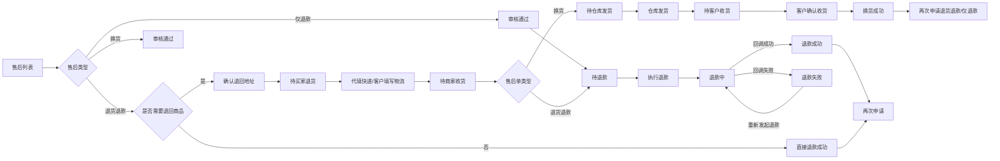
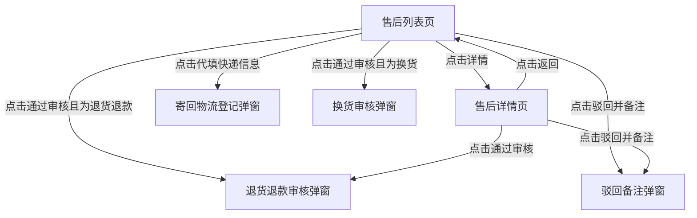
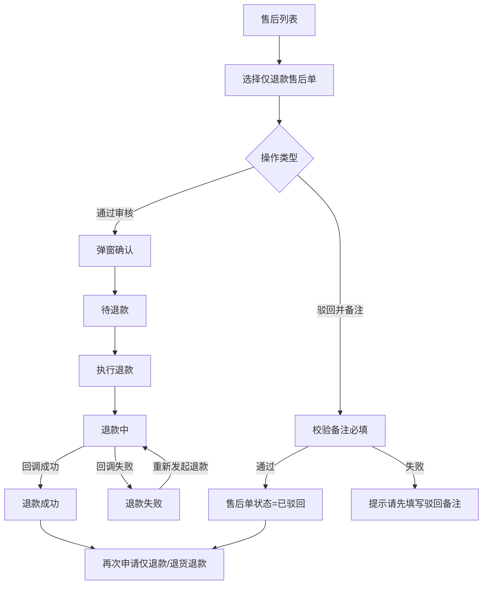
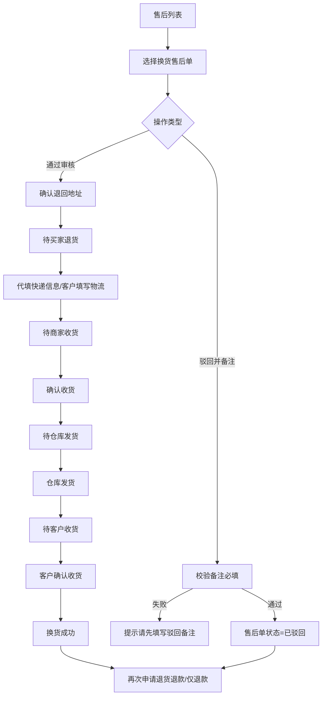
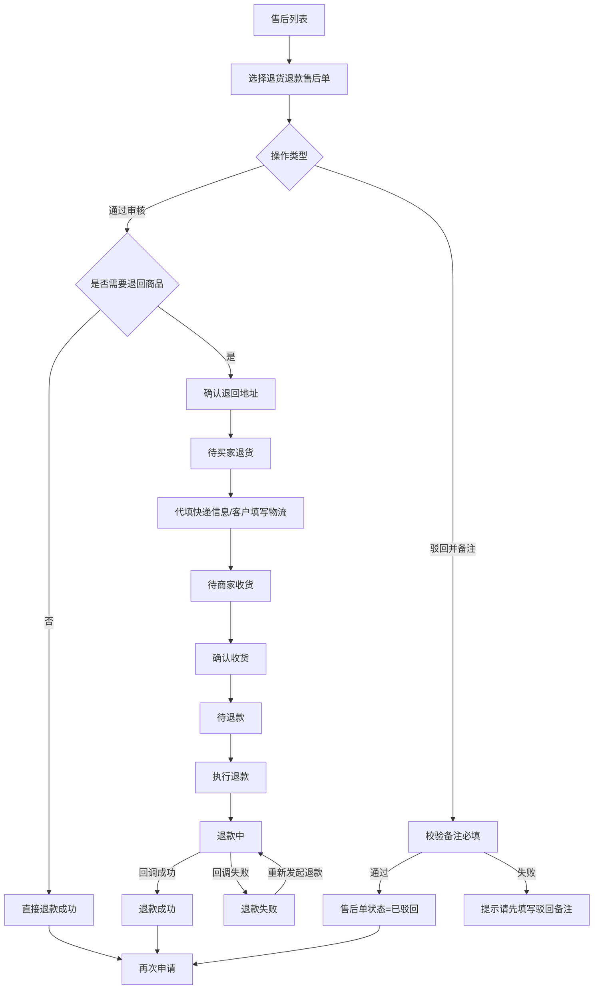
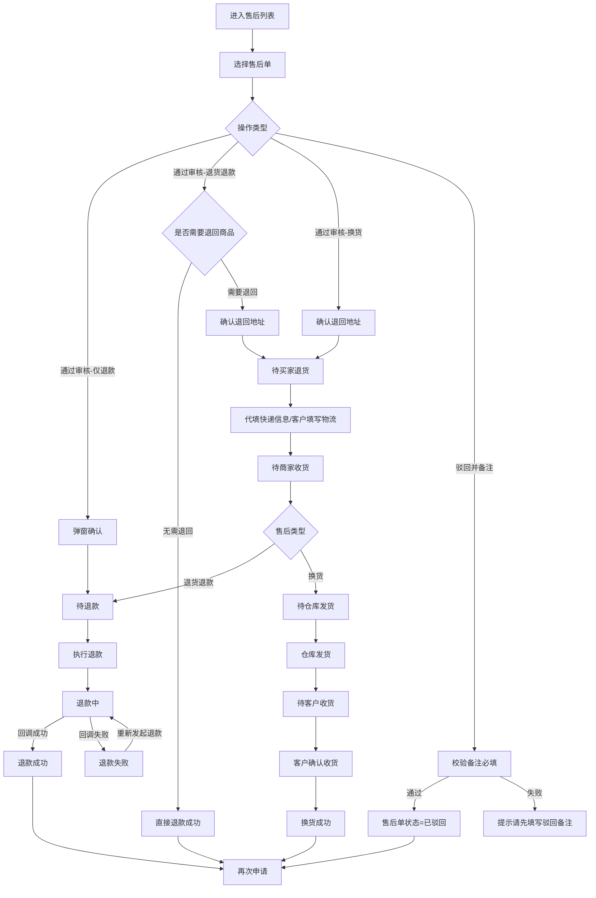
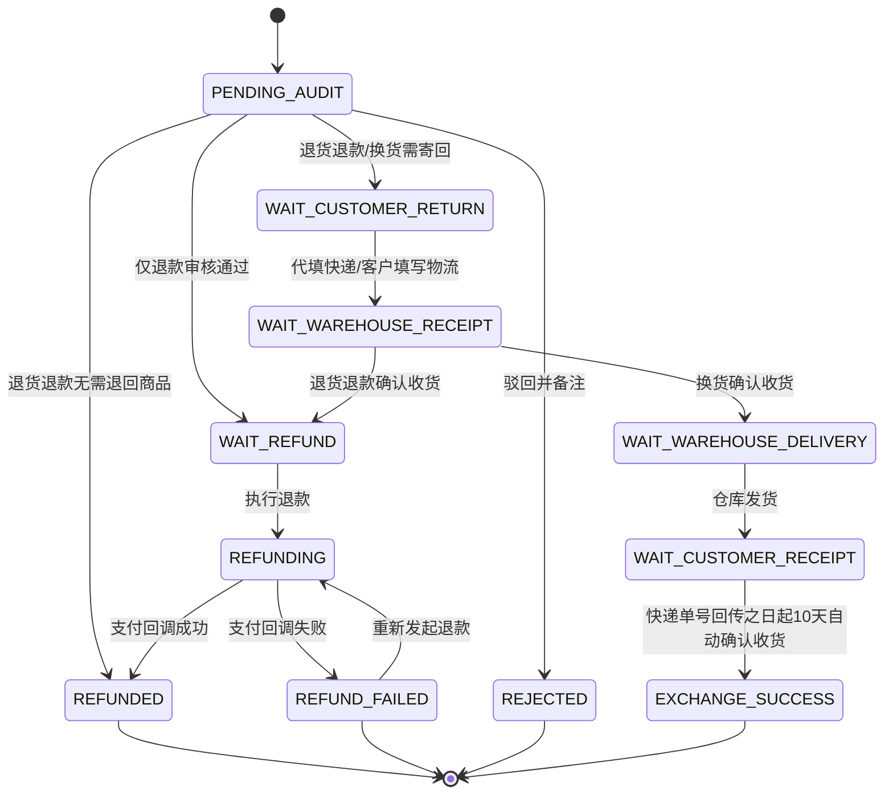

# 供应链管理后台 - 售后管理产品需求文档

# 1. 需求背景

# 2. 需求分析

# 3. 系统流程图

## 3.1. 总体功能蓝图流程图

## 3.2. 页面跳转流程图

## 3.3. 仅退款流程图

## 3.4. 换货流程图

## 3.5. 退货退款流程图

---

# 4. 详细需求

## 4.1. 供应链管理后台系统

> 原型文件：`原型/供应链售后管理原型.html`

### 4.1.1. 售后管理模块

#### 4.1.1.1. 售后列表页

##### 1. 功能概述

- **功能描述**：售后列表页用于集中展示并处理仅退款、退货退款、换货三类售后工单。供应链端承担全部售后操作。
- **业务描述**：供应链专员可在同一列表完成审核、驳回、确认退回地址、代填快递信息、确认收货、执行退款、查看详情，无需跨页面切换。
- **使用角色**：供应链专员。
- **触发条件**：从供应链管理后台进入"售后管理 > 售后列表"。

##### 2. 界面设计

###### 2.1 页面原型

`原型/供应链售后管理原型.html`

###### 2.2 输出项说明

**列表页字段**

| 字段名称 | 字段标识 | 数据类型 | 数据来源 | 格式说明 |
|----------|----------|----------|----------|----------|
| 主订单号 | main_order_no | string | 订单管理 | 独立一列展示 |
| 子订单号 | sub_order_no | string | 订单管理 | 独立一列展示 |
| 商品名称 | product_name | string | 商品管理 + 订单管理 | 独立一列展示 |
| SKU物流编码 | sku_logistics_code | string | SKU 编码体系 | 独立一列展示 |
| 供应商信息 | supplier_name | string | 供应商管理 | 供应商名称 |
| 收货人电话 | receiver_phone | string | 订单收货信息 | 收货人联系电话 |
| 用户电话 | user_phone | string | 用户账户信息/订单信息 | 用户联系方式 |
| 售后类型 | after_sales_type | string | 售后管理模块 | 仅退款、退货退款、换货 |
| 退款金额 | refund_amount | string | 退款规则引擎 | 支持现金、积分组合展示 |
| 申请时间 | created_at | datetime | 系统生成 | 日期在上、时间在下 |
| 售后状态 | after_sales_status | string | 售后管理模块 | 颜色胶囊标签 |
| 渠道来源 | channel | string | 订单管理 | 品牌商城、小程序、积分商城 |
| 操作 | - | - | - | 详情 + 主操作按钮 + 次操作按钮 |

###### 2.3 详情页字段说明

详情页采用独立全页面布局，以浅蓝色标题栏分区展示。

**售后基础信息**

| 字段名称 | 字段标识 | 数据类型 | 数据来源 | 格式说明 |
|----------|----------|----------|----------|----------|
| 售后单号 | aftersales_order_no | string | 系统生成 | |
| 主订单号 | main_order_no | string | 订单管理 | |
| 子订单号 | sub_order_no | string | 订单管理 | |
| 售后类型 | after_sales_type | string | 售后管理模块 | 仅退款、退货退款、换货 |
| 申请时间 | created_at | datetime | 系统生成 | |
| 售后状态 | after_sales_status | string | 售后管理模块 | 颜色状态标签 |
| 退款金额 | refund_amount | string | 退款规则引擎 | 红色高亮，支持现金、积分组合展示 |
| 供应商名称 | supplier_name | string | 供应商管理 | |
| 渠道来源 | channel | string | 订单管理 | |
| 售后原因 | reason | string | 用户提交 | |
| 驳回原因 | reject_reason | string | 供应链专员填写 | 仅"已驳回"状态显示 |

**商品信息（表格形式）**

| 字段名称 | 字段标识 | 数据类型 | 数据来源 | 格式说明 |
|----------|----------|----------|----------|----------|
| 序号 | - | integer | 系统生成 | |
| SKU物流编码 | sku_logistics_code | string | SKU 编码体系 | |
| 商品名称 | product_name | string | 商品管理 | |
| 退货数量 | return_qty | integer | 退货管理 | 默认为 1 |
| 退款金额 | refund_amount | string | 退款规则引擎 | |
| 渠道名称 | channel_name | string | 订单管理 | |

**客户信息（表格形式）**

| 字段名称 | 字段标识 | 数据类型 | 数据来源 | 格式说明 |
|----------|----------|----------|----------|----------|
| 收货人 | receiver_name | string | 订单收货信息 | |
| 收货人电话 | receiver_phone | string | 订单收货信息 | |
| 用户电话 | user_phone | string | 用户账户信息 | |
| 详细地址 | address | string | 订单收货信息 | 完整地址 |

##### 3. 业务逻辑

###### 3.1 流程图

**售后审核与退款流程**

###### 3.2 业务规则

| 规则编号 | 规则名称 | 适用场景 | 规则描述 | 错误提示 |
|----------|----------|----------|----------|----------|
| RULE-SCM-001 | 驳回备注必填 | 驳回售后申请 | 点击"驳回并备注"后必须填写驳回原因才可提交 | 请先填写驳回备注 |
| RULE-SCM-002 | 退回地址完整性 | 退货退款/换货审核 | 选择"需要退回商品"后，必须填写完整的详细地址、收件人、收件人手机号 | 请填写完整的详细地址、姓名和电话 |
| RULE-SCM-003 | 寄回物流完整性 | 代填快递信息/客户填写寄回物流 | 物流公司与寄回单号必须同时填写 | 请填写完整物流信息 |
| RULE-SCM-004 | 退货退款直退 | 退货退款审核 | 允许选择"无需退回商品，直接退款"，跳过寄回与确认收货节点 | - |
| RULE-SCM-005 | 换货后二次售后 | 换货成功售后单 | 换货完成后可再次创建退货退款或仅退款售后单 | - |
| RULE-SCM-006 | 退回地址优先级 | 退货退款/换货审核 | 优先使用供应商已配置并回传的退回地址；仅当供应商无地址时，才允许人工填写 | - |
| RULE-SCM-007 | 客户物流自动流转 | 待买家退货 | 客户在 C 端填写完整物流公司与寄回单号后，售后单自动流转到"待商家收货" | - |
| RULE-SCM-008 | 退款状态语义 | 退款处理链路 | `待退款` 表示待发起退款；`退款中` 表示已发起退款请求、等待支付渠道异步回调 | - |
| RULE-SCM-009 | 换货自动确认收货 | 待客户收货 | 换货商品发出后，快递单号回传之日起10天内客户未确认收货，系统自动确认为换货成功 | - |
| RULE-SCM-010 | 换货新订单商品名称继承 | 换货流程创建新订单 | 换货生成的新订单（换货单），商品名称统一取原售后单关联的原订单商品名称，不随新发货供应商变更 | - |
| RULE-SCM-011 | 驳回后操作限制 | 已驳回状态 | 售后单被驳回后，操作列仅保留"详情"按钮，不显示其他操作按钮 | - |
| RULE-SCM-012 | 驳回操作仅限待审核 | 驳回操作 | "驳回并备注"操作仅在"待商家审核"状态下可用；审核通过后进入任何后续状态（待买家退货、待商家收货、待退款、退款中、待仓库发货、待客户收货等），操作列均不再显示"驳回并备注"按钮 | - |

###### 3.3 状态机设计

**售后工单状态定义**

| 状态编码 | 状态名称 | 状态描述 |
|----------|----------|----------|
| PENDING_AUDIT | 待商家审核 | 新建售后工单，等待商家审核 |
| WAIT_CUSTOMER_RETURN | 待买家退货 | 已审核通过，等待买家退货 |
| WAIT_WAREHOUSE_RECEIPT | 待商家收货 | 客户已填写寄回物流或供应链代填，等待确认收货 |
| WAIT_WAREHOUSE_DELIVERY | 待仓库发货 | 换货商品待仓库出库发货 |
| WAIT_CUSTOMER_RECEIPT | 待客户收货 | 换货商品已发出，等待客户确认收货；快递单号回传之日起10天内客户未确认收货，系统自动确认为换货成功 |
| WAIT_REFUND | 待退款 | 已满足退款条件，但尚未发起退款请求 |
| REFUNDING | 退款中 | 已发起退款请求，等待支付渠道回调 |
| REFUND_FAILED | 退款失败 | 支付渠道回调失败，允许人工重新发起退款 |
| REFUNDED | 退款成功 | 退款完成并已回写 |
| REJECTED | 已驳回 | 售后申请被驳回 |
| EXCHANGE_SUCCESS | 换货成功 | 换货流程完成并允许发起二次售后 |

**状态流转规则**

| 当前状态 | 触发操作 | 目标状态 | 操作角色 | 前置条件 |
|----------|----------|----------|----------|----------|
| 待商家审核 | 通过审核（仅退款） | 待退款 | 供应链专员 | 售后单状态为待商家审核 |
| 待商家审核 | 通过审核并选择无需退回商品（退货退款） | 退款成功 | 供应链专员 | 售后单状态为待商家审核 |
| 待商家审核 | 通过审核并确认退回地址（退货退款/换货） | 待买家退货 | 供应链专员 | 退回地址完整 |
| 待商家审核 | 驳回并备注 | 已驳回 | 供应链专员 | 驳回备注必填 |
| 待买家退货 | 代填快递信息 / 客户C端填写物流 | 待商家收货 | 供应链专员 / 客户 | 物流公司与寄回单号同时填写 |
| 待商家收货 | 确认收货（退货退款） | 待退款 | 供应链专员 | 售后单状态为待商家收货 |
| 待商家收货 | 确认收货（换货） | 待仓库发货 | 供应链专员 | 售后单状态为待商家收货 |
| 待仓库发货 | 仓库发货 | 待客户收货 | 供应链专员 | 物流单号已填写 |
| 待客户收货 | 客户确认收货 / 快递单号回传10天自动确认 | 换货成功 | 客户 / 系统 | 换货商品已发出 |
| 待退款 | 执行退款 | 退款中 | 供应链专员 | 售后单状态为待退款 |
| 退款中 | 支付渠道回调成功 | 退款成功 | 系统 | 支付渠道返回成功 |
| 退款中 | 支付渠道回调失败 | 退款失败 | 系统 | 支付渠道返回失败 |
| 退款失败 | 重新发起退款 | 退款中 | 供应链专员 | 二次确认 |
| 换货成功 | 申请退货退款 / 申请仅退款 | 新售后单待商家审核 | 供应链专员 | 换货已完成 |

**状态对应UI差异**

| 状态 | 详情按钮 | 通过审核 | 驳回并备注 | 代填快递 | 确认收货 | 仓库发货 | 执行退款 | 
|------|----------|----------|------------|----------|----------|----------|----------|
| 待商家审核 | ✅ | ✅ | ✅ | ❌ | ❌ | ❌ | ❌ |
| 待买家退货 | ✅ | ❌ | ❌ | ✅ | ❌ | ❌ | ❌ | 
| 待商家收货 | ✅ | ❌ | ❌ | ❌ | ✅ | ❌ | ❌ |
| 待仓库发货 | ✅ | ❌ | ❌ | ❌ | ❌ | ✅ | ❌ |
| 待客户收货 | ✅ | ❌ | ❌ | ❌ | ❌ | ❌ | ❌ |
| 待退款 | ✅ | ❌ | ❌ | ❌ | ❌ | ❌ | ✅ |
| 退款中 | ✅ | ❌ | ❌ | ❌ | ❌ | ❌ | ❌ |
| 退款失败 | ✅ | ❌ | ❌ | ❌ | ❌ | ❌ | ✅ |
| 退款成功 | ✅ | ❌ | ❌ | ❌ | ❌ | ❌ | ❌ |
| 已驳回 | ✅ | ❌ | ❌ | ❌ | ❌ | ❌ | ❌ |
| 换货成功 | ✅ | ❌ | ❌ | ❌ | ❌ | ❌ | ❌ |

##### 4. 交互设计

###### 4.1 输入项说明

**筛选区输入项**

| 字段名称 | 字段标识 | 字段类型 | 必填 | 数据类型 | 校验规则 | 取值范围 | 来源 | 提示文案 |
|----------|----------|----------|------|----------|----------|----------|------|----------|
| 主订单号 | main_order_no | 文本输入 | 否 | String | 精确匹配 | - | 用户输入 | 请输入主订单号 |
| 子订单号 | sub_order_no | 文本输入 | 否 | String | 精确匹配 | - | 用户输入 | 请输入子订单号 |
| 商品名称 | product_name | 文本输入 | 否 | String | 模糊匹配 | - | 用户输入 | 请输入商品名称 |
| 售后单号 | aftersales_order_no | 文本输入 | 否 | String | 精确匹配 | - | 用户输入 | 请输入售后单号 |
| SKU物流编码 | sku_logistics_code | 文本输入 | 否 | String | 精确匹配 | - | 用户输入 | 请输入SKU物流编码 |
| 供应商 | supplier_name | 文本输入 | 否 | String | 模糊匹配 | - | 用户输入 | 请输入供应商名称 |
| 收货人手机号 | receiver_phone | 文本输入 | 否 | String | 精确匹配 | - | 用户输入 | 请输入收货人手机号 |
| 申请售后时间 | created_at | 日期范围 | 否 | Datetime | - | - | 用户选择 | 请选择时间范围 |
| 售后状态 | after_sales_status | 下拉选择 | 否 | String | - | 待商家审核、待买家退货、待商家收货、待仓库发货、待客户收货、待退款、退款中、退款失败、退款成功、换货成功、已驳回 | 系统配置 | 请选择售后状态 |
| 审核状态 | audit_status | 下拉选择 | 否 | String | - | 待审核、审核通过、驳回 | 系统配置 | 请选择审核状态 |
| 售后类型 | after_sales_type | 下拉选择 | 否 | String | - | 仅退款、退货退款、换货 | 系统配置 | 请选择售后类型 |
| 渠道 | channel | 下拉选择 | 否 | String | - | 品牌商城、小程序、积分商城 | 系统配置 | 请选择渠道 |

**操作区输入项**

| 字段名称 | 字段标识 | 字段类型 | 必填 | 数据类型 | 校验规则 | 来源 | 提示文案 |
|----------|----------|----------|------|----------|----------|------|----------|
| 驳回备注 | reject_remark | 多行文本 | 是 | String | 驳回时必填 | 用户输入 | 请先填写驳回备注 |
| 退回详细地址 | return_address | 文本输入 | 是 | String | 需退回时必填 | 用户输入/供应商回传 | 请填写详细地址 |
| 退回收件人 | return_name | 文本输入 | 是 | String | 需退回时必填 | 用户输入/供应商回传 | 请填写收件人 |
| 退回手机号 | return_phone | 文本输入 | 是 | String | 需退回时必填 | 用户输入/供应商回传 | 请填写手机号 |
| 物流公司 | express_company | 文本输入 | 是 | String | 代填时必填 | 用户输入 | 请填写物流公司 |
| 寄回单号 | express_no | 文本输入 | 是 | String | 代填时必填 | 用户输入 | 请填写寄回单号 |
| 发货物流单号 | ship_no | 文本输入 | 是 | String | 发货时必填 | 用户输入 | 请填写发货单号 |

###### 4.2 交互说明

1. 供应链专员可通过顶部审核状态卡片快速过滤售后单：「待审核」显示首次审核未操作的工单（状态为待商家审核）；「审核通过」显示首次审核已通过的工单（不论后续处于退款中、退款成功、换货成功等任何状态）；「驳回」显示首次审核被驳回的工单。
2. 查询区域默认展示主订单号、子订单号、商品名称 3 个快捷筛选项；点击"展开"后按一行 4 项展示全部筛选条件（售后单号、SKU物流编码、供应商、收货人手机号、申请售后时间、售后状态、审核状态、售后类型、渠道），且"收起 / 重置 / 查询"与最后一行筛选项同行。
3. 列表操作列展示"详情"按钮 + 主操作按钮 + 次操作按钮。"驳回并备注"仅在"待商家审核"状态下显示，审核通过后不再出现。已驳回状态仅展示"详情"按钮。
4. 点击"详情"后，列表视图隐藏，显示独立全页面详情页。详情页以浅蓝色标题栏分区展示售后基础信息（三列网格）、商品信息（表格）、客户信息（表格），底部操作区展示操作按钮与返回按钮。
5. 退货退款审核点击"通过审核"后，弹出二次确认弹窗，可选填备注（非必填）；确认后选择是否需要退回商品。
6. 若需要退回商品，系统优先带出供应商退回地址；若供应商无地址，则由供应链专员人工填写并确认。
7. 在"待买家退货"状态下，供应链专员可点击"代填快递信息"代替客户填写物流信息；客户也可在C端自行填写，填写后自动流转到"待商家收货"。
8. 在"待商家收货"状态下，退货退款点击"确认收货"进入"待退款"，换货点击"确认收货"进入"待仓库发货"。
9. 在"待退款"状态下，点击"执行退款"后弹出二次确认弹窗，确认后售后单进入"退款中"，等待支付渠道异步回调。
10. 支付渠道回调成功后流转为"退款成功"；回调失败后流转为"退款失败"，允许重新发起退款（需二次确认）。
11. 换货成功后，操作区新增"申请退货退款""申请仅退款"入口，自动创建二次售后工单。
12. 在"待仓库发货"状态下，点击"仓库发货"后弹出登记发货单号弹窗，填写物流单号后确认发货。
13. 仅退款审核通过时，弹出二次确认弹窗（含退款说明），确认后直接进入退款流程。

###### 4.2 错误提示文案

**表单校验提示**

| 校验字段 | 校验场景 | 提示文案 |
|----------|----------|----------|
| 驳回备注 | 为空 | 请先填写驳回备注 |
| 退回地址 | 未填写任何地址 | 请先填写退回地址 |
| 退回地址 | 地址/姓名/电话不完整 | 请填写完整的详细地址、姓名和电话 |
| 物流公司/寄回单号 | 任一为空 | 请填写完整物流信息 |

**业务异常提示**

| 异常场景 | 错误码 | 提示文案 |
|----------|--------|----------|
| 当前售后单暂无可推进审核流程 | ERROR-SCM-001 | 当前售后单暂无可推进的审核流程 |
| 退款处理中 | ERROR-SCM-002 | 当前退款状态处理中，请等待回调 |

##### 5. 数据设计

###### 5.1 数据流转说明

| 字段/数据 | 来源 | 获取方式 | 说明 |
|-----------|------|----------|------|
| 主订单号/子订单号 | 订单管理 | 订单查询接口 | 列表独立成列展示 |
| 商品名称 | 商品管理/订单行项目 | 订单详情接口 | 列表独立成列展示 |
| SKU物流编码 | SKU 编码体系 | SKU 主数据接口 | 列表独立成列展示 |
| 供应商名称 | 供应商管理 | 供应商主数据接口 | 支持名称检索 |
| 收货人电话 | 订单收货信息 | 订单详情接口 | 收货人联系电话 |
| 用户电话 | 用户账户信息/订单信息 | 用户查询接口 | 用户注册联系方式 |

**售后信息**

| 字段/数据 | 来源 | 获取方式 | 说明 |
|-----------|------|----------|------|
| 退款金额 | 支付系统/退款规则引擎 | 退款计算接口 | 支持现金、积分、优惠券组合口径 |
| 售后原因 | 用户提交 | 售后申请接口 | 用户申请售后时填写的退款原因 |

**退回与物流**

| 字段/数据 | 来源 | 获取方式 | 说明 |
|-----------|------|----------|------|
| 退回地址 | 供应商配置地址 / 人工录入 | 供应商主数据接口 / 前端表单提交 | 优先带出供应商地址；无地址时由供应链专员补录 |
| 寄回物流公司/寄回单号 | C端用户填写 / 供应链专员代填 | 用户提交 / 前端表单提交 | 信息完整后自动驱动售后单从"待买家退货"进入"待商家收货" |
| 退款结果 | 支付通道回调 | 回调接口 | 失败则回写退款失败状态，支持重试 |

###### 5.2 数据权限设计

**角色数据范围**

| 角色 | 数据范围 | 说明 |
|------|----------|------|
| 供应链专员 | 全部售后数据 | 可查看并操作所有供应商的售后工单 |
| 供应商 | 本供应商售后数据 | 仅可查看与本供应商相关的售后工单（如有多角色场景） |

**功能权限点**

| 权限标识 | 权限名称 |
|----------|----------|
| aftersales:list | 查看售后列表 |
| aftersales:detail | 查看售后详情 |
| aftersales:audit | 审核售后（通过/驳回） |
| aftersales:refund | 执行退款 |
| aftersales:receive | 确认收货 |
| aftersales:ship | 仓库发货 |
| aftersales:logistics | 代填快递信息 |

##### 6. 扩展功能

###### 6.1 操作日志要求

| 操作类型 | 记录内容 | 保留时长 |
|----------|----------|----------|
| 审核通过/驳回 | 操作人、时间、售后单号、审核结果、备注 | 3年 |
| 退款执行/重试 | 操作人、时间、售后单号、退款金额、支付渠道回调结果 | 3年 |
| 确认收货 | 操作人、时间、售后单号 | 3年 |
| 仓库发货 | 操作人、时间、售后单号、物流单号 | 3年 |
| 代填快递 | 操作人、时间、售后单号、物流公司、寄回单号 | 3年 |
