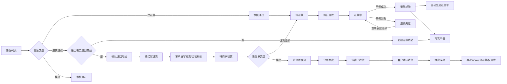
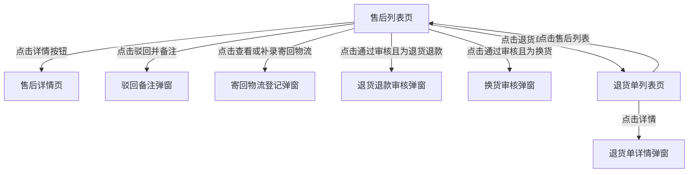
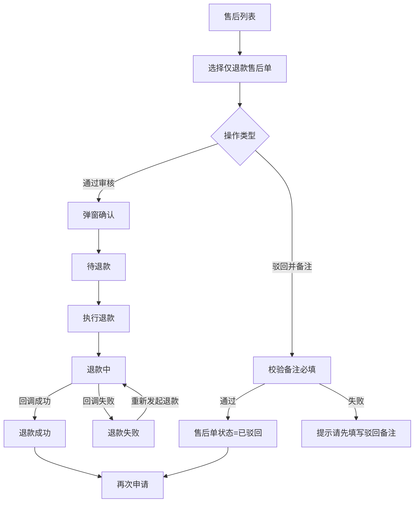
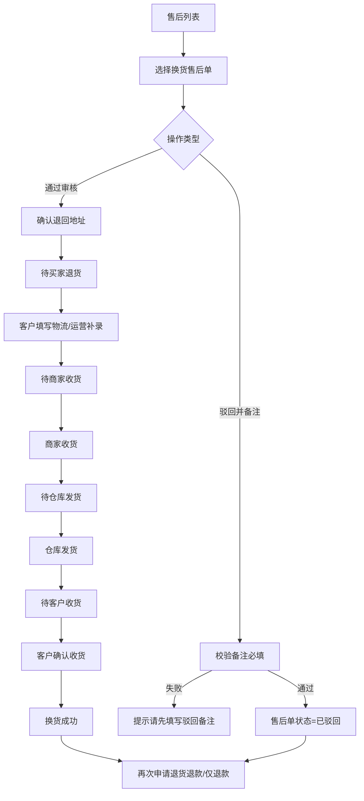
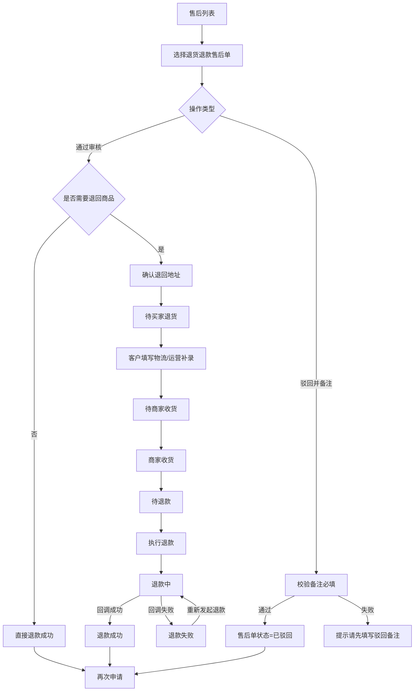
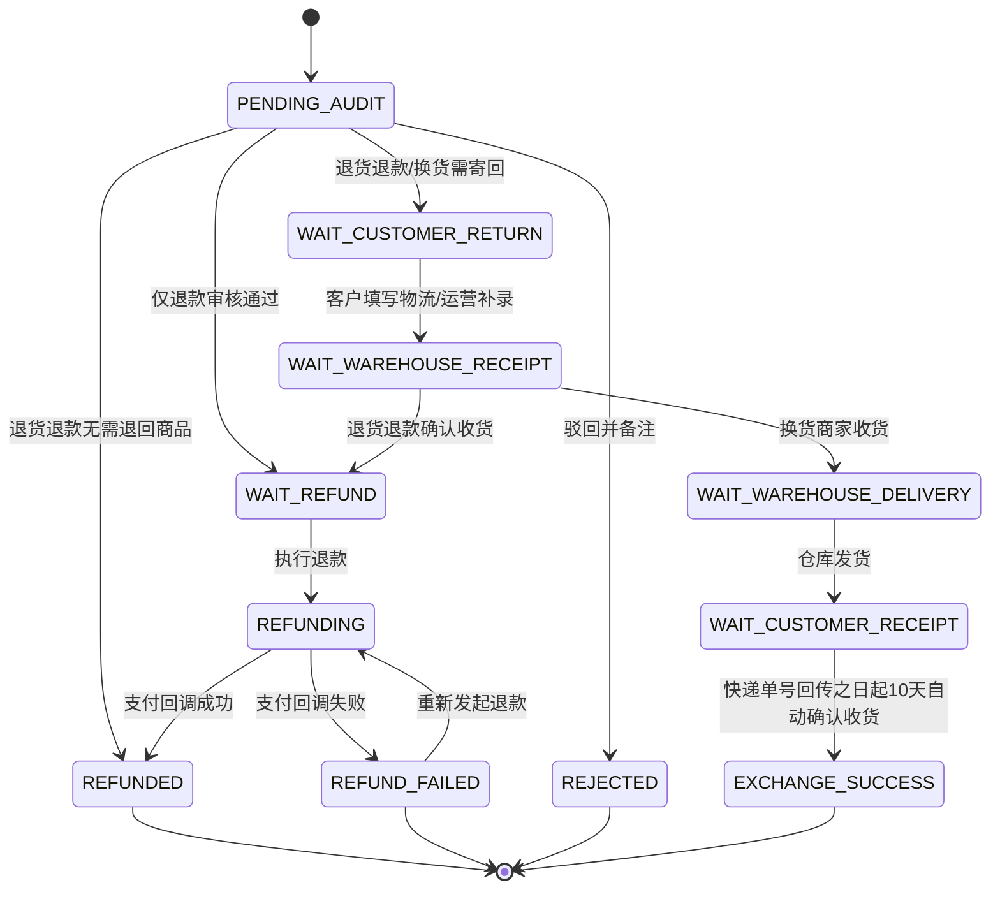

# 品牌商城 - 售后管理产品需求文档

# 1. 需求背景

品牌商城作为品牌商家自营商城系统，需提供完整的售后管理功能，支持品牌运营人员处理仅退款、退货退款、换货三类售后工单。品牌商城售后管理区别于商城运营后台，不涉及供应商维度管理，客户信息以收货人信息为主，同时支持积分、优惠券等多支付方式的退款拆分。

# 2. 需求分析

- 售后列表集中展示所有售后工单，支持按审核状态快速筛选
- 品牌运营人员可在同一页面完成审核、驳回、退回地址确认、物流补录、商家收货、执行退款等全部操作
- 详情页展示售后信息、支付信息、商品信息、客户信息及审核轨迹
- 退款支持现金、积分、优惠券混合支付场景的拆分退回
- 换货完成后支持二次售后申请

# 3. 系统流程图

## 3.1. 总体功能蓝图流程图

## 3.2. 页面跳转流程图

## 3.3. 仅退款流程图

## 3.4. 换货流程图

## 3.5. 退货退款流程图

---

# 4. 详细需求

## 4.1. 品牌商城系统

> 原型文件：`原型/品牌商城售后管理原型.html`

### 4.1.1. 售后管理模块

#### 4.1.1.1. 售后列表页

##### 1. 功能概述

- **功能描述**：售后列表页用于集中展示并处理品牌商城仅退款、退货退款、换货三类售后工单。
- **业务描述**：品牌运营人员可在同一列表完成审核、驳回、审核退回地址、查看客户已填写物流、商家收货、执行退款、查看详情，避免跨页面切换。
- **使用角色**：品牌管理员、品牌客服、品牌财务人员。
- **触发条件**：从品牌商城进入"售后管理 > 售后列表"。

##### 2. 界面设计

###### 2.1 页面原型

`原型/品牌商城售后管理原型.html`

###### 2.2 列表字段说明

| 字段名称 | 字段标识 | 数据类型 | 数据来源 | 格式说明 |
|----------|----------|----------|----------|----------|
| 主/子订单号 | main_order_no / sub_order_no | string | 订单管理 | 第一列展示，主订单号在上、子订单号在下 |
| 商品信息 | product_info | string | 商品管理 + 订单管理 | 商品图片占位、商品名称、SKU规格、SKU物流编码 |
| 客户信息 | customer_info | string | 订单收货信息 | 收货人姓名、收货人电话 |
| 售后类型 | after_sales_type | string | 售后管理模块 | 仅退款、退货退款、换货 |
| 退款金额 | refund_amount | string | 退款规则引擎 | 支持现金、积分、优惠券组合展示 |
| 申请时间 | created_at | datetime | 系统生成 | 日期在上、时间在下 |
| 售后状态 | after_sales_status | string | 售后管理模块 | 待商家审核、待买家退货、待商家收货、待仓库发货、待客户收货、待退款、退款中、退款失败、退款成功、换货成功、已驳回 |
| 操作 | action | - | - | 详情按钮 |

###### 2.3 详情页字段说明

**售后信息**

| 字段名称 | 字段标识 | 数据类型 | 数据来源 | 格式说明 |
|----------|----------|----------|----------|----------|
| 售后单号 | aftersales_order_no | string | 系统生成 | |
| 申请时间 | created_at | datetime | 系统生成 | |
| 售后类型 | after_sales_type | string | 售后管理模块 | 仅退款、退货退款、换货 |
| 退款金额 | refund_amount | string | 退款规则引擎 | 支持现金、积分、优惠券组合展示 |
| 积分退回 | refund_points | string | 支付系统 | 积分退回金额，若积分过期则备注过期说明 |
| 优惠券退回 | refund_coupon | string | 支付系统 | 优惠券退回金额，若优惠券过期则备注过期说明 |

**支付信息**

| 字段名称 | 字段标识 | 数据类型 | 数据来源 | 格式说明 |
|----------|----------|----------|----------|----------|
| 商品总价 | product_total_price | string | 订单管理 | 商品的原始销售价格 |
| 实付金额 | actual_paid_amount | string | 订单管理/支付系统 | 用户实际支付的金额（扣除优惠后） |
| 优惠明细 | discount_detail | string | 订单管理/支付系统 | 动态显示优惠券和积分抵扣，有优惠时显示具体金额，无优惠时显示0 |
| 支付方式 | payment_method | string | 订单管理/支付系统 | 现金支付、积分支付、混合支付 |

**商品信息**

| 字段名称 | 字段标识 | 数据类型 | 数据来源 | 格式说明 |
|----------|----------|----------|----------|----------|
| 商品名称 | product_name | string | 商品管理 | |
| SKU物流编码 | sku_logistics_code | string | SKU管理 | |
| 商品数量 | return_qty | integer | 售后申请 | |
| 售后渠道 | channel | string | 售后管理模块 | 品牌商城 |
| 商品编码 | product_code | string | 商品管理 | 可选展示 |

**客户信息**

| 字段名称 | 字段标识 | 数据类型 | 数据来源 | 格式说明 |
|----------|----------|----------|----------|----------|
| 收货人 | receiver_name | string | 订单收货信息 | 当前收件人姓名 |
| 收货人电话 | receiver_phone | string | 订单收货信息 | 收件人联系电话 |
| 收货地址 | receiver_address | string | 订单收货信息 | 收货人电话 + 完整收货地址 |
| 售后原因 | reason | string | 用户提交 | |
| 客户备注 | customer_remark | string | 用户提交 | 可选填 |

##### 3. 筛选条件

###### 3.1 快捷筛选项（默认展示）

| 筛选项 | 类型 | 说明 |
|--------|------|------|
| 主订单号 | 文本输入 | 模糊匹配 |
| 子订单号 | 文本输入 | 模糊匹配 |
| 商品名称 | 文本输入 | 模糊匹配 |
| 售后单号 | 文本输入 | 精确匹配 |

###### 3.2 展开筛选项

| 筛选项 | 类型 | 说明 |
|--------|------|------|
| SKU物流编码 | 文本输入 | |
| 收货人手机号码 | 文本输入 | |
| 申请售后时间 | 日期范围选择 | |
| 售后状态 | 下拉选择 | 12种状态 |
| 审核状态 | 下拉选择 | 4种状态 |
| 售后类型 | 下拉选择 | 仅退款、退货退款、换货 |

##### 4. 业务逻辑

###### 4.1 业务规则

| 规则编号 | 规则名称 | 适用场景 | 规则描述 | 错误提示 |
|----------|----------|----------|----------|----------|
| RULE-BM-001 | 驳回备注必填 | 驳回售后申请 | 点击"驳回并备注"后必须填写驳回原因才可提交 | 请先填写驳回备注 |
| RULE-BM-002 | 退回地址完整性 | 退货退款/换货审核 | 选择"需要退回商品"后，必须填写完整的详细地址、收件人、收件人手机号 | 请填写完整的详细地址、姓名和电话 |
| RULE-BM-003 | 寄回物流完整性 | 客户填写寄回物流/运营补录 | 物流公司与寄回单号必须同时填写 | 请填写完整物流信息 |
| RULE-BM-004 | 退货退款直退 | 退货退款审核 | 允许选择"无需退回商品，直接退款"，跳过寄回与确认收货节点 | - |
| RULE-BM-005 | 换货后二次售后 | 换货成功售后单 | 换货完成后可再次创建退货退款或仅退款售后单 | - |
| RULE-BM-006 | 退货单生成时机 | 退款成功回写 | 仅当支付渠道回调成功并确认退款成功后，且售后类型为「退货退款」或「换货」时，系统才自动生成退货单；「仅退款」不生成退货单 | - |
| RULE-BM-007 | 退款状态语义 | 退款处理链路 | `待退款` 表示待发起退款；`退款中` 表示已发起退款请求、等待支付渠道异步回调 | - |
| RULE-BM-008 | 退回地址优先级 | 退货退款/换货审核 | 优先使用品牌仓库退回地址；若无配置地址，则由运营人工填写 | - |
| RULE-BM-009 | 客户物流自动流转 | 待买家退货 | 客户在 C 端填写完整物流公司与寄回单号后，售后单自动流转到"待商家收货" | - |
| RULE-BM-010 | 换货自动确认收货 | 待客户收货 | 换货商品发出后，快递单号回传之日起10天内客户未确认收货，系统自动确认为换货成功 | - |
| RULE-BM-011 | 多支付方式退款拆分 | 执行退款 | 混合支付场景下，退款需按现金、积分、优惠券分别退回；积分过期和优惠券过期需标注说明 | - |
| RULE-BM-012 | 换货新订单商品名称继承 | 换货流程创建新订单 | 换货生成的新订单（换货单），商品名称统一取原售后单关联的原订单商品名称，不随新发货仓库变更。即：新订单商品名称 = 原订单.商品名称 | - |

###### 4.2 状态机设计

**品牌商城售后单状态定义**

| 状态编码 | 状态名称 | 状态描述 |
|----------|----------|----------|
| PENDING_AUDIT | 待商家审核 | 新建售后单，等待品牌管理员审核 |
| WAIT_CUSTOMER_RETURN | 待买家退货 | 已审核通过，等待买家退货 |
| WAIT_WAREHOUSE_RECEIPT | 待商家收货 | 客户已填写寄回物流，等待品牌仓库确认收货 |
| WAIT_WAREHOUSE_DELIVERY | 待仓库发货 | 换货商品待品牌仓库出库发货 |
| WAIT_CUSTOMER_RECEIPT | 待客户收货 | 换货商品已发出，等待客户确认收货 |
| WAIT_REFUND | 待退款 | 已满足退款条件，但尚未发起退款请求 |
| REFUNDING | 退款中 | 已发起退款请求，等待支付渠道回调 |
| REFUND_FAILED | 退款失败 | 支付渠道回调失败，允许人工重新发起退款 |
| REFUNDED | 退款成功 | 退款完成并已回写 |
| REJECTED | 已驳回 | 售后申请被驳回 |
| EXCHANGE_SUCCESS | 换货成功 | 换货流程完成并允许发起二次售后 |

**状态流转规则**

##### 5. 交互设计

###### 5.1 交互说明

1. 列表以表格形式展示售后工单，最后一列为操作列，提供"详情"按钮可进入详情页查看完整信息。
2. 运营可通过顶部审核状态按钮快速过滤售后单：「待审核」显示首次审核未操作的售后单（状态为待商家审核）；「审核通过」显示首次审核已通过的售后单（不论后续状态）；「驳回」显示首次审核被驳回的售后单。筛选区的「售后状态」和「审核状态」下拉框与按钮联动。
3. 查询区域默认展示主订单号、子订单号、商品名称、售后单号 4 个快捷筛选项；点击"展开"后按一行 4 项展示全部筛选条件，且"收起 / 重置 / 查询"与最后一行筛选项同行。
4. 点击"详情"按钮后，进入详情页查看售后单完整信息（含进度步骤条、售后信息、支付信息、商品信息、客户信息）和审核轨迹。
5. 详情页客户信息展示收货人、收货人电话、收货地址、售后原因、客户备注。
6. 退货退款审核点击"通过审核"后，弹出二次确认弹窗，可选填备注（非必填）；确认后选择是否需要退回商品。
7. 若需要退回商品，系统优先带出品牌仓库退回地址；若无配置地址，则由运营人工填写并确认。
8. 在"待买家退货"状态下，客户于 C 端填写完整物流公司与寄回单号后，售后单自动流转到"待商家收货"；品牌运营也支持在后台补录。
9. 在"待商家收货"状态下，退货退款点击"商家收货"进入"待退款"，换货点击"商家收货"进入"待仓库发货"。
10. 在"待退款"状态下，点击"执行退款"后弹出二次确认弹窗，确认后售后单进入"退款中"，等待支付渠道异步回调。混合支付场景下退款按现金、积分、优惠券分别处理。
11. 支付渠道回调成功后流转为"退款成功"；回调失败后流转为"退款失败"，允许重新发起退款（需二次确认）。
12. 换货成功后，操作区新增"申请退货退款""申请仅退款"入口，自动创建二次售后单。
13. 在"待仓库发货"状态下，点击"仓库发货"后弹出登记发货单号弹窗，填写物流单号后确认发货。

###### 5.2 错误提示文案

**表单校验提示**

| 校验字段 | 校验场景 | 提示文案 |
|----------|----------|----------|
| 驳回备注 | 为空 | 请先填写驳回备注 |
| 退回地址 | 未填写任何地址 | 请先填写退回地址 |
| 退回地址 | 地址/姓名/电话不完整 | 请填写完整的详细地址、姓名和电话 |
| 物流公司/寄回单号 | 任一为空 | 请填写完整物流信息 |

**业务异常提示**

| 异常场景 | 错误码 | 提示文案 |
|----------|--------|----------|
| 当前售后单暂无可推进审核流程 | ERROR-BM-001 | 当前售后单暂无可推进的审核流程 |
| 退款处理中 | ERROR-BM-002 | 当前退款状态处理中，请等待回调 |

##### 6. 数据设计

###### 6.1 数据流转说明

| 字段/数据 | 来源 | 获取方式 | 说明 |
|-----------|------|----------|------|
| 主订单号/子订单号 | 订单管理 | 订单查询接口 | 与订单管理展示口径保持一致 |
| 商品信息/SKU物流编码 | 商品管理/订单行项目 | 订单详情接口 | 列表与详情统一展示 |

**售后信息**

| 字段/数据 | 来源 | 获取方式 | 说明 |
|-----------|------|----------|------|
| 退款金额 | 支付系统/退款规则引擎 | 退款计算接口 | 支持现金、积分、优惠券组合口径 |
| 积分退回 | 支付系统 | 退款计算接口 | 展示积分退回金额，若过期则备注过期说明 |
| 优惠券退回 | 支付系统 | 退款计算接口 | 展示优惠券退回金额，若过期则备注过期说明 |

**支付信息**

| 字段/数据 | 来源 | 获取方式 | 说明 |
|-----------|------|----------|------|
| 商品总价/实付金额 | 订单管理/支付系统 | 订单详情接口/支付记录 | 用户实际支付的金额（扣除优惠后） |
| 优惠明细 | 订单管理/支付系统 | 订单详情接口/支付记录 | 动态显示优惠券和积分抵扣 |

| 退回地址 | 品牌仓库配置地址 / 运营人工录入 | 仓库主数据接口 / 前端表单提交 | 优先带出品牌仓库地址；无地址时由运营补录 |
| 寄回物流公司/寄回单号 | C端用户填写 / 品牌运营补录 | 用户提交 / 前端表单提交 | 信息完整后自动驱动售后单从"待买家退货"进入"待商家收货" |
| 退款结果 | 支付通道回调 | 回调接口 | 仅回调成功后触发退货单生成；失败则回写退款失败状态 |

### 4.1.2. 退货单列表页

#### 4.1.2.1. 功能概述

- **功能描述**：退货单列表页展示退款成功后系统自动生成的退货单，用于跟踪退货处理进度与品牌仓库协同状态。
- **业务描述**：仅「退货退款」和「换货」类型的售后单在退款成功后自动生成退货单，「仅退款」不生成退货单。退货单关联退款单与售后单，形成完整追溯链路。
- **使用角色**：品牌运营、品牌仓库管理人员。
- **触发条件**：从品牌商城进入"售后管理 > 退货单列表"。

#### 4.1.2.2. 界面设计

###### 输出项说明

| 字段名称 | 字段标识 | 数据类型 | 数据来源 | 格式说明 |
|----------|----------|----------|----------|----------|
| 退货单号 | return_order_no | string | 系统生成 | |
| 主订单号 | main_order_no | string | 订单管理 | 主订单编号 |
| 子订单号 | sub_order_no | string | 订单管理 | 子订单编号 |
| 商品名称 | product_name | string | 商品管理 | 退货商品名称 |
| 退货数量 | return_qty | integer | 退货管理 | 退货商品数量 |
| 退款金额 | refund_amount | decimal | 退款单管理 | 退款金额 |
| 退货单状态 | return_status | string | 退货管理 | 已退款、待收货等 |
| 制单时间 | created_at | datetime | 系统生成 | 退货单创建时间 |

#### 4.1.2.3. 业务规则

| 规则编号 | 规则名称 | 适用场景 | 规则描述 |
|----------|----------|----------|----------|
| RULE-BM-RT-001 | 退货单生成条件 | 退款成功回写 | 仅售后类型为「退货退款」或「换货」且退款状态为「退款成功」时，系统自动生成退货单 |
| RULE-BM-RT-002 | 退货单关联关系 | 退货单生成 | 每张退货单同时关联退款单号与售后单号，用于完整追溯 |
| RULE-BM-RT-003 | 退货单详情 | 详情弹窗 | 详情展示基础信息（含商品图片、商品信息、退货类型）、关联单据信息，不展示审核轨迹 |
