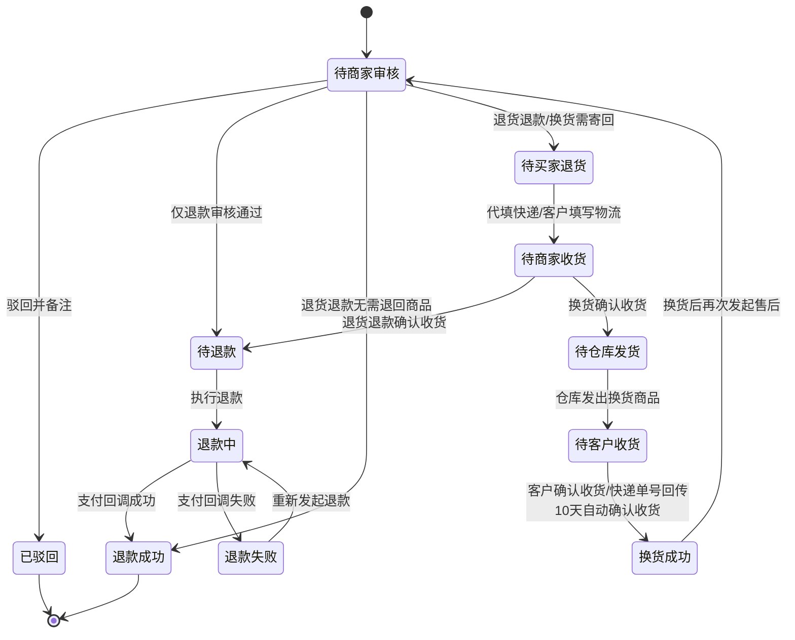

# 供应链管理后台 - 售后管理业务逻辑清单 V1.0

> 本文档为 V1.0 版本业务逻辑清单，覆盖供应链管理后台售后列表页及其详情页。
>
> 原型来源：`原型/供应链售后管理原型.html`
>
> **工单数据来源：** 售后单由售后管理模块维护，主/子订单号、商品信息、支付信息与供应商信息需与订单管理口径保持一致。

---

## 一、售后审核 `V1.0`

### 1.1 售后列表页（供应链售后管理原型.html）

> 该页面承担全部售后工单处理入口，覆盖仅退款、退货退款、换货三类审核。列表以细粒度列（主订单号、子订单号、商品名称、SKU物流编码、收货人电话、用户电话）展示信息，详情页为独立全页面布局。

#### 1.1.1 功能用例表

| # | 场景 | 操作 | 预期结果 |
|---|------|------|----------|
| 1 | 审核状态切换 | 点击"全部""待审核""审核通过""驳回"卡片 | 列表按审核状态过滤：「待审核」显示首次审核未操作的工单（待商家审核）；「审核通过」显示首次审核已通过的工单（不论后续状态）；「驳回」显示首次审核被驳回的工单。筛选区的「售后状态」和「审核状态」下拉框联动 |
| 2 | 展开筛选 | 点击"展开"按钮 | 默认展示主订单号、子订单号、商品名称 3 个快捷筛选项；展开后按一行 4 项展示售后单号、SKU物流编码、供应商、收货人手机号、申请售后时间、售后状态、审核状态、售后类型、渠道，且"收起 / 重置 / 查询"与最后一行筛选项同行展示 |
| 3 | 订单维度查询 | 输入主订单号或子订单号后点击"查询" | 列表按主/子订单号匹配过滤，主订单号与子订单号各自独立成列展示 |
| 4 | 供应商检索 | 输入供应商名称后点击"查询" | 列表返回匹配的供应商工单 |
| 5 | 工单详情查看 | 点击"详情"按钮 | 列表视图隐藏，显示独立全页面详情页。详情页以浅蓝色标题栏分区展示：售后基础信息（三列网格：售后单号、主订单号、子订单号、售后类型、申请时间、售后状态、退款金额、供应商名称、渠道来源、售后原因）、商品信息（表格：序号、SKU物流编码、商品名称、退货数量、退款金额、渠道名称）、客户信息（表格：收货人、收货人电话、用户电话、详细地址）。底部操作区展示操作按钮与返回按钮 |
| 6 | 仅退款审核通过 | 在"待商家审核"的仅退款工单点击"通过审核"，弹出二次确认弹窗（含退款说明，可选填备注） | 确认后工单状态流转为"待退款"，表示已满足退款条件但尚未发起退款请求 |
| 7 | 退货退款直退 | 在"待商家审核"的退货退款工单点击"通过审核"（二次确认），再点击"无需退回商品，直接退款" | 跳过寄回与收货环节，售后单直接进入"退款成功"，并回写退款结果 |
| 8 | 退货退款寄回 | 在"待商家审核"的退货退款工单点击"通过审核"（二次确认，可选填备注），系统优先带出供应商退回地址；若供应商无地址则由供应链专员人工填写后确认 | 工单进入"待买家退货"，售后状态变为"待买家填写退货单号"，已确认退回地址回写到工单基础信息 |
| 9 | 换货审核通过 | 在"待商家审核"的换货工单点击"通过审核"（二次确认，可选填备注），系统优先带出供应商退回地址；若供应商无地址则由供应链专员人工填写后确认 | 工单进入"待买家退货"，后续需等待客户填写寄回物流或供应链专员代填，确认收货后进入换货出库 |
| 10 | 代填快递信息 | 在"待买家退货"的工单点击"代填快递信息"，弹出物流登记弹窗，填写物流公司与寄回单号 | 物流信息完整后工单自动由"待买家退货"流转为"待商家收货" |
| 11 | 客户物流自动推进 | 客户在C端填写物流公司与寄回单号 | 物流信息完整后工单自动由"待买家退货"流转为"待商家收货"，无需供应链专员手动改状态 |
| 12 | 确认收货 | 在"待商家收货"的工单点击"确认收货" | 退货退款工单进入"待退款"；换货工单进入"待仓库发货" |
| 13 | 执行退款 | 在"待退款"工单点击"执行退款"，弹出二次确认弹窗 | 确认后工单进入"退款中"，表示退款请求已发起，等待支付渠道回调 |
| 14 | 退款失败重试 | 在"退款失败"工单点击"重新发起退款"，弹出二次确认弹窗 | 确认后工单进入"退款中"，等待支付渠道回调 |
| 15 | 驳回处理 | 在"待商家审核"工单点击"驳回并备注"，填写驳回原因后提交 | 驳回原因为必填；提交后工单状态变为"已驳回"，操作列仅保留"详情"按钮。注意："驳回并备注"仅在"待商家审核"状态下可用，审核通过后进入任何后续状态均不再显示该按钮 |
| 16 | 仓库发货 | 在"待仓库发货"工单点击"仓库发货"，弹出登记发货单号弹窗 | 填写物流单号后确认发货，工单进入"待客户收货" |
| 17 | 换货后二次售后 | 在"换货成功"工单点击"申请退货退款"或"申请仅退款" | 系统自动创建新的售后工单，状态为"待商家审核" |
| 18 | 返回列表 | 在详情页点击"返回"按钮 | 详情页隐藏，列表视图恢复显示 |

#### 1.1.2 关键字段数据来源

| 字段 | 数据来源 |
|------|----------|
| 售后单号 | 售后管理模块 — 系统生成的售后工单主键 |
| 主订单号 | 订单管理 — 主订单编号（列表独立成列） |
| 子订单号 | 订单管理 — SKU 维度子订单编号（列表独立成列） |
| 商品名称 | 订单管理 + 商品管理 — 订单行项目商品名称（列表独立成列） |
| SKU物流编码 | SKU 编码体系 — SKU 物流编码（列表独立成列） |
| SKU规格 | 订单管理 + SKU 编码体系 — SKU 规格描述（如"黑色 / XL"） |
| 供应商名称 | 供应商管理 — 供应商主数据，支持名称搜索 |
| 收货人电话 | 订单收货信息 — 收货人联系电话（列表独立成列） |
| 用户电话 | 用户账户信息/订单信息 — 用户注册联系方式（列表独立成列） |
| 用户名称 | 用户账户信息 — 用户注册姓名 |
| 收货人 | 订单收货信息 — 收件人姓名 |
| 详细地址 | 订单收货信息 — 完整收货地址 |
| 售后类型 | 用户申请售后时选择，系统回写为仅退款/退货退款/换货 |
| 售后状态 | 售后管理模块 — 当前工单状态字段，包括待商家审核、待买家退货、待商家收货、待仓库发货、待客户收货、待退款、退款中、退款失败、退款成功、换货成功、已驳回 |
| 审核状态 | 售后管理模块 — 基于首次审核结果归类，包括待审核、审核通过、驳回 |
| 退款金额 | 支付系统 + 订单金额规则 — 按现金、积分组合口径计算 |
| 积分退回 | 支付系统 — 积分退回金额，若积分过期则备注过期说明 |
| 优惠券退回 | 支付系统 — 优惠券退回金额，若优惠券过期则备注过期说明 |
| 支付方式 | 订单管理/支付系统 — 现金支付、积分支付 |
| 商品总价 | 订单管理 — 商品的原始销售价格 |
| 实付金额 | 订单管理/支付系统 — 用户实际支付的金额（扣除优惠后） |
| 渠道来源 | 订单管理 — 品牌商城、小程序、积分商城 |
| 售后原因 | 用户提交 — 用户申请售后时填写的退款原因 |
| 驳回原因 | 供应链专员填写 — 审核驳回时填写的备注内容，仅在"已驳回"状态详情页的售后基础信息区展示 |
| 退回地址 | 优先取供应商回传退回地址；若供应商未提供，则由供应链专员审核时人工填写 |
| 寄回物流公司/寄回单号 | 用户在C端填写或供应链专员代填 — 信息完整后自动推进到待商家收货 |
| 驳回备注 | 供应链专员操作 — 审核驳回时填写（必填） |
| 换货新订单商品名称 | 原订单管理 — 换货新订单的商品名称固定取原售后单关联的原订单行项目商品名称 |

#### 1.1.3 业务逻辑增强

| # | 问题 | 确认结果 |
|---|------|----------|
| 1 | 退货退款审核是否支持无需退回商品？ | 支持。审核弹窗提供"无需退回商品，直接退款"入口，选择后跳过寄回单号与确认收货环节，一键完成退款 |
| 2 | 驳回原因是否必填？ | 必填。驳回弹窗提交前必须填写备注，否则提示"请先填写驳回备注"。且"驳回并备注"操作仅在"待商家审核"状态下可用，审核通过后不再显示 |
| 3 | 是否需要增加确认收货地址？ | 需要。审核通过时需填写或确认退回地址，客户填写或供应链专员代填物流后在工单基础信息中保留退回地址 |
| 4 | 全部售后处理是否都在售后列表内完成？ | 是。审核、代填快递信息、确认收货、发起退款均在售后列表操作列中完成 |
| 5 | 待退款与退款中的区别是什么？ | `待退款` 表示业务审核已通过，但尚未调用支付退款接口；`退款中` 表示已发起退款请求，正在等待支付渠道异步回调 |
| 6 | 换货完成后是否允许再次售后？ | 允许。换货状态为"换货成功"后，可再次发起退货退款或仅退款，系统自动创建新售后单 |
| 7 | 退回地址由谁提供？ | 优先使用供应商已配置并回传的退回地址；仅当供应商无可用地址时，才允许供应链专员在审核弹窗人工填写 |
| 8 | 客户填写寄回物流后是否还需要手动改状态？ | 不需要。客户一旦填写完整物流公司与寄回单号，工单应自动从"待买家退货"流转到"待商家收货" |
| 9 | 供应链专员是否可以代填快递信息？ | 可以。在"待买家退货"状态下，供应链专员可点击"代填快递信息"代替客户填写物流信息，效果与客户自行填写一致 |
| 10 | 关键操作是否需要二次确认？ | 需要。通过审核、执行退款、重新发起退款、仅退款直退均弹出二次确认弹窗；通过审核的确认弹窗中可选填备注（非必填） |
| 11 | 仓库发货如何操作？ | 待仓库发货状态下，点击"仓库发货"弹出登记发货单号弹窗，填写物流单号后确认发货，工单进入"待客户收货" |
| 12 | 审核卡片的过滤逻辑是什么？ | 「待审核」显示首次审核未操作的工单（待商家审核）；「审核通过」显示首次审核已通过的工单（不论后续处于退款中、退款成功、换货成功等任何状态）；「驳回」显示首次审核被驳回的工单 |
| 13 | 换货后新订单商品名称取哪个？ | 取原订单的商品名称。换货流程中，即使新发货的供应商与原订单不同，新订单（换货单）上的商品名称仍以原售后单关联的原订单商品名称为准，不做变更 |
| 14 | 驳回后操作列显示什么？ | 售后单被驳回后，操作列仅显示"详情"按钮，不显示通过审核、驳回等其他操作按钮。同时，驳回操作仅在"待商家审核"状态下可用，审核通过后无论进入哪个后续状态，操作列都不再显示"驳回并备注" |
| 15 | 详情页是什么布局？ | 独立全页面布局（非弹窗）。点击"详情"后列表视图隐藏，详情页以浅蓝色标题栏分区展示售后基础信息（三列网格）、商品信息（表格）、客户信息（表格），底部操作区展示操作按钮与返回按钮 |

---

## 二、页面导航 `V1.0`

### 2.1 跳转关系

| # | 页面A | 触发条件 | 页面B |
|---|-------|----------|-------|
| 1 | 售后列表页 | 点击"详情" | 售后详情页（独立全页面） |
| 2 | 售后详情页 | 点击"返回" | 售后列表页 |
| 3 | 售后列表页 | 点击"驳回并备注"（仅待商家审核状态） | 驳回备注弹窗 |
| 4 | 售后列表页 | 点击"代填快递信息" | 寄回物流登记弹窗 |
| 5 | 售后列表页 | 点击"通过审核"（退货退款） | 退货退款审核弹窗 |
| 6 | 售后列表页 | 点击"通过审核"（换货） | 换货审核弹窗 |
| 7 | 售后详情页 | 点击"通过审核" | 对应审核弹窗 |
| 8 | 售后详情页 | 点击"驳回并备注"（仅待商家审核状态） | 驳回备注弹窗 |

### 2.2 返回导航

- 详情页通过底部"返回"按钮返回列表视图。
- 所有弹窗均支持点击"关闭""取消"或右上角关闭按钮返回原视图。

### 2.3 登录拦截

| 类型 | 页面 |
|------|------|
| 受保护 | 售后列表页、售后详情页 |
| 公开 | 无 |

---

## 三、状态流转 `V1.0`

### 3.1 售后单状态流转

| 当前状态 | 可执行操作 | 目标状态 | 入口页面 |
|----------|-----------|----------|----------|
| 待商家审核 | 通过审核（仅退款，二次确认） | 待退款 | 售后列表页/详情页 |
| 待商家审核 | 通过审核并选择无需退回商品（二次确认） | 退款成功 | 售后列表页/详情页 |
| 待商家审核 | 通过审核并确认退回地址（二次确认） | 待买家退货 | 售后列表页/详情页 |
| 待商家审核 | 驳回并备注（备注必填） | 已驳回 | 售后列表页/详情页 |
| 待买家退货 | 代填快递信息（供应链专员填写物流） | 待商家收货 | 售后列表页/详情页 |
| 待买家退货 | 客户填写物流公司与寄回单号 | 待商家收货 | C端售后详情页 |
| 待商家收货 | 确认收货（退货退款） | 待退款 | 售后列表页/详情页 |
| 待商家收货 | 确认收货（换货） | 待仓库发货 | 售后列表页/详情页 |
| 待仓库发货 | 仓库发货（登记发货单号） | 待客户收货 | 售后列表页/详情页 |
| 待客户收货 | 客户确认收货/快递单号回传10天自动确认 | 换货成功 | 售后列表页 |
| 待退款 | 执行退款（二次确认） | 退款中 | 售后列表页/详情页 |
| 退款中 | 支付渠道回调成功 | 退款成功 | 售后列表页/退款处理链路 |
| 退款中 | 支付渠道回调失败 | 退款失败 | 售后列表页/退款处理链路 |
| 退款失败 | 重新发起退款（二次确认） | 退款中 | 售后列表页/详情页 |
| 换货成功 | 申请退货退款/申请仅退款 | 新售后单待商家审核 | 售后列表页 |
