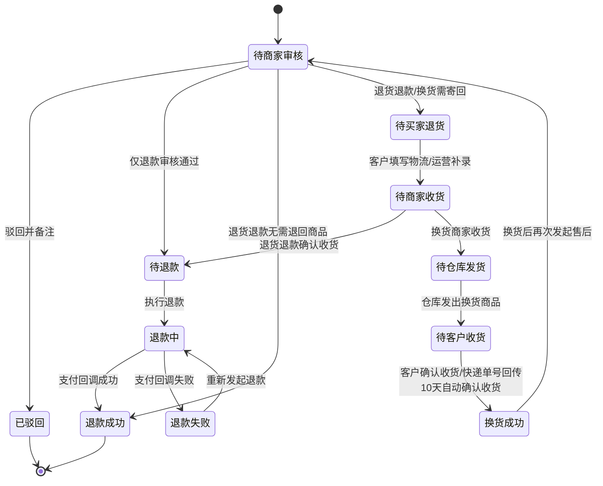

# 品牌商城 - 售后管理业务逻辑清单 V1.0（售后审核与退货单协同）

> 本文档为 V1.0 版本业务逻辑清单，覆盖售后列表、退货单列表共 2 个页面。
>
> 原型来源：`原型/品牌商城售后管理原型.html`
>
> **工单数据来源：** 售后单、退款单、退货单均由品牌商城售后管理模块维护，主/子订单号、商品信息、支付信息需与订单管理口径保持一致。
>
> **与商城运营后台的差异：** 品牌商城不涉及供应商维度管理，退回地址优先使用品牌仓库地址；客户信息以收货人信息为主；支持积分、优惠券等多支付方式的退款拆分。

---

## 一、售后审核 `V1.0`

### 1.1 售后列表页（品牌商城售后管理原型.html）

> 该页面承担全部售后工单处理入口，覆盖仅退款、退货退款、换货三类审核，并在列表内完成审核、审核退回地址、查看或补录寄回物流、商家收货、执行退款等操作。

#### 1.1.1 功能用例表

| # | 场景 | 操作 | 预期结果 |
|---|------|------|----------|
| 1 | 审核状态切换 | 点击"全部""待审核""审核通过""驳回"按钮 | 列表按审核状态过滤：「待审核」显示首次审核未操作的工单（待商家审核）；「审核通过」显示首次审核已通过的工单（不论后续状态）；「驳回」显示首次审核被驳回的工单。筛选区的「售后状态」和「审核状态」下拉框联动 |
| 2 | 展开筛选 | 点击"展开"按钮 | 默认展示主订单号、子订单号、商品名称、售后单号 4 个快捷筛选项；展开后按一行 4 项展示全部筛选条件（SKU物流编码、收货人手机号码、申请售后时间、售后状态、审核状态、售后类型），且"收起 / 重置 / 查询"与最后一行筛选项同行展示 |
| 3 | 订单维度查询 | 输入主订单号或子订单号后点击"查询" | 列表按主/子订单号匹配过滤，主/子订单号展示在第一列 |
| 4 | 工单详情查看 | 点击操作列"详情"按钮 | 进入详情页，展示进度步骤条、售后信息（售后单号、申请时间、售后类型、退款金额、积分退回、优惠券退回）、支付信息（商品总价、实付金额、优惠明细）、商品信息（商品名称、SKU物流编码、商品数量、售后渠道、商品编码）、客户信息（收货人、收货人电话、收货地址、售后原因、客户备注）和审核轨迹（含操作人） |
| 5 | 仅退款审核通过 | 在"待商家审核"的仅退款工单点击"通过审核"，弹出二次确认弹窗（含退款说明，可选填备注） | 确认后工单状态流转为"待退款"，表示已满足退款条件但尚未发起退款请求，并同步生成对应退款单 |
| 6 | 退货退款直退 | 在"待商家审核"的退货退款工单点击"通过审核"（二次确认），再点击"无需退回商品，直接退款" | 跳过寄回与收货环节，售后单直接进入"退款成功"，并回写退款结果 |
| 7 | 退货退款寄回 | 在"待商家审核"的退货退款工单点击"通过审核"（二次确认，可选填备注），系统优先带出品牌仓库退回地址；若无配置地址则由运营人工填写后确认 | 工单进入"待买家退货"，售后状态变为"待买家填写退货单号"，已确认退回地址回写到工单基础信息 |
| 8 | 换货审核通过 | 在"待商家审核"的换货工单点击"通过审核"（二次确认，可选填备注），系统优先带出品牌仓库退回地址；若无配置地址则由运营人工填写后确认 | 工单进入"待买家退货"，后续需等待客户填写寄回物流，品牌仓库确认收货后进入换货出库 |
| 9 | 寄回物流自动推进 | 客户在C端填写物流公司与寄回单号，或品牌运营在后台补录寄回物流 | 物流信息完整后工单自动由"待买家退货"流转为"待商家收货"，基础信息增加物流公司、寄回单号、退回地址 |
| 10 | 商家确认收货 | 在"待商家收货"的工单点击"商家收货" | 退货退款工单进入"待退款"；换货工单进入"待仓库发货" |
| 11 | 执行退款 | 在"待退款"工单点击"执行退款"，弹出二次确认弹窗 | 确认后工单进入"退款中"，表示退款请求已发起，等待支付渠道回调。混合支付场景下按现金、积分、优惠券分别退款 |
| 12 | 退款失败重试 | 在"退款失败"工单点击"重新发起退款"，弹出二次确认弹窗 | 确认后工单进入"退款中"，售后状态变为"执行退款"，等待支付渠道回调 |
| 13 | 驳回处理 | 点击"驳回并备注"，填写驳回原因后提交 | 驳回原因为必填；提交后工单状态变为"已驳回"，轨迹中追加驳回备注 |
| 14 | 仓库发货 | 在"待仓库发货"工单点击"仓库发货"，弹出登记发货单号弹窗 | 填写物流单号后确认发货，工单进入"待客户收货" |

#### 1.1.2 关键字段数据来源

| 字段 | 数据来源 |
|------|----------|
| 售后订单号 | 售后管理模块 — 系统生成的售后工单主键 |
| 主订单号 | 订单管理 — 主订单编号 |
| 子订单号 | 订单管理 — SKU 维度子订单编号 |
| 商品信息（商品名称/SKU规格/SKU物流编码） | 订单管理 + 商品管理 — 订单行项目与 SKU 信息 |
| 换货新订单商品名称 | 原订单管理 — 换货新订单的商品名称固定取原售后单关联的原订单行项目商品名称 |
| 收货人 | 订单收货信息 — 当前收件人姓名 |
| 收货人电话 | 订单收货信息 — 收件人联系电话 |
| 收货地址 | 订单收货信息 — 收货人电话 + 完整收货地址 |
| 售后渠道 | 售后管理模块 — 品牌商城 |
| 售后类型 | 用户申请售后时选择，系统回写为仅退款/退货退款/换货 |
| 售后状态 | 售后管理模块 — 当前工单状态字段，包括待商家审核、待买家退货、待商家收货、待仓库发货、待客户收货、待退款、退款中、退款失败、退款成功、换货成功、已驳回 |
| 审核状态 | 售后管理模块 — 基于首次审核结果归类，包括待审核、审核通过、驳回 |
| 退款金额 | 支付系统 + 订单金额规则 — 按现金、积分、优惠券组合口径计算 |
| 积分退回 | 支付系统 — 积分退回金额，若积分过期则备注过期说明 |
| 优惠券退回 | 支付系统 — 优惠券退回金额，若优惠券过期则备注过期说明 |
| 支付方式 | 订单管理/支付系统 — 现金支付、积分支付、混合支付 |
| 商品总价 | 订单管理 — 商品的原始销售价格 |
| 退回地址 | 优先取品牌仓库退回地址；若无配置地址，则由运营审核时人工填写并确认 |
| 寄回物流公司/寄回单号 | 用户在C端填写或品牌运营后台补录 — 信息完整后自动推进到待商家收货 |
| 驳回备注 | 用户操作 — 品牌管理员审核驳回时填写 |

#### 1.1.3 业务逻辑增强

| # | 问题 | 确认结果 |
|---|------|----------|
| 1 | 退货退款审核是否支持无需退回商品？ | 支持。审核弹窗提供"无需退回商品，直接退款"入口，选择后跳过寄回单号与确认收货环节，一键完成退款 |
| 2 | 驳回原因是否必填？ | 必填。驳回弹窗提交前必须填写备注，否则提示"请先填写驳回备注" |
| 3 | 是否需要增加确认收货地址？ | 需要。审核通过时需填写或确认退回地址，客户填写或运营补录物流后在工单基础信息中保留退回地址 |
| 4 | 全部售后处理是否都在售后列表内完成？ | 是。审核、查看或补录寄回物流、商家收货、发起退款均在售后列表操作列中完成 |
| 5 | 待退款与退款中的区别是什么？ | `待退款` 表示业务审核已通过，但尚未调用支付退款接口；`退款中` 表示已发起退款请求，正在等待支付渠道异步回调 |
| 6 | 换货完成后是否允许再次售后？ | 允许。换货状态为"换货成功"后，可再次发起退货退款或仅退款，系统自动创建新售后单 |
| 7 | 退回地址由谁提供？ | 优先使用品牌仓库已配置的退回地址；仅当无可用地址时，才允许运营在审核弹窗人工填写 |
| 8 | 客户填写寄回物流后是否还需要商家手动改状态？ | 不需要。客户一旦填写完整物流公司与寄回单号，工单应自动从"待买家退货"流转到"待商家收货" |
| 9 | 关键操作是否需要二次确认？ | 需要。通过审核、执行退款、重新发起退款、仅退款直退均弹出二次确认弹窗；通过审核的确认弹窗中可选填备注（非必填） |
| 10 | 仓库发货如何操作？ | 待仓库发货状态下，点击"仓库发货"弹出登记发货单号弹窗，填写物流单号后确认发货，工单进入"待客户收货" |
| 11 | 审核卡片的过滤逻辑是什么？ | 「待审核」显示首次审核未操作的工单（待商家审核）；「审核通过」显示首次审核已通过的工单（不论后续处于退款中、退款成功、换货成功等任何状态）；「驳回」显示首次审核被驳回的工单 |
| 12 | 混合支付退款如何处理？ | 现金部分原路退回，积分部分退回到用户账户（过期积分标注说明），优惠券部分退回到用户账户（过期优惠券标注说明） |
| 13 | 品牌商城与商城运营后台的售后数据是否互通？ | 品牌商城售后由品牌管理员独立处理，退回地址使用品牌仓库地址，不涉及供应商维度 |
| 14 | 换货后新订单商品名称取哪个？ | 取原订单的商品名称。换货流程中，即使新发货的仓库与原订单不同，新订单（换货单）上的商品名称仍以原售后单关联的原订单商品名称为准，不做变更 |

---

## 二、退货单管理 `V1.0`

### 2.1 退货单列表页（品牌商城售后管理原型.html）

> 该页面用于查看退款成功后自动生成的退货单，跟踪退货处理、结果回传与品牌仓库协同状态。

#### 2.1.1 功能用例表

| # | 场景 | 操作 | 预期结果 |
|---|------|------|----------|
| 1 | 页面切换 | 点击"退货单列表"子菜单 | 页面切换至退货单视图 |
| 2 | 退货单生成 | 退款单达到"退款成功"状态，且售后类型为「退货退款」或「换货」 | 系统自动生成对应退货单，并关联退款单与售后单；「仅退款」不生成退货单 |
| 3 | 详情查看 | 点击"查看详情" | 弹窗展示退货单基础信息（含商品图片、商品信息、退货类型）、关联退款单、关联售后单、客户收货人、收货人手机号、售后信息（退款金额、积分退回、优惠券退回）、支付信息（商品总价、实付金额、优惠明细）等，不展示审核轨迹 |
| 4 | 条件筛选 | 在筛选区输入主订单号、子订单号、售后单号、SKU物流编码等条件后点击"查询" | 列表返回匹配的退货单记录 |
| 5 | 状态跟踪 | 查看退货单状态 | 根据退款回写结果展示"已退款""待收货"等状态 |
| 6 | 结果回传 | 退货单处理完成 | 退货结果回写至退款单与售后单，形成闭环轨迹 |

#### 2.1.2 关键字段数据来源

| 字段 | 数据来源 |
|------|----------|
| 退货单号 | 退货管理模块 — 由退款成功事件自动生成 |
| 关联退款单 | 退款单管理 — 来源退款单编号 |
| 关联售后单 | 售后管理模块 — 来源售后单编号 |
| 主订单号/子订单号 | 订单管理 — 原始订单信息 |
| 商品名称 | 商品管理 — 退货商品名称 |
| 商品图片 | 商品管理 — 退货商品图片（预留占位） |
| 退货类型 | 售后管理模块 — 退货退款/换货 |
| SKU物流编码 | 订单管理 + SKU 编码体系 — 列表与详情统一展示 |
| 退货数量 | 来源小程序退货信息 |
| 退款金额 | 退款单管理 — 与原退款单金额保持一致 |
| 商品总价 | 订单管理 — 商品的原始销售价格 |
| 优惠明细 | 订单管理/支付系统 — 动态显示优惠券和积分抵扣，有优惠时显示具体金额，无优惠时显示0 |
| 积分退回 | 支付系统 — 积分退回金额，若积分过期则备注过期说明 |
| 优惠券退回 | 支付系统 — 优惠券退回金额，若优惠券过期则备注过期说明 |
| 支付方式 | 订单管理/支付系统 — 现金支付、积分支付、混合支付 |
| 客户收货人 | 订单收货信息 — 收件人姓名 |
| 收货人手机号 | 订单收货信息 — 收件人联系电话 |
| 退货单状态 | 退货管理模块 — 基于退款成功等状态映射 |
| 制单时间 | 系统生成 — 退货单生成时间 |

#### 2.1.3 业务逻辑增强

| # | 问题 | 确认结果 |
|---|------|----------|
| 1 | 退货单何时生成？ | 退款单进入"退款成功"后，且售后类型为「退货退款」或「换货」时自动生成对应退货单；「仅退款」不生成退货单 |
| 2 | 退货单与退款单、售后单如何关联？ | 退货单需同时保留关联退款单号与关联售后单号，用于详情追溯 |
| 3 | 退货单关闭后是否还需结果回传？ | 不需要。关闭状态下结果回传节点仅保留"无需处理"说明 |
| 4 | 退货单是否支持查看仓库信息？ | 支持。详情中展示快递公司、快递单号等协同字段 |

---

## 三、页面导航 `V1.0`

### 3.1 跳转关系

| # | 页面A | 触发条件 | 页面B |
|---|-------|----------|-------|
| 1 | 售后列表页 | 点击"退货单列表"子菜单 | 退货单列表页 |
| 2 | 退货单列表页 | 点击"售后列表"子菜单 | 售后列表页 |
| 3 | 售后列表页 | 点击操作列"详情"按钮 | 售后订单详情页 |
| 4 | 退货单列表页 | 点击"查看详情" | 退货单详情弹窗 |
| 5 | 售后列表页 | 点击"驳回并备注" | 驳回备注弹窗 |
| 6 | 售后列表页 | 点击"登记寄回单号" | 寄回物流登记弹窗 |
| 7 | 售后列表页 | 点击"通过审核"（退货退款） | 退货退款审核弹窗 |
| 8 | 售后列表页 | 点击"通过审核"（换货） | 换货审核弹窗 |

### 3.2 返回导航

- 售后详情页通过面包屑导航返回售后列表页。
- 所有弹窗均支持点击"关闭""取消"或右上角关闭按钮返回原列表视图，不跳转新页面。

### 3.3 登录拦截

| 类型 | 页面 |
|------|------|
| 受保护 | 售后列表页、退货单列表页、售后订单详情页、退货单详情弹窗 |
| 公开 | 无 |

---

## 四、状态流转 `V1.0`

### 4.1 售后单状态流转

| 当前状态 | 可执行操作 | 目标状态 | 入口页面 |
|----------|-----------|----------|----------|
| 待商家审核 | 通过审核（仅退款，二次确认） | 待退款 | 售后列表页 |
| 待商家审核 | 通过审核并选择无需退回商品（二次确认） | 退款成功 | 售后列表页 |
| 待商家审核 | 通过审核并确认退回地址（二次确认） | 待买家退货 | 售后列表页 |
| 待商家审核 | 驳回并备注（备注必填） | 已驳回 | 售后列表页 |
| 待买家退货 | 客户填写物流公司与寄回单号/运营补录 | 待商家收货 | C端售后详情页/售后列表页 |
| 待商家收货 | 确认收货（退货退款） | 待退款 | 售后列表页 |
| 待商家收货 | 确认收货（换货） | 待仓库发货 | 售后列表页 |
| 待仓库发货 | 仓库发货（登记发货单号） | 待客户收货 | 售后列表页 |
| 待客户收货 | 客户确认收货/快递单号回传10天自动确认 | 换货成功 | 售后列表页 |
| 待退款 | 执行退款（二次确认） | 退款中 | 售后列表页 |
| 退款中 | 支付渠道回调成功 | 退款成功 | 售后列表页/退款处理链路 |
| 退款中 | 支付渠道回调失败 | 退款失败 | 售后列表页/退款处理链路 |
| 退款失败 | 重新发起退款（二次确认） | 退款中 | 售后列表页 |
| 换货成功 | 申请退货退款/申请仅退款 | 新售后单待商家审核 | 售后列表页 |

### 4.2 退货单状态流转

| 当前状态 | 可执行操作 | 目标状态 | 入口页面 |
|----------|-----------|----------|----------|
| 已退款 | 查看详情 | - | 退货单列表页 |

> 退货单当前为只读展示，仅支持查看详情，不支持手动状态变更。退货单由退款成功事件自动生成，状态随退款单同步更新。
