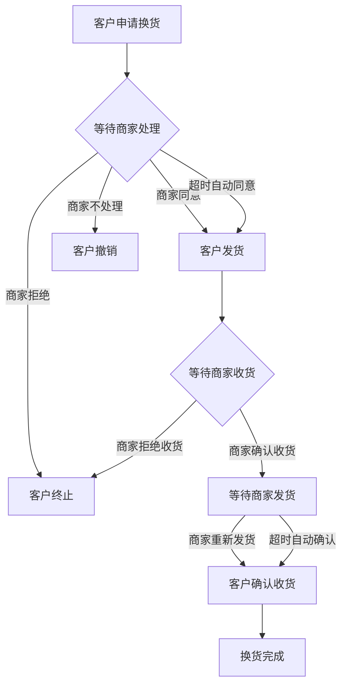

# 换货流程售后状态对照图

```mermaid
graph TD
    A[客户申请换货] --> B{等待商家处理}

    B -->|商家同意| C[客户发货]
    B -->|商家拒绝| H[客户终止]
    B -->|商家不处理| I[客户撤销]
    B -->|超时自动同意| C

    C --> D{等待商家收货}

    D -->|商家拒绝收货| H
    D -->|商家确认收货| E[等待商家发货]

    E -->|商家重新发货| F[客户确认收货]
    E -->|超时自动确认| F

    F --> G[换货完成]
```