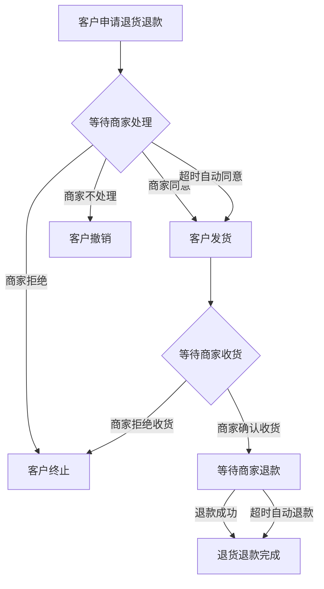

# 退货退款流程售后状态对照图

```mermaid
graph TD
    A[客户申请退货退款] --> B{等待商家处理}

    B -->|商家同意| C[客户发货]
    B -->|商家拒绝| H[客户终止]
    B -->|商家不处理| I[客户撤销]
    B -->|超时自动同意| C

    C --> D{等待商家收货}

    D -->|商家拒绝收货| H
    D -->|商家确认收货| E[等待商家退款]

    E -->|退款成功| F[退货退款完成]
    E -->|超时自动退款| F
```