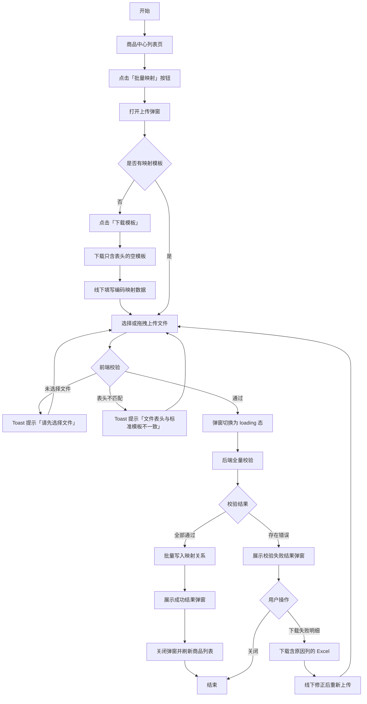
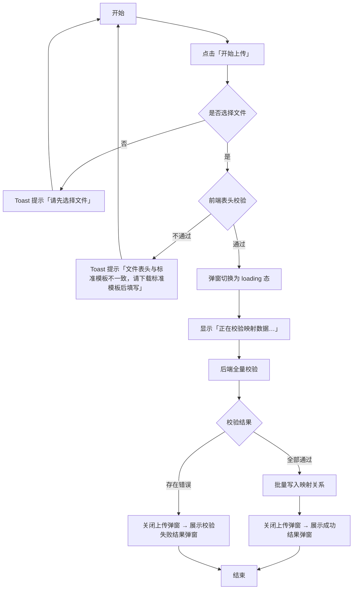
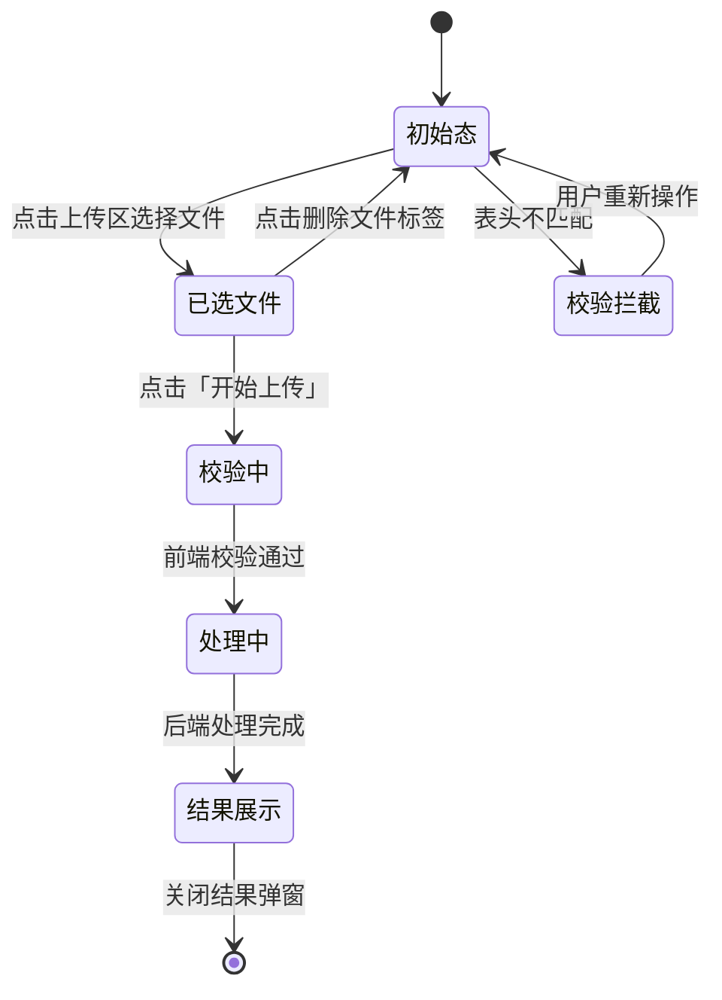
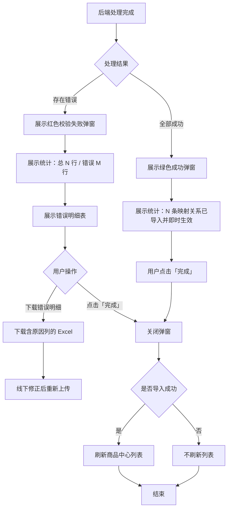
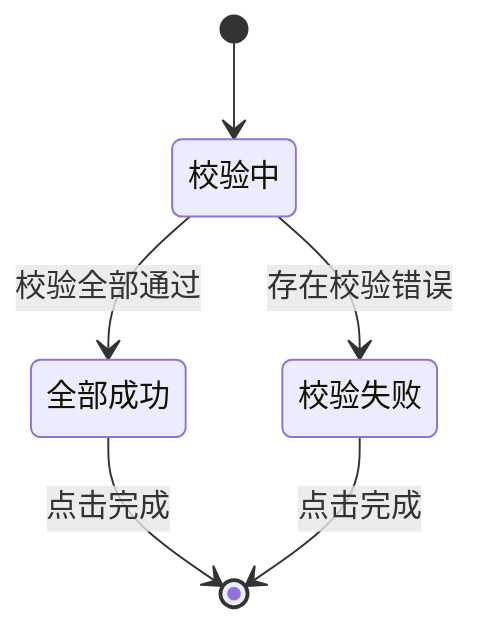

# 商品中心 · 批量映射 — 品牌商城后台产品需求文档

# 1. 需求背景

---

# 2. 需求分析

---

# 3. 系统流程图

## 3.1. 批量映射总体流程

## 3.2. 编码映射数据流转

---

# 4. 详细需求

## 4.1. 品牌商城后台系统

### 4.1.0. 商品中心主页

#### 4.1.0.1. 功能概述

商品中心主页是品牌商城后台管理商品的统一入口，集中展示本商城全部商品，支持直销/分销两种模式切换查看。商品信息（含商城价、渠道价、划线价）由商城运营平台推品时一并推送，已包含完整价格，无需手动设置初始价。分销模式下提供毛利率范围筛选、毛利预警及批量设置商城价能力。

> 直销/分销两种模式的字段差异、价格编辑权限、毛利计算规则详见 `05.商品中心-直销与分销价格字段-品牌商城后台PRD-V1.0.md`，本节仅描述列表与工具栏交互，不重复字段定义。

#### 4.1.0.2. 页面结构

页面自上而下由「面包屑（商品管理 / 商品中心）+ 页面标题 + 模式切换 + 表格面板」组成。

| 区域 | 说明 |
|------|------|
| 顶栏 | 演示标签 + 模式切换（直销模式 / 分销模式 toggle）+ 用户信息 |
| 页面标题 | 「商品中心」+ 副标题（随模式变化：直销为"管理品牌商城商品信息…"；分销为"管理分销商品定价，设置商城价、查看毛利，同步至小程序"） |
| 工具栏 | 批量操作按钮组 + 右侧【批量映射】主按钮；右侧统计「共 N 件商品（已上架 X / 已下架 Y）」 |
| 毛利率筛选栏 | **仅分销模式显示**：毛利率范围输入（最低%—最高%）+ 筛选/重置 + 提示 |
| 数据表格 | 商品列表（列随模式变化，详见 05 PRD） |

#### 4.1.0.3. 工具栏批量操作

| 按钮 | 直销模式 | 分销模式 | 说明 |
|------|:----:|:----:|------|
| 批量上架 | ✅ | ✅ | 勾选商品后批量上架 |
| 批量下架 | ✅ | ✅ | 勾选商品后批量下架 |
| 批量打标签 | ✅ | ✅ | 批量为商品打标签（演示） |
| 批量分类 | ✅ | ✅ | 批量修改商品前台分类（演示） |
| 批量设置商城价 | ❌ | ✅ | 仅分销模式显示，批量设置商城价（演示） |
| 批量映射 | ✅ | ✅ | 打开批量映射上传弹窗（详见 4.1.1） |

未勾选商品执行批量操作时，Toast 提示"请先勾选商品"。

#### 4.1.0.4. 毛利率范围筛选（分销模式专属）

分销模式下，工具栏下方展示毛利率范围筛选栏，用于按毛利率筛选商品：

| 元素 | 说明 |
|------|------|
| 毛利率范围标签 | 固定文案"毛利率范围" |
| 最低% 输入框 | 数字输入，范围 -100~100，步长 0.1，留空表示不限下限 |
| 分隔符 | "—" |
| 最高% 输入框 | 数字输入，范围 -100~100，步长 0.1，留空表示不限上限 |
| 筛选 | 按钮，应用筛选刷新列表 |
| 重置 | 按钮，清空范围并刷新，Toast 提示"已重置毛利率筛选" |
| 提示文案 | "毛利率为负或低于阈值 10% 的商品会高亮提示" |

**筛选规则：**

| 规则编号 | 规则描述 |
|----------|----------|
| RULE-MARGIN-001 | 毛利率 = (商城价 − 渠道价) ÷ 商城价 × 100%，与表格内毛利/毛利率列口径一致 |
| RULE-MARGIN-002 | 仅填最低值：筛选毛利率 ≥ 最低值的商品 |
| RULE-MARGIN-003 | 仅填最高值：筛选毛利率 ≤ 最高值的商品 |
| RULE-MARGIN-004 | 同时填两端：筛选最低值 ≤ 毛利率 ≤ 最高值的商品 |
| RULE-MARGIN-005 | 最低值 > 最高值时，Toast 提示"最低毛利率不能大于最高毛利率"，不执行筛选 |
| RULE-MARGIN-006 | 没有有效商城价的商品无法计算毛利率，筛选时排除 |
| RULE-MARGIN-007 | 切换到直销模式时筛选栏隐藏，并清空已输入的筛选范围 |
| RULE-MARGIN-008 | 输入框支持边输边筛，也可点击【筛选】按钮触发 |

#### 4.1.0.5. 操作列

商品列表每行操作列提供【编辑】【详情】：
- 【编辑】：进入商品编辑视图，可修改前台分类、商品标签、客户编码，分销模式下还可修改商城价/划线价。
- 【详情】：进入商品详情只读视图。

#### 4.1.0.6. 业务规则

| 规则编号 | 规则描述 |
|----------|----------|
| RULE-PROD-LIST-001 | 直销/分销模式切换即时刷新列表列结构，不刷新页面 |
| RULE-PROD-LIST-002 | 工具栏统计「已上架/已下架」数量随筛选结果实时更新 |
| RULE-PROD-LIST-003 | 商品的前台分类通过「批量映射」上传表格自动归属，单个修改在编辑商品时操作（与分类管理页面解耦） |

---

### 4.1.1. 商品中心模块

#### 4.1.1.1. 批量映射上传弹窗

##### 1. 功能概述

- **功能描述**：品牌商城运营人员通过上传「品牌商城编码映射模板」Excel 文件，批量建立客户商品编码与商城 SKU 的映射关系。系统对全量数据执行完整校验后一次性导入，校验不通过则全部拒绝并展示错误明细供修正。
- **业务描述**：商品中心接收基线商品数据后，商城侧需将内部客户商品编码与商城 SKU 建立映射，以便后续上架、定价和库存管理。批量映射功能替代逐条手动映射，大幅提升运营效率。采用「先校验后导入」策略，保证映射数据的完整性和一致性。
- **使用角色**：商城超管（mall-admin）
- **触发条件**：在商品中心列表页工具栏点击「批量映射」按钮

##### 2. 界面设计

###### 2.1 页面原型

- 原型文件：`04.商品中心-批量映射-品牌商城后台原型.html` — 点击工具栏「批量映射」按钮查看

###### 2.2 输出项说明

| 字段名称 | 字段标识 | 数据类型 | 数据来源 | 格式说明 |
|----------|----------|----------|----------|----------|
| 模板下载卡片 | tpl_card | 组件 | 系统固定 | 展示「没有文件？下载只有表头的空模板，填写后上传」文案 + 下载按钮 |
| 上传区域 | upload_area | 组件 | 用户交互 | 虚线边框拖拽区，提示「仅支持 .xlsx，≤ 10MB，表头须与模板完全一致」 |
| 已选文件标签 | file_chip | 文本 | 用户选择 | 展示已选文件名 + 删除按钮，如「📄 品牌商城编码映射模板.xlsx ×」 |
| 取消按钮 | btn_cancel | 按钮 | 系统固定 | 关闭弹窗，不执行任何操作 |
| 开始上传按钮 | btn_upload | 按钮 | 系统固定 | 触发文件校验与上传流程，蓝色主按钮 |

##### 3. 业务逻辑

###### 3.1 流程图

**文件校验流程**

###### 3.2 业务规则

| 规则编号 | 规则名称 | 适用场景 | 规则描述 | 错误提示 |
|----------|----------|----------|----------|----------|
| RULE-MAP-001 | 文件格式限制 | 上传文件时 | 仅支持 .xlsx 格式文件 | 仅支持 .xlsx 格式文件 |
| RULE-MAP-002 | 文件大小限制 | 上传文件时 | 单文件不超过 10MB | 文件大小不能超过 10MB |
| RULE-MAP-003 | 表头校验 | 开始上传后 | 上传文件表头须与标准模板完全一致，校验列名、列数、列顺序 | 文件表头与标准模板不一致，请下载标准模板后填写 |
| RULE-MAP-004 | 文件必选 | 开始上传后 | 用户必须先选择文件才能开始上传 | 请先选择文件 |
| RULE-MAP-005 | 模板下载 | 点击下载模板 | 下载只含标准表头、无数据行的空 .xlsx 文件 | — |
| RULE-MAP-006 | 同步处理 | 校验通过后 | 采用同步等待方式处理，页面 loading 直至处理完成，期间提示「请勿关闭窗口」 | — |
| RULE-MAP-007 | 全量校验策略 | 后台处理时 | 先全量校验所有数据，任一行校验失败则全部映射关系均不写入，全部无误才批量写入 | — |
| RULE-MAP-008 | 失败行记录 | 后台处理时 | 每条失败行记录：行号、客户商品编码、SKU物流编码、失败原因 | — |
| RULE-MAP-009 | 客户编码存在性 | 逐行处理时 | 客户商品编码由映射产生，不需校验存在性；但不可为空 | 客户商品编码不能为空（MAP-201） |
| RULE-MAP-010 | SKU存在性校验 | 逐行处理时 | SKU物流编码须在商品中心存在且已上架 | SKU物流编码「{code}」不存在或未上架（MAP-212） |
| RULE-MAP-011 | 必填项校验 | 逐行处理时 | 模板中标记为必填的列不可为空 | 必填项「{字段名}」为空（MAP-201/202） |
| RULE-MAP-012 | 编码格式校验 | 逐行处理时 | 编码去除首尾空格、不可见字符，限 1-50 字符 | 编码格式错误，请去除首尾空格，限 1-50 字符（MAP-203） |
| RULE-MAP-013 | 客户商品编码唯一性 | 逐行+跨行 | 一个客户商品编码只能绑定一个 SKU物流编码；已绑其他 SKU 时禁止改绑 | 客户商品编码「{code}」已绑定 SKU「{oldSKU}」，不可重复绑定其他 SKU（MAP-221） |
| RULE-MAP-014 | 同文件冲突校验 | 文件内校验 | 同一文件内同一客户商品编码不可绑定不同 SKU | 客户商品编码「{code}」在本文件中绑定了不同 SKU（与第 {X} 行冲突）（MAP-222） |
| RULE-MAP-015 | 完全重复校验 | 文件内校验 | 同一文件内不允许存在完全相同的「客户商品编码+SKU物流编码」组合行 | 数据重复，与第 {X} 行映射完全相同（MAP-223） |
| RULE-MAP-016 | 表头版本 | 逐行处理时 | 模板表头版本须为最新版本 | 模板表头版本不一致，请下载最新模板（MAP-105） |
| RULE-MAP-017 | 空行/无数据 | 文件级 | 文件至少 1 行有效数据 | 文件中无有效数据行（MAP-106） |
| RULE-MAP-018 | 行数上限 | 文件级 | 单次导入不超过 5000 行 | 单次导入数据不能超过 5000 行（MAP-107） |
**上传弹窗状态流转**

**状态定义**

| 状态值 | 状态名称 | 状态说明 | 可见UI |
|--------|----------|----------|--------|
| idle | 初始态 | 弹窗打开的默认状态，上传区空 | 下载模板卡 + 空上传区 + 取消/开始上传按钮 |
| selected | 已选文件 | 用户已选择文件但未上传 | 下载模板卡 + 上传区 + 已选文件标签 + 取消/开始上传按钮 |
| loading | 处理中 | 文件校验通过，后端正在全量校验 | 转圈 spinner + 「正在校验映射数据…」+ 「请勿关闭窗口」 |

###### 3.4 模板字段定义

「品牌商城编码映射模板」（对应 `OMS批量映射模板.xlsx`）共 2 列，运营人员按列填写：

| 列序 | 列名 | 字段标识 | 必填 | 数据类型 | 长度限制 | 校验规则 | 错误提示 |
|:----:|------|----------|:----:|----------|----------|----------|----------|
| 1 | 客户商品编码 | customer_product_code | 是 | String | 1-50 | 不可为空；一个客户商品编码只能绑定一个 SKU物流编码（MAP-221/222） | 客户商品编码不能为空（MAP-201）；已绑其他 SKU 不可改绑（MAP-221） |
| 2 | SKU物流编码 | sku_logistics_code | 是 | String | 1-50 | 不可为空；须在商品中心存在且已上架；一个 SKU 可绑定多个客户商品编码（合法，不报错） | SKU物流编码「{code}」不存在或未上架（MAP-212） |

以下字段由系统自动填充，不出现在模板中：

| 自动填充字段 | 规则 |
|-------------|------|
| 映射关系 | 校验通过的行即时写入，即时生效 |
| 状态 | 映射后商品状态不变（沿用原状态） |
| 更新人/时间 | 记录本次操作的运营人员和时间 |

##### 4. 交互设计

###### 4.1 输入项说明

| 字段名称 | 字段标识 | 字段类型 | 必填 | 数据类型 | 长度限制 | 校验规则 | 取值范围 | 来源 | 提示文案 | 备注 |
|----------|----------|----------|------|----------|----------|----------|----------|------|----------|------|
| 映射模板文件 | mapping_file | 文件上传 | 是 | File(.xlsx) | ≤ 10MB | 仅 .xlsx 格式；表头须与标准模板完全一致 | .xlsx | 用户选择 | 点击选择或拖拽文件到此处 | 对应 OMS 批量映射模板 |

###### 4.2 交互说明

1. 用户在商品中心列表页工具栏点击「批量映射」按钮，打开上传弹窗
2. 弹窗内展示模板下载卡片和空的上传区域
3. 若用户没有模板文件，点击「下载模板」按钮，系统下载只含表头的空 .xlsx 文件
4. 用户点击上传区或拖拽文件到上传区，选择已填写的映射模板文件
5. 上传区下方显示已选文件标签（文件名 + 删除按钮），用户可点击 × 删除后重新选择
6. 用户点击「开始上传」按钮
7. 系统执行前端校验（文件是否已选、表头是否匹配）
8. 校验不通过：显示 Toast 错误提示，用户可修正后重试
9. 校验通过：弹窗内容切换为 loading 态（转圈 + 提示文案），底部按钮隐藏
10. 后台处理完成后，上传弹窗自动关闭，打开结果弹窗

###### 4.3 错误提示文案

**表单校验提示**

| 校验字段 | 校验场景 | 提示文案 |
|----------|----------|----------|
| mapping_file | 未选择文件 | 请先选择文件 |
| mapping_file | 文件格式非 .xlsx | 仅支持 .xlsx 格式文件 |
| mapping_file | 文件超过 10MB | 文件大小不能超过 10MB |
| mapping_file | 表头不匹配 | 文件表头与标准模板不一致，请下载标准模板后填写 |

**业务异常提示**

| 异常场景 | 错误码 | 提示文案 |
|----------|--------|----------|
| **文件级错误（MAP-1xx）** | | |
| 文件未选择 | MAP-101 | 请先选择文件 |
| 文件格式不符 | MAP-102 | 仅支持 .xlsx 格式文件 |
| 文件超过大小上限 | MAP-103 | 文件大小不能超过 10MB |
| 表头不匹配 | MAP-104 | 文件表头与标准模板不一致，请下载标准模板后填写 |
| 表头版本不一致 | MAP-105 | 模板表头版本不一致，请下载最新模板 |
| 文件无数据行 | MAP-106 | 文件中无有效数据行 |
| 行数超过上限 | MAP-107 | 单次导入数据不能超过 5000 行 |
| 文件解析失败 | MAP-108 | 文件解析失败，请检查文件是否损坏或被加密 |
| **行级数据错误（MAP-2xx）** | | |
| 客户商品编码为空 | MAP-201 | 第 {n} 行：客户商品编码不能为空 |
| SKU物流编码为空 | MAP-202 | 第 {n} 行：SKU物流编码不能为空 |
| 编码格式错误 | MAP-203 | 第 {n} 行：编码格式错误，请去除首尾空格，限 1-50 字符 |
| SKU物流编码不存在 | MAP-212 | 第 {n} 行：SKU物流编码「{code}」不存在或未上架 |
| 客户商品编码已绑其他SKU | MAP-221 | 第 {n} 行：客户商品编码「{code}」已绑定 SKU「{oldSKU}」，不可重复绑定其他 SKU |
| 同文件客户商品编码绑不同SKU | MAP-222 | 第 {n} 行：客户商品编码「{code}」在本文件中绑定了不同 SKU（与第 {X} 行冲突） |
| 映射关系完全重复 | MAP-223 | 第 {n} 行：数据重复，与第 {X} 行映射完全相同 |
##### 5. 数据设计

###### 5.1 数据流转说明

**数据来源**

| 字段/数据 | 来源 | 获取方式 | 说明 |
|-----------|------|----------|------|
| 映射模板文件 | 用户上传 | 文件上传 | 品牌商城编码映射模板 .xlsx |
| 标准表头定义 | 系统配置 | 后端接口 | 模板表头的列名、列序、必填标记 |
| 客户商品编码校验 | 商品中心基线数据 | 后端查询 | 校验客户商品编码是否存在于商品中心 |
| SKU物流编码唯一性 | 商城已有映射数据 | 后端查询 | 校验SKU物流编码是否已被其他商品映射 |

**数据去向**

| 数据 | 目标系统/模块 | 同步时机 | 说明 |
|------|---------------|----------|------|
| 映射关系 | 商品中心列表 | 全量校验通过后批量写入 | 成功导入的映射关系即时写入并刷新列表 |
| 失败明细 | 结果弹窗 + Excel 下载 | 处理完成后 | 失败行明细展示在结果弹窗，支持下载含原因列的 Excel |

---

#### 4.1.1.2. 批量映射结果弹窗

##### 1. 功能概述

- **功能描述**：上传处理完成后，系统弹出结果弹窗展示本次批量映射的处理结果。由于采用「先校验后导入」策略，结果仅有两种状态：全部成功、校验失败。校验失败时展示所有错误明细供下载修正。
- **业务描述**：运营人员通过结果弹窗了解映射处理结果。成功后映射关系即时生效，商品中心列表自动刷新；失败时需下载错误明细修正后重新上传。
- **使用角色**：商城运营（mall-operator）、商城超管（mall-admin）
- **触发条件**：上传弹窗中文件校验通过且后端处理完成后自动弹出

##### 2. 界面设计

###### 2.1 页面原型

- 原型文件：`04.商品中心-批量映射-品牌商城后台原型.html` — 上传弹窗中选择演示场景后点「开始上传」查看

###### 2.2 输出项说明

| 字段名称 | 字段标识 | 数据类型 | 数据来源 | 格式说明 |
|----------|----------|----------|----------|----------|
| 结果图标 | result_icon | 组件 | 系统渲染 | 圆形图标：绿色 ✓（成功）/ 红色 ✕（校验失败） |
| 结果标题 | result_title | 文本 | 系统生成 | 「导入成功」/「校验失败」 |
| 结果描述 | result_desc | 文本 | 系统生成 | 描述成功数量或错误统计 |
| 成功统计 | success_stats | 数字 | 后台统计 | 成功场景：展示导入的映射关系条数 |
| 错误统计 | error_stats | 数字 | 后台统计 | 失败场景：展示总行数 + 错误行数 |
| 错误明细表 | error_detail_table | 表格 | 后台返回 | 列：行号、客户商品编码、SKU物流编码、失败原因 |
| 下载失败明细按钮 | btn_download | 按钮 | 系统固定 | 下载含原因列的 Excel，文案「⬇ 下载错误明细（含原因列，修正后可重传）」 |
| 完成按钮 | btn_finish | 按钮 | 系统固定 | 蓝色主按钮，关闭弹窗 |

##### 3. 业务逻辑

###### 3.1 流程图

**结果弹窗展示流程**

###### 3.2 业务规则

| 规则编号 | 规则名称 | 适用场景 | 规则描述 | 错误提示 |
|----------|----------|----------|----------|----------|
| RULE-RST-001 | 全部成功判定 | 后端处理完成 | 全量校验通过，所有数据无错误，批量写入完成 | — |
| RULE-RST-002 | 校验失败判定 | 后端处理完成 | 存在任意行级校验错误，全部数据不写入 | — |
| RULE-RST-003 | 全量回滚 | 校验失败时 | 任一行校验失败则本次导入的全部映射关系均不写入，保证数据完整性 | — |
| RULE-RST-004 | 成功即时生效 | 结果弹窗展示 | 校验全部通过后批量写入映射关系，即时生效 | — |
| RULE-RST-005 | 错误明细展示 | 校验失败时 | 展示所有错误行的行号、客户商品编码、SKU物流编码、错误原因 | — |
| RULE-RST-006 | 错误明细下载 | 点击下载按钮 | 下载 Excel 文件在原映射模板基础上额外增加一列「错误原因」，用户可直接在错误行修正数据后重新上传 | — |
| RULE-RST-007 | 列表刷新 | 关闭结果弹窗 | 导入成功时自动刷新商品中心列表；校验失败则不刷新 | — |
| RULE-RST-008 | 成功统计 | 全部成功时 | 展示导入的映射关系总条数 | — |

###### 3.3 状态机设计

**映射处理结果状态**

**状态定义**

| 状态值 | 状态名称 | 状态说明 | 可见UI差异 |
|--------|----------|----------|------------|
| success | 全部成功 | 全量校验通过，所有映射关系已批量写入 | 绿色圆形 ✓ 图标；标题「导入成功」；描述「成功导入 N 条映射关系，已即时生效」；仅显示「完成」按钮 |
| fail | 校验失败 | 存在校验错误，全部数据未写入 | 红色圆形 ✕ 图标；标题「校验失败」；错误统计（总行数/错误行数）；错误明细表；「下载错误明细」按钮 + 「完成」按钮 |

**状态对应UI差异**

| UI元素 | 全部成功 | 校验失败 |
|--------|----------|----------|
| 结果图标颜色 | 绿色 #16a34a | 红色 #da3e3a |
| 结果图标符号 | ✓ | ✕ |
| 错误明细表 | 不展示 | 展示 |
| 下载错误明细按钮 | 不展示 | 展示 |
| 关闭后刷新列表 | ✅ 刷新 | ❌ 不刷新 |

##### 4. 交互设计

###### 4.1 输入项说明

本页面为结果展示弹窗，无用户输入项。后端处理结果数据作为输入：

| 数据字段 | 字段标识 | 数据类型 | 数据来源 | 说明 |
|----------|----------|----------|----------|------|
| 总处理行数 | total_count | Integer | 后台统计 | 本次上传的总行数 |
| 成功行数 | success_count | Integer | 后台统计 | 成功写入映射关系的行数 |
| 错误行数 | error_count | Integer | 后台统计 | 校验失败的行数 |
| 错误明细列表 | error_detail_list | Array | 后台返回 | 每条包含行号、客户商品编码、SKU物流编码、失败原因 |

###### 4.2 交互说明

**全部成功场景**

1. 结果弹窗展示绿色 ✓ 图标 + 「导入成功」标题 + 描述文案
2. 用户点击「完成」按钮关闭弹窗
3. 商品中心列表自动刷新

**校验失败场景**

1. 结果弹窗展示红色 ✕ 图标 + 「校验失败」标题 + 错误统计（总行数/错误行数）
2. 弹窗下方展示错误明细表（行号、客户商品编码、SKU物流编码、失败原因）
3. 用户可点击「⬇ 下载错误明细（含原因列，修正后可重传）」按钮下载 Excel
4. 用户点击「完成」按钮关闭弹窗
5. 列表不刷新（无新数据写入）

###### 4.3 错误提示文案

**业务异常提示**

##### 5. 数据设计

###### 5.1 数据流转说明

**数据来源**

| 字段/数据 | 来源 | 获取方式 | 说明 |
|-----------|------|----------|------|
| 处理结果 | 后端映射处理服务 | 同步返回 | 包含结果状态、成功/失败统计、错误明细 |
| 错误明细 | 后端全量校验记录 | 同步返回 | 每条错误行含行号、客户商品编码、SKU物流编码、失败原因 |
| 下载文件 | 后端动态生成 | 接口下载 | 在原上传文件基础上新增「错误原因」列 |

**数据去向**

| 数据 | 目标系统/模块 | 同步时机 | 说明 |
|------|---------------|----------|------|
| 映射关系 | 商品中心列表 | 全量校验通过后批量写入 | 映射关系即时生效 |
| 错误明细文件 | 用户本地 | 用户点击下载 | 供线下修正后重新上传 |

###### 5.2 数据权限设计

**功能权限点**

| 权限标识 | 权限名称 | mall-admin | mall-operator | mall-viewer |
|----------|----------|:----------:|:------------:|:-----------:|
| product:batch_mapping | 批量映射上传 | ✓ | ✓ | — |
| product:download_mapping_result | 下载映射结果明细 | ✓ | ✓ | ✓ |
