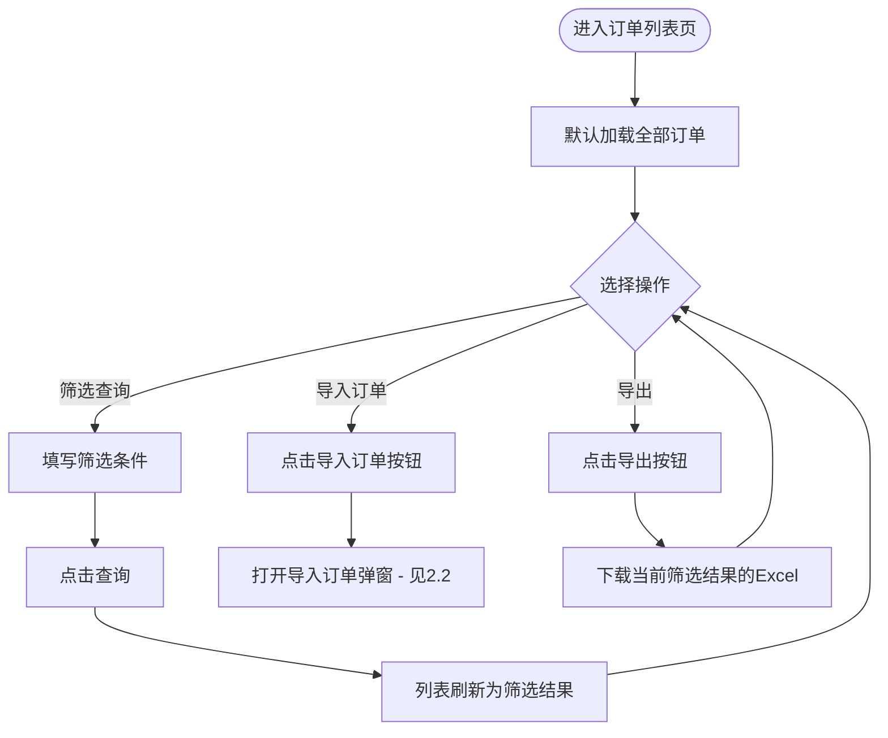
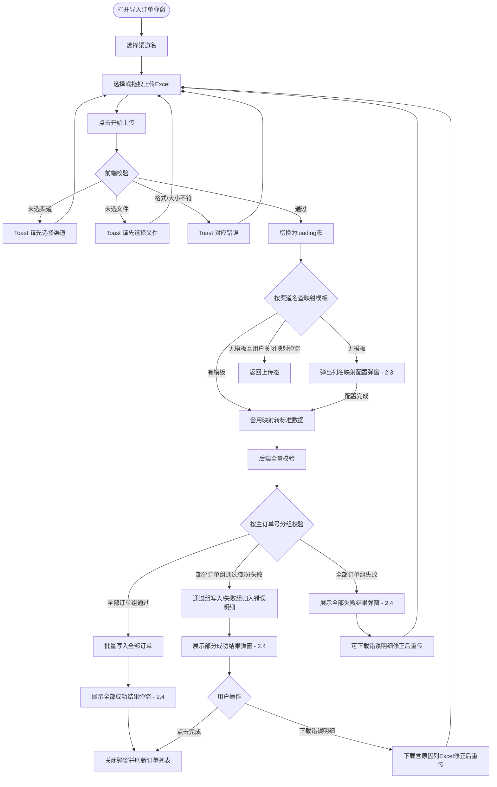
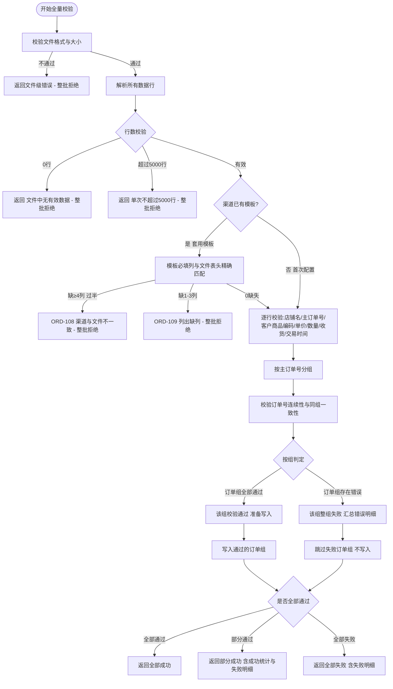
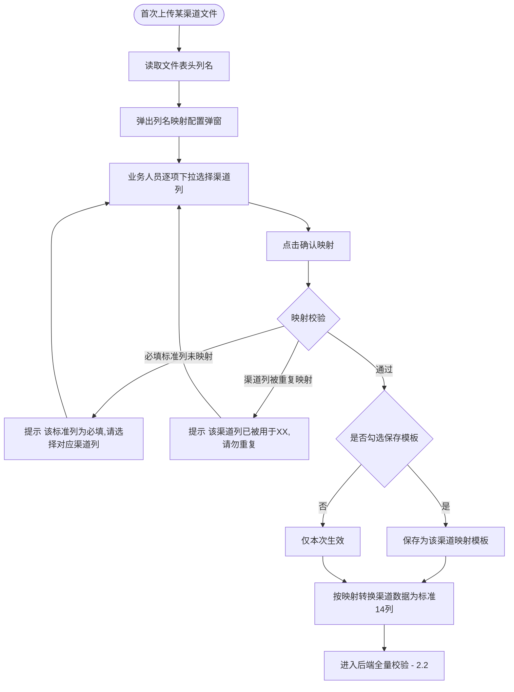
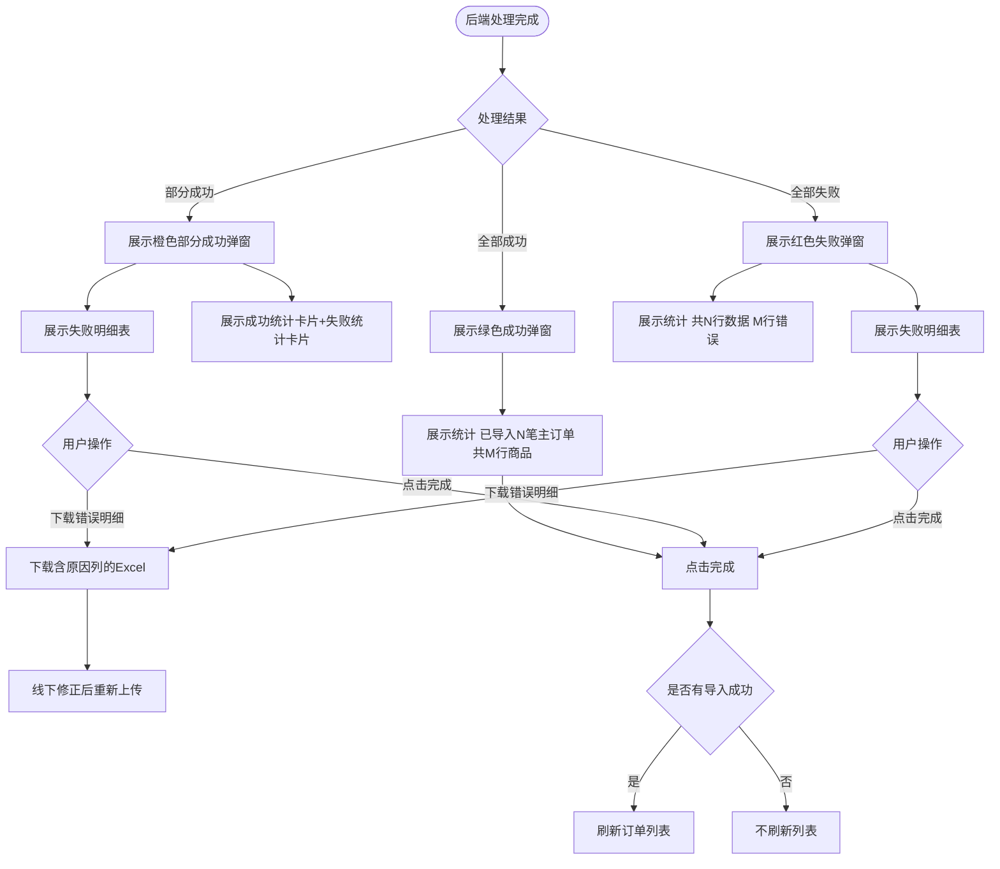
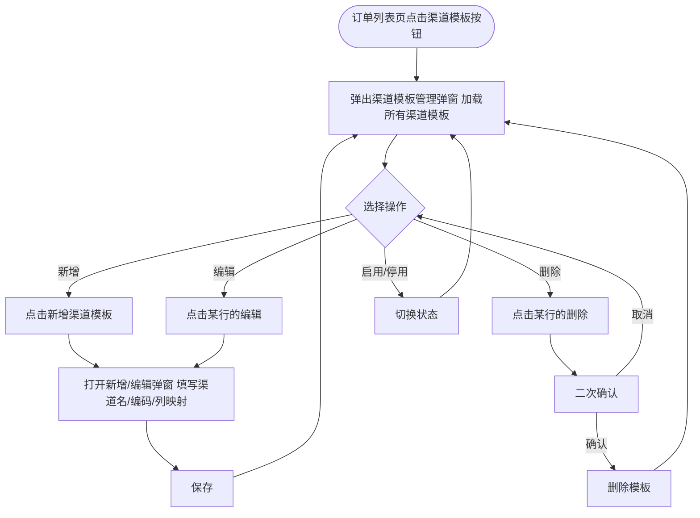

# 订单列表·导入订单 — 商城运营平台 PRD V1.0

> 版本：V1.0 | 最后更新：2026-06-16

商城运营平台作为多商城统一管理中枢，需要支持面向多个子商城的线下订单批量导入。各子商城在日常运营中除线上交易外，还存在企业集采、展会销售、门店销售等线下渠道产生的订单。这些订单来自不同第三方渠道，格式各异，需要先做列名匹配转换为标准格式后，再统一导入运营平台订单列表进行后续管理（发货、售后、对账）。

---

## 一、版本概述

V1.0 覆盖商城运营平台的订单管理与渠道模板两大模块，核心解决"多渠道、多格式的线下订单如何高效导入到统一订单列表"的问题。

### 1.1 页面清单

本次 PRD 覆盖以下页面：

| 页面 | 层级 | 说明 |
|------|------|------|
| 订单列表页 | 一级（菜单） | 展示线上线下订单，导入入口 |
| 导入订单弹窗 | 弹窗 | 选渠道、上传文件、触发匹配与导入 |
| 列名映射配置弹窗 | 弹窗 | 首次匹配某渠道时，配置列名对应关系 |
| 导入结果弹窗 | 弹窗 | 展示导入成功/部分成功/失败结果 |
| 渠道模板管理弹窗 | 弹窗 | 从订单列表工具栏打开，维护渠道映射模板 |
| 渠道模板编辑弹窗 | 弹窗 | 新增/编辑渠道模板 |

共 6 个页面。

> 原型文件：`订单列表-导入订单-商城运营平台原型.html`，所有页面布局、交互细节、视觉风格以原型为准。

### 1.2 核心功能

本版本的核心是建立一条完整的线下订单导入链路：业务人员从第三方渠道下载订单 Excel → 上传时选择渠道 → 系统按渠道复用已有映射模板（首次需现场配置列名对应关系并保存）→ 自动转换为标准 14 列数据 → 全量校验后批量导入。引入"渠道模板"概念，让每个渠道只需配置一次列名映射，后续上传自动套用。

### 1.3 数据来源说明

| 数据类型 | 来源 | 说明 |
|----------|------|------|
| 渠道订单数据 | 第三方渠道平台导出的 Excel | 格式因渠道而异，需经列名映射转换 |
| 标准模板定义 | 系统内置 | 固定 14 列标准字段 |
| 渠道映射模板 | 业务人员在系统内配置并保存 | 每渠道一份，记录"渠道列名→标准列名"的对应 |
| SKU 与供应商关联 | 各子商城商品中心 | 按商城维度，通过 SKU 物流编码自动关联供应商 |
| 商城注册信息 | 运营平台商城管理 | 校验主订单号对应的所属商城是否启用 |

### 1.4 统计口径

| 指标 | 计算方式 | 示例 |
|------|----------|------|
| 主订单数 | 去重主订单号后的订单笔数 | 3 行不同主订单号 = 3 笔 |
| 商品总行数 | 导入的子订单（商品行）总数 | — |
| 涉及商城数 | 按主订单号分组后的订单涉及的商城数量 | — |

---

## 二、订单管理

订单管理模块集中处理线上线下订单的展示与线下订单的批量导入。线上交易订单与线下导入订单在同一列表混合展示，通过"订单来源"标签区分。

### 2.1 订单列表页

#### 2.1.1 功能概述

订单列表页是运营平台订单管理的统一入口，集中展示所有子商城的线上线下订单，支持按订单号、下单日期、订单状态、支付方式筛选查询，并提供线下订单导入与导出能力。运营人员从左侧菜单"订单管理"进入，导入的订单写入后即时出现在列表中。

#### 2.1.2 页面结构

页面自上而下由筛选栏、工具栏、数据表格三个区域组成。

| 区域 | 说明 |
|------|------|
| 筛选栏 | 订单号搜索、下单日期起止、订单状态、支付方式 + 查询/重置 |
| 工具栏 | 左侧【导入订单】主按钮、【渠道模板】按钮、【导出】按钮；右侧统计"共 N 条" |
| 数据表格 | 订单列表，每行一笔子订单记录 |

#### 2.1.3 操作流程

运营人员主要通过筛选查询订单，或通过工具栏触发导入/导出，无复杂流程跳转。



重置按钮清空筛选条件并刷新，Toast 提示"筛选条件已重置"。

#### 2.1.4 字段与交互

**数据表格列**

| 字段名称 | 字段标识 | 必填 | 数据类型 | 默认值 | 校验规则 | 取值范围 | 来源 | 错误提示 |
|----------|----------|:----:|----------|--------|----------|----------|------|----------|
| 编码 | order_code | - | String | - | - | - | 系统生成 | - |
| 所属商城 | mall_name | - | String | - | - | - | 店铺名映射 | - |
| 供应商 | supplier_name | - | String | - | - | - | SKU关联带出 | - |
| 下单时间 | order_time | - | DateTime | - | - | YYYY-MM-DD HH:mm:ss | 导入时间 | - |
| 客户信息 | customer_info | - | String | - | - | 收货人+手机号 | 客户上传 | - |
| 销售单价 | unit_price | - | Decimal | - | - | ¥XX.XX | 客户上传 | - |
| 商品数量 | quantity | - | Integer | - | - | - | 客户上传 | - |
| 订单总金额 | total_amount | - | Decimal | - | - | ¥XX.XX 加粗 | 系统计算 | - |
| 支付时间 | pay_time | - | DateTime | - | - | YYYY-MM-DD HH:mm:ss | 客户上传 | - |
| 订单状态 | order_status | - | Enum | 待发货 | - | 待发货/已发货/已完成/已取消 | 系统生成 | - |
| OMS推送状态 | oms_status | - | Enum | 未发货 | - | 未发货/已发货/运输中/已签收 | 系统生成 | - |
| 售后状态 | after_sale | - | Enum | 无售后 | - | 无售后/退款中/已退款/退款驳回 | 系统生成 | - |
| 订单备注 | order_remark | - | String | - | - | 超长截断 hover | 客户上传 | - |
| 订单来源 | order_source | - | Enum | - | - | 线上/线下导入 | 系统标记 | - |
| 查看详情 | view_detail | - | 按钮 | - | 点击跳转订单详情 | - | - | - |

**筛选与工具栏交互**

| 字段名称 | 字段标识 | 字段类型 | 必填 | 数据类型 | 长度限制 | 默认值 | 校验规则 | 取值范围 | 来源 | 错误提示 |
|----------|----------|----------|:----:|----------|----------|--------|----------|----------|------|----------|
| 订单号 | search_no | 文本输入 | 否 | String | - | 空 | 模糊匹配 | - | 用户输入 | - |
| 下单日期 | search_date | 日期选择 | 否 | Date | - | 空 | 起止区间 | - | 用户选择 | - |
| 订单状态 | search_status | 下拉选择 | 否 | Enum | - | 全部 | - | 全部/待发货/已发货/已完成/已取消 | 用户选择 | - |
| 支付方式 | search_pay | 下拉选择 | 否 | Enum | - | 全部 | - | 全部/积分支付/线下支付 | 用户选择 | - |
| 查询 | btn_query | 按钮 | - | - | - | - | 应用筛选刷新 | - | - | - |
| 重置 | btn_reset | 按钮 | - | - | - | - | 清空筛选并刷新 | - | - | Toast"筛选条件已重置" |
| 导入订单 | btn_import | 按钮 | - | - | - | - | 打开导入订单弹窗 | - | - | - |
| 导出 | btn_export | 按钮 | - | - | - | - | 按当前筛选导出Excel | - | - | Toast"已导出订单列表" |

#### 2.1.5 业务规则

| 规则编号 | 规则描述 |
|----------|----------|
| RULE-ORD-LIST-001 | 线下导入订单与线上交易订单混合展示，以"订单来源"标签区分，不分区不分 Tab |
| RULE-ORD-LIST-002 | 导入成功的订单进入列表后订单状态固定为"待发货"，售后状态固定为"无售后"，OMS推送状态固定为"未发货" |
| RULE-ORD-LIST-003 | 编码（订单号）以 monospace 字体展示，支持点击查看详情 |
| RULE-ORD-LIST-004 | 筛选条件叠加生效；筛选结果为空时表格展示"暂无匹配的订单数据" |

#### 2.1.6 页面跳转

**入口**：
- 左侧菜单"订单管理 / 订单列表"

**出口**：
- 点击【导入订单】→ 导入订单弹窗（2.2）
- 点击编码或【查看详情】→ 订单详情页（本文档不覆盖）

---

### 2.2 导入订单弹窗

#### 2.2.1 功能概述

导入订单弹窗是线下订单导入的操作入口。业务人员先选择本次文件来自哪个渠道，再上传渠道导出的 Excel。系统根据所选渠道查找已存的映射模板：若该渠道已配置过列名映射，直接套用转换；若未配置过，则弹出列名映射配置弹窗（2.3）让业务人员现场建立对应关系并保存。转换完成后进入后端全量校验，采用"按订单分组、部分成功"策略：以主订单号为单位分组校验，校验全通过的订单组正常导入；存在错误的订单组整组不导入（同一主订单号下任一子订单校验不通过，则该主订单整组失败），归入失败明细。成功与失败在同一结果弹窗分别展示，互不影响。

#### 2.2.2 页面结构

弹窗从上到下分为渠道选择区、文件上传区、底部按钮区三个部分。

| 区域 | 说明 |
|------|------|
| 渠道选择区 | "渠道"下拉框，列出所有启用状态的渠道（来自渠道模板管理弹窗） |
| 文件上传区 | 虚线边框拖拽区，提示"仅支持 .xlsx，≤ 10MB" |
| 底部按钮区 | 【取消】【开始上传】 |

#### 2.2.3 操作流程

导入的核心在于"选渠道 → 查模板 → 转换 → 校验"，其中渠道是否已配置过模板决定了流程分支。



后端全量校验按"文件级 → 行级 → 跨行级"三段执行，采用"按订单分组、部分成功"策略：文件级错误整批拒绝；行级与跨行级错误按主订单号分组处理，同组内任一行错误则该组整组失败，通过组正常导入：



#### 2.2.4 字段与交互

| 字段名称 | 字段标识 | 字段类型 | 必填 | 数据类型 | 长度限制 | 默认值 | 校验规则 | 取值范围 | 来源 | 错误提示 |
|----------|----------|----------|:----:|----------|----------|--------|----------|----------|------|----------|
| 渠道 | channel_name | 下拉选择 | 是 | String | - | 空 | 必选；仅列启用状态的渠道 | 启用渠道列表 | 系统配置 | 为空：请先选择渠道 |
| 导入文件 | import_file | 文件上传 | 是 | File | ≤10MB | 空 | 仅 .xlsx；至少1行数据；≤5000行 | .xlsx | 用户上传 | 为空：请先选择文件；非xlsx：仅支持.xlsx格式文件；超10MB：文件大小不能超过10MB |
| 取消 | btn_cancel | 按钮 | - | - | - | - | 关闭弹窗，不执行操作 | - | - | - |
| 开始上传 | btn_upload | 按钮 | - | - | - | - | 按渠道→文件顺序校验后触发匹配与导入 | - | - | 显示首个未通过项的错误提示 |

#### 2.2.5 业务规则

| 规则编号 | 规则描述 |
|----------|----------|
| RULE-IMP-001 | 渠道名是必选项，未选渠道不允许上传 |
| RULE-IMP-002 | 系统按渠道名查找映射模板：有则直接套用转换；无则弹出列名映射配置弹窗（2.3） |
| RULE-IMP-003 | 采用"按订单分组、部分成功"策略：以主订单号为单位分组校验，校验全通过的订单组正常导入；存在错误的订单组不导入，归入失败明细。成功与失败在同一结果弹窗分别展示，互不影响 |
| RULE-IMP-004 | 校验通过的订单组按主订单号聚合：同一主订单号的所有商品行合并为1笔主订单，每行=1笔子订单 |
| RULE-IMP-005 | 单次导入文件不超过 5000 行有效数据 |
| RULE-IMP-006 | 校验通过后批量写入，订单状态固定"待发货"、售后"无售后"、OMS"未发货"、下单时间=导入时间 |
| RULE-IMP-007 | 导入成功后关闭弹窗并刷新订单列表；失败则不刷新 |
| RULE-IMP-008 | 仅 mall-admin / mall-operator 角色可导入，viewer 不可 |
| RULE-IMP-009 | 渠道已有模板时，套用前校验模板 7 个必填列与文件表头**精确匹配**（100% 字符相同才命中）：缺失 ≥4 列（过半）→ 报 ORD-108「渠道与文件不一致」，整批拒绝且不展开缺列明细；缺失 1~3 列 → 报 ORD-109「列出缺失列名」，整批拒绝；0 缺失 → 正常转换进入逐行校验。仅在"套用已有模板"分支执行，首次配置（2.3）天然一致不校验。目的：避免选错渠道后逐行报出大量假错 |

#### 2.2.6 页面跳转

**入口**：
- 订单列表页（2.1）点击【导入订单】

**出口**：
- 首次匹配 → 列名映射配置弹窗（2.3）
- 校验完成 → 导入结果弹窗（2.4）

---

### 2.3 列名映射配置弹窗

#### 2.3.1 功能概述

当业务人员首次上传某渠道文件、系统未找到该渠道的已存映射模板时，自动弹出此弹窗。业务人员在此建立"标准列名 ↔ 渠道文件列名"的对应关系：左列固定显示 14 个标准模板字段，右列为下拉选项，选项来自本次上传文件的表头列名。配置完成并校验通过后，可选择保存为该渠道的映射模板，下次上传同渠道文件时自动套用、无需再配。

#### 2.3.2 页面结构

弹窗主体为一张映射对照表，顶部为提示区，底部为操作区。

| 区域 | 说明 |
|------|------|
| 提示区 | 文案"请将标准字段与渠道文件列名一一对应；勾选'保存为该渠道模板'后，下次上传此渠道文件将自动套用" |
| 映射对照表 | 左列：14个标准模板字段名（固定）；右列：下拉选择，选项来自上传文件表头 |
| 保存模板勾选 | 复选框"保存为【{渠道名}】的映射模板"，默认勾选 |
| 底部按钮区 | 【取消】【确认映射】 |

#### 2.3.3 操作流程

配置映射的核心是确保每个必填标准列都对应上渠道列，且渠道列不被重复映射。



#### 2.3.4 字段与交互

映射对照表的左列为固定标准字段，右列为下拉。下表左侧为标准列定义，右侧为交互说明：

| 标准字段名 | 字段标识 | 必填 | 右侧交互 | 校验规则 | 错误提示 |
|-----------|----------|:----:|----------|----------|----------|
| 主订单号 | std_main_order | 是 | 下拉选渠道列 | 必须映射；作为主订单分组键 | 主订单号为必填，请选择对应渠道列 |
| 子订单号 | std_sub_order | 否 | 下拉选渠道列/可不选 | 非必填；不映射则系统自动生成 | - |
| 客户商品编码 | std_customer_code | 是 | 下拉选渠道列 | 必须映射；系统按映射反查SKU | 客户商品编码为必填，请选择对应渠道列 |
| 销售单价 | std_unit_price | 是 | 下拉选渠道列 | 必须映射 | 销售单价为必填，请选择对应渠道列 |
| 商品数量 | std_quantity | 是 | 下拉选渠道列 | 必须映射 | 商品数量为必填，请选择对应渠道列 |
| 收货人 | std_receiver | 是 | 下拉选渠道列 | 必须映射 | 收货人为必填，请选择对应渠道列 |
| 手机号1 | std_phone1 | 是 | 下拉选渠道列 | 必须映射 | 手机号1为必填，请选择对应渠道列 |
| 手机号2 | std_phone2 | 否 | 下拉选渠道列/可不选 | 非必填；备用手机号 | - |
| 收货地址 | std_address | 是 | 下拉选渠道列 | 必须映射 | 收货地址为必填，请选择对应渠道列 |
| 订单备注 | std_remark | 否 | 下拉选渠道列/可不选 | 非必填 | - |
| 交易时间 | std_trade_time | 否 | 下拉选渠道列/可不选 | 非必填；不映射则取导入时间作为交易时间 | - |
| 订单状态 | std_order_status | 否 | 下拉选渠道列/可不选 | 非必填；源有值则按源状态写入，源无值或未映射则强制"待发货" | - |
| 买家备注 | std_buyer_remark | 否 | 下拉选渠道列/可不选 | 非必填 | - |
| 卖家备注 | std_seller_remark | 否 | 下拉选渠道列/可不选 | 非必填 | - |
| 保存为渠道模板 | save_as_template | 复选框 | - | 默认勾选 | - |
| 取消 | btn_cancel | 按钮 | - | 关闭弹窗，返回上传态 | - |
| 确认映射 | btn_confirm | 按钮 | - | 触发映射校验 | 显示首个未通过项提示 |

#### 2.3.5 业务规则

| 规则编号 | 规则描述 |
|----------|----------|
| RULE-MAP-001 | 右侧下拉选项来自本次上传文件的表头列名，读取后不可编辑 |
| RULE-MAP-002 | 一个渠道列不可同时映射到多个标准列，重复选择时提示报错 |
| RULE-MAP-003 | 7个标准列为必填，其余7列（子订单号、手机号2、订单备注、交易时间、订单状态、买家备注、卖家备注）为选填，未映射全部必填项则不允许确认 |
| RULE-MAP-004 | 勾选"保存为渠道模板"后，本次映射关系存为该渠道的模板；同一渠道已有模板时覆盖更新 |
| RULE-MAP-005 | 不勾选保存时，映射仅对本次上传生效，不持久化 |
| RULE-MAP-006 | 映射确认后，系统按对应关系将渠道数据转换为标准14列，再进入后端全量校验 |
| RULE-MAP-007 | 非首次上传（渠道已有模板）时不弹出此弹窗，直接套用已存模板转换 |

#### 2.3.6 页面跳转

**入口**：
- 导入订单弹窗（2.2）中，所选渠道无已存映射模板时自动弹出

**出口**：
- 确认映射 → 后端全量校验 → 导入结果弹窗（2.4）
- 取消 → 返回导入订单弹窗（2.2）上传态

---

### 2.4 导入结果弹窗

#### 2.4.1 功能概述

后端校验处理完成后自动弹出此弹窗展示导入结果。采用"按订单分组、部分成功"策略：以主订单号为单位，校验通过的订单组正常导入并展示成功统计；存在错误的订单组不导入，展示失败明细供下载修正后重新上传；已存在的子订单自动跳过，展示跳过明细。同一弹窗内成功、跳过、失败分区展示，互不影响。

#### 2.4.2 页面结构

弹窗以结果图标+标题开场，成功态仅展示统计与完成按钮，失败态额外展示错误明细表与下载按钮。

| 区域 | 全部成功态 | 部分成功态 | 全部失败态 |
|------|----------|----------|----------|
| 结果图标 | 绿色圆形 ✓ | 橙色圆形 ! | 红色圆形 ✕ |
| 结果标题 | 导入成功 | 部分成功 | 校验失败 |
| 成功统计区 | 已导入 N 笔主订单（共 M 行商品），订单状态为待发货 | 展示成功统计卡片 | 不展示 |
| 跳过统计区 | 不展示 | 展示跳过统计卡片：N 个子订单已存在，本次未重复导入 | 不展示 |
| 失败统计区 | 不展示 | 展示失败统计卡片：N 行错误，未导入，请修正后重传 | 共N行数据，M行存在错误，全部数据未导入 |
| 跳过明细表 | 不展示 | 展示：主订单号/子订单号/跳过原因 | 不展示 |
| 失败明细表 | 不展示 | 展示：行号/主订单号/客户商品编码/销售单价/手机号1/错误原因 | 展示：行号/主订单号/客户商品编码/销售单价/手机号1/错误原因 |
| 下载错误明细 | 不展示 | 【⬇ 下载失败明细（含原因列，修正后可重传）】 | 【⬇ 下载失败明细（含原因列，修正后可重传）】 |
| 完成按钮 | 【完成】 | 【完成】 | 【完成】 |

#### 2.4.3 操作流程



#### 2.4.4 字段与交互

本弹窗为结果展示，无用户输入。后端返回数据作为展示输入：

| 字段名称 | 字段标识 | 字段类型 | 必填 | 数据类型 | 说明 | 来源 |
|----------|----------|----------|:----:|----------|------|------|
| 处理结果状态 | result_status | 展示 | - | Enum | success/partial/fail | 后端返回 |
| 总行数 | total_rows | 展示 | - | Integer | Excel有效数据行数 | 后端统计 |
| 主订单数 | order_count | 展示 | - | Integer | 成功导入的去重主订单号笔数 | 后端统计 |
| 成功行数 | success_rows | 展示 | - | Integer | 成功导入的商品行数 | 后端统计 |
| 跳过行数 | skip_count | 展示 | - | Integer | 已存在子订单跳过的行数 | 后端统计 |
| 跳过明细列表 | skip_list | 表格 | - | Array | 主订单号/子订单号/跳过原因 | 后端返回 |
| 错误行数 | error_count | 展示 | - | Integer | 校验失败行数 | 后端统计 |
| 错误明细列表 | error_list | 表格 | - | Array | 行号/主订单号/客户商品编码/销售单价/手机号1/错误原因 | 后端返回 |
| 下载错误明细 | btn_download | 按钮 | - | - | 下载在原文件基础上增加"错误原因"列的Excel | - |
| 完成 | btn_finish | 按钮 | - | - | 关闭弹窗 | - |

#### 2.4.5 业务规则

| 规则编号 | 规则描述 |
|----------|----------|
| RULE-RST-001 | 全部成功判定：所有订单组校验通过且批量写入完成 |
| RULE-RST-002 | 部分成功判定：存在错误的订单组不导入（按主订单号整组剔除），校验通过的订单组正常导入，两类结果在同一弹窗分别展示 |
| RULE-RST-003 | 全部失败判定：所有订单组均存在错误，无任何订单写入，展示全部失败弹窗 |
| RULE-RST-004 | 错误明细展示所有错误行的行号、主订单号、客户商品编码、销售单价、手机号1、错误原因 |
| RULE-RST-005 | 下载的错误明细Excel在原上传文件基础上额外增加一列"错误原因"，运营可直接在错误行修正后重传 |
| RULE-RST-006 | 子订单防重复：已存在的子订单（按渠道ID+主订单号+子订单号唯一判定）自动跳过，不重复导入，展示跳过明细（ORD-402） |
| RULE-RST-007 | 有导入成功的订单（全部成功或部分成功）时关闭弹窗自动刷新订单列表；全部失败则不刷新 |

**错误码体系**（适配新字段，错误明细中展示）

| 错误码 | 异常场景 | 提示文案 |
|--------|----------|----------|
| ORD-101 | 文件未选择 | 请先选择文件 |
| ORD-102 | 文件格式不符 | 仅支持 .xlsx 格式文件 |
| ORD-103 | 文件超过10MB | 文件大小不能超过 10MB |
| ORD-105 | 文件无数据行 | 文件中无有效数据行 |
| ORD-106 | 行数超过5000 | 单次导入数据不能超过 5000 行 |
| ORD-107 | 文件解析失败 | 文件解析失败，请检查文件是否损坏或被加密 |
| ORD-108 | 渠道与文件不一致 | 上传的文件与所选渠道「{渠道名}」不一致，请确认所选渠道或更换文件后重试 |
| ORD-109 | 渠道模板必填列缺失 | 渠道模板映射的必填列在文件中未找到：{缺失列名列表}。请检查文件或更新渠道模板 |
| ORD-201 | 主订单号为空 | 第{n}行：主订单号不能为空 |
| ORD-202 | 客户商品编码为空 | 第{n}行：客户商品编码不能为空 |
| ORD-203 | 客户商品编码不存在 | 第{n}行：客户商品编码「{code}」在对应商城不存在或未上架 |
| ORD-204 | 销售单价为空 | 第{n}行：销售单价不能为空 |
| ORD-205 | 销售单价无效 | 第{n}行：销售单价必须大于 0 |
| ORD-206 | 商品数量为空 | 第{n}行：商品数量不能为空 |
| ORD-207 | 商品数量无效 | 第{n}行：商品数量必须为正整数 |
| ORD-208 | 收货人为空 | 第{n}行：收货人不能为空 |
| ORD-209 | 手机号1为空 | 第{n}行：手机号1不能为空 |
| ORD-210 | 手机号1格式错误 | 第{n}行：手机号1格式不正确，须为 11 位数字 |
| ORD-211 | 手机号2格式错误 | 第{n}行：手机号2格式不正确，须为 11 位数字 |
| ORD-212 | 收货地址为空 | 第{n}行：收货地址不能为空 |
| ORD-213 | 交易时间格式错误 | 第{n}行：交易时间格式应为 YYYY-MM-DD HH:mm:ss |
| ORD-301 | 主订单号缺失 | 主订单号不能为空 |
| ORD-302 | 同组收货人不一致 | 主订单号{n}的收货人存在不一致（第{row1}行与第{row2}行） |
| ORD-303 | 同组手机号1不一致 | 主订单号{n}的手机号1存在不一致（第{row1}行与第{row2}行） |
| ORD-304 | 同组收货地址不一致 | 主订单号{n}的收货地址存在不一致（第{row1}行与第{row2}行） |
| ORD-305 | 同组交易时间不一致 | 主订单号{n}的交易时间存在不一致 |
| ORD-402 | 子订单已存在 | 子订单号「{sub}」已导入过，已跳过（未重复导入） |
| ORD-100 | 后端处理超时 | 处理超时，请稍后重试或联系管理员 |
| ORD-101A | 服务器异常 | 系统异常，请稍后重试 |

#### 2.4.6 页面跳转

**入口**：
- 导入订单弹窗（2.2）或列名映射配置弹窗（2.3）校验完成后自动弹出

**出口**：
- 完成 → 关闭弹窗，返回订单列表页（2.1）

---

## 三、渠道模板管理

渠道模板管理模块用于维护"渠道 → 标准字段"的映射模板。每个渠道对应一份模板，记录其上传文件的列名与系统 14 个标准字段的对应关系。模板配好后，在该渠道后续导入时自动套用，无需重复配置。

### 3.1 渠道模板管理弹窗

#### 3.1.1 功能概述

渠道模板管理弹窗集中管理所有渠道的映射模板，运营人员可在此新增渠道模板、编辑现有模板的列名映射、删除不再使用的模板、启用或停用模板。停用的渠道模板不会出现在导入订单弹窗的渠道下拉中。运营人员从订单列表页工具栏点击【渠道模板】按钮打开此弹窗。

#### 3.1.2 页面结构

弹窗由工具栏与数据表格组成。

| 区域 | 说明 |
|------|------|
| 工具栏 | 左侧【+ 新增渠道模板】主按钮；右侧统计"共 N 个渠道模板" |
| 数据表格 | 渠道模板列表 |
| 底部按钮区 | 【关闭】按钮 |

#### 3.1.3 操作流程



#### 3.1.4 字段与交互

**数据表格列**

| 字段名称 | 字段标识 | 必填 | 数据类型 | 说明 | 来源 |
|----------|----------|:----:|----------|------|------|
| 渠道名称 | tpl_channel_name | - | String | 如"京东企业购" | 用户配置 |
| 渠道编码 | tpl_channel_code | - | String | 业务标识（仅展示用，不强制唯一；系统内部以主键ID关联） | 用户配置 |
| 映射字段数 | tpl_field_count | - | Integer | 已映射的标准字段数 / 14 | 系统统计 |
| 创建人 | tpl_creator | - | String | - | 系统记录 |
| 创建时间 | tpl_create_time | - | DateTime | YYYY-MM-DD HH:mm:ss | 系统记录 |
| 更新时间 | tpl_update_time | - | DateTime | - | 系统记录 |
| 状态 | tpl_status | - | Enum | 启用/停用 | 用户配置 |
| 操作 | tpl_action | - | 按钮 | 编辑/删除/启用-停用 | - |

**新增/编辑弹窗交互**

| 字段名称 | 字段标识 | 字段类型 | 必填 | 数据类型 | 长度限制 | 默认值 | 校验规则 | 取值范围 | 来源 | 错误提示 |
|----------|----------|----------|:----:|----------|----------|--------|----------|----------|------|----------|
| 渠道名称 | channel_name | 文本输入 | 是 | String | 1-50 | 空 | 不为空；同一启用状态下唯一（停用渠道名不参与查重） | - | 用户输入 | 为空：请输入渠道名称；重复：该渠道名称在启用状态已存在 |
| 渠道编码 | channel_code | 文本输入 | 是 | String | 1-30 | 空 | 不为空；仅作业务标识，不强制唯一性校验（系统内部以主键ID关联） | 字母数字 | 用户输入 | 为空：请输入渠道编码 |
| 列名映射 | field_mapping | 表格 | 是 | Array | - | 空 | 14标准列中7个必填必须配映射；渠道列不重复 | - | 用户配置 | 必填缺：XX为必填请配置；重复：渠道列已被使用 |
| 状态 | status | 下拉选择 | 是 | Enum | - | 启用 | - | 启用/停用 | 用户选择 | - |
| 取消 | btn_cancel | 按钮 | - | - | - | - | 关闭弹窗 | - | - | - |
| 保存 | btn_save | 按钮 | - | - | - | - | 校验通过后保存 | - | - | 显示首个未通过项提示 |

> 列名映射的配置方式与 2.3 列名映射配置弹窗一致：左列固定 14 个标准字段，右列填写该渠道文件中对应的列名（文本输入，因在管理页无实际上传文件，故为手动填写列名）。

#### 3.1.5 业务规则

| 规则编号 | 规则描述 |
|----------|----------|
| RULE-TPL-001 | 渠道名称在启用状态下唯一（停用渠道名不参与查重）；新增与编辑（含停用后重新启用）时均需校验 |
| RULE-TPL-002 | 渠道编码仅作业务展示标识，不强制唯一性，系统内部以主键ID关联渠道与订单 |
| RULE-TPL-003 | 列名映射中 7 个必填标准列必须配置对应渠道列名，否则保存失败 |
| RULE-TPL-004 | 一个渠道列名不可对应多个标准列 |
| RULE-TPL-005 | 删除渠道模板需二次确认；已删除的模板不可恢复 |
| RULE-TPL-006 | 停用的渠道模板不出现在导入订单弹窗（2.2）的渠道下拉中 |
| RULE-TPL-007 | 编辑已存在的渠道模板后，该渠道后续上传自动套用最新映射；不影响已导入的历史订单 |
| RULE-TPL-008 | 仅 mall-admin 角色可新增/编辑/删除渠道模板；mall-operator 仅可查看 |

#### 3.1.6 页面跳转

**入口**：
- 订单列表页（2.1）工具栏点击【渠道模板】按钮

**出口**：
- 点击【关闭】返回订单列表页；新增/编辑均为弹窗内完成

---

## 四、数据模型

### 4.1 渠道映射模板结构

渠道映射模板记录每个渠道的列名对应关系，存储于运营平台后端：

```json
{
  "channel_code": "JD-CORP",
  "channel_name": "京东企业购",
  "status": "启用",
  "field_mapping": [
    {"standard_field": "主订单号", "channel_column": "店铺名"},
    {"standard_field": "主订单号", "channel_column": "订单编号"},
        {"standard_field": "客户商品编码", "channel_column": "商家编码"},
    {"standard_field": "销售单价", "channel_column": "成交价"},
    {"standard_field": "商品数量", "channel_column": "购买数量"},
    {"standard_field": "收货人", "channel_column": "收货人姓名"},
    {"standard_field": "手机号1", "channel_column": "联系电话"},
    {"standard_field": "手机号2", "channel_column": ""},
    {"standard_field": "收货地址", "channel_column": "收货地址"},
    {"standard_field": "交易时间", "channel_column": ""},
    {"standard_field": "订单状态", "channel_column": ""},
    {"standard_field": "买家备注", "channel_column": ""},
    {"standard_field": "卖家备注", "channel_column": ""},
    {"standard_field": "订单备注", "channel_column": "买家留言"}
  ],
  "creator": "admin",
  "create_time": "2026-06-16 10:00:00",
  "update_time": "2026-06-16 10:00:00"
}
```

### 4.2 导入订单聚合规则

校验通过后，渠道数据按以下规则聚合写入订单：

| 源数据 | 聚合规则 | 生成结果 |
|--------|----------|----------|
| 同一主订单号的所有商品行 | 合并为1笔主订单 | 主订单号 = 源主订单号（原样采用，不加前缀） |
| 每行商品数据 | 1行=1笔子订单 | 子订单号见下方"系统自动填充字段"两种情形 |
| 主订单号 | 匹配对应商城 | 主订单的所属商城（商城名称、商城ID） |
| 供应商 | 通过所属商城+客户商品编码自动关联 | 子订单的供应商 |
| 同组收货人/手机号/地址 | 取第一行值（已校验一致性） | 主订单的收货信息（客户信息） |
| Σ(销售单价×商品数量) | 按主订单号聚合 | 订单总金额 |
| 交易时间 | 取第一行值，留空则取导入时间 | 主订单的支付时间 |

**系统自动填充字段**

| 字段 | 自动填充规则 |
|------|-------------|
| 主订单号 | 直接采用源主订单号（不加任何前缀）；表以代理主键（自增ID）为主键，唯一约束 `UNIQUE(渠道ID, 主订单号)` |
| 子订单号 | ①源文件填了源子订单号 → 直接采用源值；②未填 → `主订单号 + 2位行序号`（按主订单内商品行顺序）。唯一约束 `UNIQUE(渠道ID, 主订单号, 子订单号)` |
| 所属商城 | 主订单号匹配商城主数据 |
| 供应商 | 所属商城 + 客户商品编码 关联供应商主数据 |
| 下单时间/支付时间/更新时间 | = 导入时间（系统当前时间） |
| 订单状态 | 映射了源订单状态且源值非空 → 采用源值；未映射或源值为空 → 强制"待发货" |
| 售后状态 | 固定"无售后" |
| OMS推送状态 | 固定"未发货" |
| 订单来源 | 固定"线下导入" |
| 状态说明 | 固定"线下订单已导入，等待商家发货" |
| 买家备注 | 取源买家备注值（映射了源列时），未映射则为空 |
| 卖家备注 | 取源卖家备注值（映射了源列时），未映射则为空 |

---

## 五、页面导航

### 5.1 跳转关系

- 订单列表页（2.1）→ 导入订单弹窗（2.2）：点击【导入订单】
- 导入订单弹窗（2.2）→ 列名映射配置弹窗（2.3）：所选渠道无已存模板时自动弹出
- 列名映射配置弹窗（2.3）→ 导入结果弹窗（2.4）：映射确认并校验完成
- 导入订单弹窗（2.2）→ 导入结果弹窗（2.4）：渠道已有模板，直接校验完成
- 导入结果弹窗（2.4）→ 订单列表页（2.1）：点击完成（成功则刷新列表）
- 订单列表页（2.1）→ 订单详情页（本文档不覆盖）：点击编码或查看详情
- 订单列表页（2.1）→ 渠道模板管理弹窗（3.1）：点击工具栏【渠道模板】按钮，弹窗内完成新增/编辑/查看，无页面跳转

### 5.2 返回导航

- 订单列表页：通过左侧菜单切换
- 导入订单弹窗、列名映射配置弹窗、导入结果弹窗：点击【取消】或【完成】关闭，返回订单列表页
- 渠道模板管理弹窗：点击【关闭】返回订单列表页；新增/编辑弹窗点【取消】关闭

### 5.3 登录拦截

受保护页面加载时检查登录状态与角色权限：

| 角色权限 | 范围 |
|----------|------|
| platform-admin | 全部商城订单；可导入、查看、管理；可新增/编辑/删除渠道模板 |
| platform-operator | 全部商城订单；可导入、查看订单；仅可查看渠道模板 |
| platform-viewer | 仅查看订单列表；不可导入订单；不可访问渠道模板管理 |

**功能权限点**

| 权限标识 | 权限名称 | admin | operator | viewer |
|----------|----------|:-----:|:--------:|:------:|
| order:import | 导入订单 | ✓ | ✓ | — |
| order:export | 导出订单 | ✓ | ✓ | — |
| order:download_import_result | 下载导入结果明细 | ✓ | ✓ | ✓ |
| channel_template:manage | 渠道模板增删改 | ✓ | — | — |
| channel_template:view | 渠道模板查看 | ✓ | ✓ | — |

公开页面：无（所有页面均需登录）。
