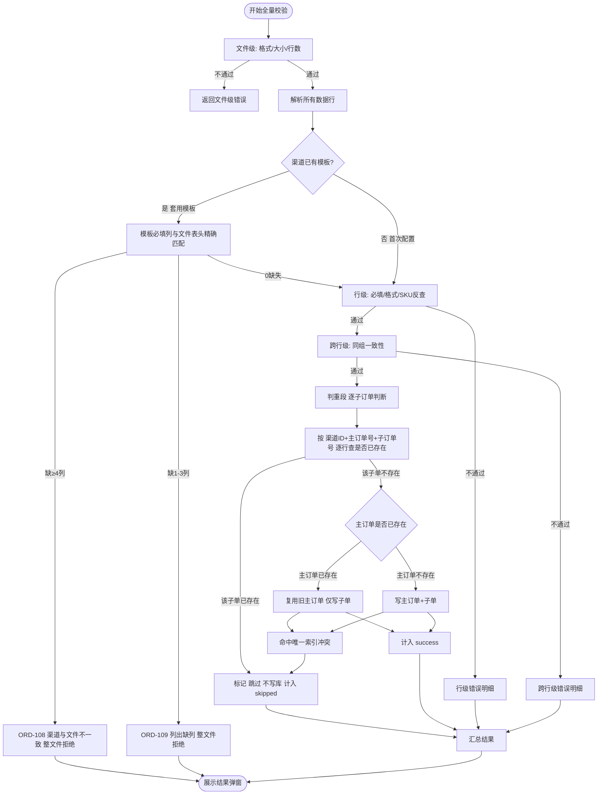

# 线下订单导入 · 子订单生成规则与校验 V1.1

> 版本：V1.1 | 最后更新：2026-06-30
> 关联文档：`订单列表-导入订单-商城运营平台PRD-V1.0.md`

本文仅覆盖两块：①子订单生成规则，②校验（含防重复导入）。

---

## 一、子订单生成规则

### 1.1 主订单号

**直接采用源文件中映射后的源主订单号，不加任何系统前缀。**

| 字段 | 取值 | 示例 |
|------|------|------|
| 主订单号 `main_order_no` | 源文件中的主订单号原样采用 | 源号 `JD20260611003` → 主订单号 `JD20260611003` |

- 源主订单号必填（ORD-201 保证非空），且为跨行校验的分组键（同号 = 同一笔主订单的多个商品行）。
- 不再使用 `IMP+时间戳` 之类的系统生成号；订单来源（线上/线下导入）由独立的"订单来源"字段标记。

### 1.2 子订单号

按源文件**是否填写了源子订单号**分两种情形：

| 情形 | 子订单号取值 | 示例 |
|------|--------------|------|
| 源文件**填了**源子订单号 | **直接采用源子订单号的值，不生成** | 源子单号 `JD2026061100301` → 子订单号 `JD2026061100301` |
| 源文件**未填**源子订单号 | `主订单号` + `2位行序号`，按主订单内商品行顺序从 `01` 起递增 | 主订单号 `JD20260611003` → 第1行 `JD2026061100301`、第2行 `JD2026061100302` |

- **填了就用源值**：源子订单号本身就是渠道给出的、行内唯一的稳定标识，无需再用系统序号覆盖，也便于跨次导入精确比对每一行。
- **未填才按行序生成**：直接拼接，不加分隔符。

### 1.3 生成确定性

给定同一份源文件 + 同一套列名映射，主订单号与子订单号的生成结果**完全确定**（同一源号每次生成相同的号）。这是防重复导入校验成立的根基。

---

## 二、校验

校验分四段：文件级 → 渠道模板表头匹配（新增） → 行级 → 跨行级 → 判重段。文件级、行级、跨行级沿用 PRD §2.2.3 现状，**渠道模板表头匹配**与**判重段**为本次新增。

> 判重粒度为**子订单（行）级**：以 `(渠道ID, 主订单号, 子订单号)` 逐行判断。这样既能识别"整单重复"，也能识别"同一主订单下部分行已导入、本次补传新行"。
>
> **渠道模板表头匹配**仅在"渠道已有模板、直接套用"分支执行（首次配置天然一致）：套用前校验模板 7 个必填列与文件表头精确匹配，避免选错渠道后逐行报出大量假错。

### 2.1 校验流程

### 2.2 判重优先原则

判重段在三段校验全通过后才执行。**已导入过的子订单直接判定"跳过"，不再跑业务校验。** 三类结果互不交叉：

- **跳过** = 该子订单已存在（已导入过）
- **失败** = 本次校验不通过（数据本身有问题）
- **成功** = 本次校验通过且该子订单首次导入

> 主订单存在与否由子订单的写入隐式处理：只要本批任一子订单写入成功，就确保对应主订单存在（不存在则新建，已存在则复用）。

### 2.3 去重键与唯一索引（工程配套，必须）

判重的核心约束落在**子订单表**，主订单表只做撞号隔离：

- 主订单号字段**不作全局唯一主键**；表采用代理主键（自增 ID）。
- 主订单表：`UNIQUE(渠道ID, main_order_no)` —— 隔离跨渠道撞号，并作为主订单是否复用的判据。
- 子订单表：`UNIQUE(渠道ID, main_order_no, sub_order_no)` —— **判重主约束**，逐行去重。
- 主订单创建遵循"不存在则建、已存在则复用"：由子订单表 `UNIQUE(渠道ID, main_order_no, sub_order_no)` 逐行触发，主订单表 `UNIQUE(渠道ID, main_order_no)` 在主订单首次写入时生效，后续同主订单子单复用旧主订单。
- 并发导入时，写库命中唯一索引冲突即归入"跳过"，由数据库兜底保证不重复入库。
- 订单列表中若两渠道撞号，靠"所属商城 / 订单来源"列区分。

### 2.4 结果弹窗（三格统计）

统计区由两格扩展为三格，动态显隐：

| 区块 | 颜色 | 展示条件 | 内容 |
|------|------|----------|------|
| 成功导入 | 绿 | 有成功时 | N 笔主订单（M 行商品），订单状态为待发货 |
| 跳过（已导入过） | 灰 | 有跳过时 | K 个子订单已存在，本次未重复导入 |
| 校验失败 | 红 | 有失败时 | P 行错误，未导入，可下载修正后重传 |

- 三块各自独立统计、互不影响。
- 全部成功且无跳过时，退回为现有绿色"导入成功"单弹窗。

### 2.5 新增错误码

| 错误码 | 异常场景 | 提示文案 | 性质 |
|--------|----------|----------|------|
| ORD-108 | 渠道与文件不一致（套用模板时必填列过半缺失） | 上传的文件与所选渠道「{渠道名}」不一致，请确认所选渠道或更换文件后重试 | 文件级，整文件拒绝，不展开 |
| ORD-109 | 渠道模板必填列缺失（1~3 列缺失） | 渠道模板映射的必填列在文件中未找到：{缺失列名列表}。请检查文件或更新渠道模板 | 文件级，整文件拒绝，列出缺列 |
| ORD-402 | 子订单已存在（重复导入） | 子订单号{n}已导入过，已跳过（未重复导入） | 跳过提示 |

- **ORD-108/109 仅在"渠道已有模板、直接套用"分支触发**；首次配置（用户对着文件当场映射）天然一致，不校验。
- 匹配方式：**精确匹配**（模板列名与文件表头 100% 字符相同才算命中）。
- 判定阈值：必填 7 列中缺失 **≥4 列**（过半）→ ORD-108；缺失 **1~3 列** → ORD-109；**0 缺失** → 正常转换。
- 用"过半缺失"判定渠道不一致，能正确处理"收货人/手机号/地址"等通用列名撞名（明明选错渠道却只缺 3~4 列）的情况。
- ORD-108/109 为文件级整文件拒绝 → 结果弹窗展示为单条红色错误，**不走三格统计**（三格仅用于行级/跨行级部分成功）。
- ORD-402 归入 **skipped** 统计，不进"校验失败"明细，不进入"下载错误明细"Excel（无需用户修正）。
- 可在结果弹窗"跳过"区块以列表形式展示，便于用户核对。
- 主订单已存在不再单独报错——是否新建/复用主订单由子订单写入隐式处理。

### 2.6 行序号稳定性（仅"未填子单号"情形相关）

§1.2 子订单号有两种取值，其去重稳定性不同：

| 情形 | 子订单号来源 | 跨次导入稳定性 |
|------|--------------|----------------|
| 填了源子订单号 | 直接采用源值 | ✅ **完全稳定**：源值由渠道给定，与行位置无关，重传/任意位置改动都不影响子单号 → 逐行判重始终精确 |
| 未填源子订单号 | 按源文件行顺序生成 `主订单号+序号` | ⚠️ **依赖行顺序稳定**：行序号由位置决定 |

**"未填子单号"情形下的覆盖范围：**

- ✅ **主流场景成立**：
  - 整单重传（修正后原样重传，行序号不变）→ 已导入行整批跳过；
  - 末尾追加新行（`01`→`02`→`03` 顺序往后加）→ 原行跳过、新行正常导入。
- ❌ **未覆盖的边界场景**：
  - 在中间插入新行（如第二次把新行插在第2行位置）→ 它会拿到原 `02` 的号 → 误判已存在跳过 → 数据错位。
  - 电商线下导入中"中间插队"极少；首发版本**不处理中间插入**，需业务上规避（新增行一律放末尾）。

> 建议：对同一主订单的多次导入，**优先在源文件填好源子订单号**，可彻底规避行序号错位风险。

### 2.7 典型场景

- **场景 A · 整单重传**：第一次 7 笔成功、3 笔失败，第二次整文件重传 → 7 笔的子单号全部命中 ORD-402 整批跳过；已修正的失败单正常导入，未修正的继续报失败。
- **场景 B · 主订单部分行已导入、补传新行**：主订单 `JD20260611003` 第一次导入行 `01`、`02` 成功；第二次上传 `01`、`02`、`03` → `01`、`02` 命中 ORD-402 跳过，主订单已存在则复用，`03` 正常导入。三格结果：成功 1 行 / 跳过 2 行 / 失败 0 行。
- **场景 C · 并发导入**：两请求同时通过查询校验 → 第二个写子单时命中 `UNIQUE(渠道ID, 主订单号, 子订单号)` 冲突 → 归入 skipped。
