# 基础模块产品需求文档

# 1. 需求背景

***

# 2. 需求分析

***

该模块功能由业务特殊定制，无竞品分析。

# 3. 系统流程图

***

# 4. 详细需求

## 4.0. 操作日志入口说明

### 操作日志入口关联关系

| 日志类型      | 所属系统  | 入口位置          | 说明              |
| --------- | ----- | ------------- | --------------- |
| 品牌商城端操作日志 | 品牌商城端 | 左侧菜单 → 操作日志   | 记录品牌商城端用户的操作行为  |
| 运营后台操作日志  | 商城运营端 | 左侧菜单 → 操作日志   | 记录运营后台管理员的操作行为  |
| 品牌商城操作日志  | 商城运营端 | 品牌商城列表 → 日志按钮 | 记录指定品牌商城用户的操作行为 |

### 操作日志入口流程图

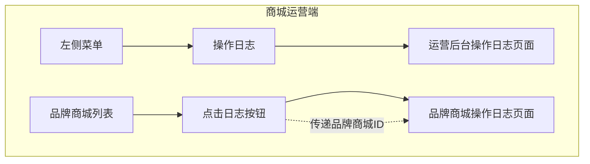

## 4.1. 品牌商城端系统

### 4.1.1. 登录注册模块

#### 4.1.1.1. 登录页面

##### 1. 功能概述

- **功能描述**：品牌商城端用户登录入口，支持短信登录和密码登录两种方式
- **业务描述**：用户通过手机号+验证码或手机号+密码的方式登录品牌商城后台系统
- **使用角色**：品牌商城端用户
- **触发条件**：用户访问品牌商城后台登录页面

##### 2. 流程图

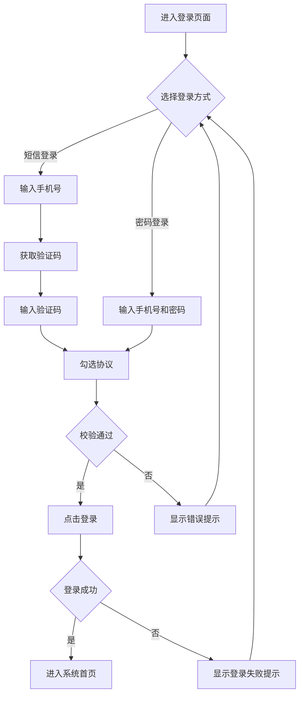

##### 3. 页面原型

- 原型图链接：/品牌商城端/登陆注册/注册登录/登录页面.html

##### 4. 输入项说明

| 字段名称 | 字段标识      | 字段类型 | 必填      | 数据类型    | 长度限制  | 校验规则           | 取值范围 | 来源   | 提示文案           | 备注 |
| ---- | --------- | ---- | ------- | ------- | ----- | -------------- | ---- | ---- | -------------- | -- |
| 手机号  | phone     | 文本输入 | 是       | string  | 11位   | 手机号格式校验        | -    | 用户输入 | 请输入手机号         | -  |
| 验证码  | sms\_code | 文本输入 | 是（短信登录） | string  | 6位    | 数字校验           | -    | 用户输入 | 请输入验证码         | -  |
| 密码   | password  | 密码输入 | 是（密码登录） | string  | 8-20位 | 包含大写字母、数字和特殊符号 | -    | 用户输入 | 请输入登录密码        | -  |
| 协议勾选 | agreement | 复选框  | 是       | boolean | -     | 必须勾选           | -    | 用户选择 | 我已阅读并同意供应商注册协议 | -  |

##### 5. 输出项说明

| 字段名称  | 字段标识          | 数据类型    | 数据来源 | 格式说明       |
| ----- | ------------- | ------- | ---- | ---------- |
| 登录状态  | login\_status | boolean | 系统返回 | true/false |
| 用户信息  | user\_info    | object  | 系统返回 | 用户基本信息     |
| Token | token         | string  | 系统返回 | 登录凭证       |

##### 6. 业务规则

| 规则编号      | 规则名称    | 适用场景    | 规则描述                     | 错误提示      |
| --------- | ------- | ------- | ------------------------ | --------- |
| LOGIN-001 | 手机号校验   | 用户输入手机号 | 必须为11位有效手机号              | 请输入正确的手机号 |
| LOGIN-002 | 验证码校验   | 短信登录    | 验证码为6位数字，有效期5分钟          | 验证码错误或已过期 |
| LOGIN-003 | 密码校验    | 密码登录    | 密码长度8-20位，包含大写字母、数字和特殊符号 | 密码格式不正确   |
| LOGIN-004 | 协议校验    | 点击登录    | 必须勾选协议才能登录               | 请先阅读并同意协议 |
| LOGIN-005 | 验证码发送频率 | 获取验证码   | 60秒内只能发送一次               | 请等待60秒后重试 |

##### 7. 交互说明

1. 用户进入登录页面，默认显示短信登录方式
2. 用户可切换至密码登录方式
3. 短信登录：输入手机号后点击"获取验证码"，系统发送验证码
4. 密码登录：输入手机号和密码
5. 勾选协议后点击"登录"按钮
6. 登录成功后跳转至系统首页
7. 点击"免费注册"跳转至注册页面
8. 点击"忘记密码"跳转至重置密码页面

##### 8. 数据流转说明

###### 数据来源

| 字段/数据 | 来源   | 获取方式  | 说明      |
| ----- | ---- | ----- | ------- |
| 验证码   | 短信服务 | API发送 | 发送至用户手机 |
| 用户信息  | 用户服务 | API查询 | 根据手机号查询 |

##### 9. 错误提示文案

###### 表单校验提示

| 校验字段 | 校验场景  | 提示文案      |
| ---- | ----- | --------- |
| 手机号  | 格式错误  | 请输入正确的手机号 |
| 验证码  | 为空    | 请输入验证码    |
| 验证码  | 错误或过期 | 验证码错误或已过期 |
| 密码   | 为空    | 请输入密码     |
| 协议   | 未勾选   | 请先阅读并同意协议 |

###### 业务异常提示

| 异常场景   | 错误码               | 提示文案          |
| ------ | ----------------- | ------------- |
| 手机号未注册 | LOGIN\_ERROR\_001 | 该手机号未注册，请先注册  |
| 密码错误   | LOGIN\_ERROR\_002 | 密码错误，请重新输入    |
| 账号被禁用  | LOGIN\_ERROR\_003 | 账号已被禁用，请联系管理员 |
| 登录失败   | LOGIN\_ERROR\_004 | 登录失败，请稍后重试    |

##### 10. 数据权限设计

###### 角色数据范围

| 角色     | 数据范围   | 说明        |
| ------ | ------ | --------- |
| 品牌商城用户 | 当前用户信息 | 仅能登录自己的账号 |

###### 功能权限点

| 权限标识            | 权限名称 |
| --------------- | ---- |
| LOGIN\_SMS      | 短信登录 |
| LOGIN\_PASSWORD | 密码登录 |

##### 11. 模块依赖关系

###### 依赖的其他模块

| 模块名称 | 依赖场景  | 依赖数据    | 是否强依赖 |
| ---- | ----- | ------- | ----- |
| 短信服务 | 发送验证码 | 手机号、验证码 | 是     |
| 用户服务 | 用户认证  | 手机号、密码  | 是     |

#### 4.1.1.2. 注册页面

##### 1. 功能概述

- **功能描述**：品牌商城端用户注册入口，新用户可通过手机号注册账号
- **业务描述**：用户通过手机号验证码设置密码完成注册，注册成功后可登录系统
- **使用角色**：新用户
- **触发条件**：用户点击"免费注册"链接

##### 2. 流程图

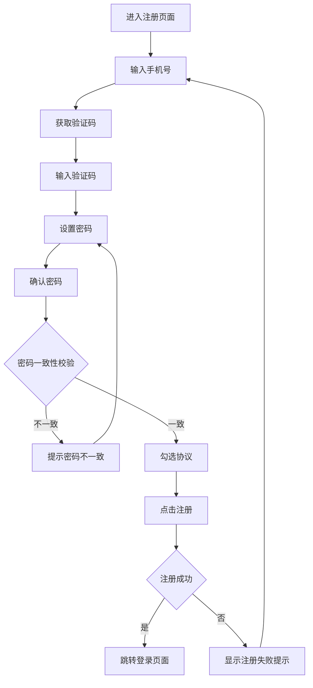

##### 3. 页面原型

- 原型图链接：/品牌商城端/登陆注册/注册登录/注册页面.html

##### 4. 输入项说明

| 字段名称 | 字段标识              | 字段类型 | 必填 | 数据类型    | 长度限制  | 校验规则           | 取值范围 | 来源   | 提示文案           | 备注                     |
| ---- | ----------------- | ---- | -- | ------- | ----- | -------------- | ---- | ---- | -------------- | ---------------------- |
| 手机号  | phone             | 文本输入 | 是  | string  | 11位   | 手机号格式校验        | -    | 用户输入 | 请输入手机号         | -                      |
| 验证码  | sms\_code         | 文本输入 | 是  | string  | 6位    | 数字校验           | -    | 用户输入 | 请输入验证码         | -                      |
| 设置密码 | password          | 密码输入 | 是  | string  | 8-20位 | 包含大写字母、数字和特殊符号 | -    | 用户输入 | 设置密码           | 8位及以上，且需包含大写字母、数字和特殊符号 |
| 确认密码 | confirm\_password | 密码输入 | 是  | string  | 8-20位 | 与设置密码一致        | -    | 用户输入 | 确认密码           | -                      |
| 协议勾选 | agreement         | 复选框  | 是  | boolean | -     | 必须勾选           | -    | 用户选择 | 我已阅读并同意供应商注册协议 | -                      |

##### 5. 输出项说明

| 字段名称 | 字段标识             | 数据类型    | 数据来源 | 格式说明       |
| ---- | ---------------- | ------- | ---- | ---------- |
| 注册状态 | register\_status | boolean | 系统返回 | true/false |
| 用户ID | user\_id         | string  | 系统返回 | 新用户ID      |

##### 6. 业务规则

| 规则编号    | 规则名称   | 适用场景    | 规则描述                 | 错误提示      |
| ------- | ------ | ------- | -------------------- | --------- |
| REG-001 | 手机号校验  | 用户输入手机号 | 必须为11位有效手机号          | 请输入正确的手机号 |
| REG-002 | 手机号唯一性 | 点击注册    | 手机号不能已注册             | 该手机号已注册   |
| REG-003 | 密码格式   | 设置密码    | 8位及以上，包含大写字母、数字和特殊符号 | 密码格式不正确   |
| REG-004 | 密码一致性  | 确认密码    | 确认密码与设置密码一致          | 两次密码输入不一致 |
| REG-005 | 协议校验   | 点击注册    | 必须勾选协议               | 请先阅读并同意协议 |

##### 7. 交互说明

1. 用户进入注册页面
2. 输入手机号后点击"获取验证码"
3. 输入收到的验证码
4. 设置密码（需满足密码规则）
5. 再次输入确认密码
6. 勾选协议后点击"立即注册"
7. 注册成功后跳转至登录页面
8. 点击"前去登录"跳转至登录页面

##### 9. 错误提示文案

###### 表单校验提示

| 校验字段 | 校验场景  | 提示文案      |
| ---- | ----- | --------- |
| 手机号  | 格式错误  | 请输入正确的手机号 |
| 手机号  | 已注册   | 该手机号已注册   |
| 验证码  | 错误或过期 | 验证码错误或已过期 |
| 密码   | 格式错误  | 密码格式不正确   |
| 确认密码 | 不一致   | 两次密码输入不一致 |

###### 业务异常提示

| 异常场景 | 错误码             | 提示文案       |
| ---- | --------------- | ---------- |
| 注册失败 | REG\_ERROR\_001 | 注册失败，请稍后重试 |

#### 4.1.1.3. 账号信息页面

##### 1. 功能概述

- **功能描述**：展示和管理当前登录用户的账号信息
- **业务描述**：用户可查看和修改对接人姓名、手机号、邮箱等基础信息，支持重置密码
- **使用角色**：品牌商城端用户
- **触发条件**：用户进入账号信息页面

##### 2. 流程图

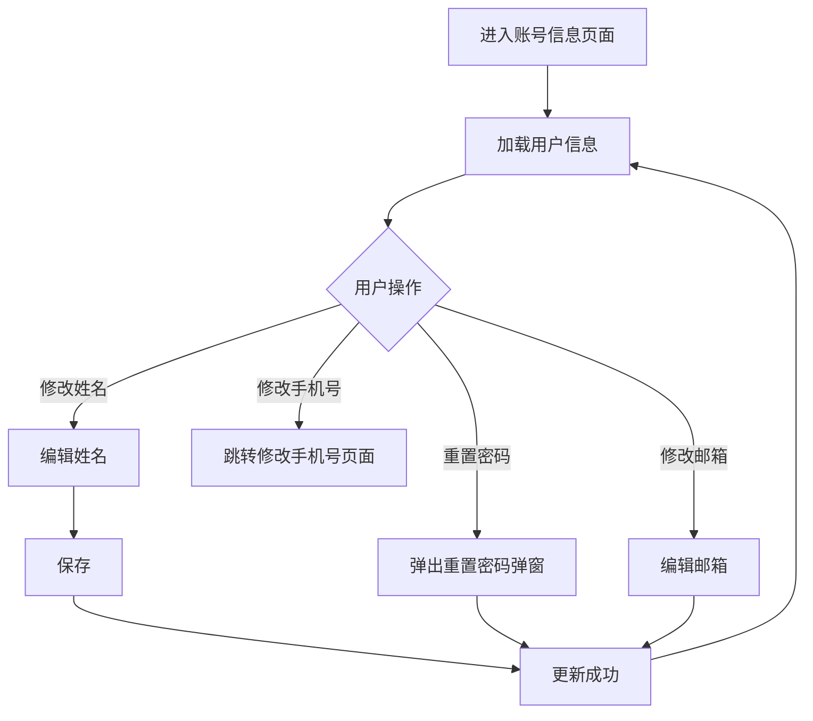

##### 3. 页面原型

- 原型图链接：/品牌商城端/登陆注册/账号信息 (2)/账号信息.html

##### 4. 输入项说明

| 字段名称   | 字段标识           | 字段类型 | 必填 | 数据类型   | 长度限制  | 校验规则  | 取值范围 | 来源   | 提示文案               | 备注   |
| ------ | -------------- | ---- | -- | ------ | ----- | ----- | ---- | ---- | ------------------ | ---- |
| 对接人姓名  | contact\_name  | 文本输入 | 是  | string | 2-20位 | 中文或英文 | -    | 用户输入 | 请输入对接人姓名           | 支持编辑 |
| 对接人手机号 | contact\_phone | 文本展示 | 是  | string | 11位   | -     | -    | 系统展示 | -                  | 支持修改 |
| 邮箱     | email          | 文本输入 | 否  | string | -     | 邮箱格式  | -    | 用户输入 | 请输入邮箱              | 支持编辑 |
| 账号密码   | password       | 密码展示 | 是  | string | -     | -     | -    | 系统展示 | \*\*\*\*\*\*\*\*\* | 支持重置 |
| 注册时间   | register\_time | 文本展示 | 是  | date   | -     | -     | -    | 系统展示 | -                  | 不可修改 |

##### 5. 输出项说明

| 字段名称   | 字段标识           | 数据类型   | 数据来源 | 格式说明                |
| ------ | -------------- | ------ | ---- | ------------------- |
| 用户头像   | avatar         | string | 系统展示 | 头像URL               |
| 对接人姓名  | contact\_name  | string | 系统展示 | -                   |
| 对接人手机号 | contact\_phone | string | 系统展示 | 手机号                 |
| 邮箱     | email          | string | 系统展示 | 邮箱地址                |
| 注册时间   | register\_time | date   | 系统展示 | YYYY-MM-DD HH:mm:ss |

##### 6. 业务规则

| 规则编号    | 规则名称 | 适用场景    | 规则描述       | 错误提示    |
| ------- | ---- | ------- | ---------- | ------- |
| ACC-001 | 姓名修改 | 修改对接人姓名 | 2-20位中文或英文 | 姓名格式不正确 |
| ACC-002 | 邮箱修改 | 修改邮箱    | 需符合邮箱格式    | 邮箱格式不正确 |

##### 7. 交互说明

1. 用户进入账号信息页面，系统自动加载用户信息
2. 点击对接人姓名旁的"修改"按钮，进入编辑模式
3. 编辑完成后点击"保存"或"取消"
4. 点击对接人手机号旁的"修改"按钮，跳转至修改手机号页面
5. 点击账号密码旁的"重置"按钮，弹出重置密码弹窗
6. 点击邮箱旁的编辑图标，进入编辑模式

##### 11. 模块依赖关系

###### 依赖的其他模块

| 模块名称 | 依赖场景      | 依赖数据 | 是否强依赖 |
| ---- | --------- | ---- | ----- |
| 用户服务 | 获取/更新用户信息 | 用户ID | 是     |

###### 被依赖场景

| 调用模块 | 调用场景  | 提供数据 |
| ---- | ----- | ---- |
| 操作日志 | 修改信息时 | 修改记录 |

##### 13. 操作日志要求

| 操作类型  | 记录内容           | 保留时长 |
| ----- | -------------- | ---- |
| 修改姓名  | 修改时间、原姓名、新姓名   | 永久   |
| 修改手机号 | 修改时间、原手机号、新手机号 | 永久   |
| 重置密码  | 重置时间           | 永久   |

### 4.1.2. C端客户管理模块

#### 4.1.2.1. C端客户列表页面

##### 1. 功能概述

- **功能描述**：管理品牌商城的C端客户，支持查询、新增、编辑、启用/禁用等操作
- **业务描述**：品牌商城管理员可查看和管理所有C端客户信息，包括手机号、积分余额、账号状态等
- **使用角色**：品牌商城管理员
- **触发条件**：用户进入客户列表页面

##### 2. 流程图

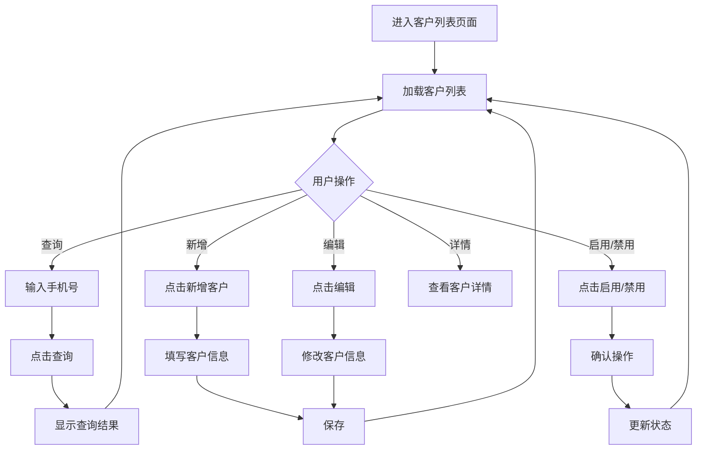

##### 3. 页面原型

- 原型图链接：/品牌商城端/C端客户管理/C端客户列表.html

##### 4. 输入项说明

| 字段名称 | 字段标识  | 字段类型 | 必填 | 数据类型   | 长度限制 | 校验规则  | 取值范围 | 来源   | 提示文案   | 备注   |
| ---- | ----- | ---- | -- | ------ | ---- | ----- | ---- | ---- | ------ | ---- |
| 手机号  | phone | 文本输入 | 否  | string | 11位  | 手机号格式 | -    | 用户输入 | 请输入手机号 | 查询条件 |

##### 5. 输出项说明

| 字段名称 | 字段标识   | 数据类型   | 数据来源 | 格式说明  |
| ---- | ------ | ------ | ---- | ----- |
| 手机号  | phone  | string | 系统记录 | 脱敏显示  |
| 积分余额 | points | number | 系统记录 | -     |
| 账号状态 | status | string | 系统记录 | 启用/禁用 |

##### 6. 业务规则

| 规则编号     | 规则名称  | 适用场景  | 规则描述    | 错误提示 |
| -------- | ----- | ----- | ------- | ---- |
| CUST-001 | 手机号查询 | 查询客户  | 支持模糊查询  | -    |
| CUST-002 | 状态切换  | 启用/禁用 | 确认后立即生效 | -    |
| CUST-003 | 分页规则  | 列表展示  | 默认每页10条 | -    |

##### 7. 交互说明

1. 用户进入客户列表页面，默认加载全部客户
2. 输入手机号后点击"查询"按钮进行筛选
3. 点击"重置"按钮清空筛选条件
4. 点击"新增客户"按钮打开新增客户弹窗
5. 点击"批量操作"展开批量操作菜单
6. 点击客户的"详情"查看客户详细信息
7. 点击"编辑"修改客户信息
8. 点击"启用/禁用"切换客户状态

##### 12. 批量操作规则

| 操作名称 | 单次上限 | 前置条件   | 成功提示   |
| ---- | ---- | ------ | ------ |
| 批量启用 | 100条 | 选中至少1条 | 批量启用成功 |
| 批量禁用 | 100条 | 选中至少1条 | 批量禁用成功 |

##### 13. 操作日志要求

| 操作类型  | 记录内容       | 保留时长 |
| ----- | ---------- | ---- |
| 新增客户  | 新增时间、客户手机号 | 永久   |
| 编辑客户  | 修改时间、修改内容  | 永久   |
| 启用/禁用 | 操作时间、操作内容  | 永久   |

#### 4.1.2.2. 批量导入B端客户页面

##### 1. 功能概述

- **功能描述**：支持通过Excel文件批量导入客户数据
- **业务描述**：用户下载导入模板，填写客户数据后上传，系统自动校验并导入
- **使用角色**：品牌商城管理员
- **触发条件**：用户点击"批量操作"中的"批量导入"

##### 2. 流程图

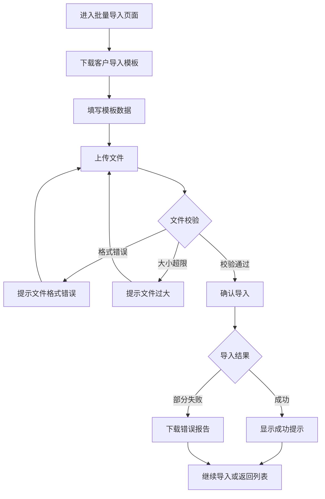

##### 3. 页面原型

- 原型图链接：/品牌商城端/C端客户管理/批量导入员工.html

##### 4. 输入项说明

| 字段名称 | 字段标识         | 字段类型 | 必填 | 数据类型 | 长度限制 | 校验规则         | 取值范围 | 来源   | 提示文案   | 备注 |
| ---- | ------------ | ---- | -- | ---- | ---- | ------------ | ---- | ---- | ------ | -- |
| 导入文件 | import\_file | 文件上传 | 是  | file | ≤2M  | .xlsx或.xls格式 | -    | 用户上传 | 选择文件上传 | -  |

##### 6. 业务规则

| 规则编号    | 规则名称 | 适用场景 | 规则描述            | 错误提示     |
| ------- | ---- | ---- | --------------- | -------- |
| IMP-001 | 文件格式 | 上传文件 | 仅支持.xlsx或.xls格式 | 文件格式不支持  |
| IMP-002 | 文件大小 | 上传文件 | 文件大小不超过2M       | 文件大小超过限制 |
| IMP-003 | 数据条数 | 导入数据 | 每次不超过1000条      | 数据条数超过限制 |
| IMP-004 | 模板校验 | 导入数据 | 必须使用标准模板        | 模板格式不正确  |

##### 7. 交互说明

1. 用户进入批量导入页面
2. 点击"下载客户导入模板"下载模板文件
3. 按照模板要求填写客户数据
4. 点击上传区域选择文件或拖拽文件上传
5. 文件上传后点击"确认导入"
6. 导入成功显示成功提示，可继续导入或返回列表
7. 导入失败可下载错误报告查看失败原因

### 4.1.3. 客服配置模块

#### 4.1.3.1. 客服配置页面

##### 1. 功能概述

- **功能描述**：配置品牌商城的客服信息，包括客服电话、客服微信等
- **业务描述**：品牌商城管理员可设置客服联系方式，供C端用户咨询
- **使用角色**：品牌商城管理员
- **触发条件**：用户进入客服配置页面

##### 2. 流程图

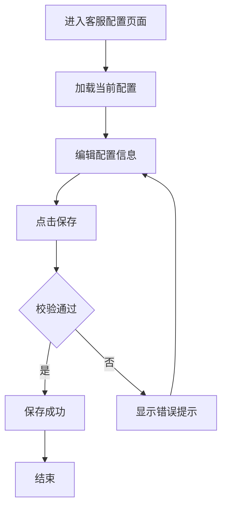

##### 3. 页面原型

- 原型图链接：/品牌商城端/客服配置/客服配置.html

##### 6. 业务规则

| 规则编号   | 规则名称 | 适用场景 |
| ------ | ---- | ---- |
| CS-001 | 客服电话 | 保存配置 |

##### 7. 交互说明

1. 用户进入客服配置页面
2. 系统自动加载当前客服配置
3. 用户编辑配置信息
4. 点击"保存"按钮保存配置
5. 保存成功后显示成功提示

##### 13. 操作日志要求

| 操作类型   | 记录内容      | 保留时长 |
| ------ | --------- | ---- |
| 修改客服配置 | 修改时间、修改内容 | 永久   |

### 4.1.4. 默认规则模块

#### 4.1.4.1. 默认规则页面

##### 1. 功能概述

- **功能描述**：配置品牌商城的默认业务规则
- **业务描述**：品牌商城管理员可设置订单、库存等业务规则
- **使用角色**：品牌商城管理员
- **触发条件**：用户进入默认规则页面

##### 2. 流程图

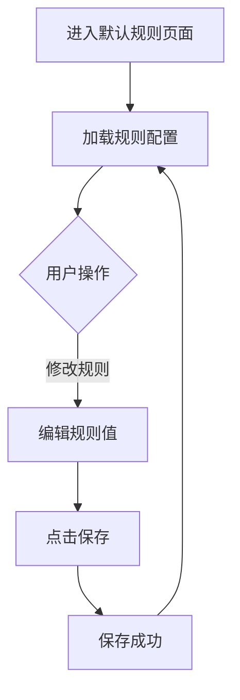

##### 3. 页面原型

- 原型图链接：/品牌商城端/默认规则/默认规则.html

##### 7. 交互说明

1. 用户进入默认规则页面
2. 系统自动加载当前规则配置
3. 用户可修改各项规则值
4. 点击"保存"按钮保存配置
5. 保存成功后显示成功提示

##### 13. 操作日志要求

| 操作类型   | 记录内容            | 保留时长 |
| ------ | --------------- | ---- |
| 修改默认规则 | 修改时间、规则名称、修改前后值 | 永久   |

### 4.1.5. 操作日志模块

#### 4.1.5.1. 操作日志页面

##### 1. 功能概述

- **功能描述**：记录品牌商城端用户的数据修改操作行为，用于审计和问题追溯
- **业务描述**：系统自动记录用户的数据修改操作行为，并提供查询和导出功能
- **使用角色**：品牌商城管理员
- **触发条件**：用户从左侧菜单进入操作日志页面

##### 2. 流程图

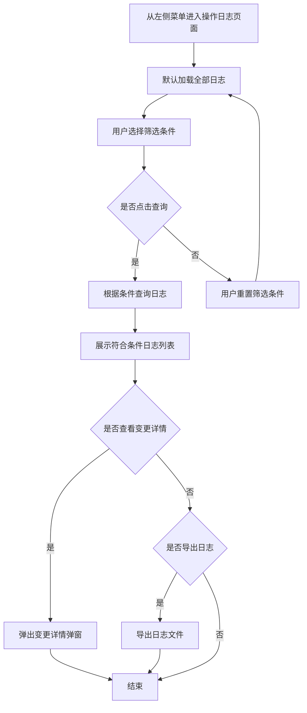

##### 3. 页面原型

- 原型图链接：/品牌商城端/操作日志/操作日志.html

##### 4. 输入项说明

| 字段名称 | 字段标识            | 字段类型  | 必填 | 数据类型   | 长度限制 | 校验规则        | 取值范围    | 来源   | 提示文案   | 备注 |
| ---- | --------------- | ----- | -- | ------ | ---- | ----------- | ------- | ---- | ------ | -- |
| 开始时间 | start\_time     | 日期选择器 | 否  | date   | -    | -           | -       | 用户输入 | 选择开始时间 | -  |
| 结束时间 | end\_time       | 日期选择器 | 否  | date   | -    | 结束时间需大于开始时间 | -       | 用户输入 | 选择结束时间 | -  |
| 操作类型 | operation\_type | 下拉选择  | 否  | string | -    | -           | 全部/数据修改 | 系统预设 | 选择操作类型 | -  |

##### 5. 输出项说明

| 字段名称 | 字段标识            | 数据类型   | 数据来源 | 格式说明                 |
| ---- | --------------- | ------ | ---- | -------------------- |
| 状态   | status          | string | 系统记录 | 成功/失败                |
| 操作时间 | operation\_time | date   | 系统记录 | YYYY-MM-DD HH:mm:ss  |
| 操作人  | operator\_name  | string | 系统记录 | 用户姓名                 |
| 操作类型 | operation\_type | string | 系统记录 | 数据修改                 |
| 变更记录 | change\_record  | string | 系统记录 | 有变更时显示"查看"，无变更时显示"-" |

##### 6. 业务规则

| 规则编号    | 规则名称   | 适用场景     | 规则描述                  | 错误提示        |
| ------- | ------ | -------- | --------------------- | ----------- |
| LOG-001 | 时间筛选规则 | 用户选择时间范围 | 开始时间不能大于结束时间          | 结束时间需大于开始时间 |
| LOG-002 | 日志展示规则 | 日志列表加载   | 默认按操作时间倒序展示           | -           |
| LOG-003 | 分页规则   | 日志列表分页   | 默认每页10条，支持10/20/50条每页 | -           |
| LOG-004 | 变更记录显示 | 查看变更记录   | 仅数据修改类操作有变更记录         | -           |

##### 7. 交互说明

1. 用户从左侧菜单进入操作日志页面
2. 默认加载全部操作日志
3. 用户可选择操作时间范围和操作类型进行筛选
4. 点击"查询"按钮后，系统根据筛选条件返回日志列表
5. 点击"重置"按钮后，清空所有筛选条件并重新加载全部日志
6. 点击"导出日志"按钮后，导出当前筛选条件下的所有日志
7. 对于有变更记录的操作，点击"查看"链接可弹出变更详情弹窗
8. 变更详情弹窗展示修改字段的原内容和更新内容

##### 11. 模块依赖关系

###### 依赖的其他模块

| 模块名称 | 依赖场景    | 依赖数据      | 是否强依赖 |
| ---- | ------- | --------- | ----- |
| 用户模块 | 获取操作人信息 | 用户ID、用户姓名 | 是     |
| 权限模块 | 权限校验    | 权限标识      | 是     |

###### 被依赖场景

| 调用模块 | 调用场景  | 提供数据   |
| ---- | ----- | ------ |
| 业务模块 | 用户操作时 | 记录操作日志 |

##### 12. 批量操作规则

| 操作名称 | 单次上限   | 前置条件          | 成功提示 |
| ---- | ------ | ------------- | ---- |
| 导出日志 | 10000条 | 筛选结果不超过10000条 | 导出成功 |

##### 13. 操作日志要求

| 操作类型 | 记录内容            | 保留时长 |
| ---- | --------------- | ---- |
| 数据修改 | 修改时间、修改内容、修改前后值 | 永久   |

## 4.2. 商城运营端系统

### 4.2.1. 品牌商城列表模块

#### 4.2.1.1. 品牌商城列表页面

##### 1. 功能概述

- **功能描述**：管理所有品牌商城，支持查询、新增、编辑、启用/停用等操作
- **业务描述**：运营管理员可查看和管理所有品牌商城信息，包括客户名称、商城名称、K3渠道编码、商城状态等
- **使用角色**：商城运营管理员
- **触发条件**：用户进入品牌商城列表页面

##### 2. 流程图

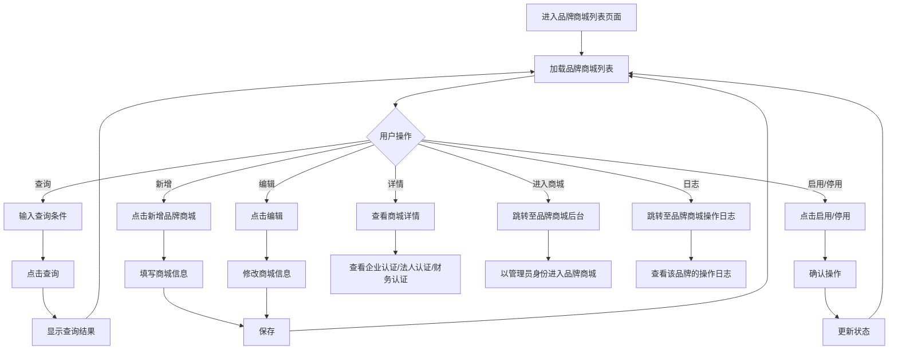

##### 3. 页面原型

- 原型图链接：/商城运营端/品牌商城列表/品牌商城列表.html

##### 4. 输入项说明

| 字段名称   | 字段标识           | 字段类型 | 必填 | 数据类型   | 长度限制 | 校验规则 | 取值范围     | 来源   | 提示文案      | 备注   |
| ------ | -------------- | ---- | -- | ------ | ---- | ---- | -------- | ---- | --------- | ---- |
| 客户名称   | customer\_name | 文本输入 | 否  | string | -    | -    | -        | 用户输入 | 请输入客户名称   | 查询条件 |
| 手机号    | phone          | 文本输入 | 否  | string | 11位  | -    | -        | 用户输入 | 请输入手机号    | 查询条件 |
| K3渠道编码 | k3\_code       | 文本输入 | 否  | string | -    | -    | -        | 用户输入 | 请输入K3渠道编码 | 查询条件 |
| 商城名称   | mall\_name     | 文本输入 | 否  | string | -    | -    | -        | 用户输入 | 请输入商城名称   | 查询条件 |
| 商城状态   | status         | 下拉选择 | 否  | string | -    | -    | 全部/启用/停用 | 系统预设 | 选择商城状态    | 查询条件 |

##### 5. 输出项说明

| 字段名称   | 字段标识           | 数据类型   | 数据来源 | 格式说明       |
| ------ | -------------- | ------ | ---- | ---------- |
| 客户名称   | customer\_name | string | 系统记录 | -          |
| 商城名称   | mall\_name     | string | 系统记录 | -          |
| K3渠道编码 | k3\_code       | string | 系统记录 | -          |
| 对接人手机号 | contact\_phone | string | 系统记录 | 脱敏显示       |
| 商城状态   | status         | string | 系统记录 | 启用/停用      |
| 对接业务员  | salesman       | string | 系统记录 | -          |
| 商城有效期  | valid\_period  | date   | 系统记录 | 开始时间\~结束时间 |

##### 6. 业务规则

| 规则编号     | 规则名称 | 适用场景   | 规则描述             | 错误提示 |
| -------- | ---- | ------ | ---------------- | ---- |
| MALL-001 | 状态切换 | 启用/停用  | 确认后立即生效          | -    |
| MALL-002 | 分页规则 | 列表展示   | 默认每页10条          | -    |
| MALL-003 | 进入商城 | 点击进入商城 | 以管理员身份进入对应品牌商城后台 | -    |
| MALL-004 | 查看日志 | 点击日志   | 跳转至该品牌商城的操作日志页面  | -    |

##### 7. 交互说明

1. 用户进入品牌商城列表页面，默认加载全部品牌商城
2. 输入查询条件后点击"查询"按钮进行筛选
3. 点击"重置"按钮清空筛选条件
4. 点击"新增品牌商城"按钮打开新增商城弹窗
5. 点击"批量操作"展开批量操作菜单（批量启用/批量停用）
6. 点击"详情"查看品牌商城详细信息（企业认证/法人认证/财务认证）
7. 点击"编辑"修改品牌商城信息
8. 点击"启用/停用"切换商城状态
9. 点击"进入商城"跳转至对应品牌商城后台
10. 点击"日志"跳转至该品牌商城的操作日志页面

##### 8. 数据流转说明

###### 数据来源

| 字段/数据  | 来源   | 获取方式    | 说明       |
| ------ | ---- | ------- | -------- |
| 品牌商城列表 | 后端系统 | API接口获取 | 所有品牌商城信息 |

###### 数据去向

| 数据       | 目标系统/模块 | 同步时机    | 说明        |
| -------- | ------- | ------- | --------- |
| 品牌商城操作日志 | 操作日志模块  | 点击"日志"时 | 跳转并传递品牌ID |

##### 11. 模块依赖关系

###### 依赖的其他模块

| 模块名称     | 依赖场景   | 依赖数据 | 是否强依赖 |
| -------- | ------ | ---- | ----- |
| 品牌商城操作日志 | 点击"日志" | 品牌ID | 是     |

###### 被依赖场景

| 调用模块     | 调用场景      | 提供数据      |
| -------- | --------- | --------- |
| 品牌商城操作日志 | 查看品牌操作日志时 | 品牌ID、品牌名称 |

##### 12. 批量操作规则

| 操作名称 | 前置条件   | 成功提示   |
| ---- | ------ | ------ |
| 批量启用 | 选中至少1条 | 批量启用成功 |
| 批量停用 | 选中至少1条 | 批量停用成功 |

##### 13. 操作日志要求

| 操作类型    | 记录内容      | 保留时长 |
| ------- | --------- | ---- |
| 新增品牌商城  | 新增时间、商城名称 | 永久   |
| 编辑品牌商城  | 修改时间、修改内容 | 永久   |
| 启用/停用商城 | 操作时间、操作内容 | 永久   |

### 4.2.2. 客服配置模块

#### 4.2.2.1. 客服配置页面

##### 1. 功能概述

- **功能描述**：配置商城运营端的客服信息
- **业务描述**：运营管理员可设置平台级客服联系方式
- **使用角色**：商城运营管理员
- **触发条件**：用户进入客服配置页面

##### 2. 流程图

##### 3. 页面原型

- 原型图链接：/商城运营端/客服配置/客服配置.html

##### 6. 业务规则

| 规则编号   | 规则名称 | 适用场景 | 规则描述    | 错误提示    |
| ------ | ---- | ---- | ------- | ------- |
| CS-001 | 客服电话 | 保存配置 | 需符合电话格式 | 电话格式不正确 |

##### 7. 交互说明

1. 用户进入客服配置页面
2. 系统自动加载当前客服配置
3. 用户编辑配置信息
4. 点击"保存"按钮保存配置
5. 保存成功后显示成功提示

##### 13. 操作日志要求

| 操作类型   | 记录内容      | 保留时长 |
| ------ | --------- | ---- |
| 修改客服配置 | 修改时间、修改内容 | 永久   |

### 4.2.3. 接口配置模块

#### 4.2.3.1. 微信支付配置页面

##### 1. 功能概述

- **功能描述**：配置微信支付相关参数
- **业务描述**：运营管理员可设置微信支付的AppID、商户号、密钥等参数
- **使用角色**：商城运营管理员
- **触发条件**：用户进入微信支付配置页面

##### 2. 流程图

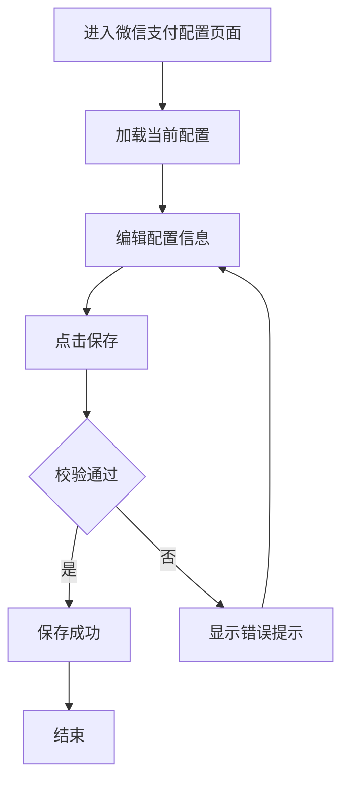

##### 3. 页面原型

- 原型图链接：/商城运营端/接口配置/微信支付配置.html

##### 4. 输入项说明

| 字段名称    | 字段标识             | 字段类型 | 必填 | 数据类型    | 长度限制 | 校验规则     | 取值范围 | 来源   | 提示文案       | 备注 |
| ------- | ---------------- | ---- | -- | ------- | ---- | -------- | ---- | ---- | ---------- | -- |
| 是否启用    | enabled          | 开关   | 是  | boolean | -    | -        | 开/关  | 用户选择 | -          | -  |
| 商户号     | merchant\_id     | 文本输入 | 是  | string  | -    | 需符合商户号格式 | -    | 用户输入 | 请输入商户号     | -  |
| API密钥   | api\_key         | 文本输入 | 是  | string  | -    | -        | -    | 用户输入 | 请输入API密钥   | -  |
| APIV3密钥 | api\_v3\_key     | 文本输入 | 否  | string  | -    | -        | -    | 用户输入 | 请输入APIV3密钥 | -  |
| 私钥      | private\_key     | 文本输入 | 否  | string  | -    | -        | -    | 用户输入 | 请输入私钥      | -  |
| 证书编号    | cert\_serial\_no | 文本输入 | 否  | string  | -    | -        | -    | 用户输入 | 请输入证书编号    | -  |
| 通知url   | notify\_url      | 文本输入 | 是  | string  | -    | 需符合URL格式 | -    | 用户输入 | 请输入通知url   | -  |
| 支付证书    | cert\_file       | 文件上传 | 否  | file    | -    | .p12格式   | -    | 用户上传 | 上传支付证书     | -  |

##### 5. 输出项说明

| 字段名称  | 字段标识           | 数据类型   | 数据来源 | 格式说明    |
| ----- | -------------- | ------ | ---- | ------- |
| 配置状态  | config\_status | string | 系统记录 | 已配置/未配置 |
| 商户号   | merchant\_id   | string | 系统记录 | -       |
| 通知url | notify\_url    | string | 系统记录 | -       |

##### 6. 业务规则

| 规则编号      | 规则名称    | 适用场景 | 规则描述         | 错误提示       |
| --------- | ------- | ---- | ------------ | ---------- |
| WXPAY-001 | AppID校验 | 保存配置 | 需符合微信AppID格式 | AppID格式不正确 |
| WXPAY-002 | 商户号校验   | 保存配置 | 需符合商户号格式     | 商户号格式不正确   |

##### 7. 交互说明

1. 用户进入微信支付配置页面
2. 系统自动加载当前配置
3. 用户编辑配置信息
4. 点击"保存"按钮保存配置
5. 保存成功后显示成功提示

##### 13. 操作日志要求

| 操作类型     | 记录内容      | 保留时长 |
| -------- | --------- | ---- |
| 修改微信支付配置 | 修改时间、修改内容 | 永久   |

#### 4.2.3.2. 快递100参数配置页面

##### 1. 功能概述

- **功能描述**：配置快递100接口相关参数
- **业务描述**：运营管理员可设置快递100的API Key、客户ID等参数
- **使用角色**：商城运营管理员
- **触发条件**：用户进入快递100参数配置页面

##### 2. 流程图

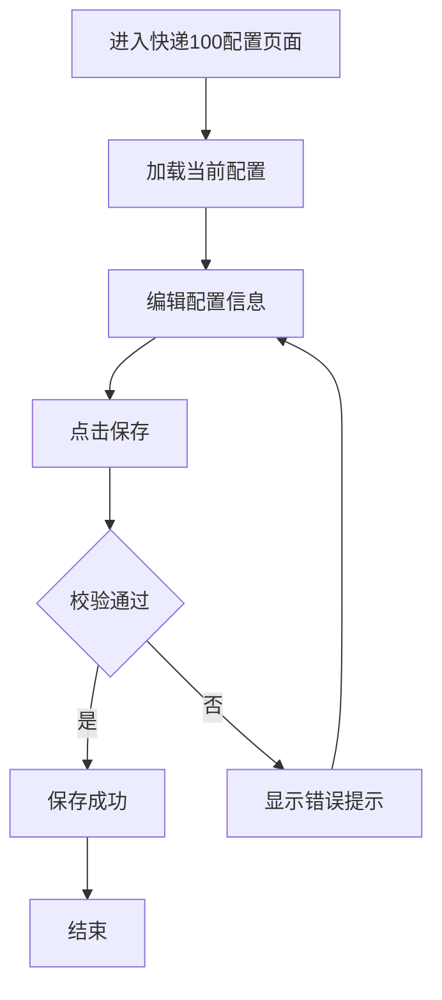

##### 3. 页面原型

- 原型图链接：/商城运营端/接口配置/快递100参数配置.html

##### 4. 输入项说明

| 字段名称    | 字段标识            | 字段类型 | 必填 | 数据类型    | 长度限制 | 校验规则 | 取值范围 | 来源   | 提示文案              | 备注          |
| ------- | --------------- | ---- | -- | ------- | ---- | ---- | ---- | ---- | ----------------- | ----------- |
| 实时查询接口  | realtime\_query | 单选按钮 | 是  | boolean | -    | -    | 开/关  | 用户选择 | 启用后在用户主动查询时才会调用接口 | -           |
| 公司编号    | customer\_key   | 文本域  | 是  | string  | -    | -    | -    | 用户输入 | 请输入公司编号           | customerKey |
| 授权密钥key | delivery\_key   | 文本域  | 是  | string  | -    | -    | -    | 用户输入 | 请输入授权密钥key        | deliveryKey |

##### 5. 输出项说明

| 字段名称   | 字段标识            | 数据类型    | 数据来源 | 格式说明    |
| ------ | --------------- | ------- | ---- | ------- |
| 配置状态   | config\_status  | string  | 系统记录 | 已配置/未配置 |
| 实时查询接口 | realtime\_query | boolean | 系统记录 | 开/关     |
| 公司编号   | customer\_key   | string  | 系统记录 | -       |

##### 6. 业务规则

| 规则编号      | 规则名称   | 适用场景 | 规则描述     | 错误提示       |
| --------- | ------ | ---- | -------- | ---------- |
| KD100-001 | 公司编号校验 | 保存配置 | 必须填写公司编号 | 请输入公司编号    |
| KD100-002 | 授权密钥校验 | 保存配置 | 必须填写授权密钥 | 请输入授权密钥key |

##### 7. 交互说明

1. 用户进入快递100配置页面
2. 系统自动加载当前配置
3. 用户编辑配置信息
4. 点击"保存"按钮保存配置
5. 保存成功后显示成功提示

##### 13. 操作日志要求

| 操作类型      | 记录内容      | 保留时长 |
| --------- | --------- | ---- |
| 修改快递100配置 | 修改时间、修改内容 | 永久   |

#### 4.2.3.3. 企微拉取组织参数配置页面

##### 1. 功能概述

- **功能描述**：配置企业微信拉取组织相关参数
- **业务描述**：运营管理员可设置企业微信的CorpID、Secret等参数
- **使用角色**：商城运营管理员
- **触发条件**：用户进入企微拉取组织参数配置页面

##### 2. 流程图

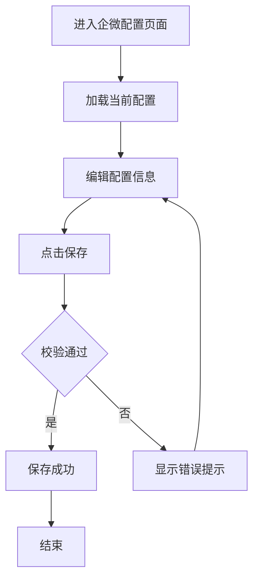

##### 3. 页面原型

- 原型图链接：/商城运营端/接口配置/企微拉取组织参数配置.html

##### 4. 输入项说明

| 字段名称       | 字段标识         | 字段类型 | 必填 | 数据类型   | 长度限制 | 校验规则 | 取值范围 | 来源   | 提示文案          | 备注   |
| ---------- | ------------ | ---- | -- | ------ | ---- | ---- | ---- | ---- | ------------- | ---- |
| corpId     | corp\_id     | 文本域  | 是  | string | -    | -    | -    | 用户输入 | 请输入corpId     | 企业ID |
| corpSecret | corp\_secret | 文本域  | 是  | string | -    | -    | -    | 用户输入 | 请输入corpSecret | 应用密钥 |
| agentId    | agent\_id    | 文本域  | 是  | string | -    | -    | -    | 用户输入 | 请输入agentId    | 应用ID |

##### 5. 输出项说明

| 字段名称    | 字段标识           | 数据类型   | 数据来源 | 格式说明    |
| ------- | -------------- | ------ | ---- | ------- |
| 配置状态    | config\_status | string | 系统记录 | 已配置/未配置 |
| corpId  | corp\_id       | string | 系统记录 | -       |
| agentId | agent\_id      | string | 系统记录 | -       |

##### 6. 业务规则

| 规则编号     | 规则名称         | 适用场景 | 规则描述           | 错误提示          |
| -------- | ------------ | ---- | -------------- | ------------- |
| QYWX-001 | corpId校验     | 保存配置 | 必须填写corpId     | 请输入corpId     |
| QYWX-002 | corpSecret校验 | 保存配置 | 必须填写corpSecret | 请输入corpSecret |
| QYWX-003 | agentId校验    | 保存配置 | 必须填写agentId    | 请输入agentId    |

##### 7. 交互说明

1. 用户进入企微配置页面
2. 系统自动加载当前配置
3. 用户编辑配置信息
4. 点击"保存"按钮保存配置
5. 保存成功后显示成功提示

##### 13. 操作日志要求

| 操作类型   | 记录内容      | 保留时长 |
| ------ | --------- | ---- |
| 修改企微配置 | 修改时间、修改内容 | 永久   |

### 4.2.4. 消息通知模块

#### 4.2.4.1. 消息通知页面

##### 1. 功能概述

- **功能描述**：管理消息通知模板和通知记录
- **业务描述**：运营管理员可配置消息通知模板，查看通知发送记录
- **使用角色**：商城运营管理员
- **触发条件**：用户进入消息通知页面

##### 2. 流程图

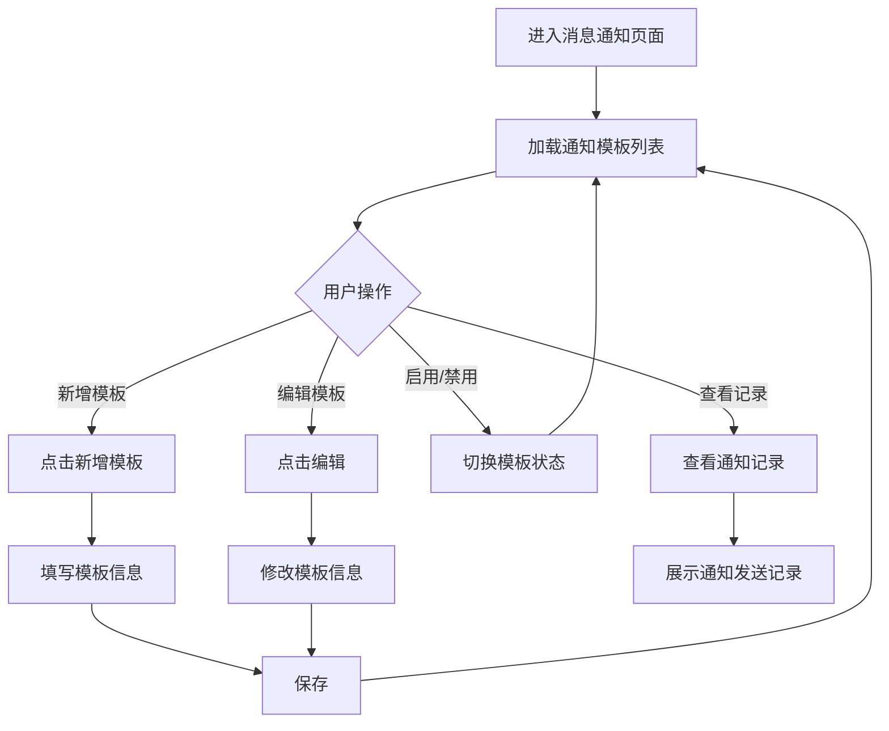

##### 3. 页面原型

- 原型图链接：/商城运营端/消息通知/消息通知.html

##### 7. 交互说明

1. 用户进入消息通知页面
2. 系统加载通知模板列表
3. 点击"新增模板"创建新的通知模板
4. 点击"编辑"修改模板信息
5. 点击"启用/禁用"切换模板状态
6. 点击"通知记录"查看历史发送记录

##### 13. 操作日志要求

| 操作类型    | 记录内容      | 保留时长 |
| ------- | --------- | ---- |
| 新增通知模板  | 新增时间、模板名称 | 永久   |
| 编辑通知模板  | 修改时间、修改内容 | 永久   |
| 启用/禁用模板 | 操作时间、操作内容 | 永久   |

### 4.2.5. 默认规则模块

#### 4.2.5.1. 默认规则页面

##### 1. 功能概述

- **功能描述**：配置商城运营端的默认业务规则
- **业务描述**：运营管理员可设置平台级的订单、库存等业务规则
- **使用角色**：商城运营管理员
- **触发条件**：用户进入默认规则页面

##### 2. 流程图

##### 3. 页面原型

- 原型图链接：/商城运营端/默认规则/默认规则.html

##### 7. 交互说明

1. 用户进入默认规则页面
2. 系统自动加载当前规则配置
3. 用户可修改各项规则值
4. 点击"保存"按钮保存配置
5. 保存成功后显示成功提示

##### 13. 操作日志要求

| 操作类型   | 记录内容            | 保留时长 |
| ------ | --------------- | ---- |
| 修改默认规则 | 修改时间、规则名称、修改前后值 | 永久   |

### 4.2.6. 操作日志模块

#### 4.2.6.1. 运营后台操作日志页面

##### 1. 功能概述

- **功能描述**：记录运营后台管理员的数据修改操作行为，用于内部审计和问题追溯
- **业务描述**：系统自动记录运营管理员的配置修改等数据修改操作行为
- **使用角色**：商城运营管理员
- **触发条件**：用户从左侧菜单进入操作日志页面

##### 2. 流程图

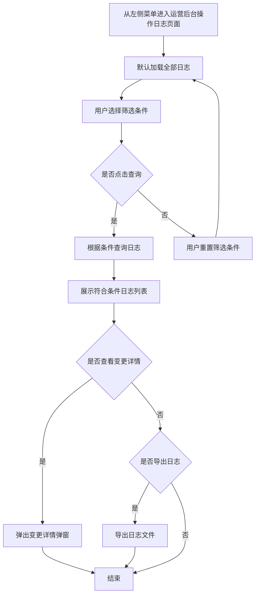

##### 3. 页面原型

- 原型图链接：/商城运营端/操作日志/商城运营后台 (2)/运营后台操作日志.html

##### 4. 输入项说明

| 字段名称 | 字段标识            | 字段类型  | 必填 | 数据类型   | 长度限制 | 校验规则        | 取值范围         | 来源   | 提示文案   | 备注 |
| ---- | --------------- | ----- | -- | ------ | ---- | ----------- | ------------ | ---- | ------ | -- |
| 开始时间 | start\_time     | 日期选择器 | 否  | date   | -    | -           | -            | 用户输入 | 选择开始时间 | -  |
| 结束时间 | end\_time       | 日期选择器 | 否  | date   | -    | 结束时间需大于开始时间 | -            | 用户输入 | 选择结束时间 | -  |
| 操作类型 | operation\_type | 下拉选择  | 否  | string | -    | -           | 全部/数据修改/系统配置 | 系统预设 | 选择操作类型 | -  |

##### 5. 输出项说明

| 字段名称 | 字段标识            | 数据类型   | 数据来源 | 格式说明                 |
| ---- | --------------- | ------ | ---- | -------------------- |
| 状态   | status          | string | 系统记录 | 成功/失败                |
| 操作时间 | operation\_time | date   | 系统记录 | YYYY-MM-DD HH:mm:ss  |
| 操作人  | operator\_name  | string | 系统记录 | 管理员姓名                |
| 操作类型 | operation\_type | string | 系统记录 | 数据修改/系统配置            |
| 变更记录 | change\_record  | string | 系统记录 | 有变更时显示"查看"，无变更时显示"-" |

##### 6. 业务规则

| 规则编号    | 规则名称   | 适用场景     | 规则描述                  | 错误提示        |
| ------- | ------ | -------- | --------------------- | ----------- |
| OPL-001 | 时间筛选规则 | 用户选择时间范围 | 开始时间不能大于结束时间          | 结束时间需大于开始时间 |
| OPL-002 | 日志展示规则 | 日志列表加载   | 默认按操作时间倒序展示           | -           |
| OPL-003 | 分页规则   | 日志列表分页   | 默认每页10条，支持10/20/50条每页 | -           |

##### 7. 交互说明

1. 用户从左侧菜单进入运营后台操作日志页面
2. 默认加载全部操作日志
3. 用户可选择操作时间范围和操作类型进行筛选
4. 点击"查询"按钮后，系统根据筛选条件返回日志列表
5. 点击"重置"按钮后，清空所有筛选条件并重新加载全部日志
6. 点击"导出日志"按钮后，导出当前筛选条件下的所有日志
7. 对于有变更记录的操作，点击"查看"链接可弹出变更详情弹窗

##### 11. 模块依赖关系

###### 依赖的其他模块

| 模块名称 | 依赖场景    | 依赖数据      | 是否强依赖 |
| ---- | ------- | --------- | ----- |
| 用户模块 | 获取操作人信息 | 用户ID、用户姓名 | 是     |
| 权限模块 | 权限校验    | 权限标识      | 是     |

###### 被依赖场景

| 调用模块 | 调用场景   | 提供数据   |
| ---- | ------ | ------ |
| 运营后台 | 管理员操作时 | 记录操作日志 |

##### 12. 批量操作规则

| 操作名称 | 单次上限   | 前置条件          | 成功提示 |
| ---- | ------ | ------------- | ---- |
| 导出日志 | 10000条 | 筛选结果不超过10000条 | 导出成功 |

##### 13. 操作日志要求

| 操作类型 | 记录内容            | 保留时长 |
| ---- | --------------- | ---- |
| 数据修改 | 修改时间、修改内容、修改前后值 | 永久   |
| 系统配置 | 配置修改时间、修改内容     | 永久   |

#### 4.2.6.2. 品牌商城操作日志页面

##### 1. 功能概述

- **功能描述**：记录所有品牌商城的数据修改操作行为，供运营人员审计和问题追溯
- **业务描述**：运营后台可查看指定品牌商城的数据修改操作日志，用于追踪品牌商城用户的操作行为
- **使用角色**：商城运营管理员
- **触发条件**：用户从品牌商城列表页面点击"日志"按钮进入

##### 2. 流程图

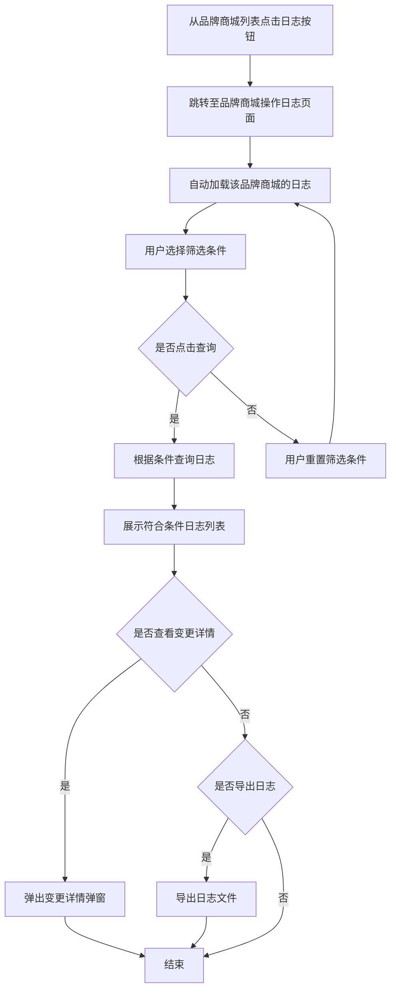

##### 3. 页面原型

- 原型图链接：/商城运营端/操作日志/商城运营后台 (2)/品牌商城操作日志.html

##### 4. 输入项说明

| 字段名称   | 字段标识        | 字段类型  | 必填 | 数据类型   | 长度限制 | 校验规则        | 取值范围 | 来源   | 提示文案   | 备注             |
| ------ | ----------- | ----- | -- | ------ | ---- | ----------- | ---- | ---- | ------ | -------------- |
| 开始时间   | start\_time | 日期选择器 | 否  | date   | -    | -           | -    | 用户输入 | 选择开始时间 | -              |
| 结束时间   | end\_time   | 日期选择器 | 否  | date   | -    | 结束时间需大于开始时间 | -    | 用户输入 | 选择结束时间 | -              |
| 所属品牌商城 | brand\_mall | 文本展示  | 是  | string | -    | -           | -    | 系统传递 | -      | 从品牌商城列表传递，不可修改 |

##### 5. 输出项说明

| 字段名称 | 字段标识            | 数据类型   | 数据来源 | 格式说明                 |
| ---- | --------------- | ------ | ---- | -------------------- |
| 状态   | status          | string | 系统记录 | 成功/失败                |
| 操作时间 | operation\_time | date   | 系统记录 | YYYY-MM-DD HH:mm:ss  |
| 操作人  | operator\_name  | string | 系统记录 | 用户姓名                 |
| 操作类型 | operation\_type | string | 系统记录 | 数据修改                 |
| 所属品牌 | brand\_name     | string | 系统记录 | 品牌商城名称               |
| 变更记录 | change\_record  | string | 系统记录 | 有变更时显示"查看"，无变更时显示"-" |

##### 6. 业务规则

| 规则编号    | 规则名称   | 适用场景     | 规则描述                  | 错误提示        |
| ------- | ------ | -------- | --------------------- | ----------- |
| BML-001 | 时间筛选规则 | 用户选择时间范围 | 开始时间不能大于结束时间          | 结束时间需大于开始时间 |
| BML-002 | 品牌筛选规则 | 进入页面     | 自动加载指定品牌商城的日志         | -           |
| BML-003 | 日志展示规则 | 日志列表加载   | 默认按操作时间倒序展示           | -           |
| BML-004 | 分页规则   | 日志列表分页   | 默认每页10条，支持10/20/50条每页 | -           |

##### 7. 交互说明

1. 用户从品牌商城列表页面点击某品牌的"日志"按钮
2. 系统跳转至品牌商城操作日志页面，并自动加载该品牌的操作日志
3. 所属品牌商城字段显示当前品牌名称，不可修改
4. 用户可选择操作时间范围进行筛选
5. 点击"查询"按钮后，系统根据筛选条件返回日志列表
6. 点击"重置"按钮后，清空时间筛选条件并重新加载该品牌的全部日志
7. 点击"导出日志"按钮后，导出当前筛选条件下的所有日志
8. 对于有变更记录的操作，点击"查看"链接可弹出变更详情弹窗

##### 8. 数据流转说明

###### 数据来源

| 字段/数据  | 来源     | 获取方式    | 说明          |
| ------ | ------ | ------- | ----------- |
| 品牌ID   | 品牌商城列表 | URL参数传递 | 从列表页点击日志时传递 |
| 操作日志数据 | 后端系统   | API接口获取 | 指定品牌商城的操作记录 |

###### 数据去向

| 数据   | 目标系统/模块 | 同步时机   | 说明          |
| ---- | ------- | ------ | ----------- |
| 导出日志 | 本地文件    | 用户点击导出 | 生成Excel文件下载 |

##### 11. 模块依赖关系

###### 依赖的其他模块

| 模块名称   | 依赖场景 | 依赖数据        | 是否强依赖 |
| ------ | ---- | ----------- | ----- |
| 品牌商城列表 | 进入页面 | 品牌ID、品牌名称   | 是     |
| 权限模块   | 权限校验 | 权限标识、品牌数据权限 | 是     |

###### 被依赖场景

| 调用模块  | 调用场景    | 提供数据   |
| ----- | ------- | ------ |
| 品牌商城端 | 品牌用户操作时 | 记录操作日志 |

##### 12. 批量操作规则

| 操作名称 | 单次上限   | 前置条件          | 成功提示 |
| ---- | ------ | ------------- | ---- |
| 导出日志 | 10000条 | 筛选结果不超过10000条 | 导出成功 |

##### 13. 操作日志要求

| 操作类型 | 记录内容            | 保留时长 |
| ---- | --------------- | ---- |
| 登录   | 登录时间、登录IP、登录结果  | 永久   |
| 数据修改 | 修改时间、修改内容、修改前后值 | 永久   |
| 退出   | 退出时间            | 永久   |

***

# 5. 非功能需求

## 5.1. 性能需求

| 指标名称   | 指标要求             |
| ------ | ---------------- |
| 页面加载时间 | 首屏加载 ≤ 2秒        |
| 操作响应时间 | 普通操作 ≤ 500ms     |
| 列表查询响应 | ≤ 1秒（数据量≤10000条） |

## 5.2. 兼容性需求

| 类型  | 要求                                         |
| --- | ------------------------------------------ |
| 浏览器 | Chrome 80+、Firefox 75+、Safari 13+、Edge 80+ |
| 分辨率 | 最低支持1366×768，推荐1920×1080                   |

## 5.3. 安全需求

| 安全项   | 要求                  |
| ----- | ------------------- |
| 登录安全  | 支持短信验证码和密码登录，密码加密存储 |
| 权限控制  | 基于角色的访问控制，数据权限隔离    |
| 日志完整性 | 操作日志不可篡改、不可删除       |
| 导出安全  | 导出文件需有水印或标识         |

***

# 6. 附录

## 6.1. 术语表

| 术语       | 说明               |
| -------- | ---------------- |
| 品牌商城端    | 品牌商使用的管理后台       |
| 商城运营端    | 平台运营人员使用的管理后台    |
| C端客户     | 在品牌商城购物的终端用户     |
| 操作日志     | 记录用户在系统中的操作行为的数据 |
| 运营后台操作日志 | 记录运营管理员操作行为的日志   |
| 品牌商城操作日志 | 记录品牌商城用户操作行为的日志  |

## 6.2. 相关文档

| 文档名称         | 文档路径                                 |
| ------------ | ------------------------------------ |
| 登录页面原型       | /品牌商城端/登陆注册/注册登录/登录页面.html           |
| 注册页面原型       | /品牌商城端/登陆注册/注册登录/注册页面.html           |
| 账号信息原型       | /品牌商城端/登陆注册/账号信息 (2)/账号信息.html       |
| C端客户列表原型     | /品牌商城端/C端客户管理/C端客户列表.html            |
| 批量导入员工原型     | /品牌商城端/C端客户管理/批量导入员工.html            |
| 品牌商城端客服配置原型  | /品牌商城端/客服配置/客服配置.html                |
| 品牌商城端默认规则原型  | /品牌商城端/默认规则/默认规则.html                |
| 品牌商城端操作日志原型  | /品牌商城端/操作日志/操作日志.html                |
| 品牌商城列表原型     | /商城运营端/品牌商城列表/品牌商城列表.html            |
| 商城运营端客服配置原型  | /商城运营端/客服配置/客服配置.html                |
| 微信支付配置原型     | /商城运营端/接口配置/微信支付配置.html              |
| 快递100参数配置原型  | /商城运营端/接口配置/快递100参数配置.html           |
| 企微拉取组织参数配置原型 | /商城运营端/接口配置/企微拉取组织参数配置.html          |
| 消息通知原型       | /商城运营端/消息通知/消息通知.html                |
| 商城运营端默认规则原型  | /商城运营端/默认规则/默认规则.html                |
| 运营后台操作日志原型   | /商城运营端/操作日志/商城运营后台 (2)/运营后台操作日志.html |
| 品牌商城操作日志原型   | /商城运营端/操作日志/商城运营后台 (2)/品牌商城操作日志.html |

## 6.3. 模块关联说明

### 操作日志入口说明

| 日志类型      | 所属系统  | 入口位置          | 说明              |
| --------- | ----- | ------------- | --------------- |
| 品牌商城端操作日志 | 品牌商城端 | 左侧菜单 → 操作日志   | 记录品牌商城端用户的操作行为  |
| 运营后台操作日志  | 商城运营端 | 左侧菜单 → 操作日志   | 记录运营后台管理员的操作行为  |
| 品牌商城操作日志  | 商城运营端 | 品牌商城列表 → 日志按钮 | 记录指定品牌商城用户的操作行为 |

### 品牌商城列表与操作日志关联

***

# 7. 版本记录

| 版本号  | 修改日期       | 修改人  | 修改内容 |
| ---- | ---------- | ---- | ---- |
| V1.0 | 2026-03-20 | 产品经理 | 初稿创建 |

