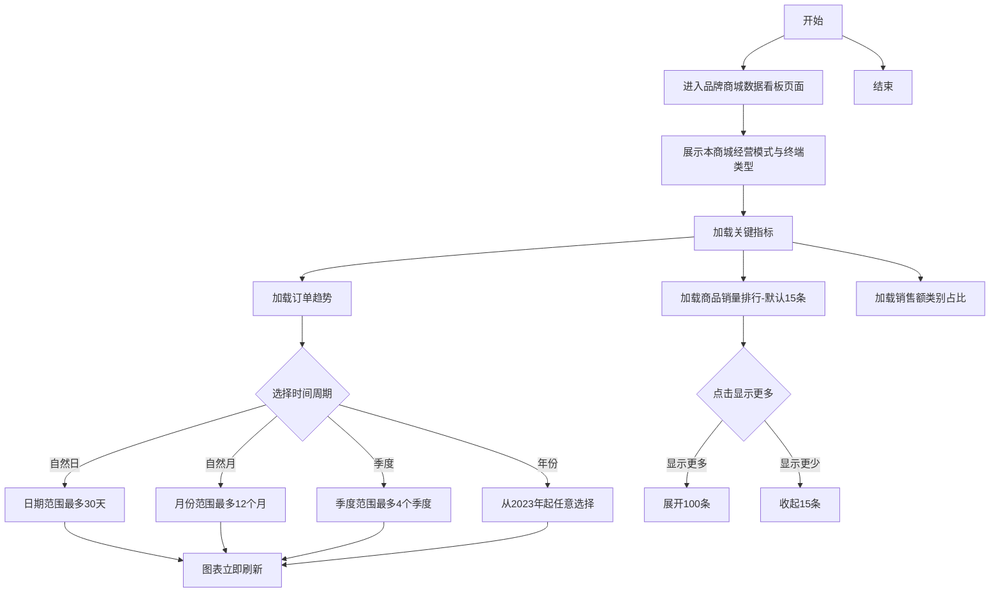
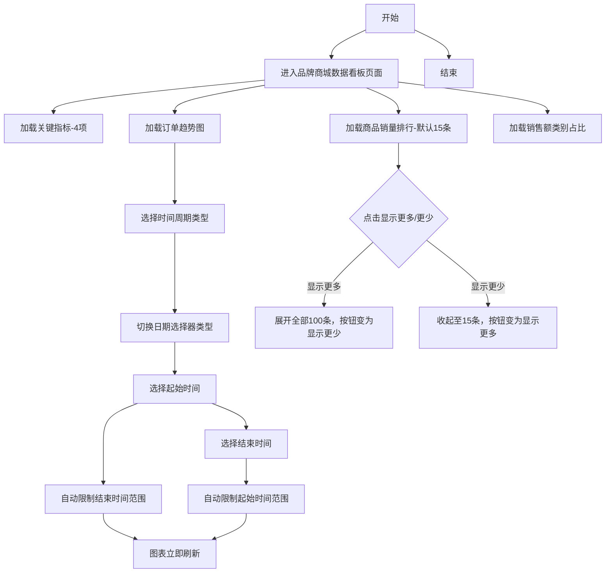

# 品牌商城数据看板产品需求文档

# 1. 需求背景

品牌商城是平台下一个个独立的经营主体，每个品牌商城在入驻审核时由运营人员配置其开通的终端（小程序商城/PC端商城/H5商城三选一）与经营模式（直销/分销）。

品牌商城运营人员需要通过数据看板实时了解本品牌商城的经营状况，包括核心交易指标、用户数据、商品销售排行以及类目销售占比等信息，并明确本商城开通的终端类型与经营模式（直销/分销），以便做出运营决策。

# 2. 需求分析

| 分析维度 | 说明 |
|----------|------|
| 目标用户 | 品牌商城运营人员、运营主管 |
| 使用场景 | 日常运营监控、业绩汇报 |
| 业务视角 | 品牌商城自身视角，仅查看本品牌商城数据 |
| 数据范围 | 本品牌商城数据（直接展示本商城开通的单一终端数据） |
| 核心价值 | 集中展示关键经营数据，快速了解业务状态 |

# 核心业务概念

| 概念 | 说明 |
|------|------|
| 品牌商城 | 平台下一个个独立的经营主体，本看板的数据主体（登录即对应一个具体品牌商城） |
| 终端 | 品牌商城开通的客户端类型：小程序商城、PC端商城、H5商城；单个品牌商城仅开通其中一个终端（三选一互斥），本看板直接展示该终端数据 |
| 经营模式 | 品牌商城的经营模式：直销、分销；单个品牌商城为单一模式（二选一），由入驻审核时配置，本看板仅展示不作为筛选 |
| 配置环节 | 品牌商城入驻审核时，由运营人员设定开通的终端与经营模式，决定本看板展示的终端与经营模式 |

> 说明：本看板的「品牌商城」「经营模式」「终端」均为本商城自身的固定属性，不提供筛选；看板直接展示本品牌商城在所开通终端上的数据，核心指标、订单趋势、商品销量排行、类目占比等区块均展示本商城数据。

# 3. 系统流程图

# 4. 详细需求

## 4.1. 品牌商城运营后台系统

### 4.1.1. 首页看板模块

#### 4.1.1.1. 品牌商城数据看板页面

##### 1. 功能概述

- 功能描述：品牌商城数据看板页面用于承载品牌商城运营后台首页，集中展示本品牌商城的关键指标、订单趋势、商品销量排行和销售额类别占比，展示本商城开通的终端类型与经营模式（直销/分销）。
- 业务描述：运营人员进入系统后，查看核心经营指标（订单金额、订单量、商品总数、用户数），通过订单趋势了解销售走势，再查看商品销售情况和类目占比。
- 使用角色：品牌商城运营、运营主管。
- 触发条件：用户登录品牌商城运营后台并进入首页。

##### 2. 界面设计

###### 2.1 页面原型

- 原型文件：[品牌商城数据看板.html](/c:/Users/张蓉鑫/Desktop/test/品牌商城数据看板.html)

###### 2.2 输出项说明

| 字段名称 | 字段标识 | 数据类型 | 数据来源 | 格式说明 |
|----------|----------|----------|----------|----------|
| 经营模式 | business_mode | String | 品牌商城审核配置 | 直销/分销（仅展示，本商城固定模式） |
| 终端类型 | terminal_type | String | 品牌商城审核配置 | 小程序商城/PC端商城/H5商城（本商城固定终端，仅展示不作为筛选） |
| 指标名称 | metric_name | String | 页面固定配置 | 文本 |
| 指标值 | metric_value | String | 看板聚合数据 | 文本或金额 |
| 指标趋势 | metric_trend | String | 看板聚合数据 | 较昨日+X |
| 趋势方向 | trend_direction | String | 计算得出 | positive/negative |
| 时间周期类型 | period_type | String | 用户选择 | 自然日/自然月/季度/年 |
| 起始时间 | start_date | Date | 用户选择 | 日期/月份/季度/年 |
| 结束时间 | end_date | Date | 用户选择 | 日期/月份/季度/年 |
| 商品排名 | product_rank | Number | 商品销量数据 | 整数 |
| 商品信息 | product_name | String | 商品基础数据 | 文本 |
| 商品编号 | product_code | String | 商品基础数据 | 文本 |
| 商品单价 | product_price | String | 商品基础数据 | 文本或金额 |
| 商品分类 | product_category | String | 商品基础数据 | 文本 |
| 商品销量 | product_sales | Number | 商品销量数据 | 整数 |
| 商品销售额 | product_amount | Number | 商品销量数据 | 整数 |
| 类别名称 | category_name | String | 类目销售数据 | 文本 |
| 类别销售额 | category_sales | Number | 类目销售数据 | 整数 |
| 类别占比 | category_ratio | Decimal | 类目销售数据 | 百分比 |

##### 3. 业务逻辑

###### 3.1 流程图

**品牌商城数据看板浏览流程**

###### 3.2 业务规则

| 规则编号 | 规则名称 | 适用场景 | 规则描述 | 错误提示 |
|----------|----------|----------|----------|----------|
| rule_brand_001 | 首页默认展示规则 | 页面初始化 | 页面默认展示4项关键指标、订单趋势、商品销量排行（默认15条）、销售额类别占比 | - |
| rule_brand_002 | 关键指标固定项规则 | 关键指标展示 | 关键指标固定展示订单金额（实时）、订单量（实时）、商品总数/在架商品数、用户数四项 | - |
| rule_brand_003 | 指标趋势显示规则 | 指标趋势展示 | 订单金额、订单量显示较昨日趋势；用户数不显示趋势 | - |
| rule_brand_004 | 订单趋势周期规则 | 订单趋势时间选择 | 支持自然日、自然月、季度、年四种周期类型切换 | - |
| rule_brand_005 | 订单趋势日期联动规则-日 | 自然日日期选择 | 选择起始日期后，结束日期最多选择之后30天；选择结束日期后，起始日期最多选择之前30天 | - |
| rule_brand_006 | 订单趋势日期联动规则-月 | 自然月日期选择 | 选择起始月份后，结束月份最多选择之后12个月；选择结束月份后，起始月份最多选择之前12个月 | - |
| rule_brand_007 | 订单趋势日期联动规则-季度 | 季度日期选择 | 选择起始季度后，结束季度最多选择之后4个季度 | - |
| rule_brand_008 | 订单趋势日期联动规则-年 | 年份日期选择 | 年份从2023年开始，可任意选择范围 | - |
| rule_brand_009 | 销量排行默认规则 | 商品销量排行 | 默认展示15条记录，按销量从高到低排序 | - |
| rule_brand_011 | 销量排行展开规则 | 商品销量排行 | 点击显示更多展开全部100条，点击显示更少收起至15条 | - |
| rule_brand_012 | 类目占比展示规则 | 销售额类别占比 | 展示前10个类目，其余归入”其他” | - |
| rule_brand_013 | 经营模式展示规则 | 页面初始化 | 页面展示本品牌商城的经营模式（直销/分销）与开通的终端类型，均由入驻审核配置，仅展示不作为筛选 | - |

###### 3.3 状态机设计

页面为展示型页面，无独立业务状态机，仅存在初始化、加载、展示三种界面状态，不单独定义业务状态流转。

##### 4. 交互设计

###### 4.1 输入项说明

| 字段名称 | 字段标识 | 字段类型 | 必填 | 数据类型 | 长度限制 | 校验规则 | 取值范围 | 来源 | 提示文案 | 备注 |
|----------|----------|----------|------|----------|----------|----------|----------|------|----------|------|
| 时间周期类型 | period_type | 下拉选择 | 是 | String | - | 仅支持固定选项 | 自然日,自然月,季度,年 | 用户选择 | - | 默认为自然日 |
| 起始时间 | start_date | 日期选择 | 是 | Date | - | 受结束时间和周期类型限制 | 动态计算 | 用户选择 | - | 根据周期类型变化 |
| 结束时间 | end_date | 日期选择 | 是 | Date | - | 受起始时间和周期类型限制 | 动态计算 | 用户选择 | - | 根据周期类型变化 |

###### 4.2 交互说明

1. 页面加载后默认显示首页看板内容，顶部展示本品牌商城开通的终端类型与经营模式（直销/分销）。
2. 页面顶部显示刷新、消息、操作手册和头像入口。
3. 看板顶部展示本商城开通的终端类型与经营模式（仅展示，不提供筛选）。
4. 关键指标区固定展示4项核心指标，每个指标显示数值、趋势。
5. 订单趋势模块独立一行，拉伸至页面全宽。
6. 订单趋势支持时间周期类型切换（自然日/自然月/季度/年），选择后日期选择器类型自动切换。
7. 订单趋势选择起始时间后自动限制结束时间范围，选择结束后图表立即刷新；选择结束时间后自动限制起始时间范围，图表立即刷新。
8. 商品销量排行默认显示15条，支持点击显示更多展开全部100条，点击显示更少收起至15条。
9. 销售额类别占比以环形图展示，默认展示前10个类目，其余归入”其他”。
10. 商品销量排行表头”销量”和”销售额”不显示排序箭头。

###### 4.3 错误提示文案

**业务异常提示**

| 异常场景 | 错误码 | 提示文案 |
|----------|--------|----------|
| 看板数据加载失败 | brand_error_001 | 看板数据加载失败，请稍后重试 |
| 图表渲染失败 | brand_error_002 | 图表渲染失败，请稍后重试 |

##### 5. 数据设计

###### 5.1 数据流转说明

| 字段/数据 | 来源 | 获取方式 | 说明 |
|-----------|------|----------|------|
| 本商城终端与模式配置 | 品牌商城审核配置 | 页面初始化加载 | 记录本品牌商城开通的终端（单终端）与经营模式，用于顶部展示 |
| 关键指标数据 | 看板聚合数据 | 页面初始化加载 | 用于首页4项核心指标展示 |
| 订单趋势数据 | 订单聚合数据 | 页面初始化和切换刷新 | 用于订单趋势图展示 |
| 商品销量数据 | 商品销售数据 | 页面初始化和展开/收起操作 | 用于商品销量排行展示 |
| 类目销售数据 | 类目聚合数据 | 页面初始化加载 | 用于环形图展示（取前10个） |

###### 5.2 数据权限设计

| 角色 | 数据范围 | 说明 |
|------|----------|------|
| 品牌商城运营 | 本品牌商城数据 | 可查看本品牌商城首页看板数据 |
| 运营主管 | 本品牌商城数据 | 可查看本品牌商城首页看板数据 |

---
