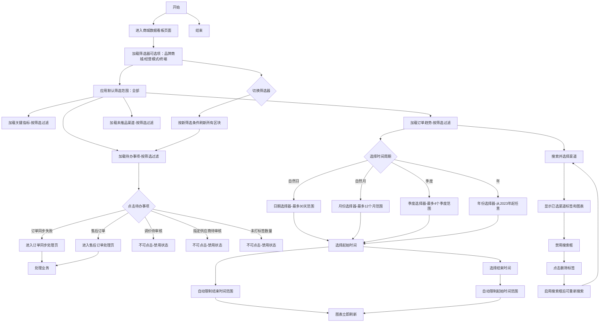
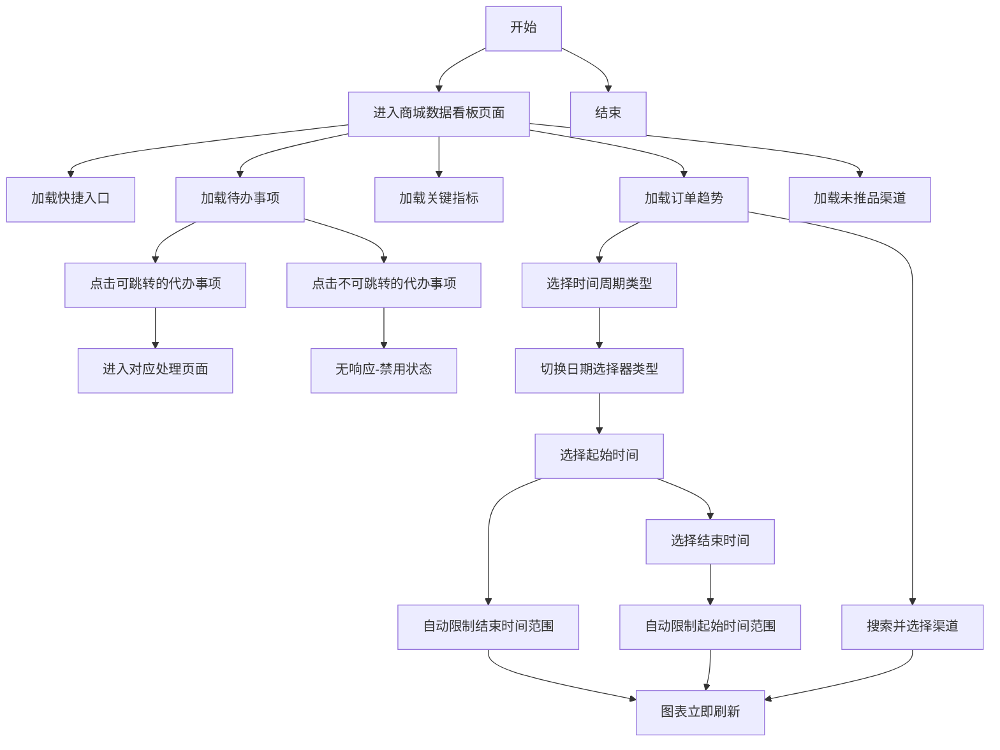
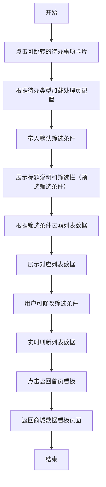
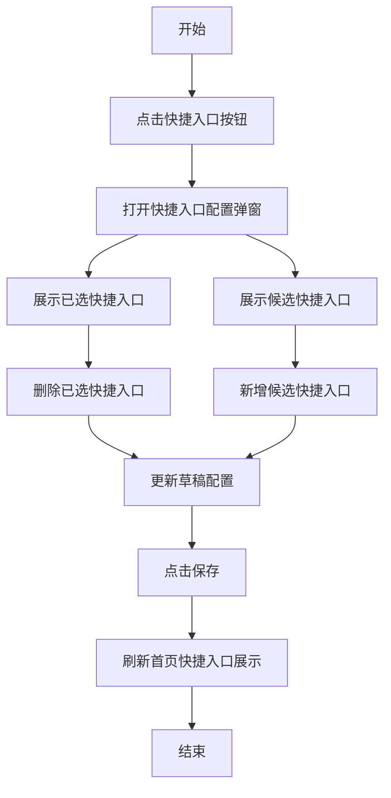

# 商城数据看板产品需求文档

# 1. 需求背景

商城运营人员需要通过数据看板实时了解店铺运营状况，包括待办事项、关键指标、订单趋势和渠道未推品情况，以便做出运营决策。

平台下存在多个独立的「品牌商城」经营主体，每个品牌商城在入驻审核环节由运营人员分别配置其开通的终端（小程序商城/PC端商城/H5商城三选一）和经营模式（直销/分销）。由于配置逐商城独立，各品牌商城的终端类型与经营模式各不相同，平台下不同终端、不同模式的品牌商城并存。

商城运营人员（代替品牌运营）需要从全局视角跨所有品牌商城查看运营数据，并能按「品牌商城」「经营模式」「终端」三个维度灵活筛选和下钻，以掌握不同品牌商城、不同模式、不同终端下的运营情况。

# 2. 需求分析

| 分析维度 | 说明 |
|----------|------|
| 目标用户 | 商城运营人员、运营主管 |
| 使用场景 | 日常运营监控、待办事项处理 |
| 业务视角 | 运营视角（代替品牌运营），跨所有品牌商城汇总查看 |
| 数据范围 | 全平台所有品牌商城；支持按品牌商城、经营模式、终端筛选与下钻 |
| 核心价值 | 集中展示待办事项和关键数据，快速处理业务 |

# 核心业务概念

| 概念 | 说明 |
|------|------|
| 品牌商城 | 平台下一个个独立的经营主体，本看板的数据基本单元，数量为多个 |
| 终端 | 品牌商城开通的客户端类型：小程序商城、PC端商城、H5商城；单个品牌商城仅开通其中一个终端（三选一互斥） |
| 经营模式 | 品牌商城的经营模式：直销、分销；单个品牌商城为单一模式（二选一） |
| 配置环节 | 品牌商城入驻审核时，由运营人员对每个品牌商城分别设定开通的终端与经营模式 |

> 筛选维度说明：本看板提供「品牌商城」「经营模式」「终端」三个筛选器，三者可组合使用。当筛选某个维度时，仅展示符合该维度条件的品牌商城及其数据；三个筛选器任一变化均联动刷新看板所有区块。具体筛选器可选项基于实际存在配置动态生成（例如终端筛选器仅展示平台下实际有品牌商城开通的终端类型）。

# 3. 系统流程图

# 4. 详细需求

## 4.1. 商城运营后台系统

### 4.1.1. 首页看板模块

#### 4.1.1.1. 商城数据看板页面

##### 1. 功能概述

- 功能描述：商城数据看板页面用于承载商城运营后台首页，集中展示快捷入口、待办事项、关键指标、订单趋势和未推品渠道，并提供「品牌商城」「经营模式」「终端」三个维度的筛选器，支持跨品牌商城汇总查看与下钻。
- 业务描述：运营人员进入系统后，可通过筛选器按品牌商城、经营模式、终端切换数据范围，优先查看需要处理的业务事项，再查看核心经营指标，通过订单趋势了解销售走势，最后查看未推品渠道情况。
- 使用角色：商城运营、平台运营主管。
- 触发条件：用户登录商城运营后台并进入首页。

##### 2. 界面设计

###### 2.1 页面原型

- 原型文件：[商城运营数据看板.html](/c:/Users/张蓉鑫/Desktop/test/商城运营数据看板.html)

###### 2.2 输出项说明

| 字段名称 | 字段标识 | 数据类型 | 数据来源 | 格式说明 |
|----------|----------|----------|----------|----------|
| 品牌商城筛选 | brand_mall_select | String | 用户选择 | 全部品牌商城/具体品牌商城 |
| 经营模式筛选 | business_mode | String | 用户选择 | 全部/直销/分销 |
| 终端筛选 | terminal_type | String | 用户选择 | 全部/小程序商城/PC端商城/H5商城（仅平台下实际有商城开通的终端类型） |
| 快捷入口名称 | shortcut_name | String | 快捷入口配置 | 文本 |
| 代办事项名称 | todo_name | String | 代办事项配置 | 文本 |
| 代办事项数量 | todo_count | Number | 业务模块聚合数据 | 整数 |
| 代办事项可用状态 | todo_enabled | Boolean | 页面配置 | 可点击/不可点击 |
| 指标名称 | metric_name | String | 页面固定配置 | 文本 |
| 指标值 | metric_value | String | 看板聚合数据 | 文本或金额 |
| 指标说明 | metric_desc | String | 看板聚合数据 | 文本 |
| 时间周期类型 | period_type | String | 用户选择 | 自然日/自然月/季度/年 |
| 渠道筛选 | channel_select | String | 用户选择 | 全部渠道/具体渠道 |
| 起始时间 | start_date | Date | 用户选择 | 日期/月份/季度/年 |
| 结束时间 | end_date | Date | 用户选择 | 日期/月份/季度/年 |
| 渠道名称 | channel_name | String | 渠道数据 | 文本 |
| 未推品天数 | no_product_days | Number | 渠道数据 | 整数 |

##### 3. 业务逻辑

###### 3.1 流程图

**商城数据看板浏览流程**

###### 3.2 业务规则

| 规则编号 | 规则名称 | 适用场景 | 规则描述 | 错误提示 |
|----------|----------|----------|----------|----------|
| rule_dashboard_001 | 首页默认展示规则 | 页面初始化 | 页面默认展示快捷入口、待办事项、关键指标、订单趋势和未推品渠道 | - |
| rule_dashboard_002 | 快捷入口默认值规则 | 快捷入口展示 | 默认展示待审核商品、商品发布、草稿箱三个快捷入口 | - |
| rule_dashboard_003 | 待办事项固定项规则 | 待办事项展示 | 待办事项固定展示订单同步失败、调价待审核、指定供应商待审核数量、未打标签数量、售后订单五项 | - |
| rule_dashboard_004 | 待办事项可用性规则 | 点击待办事项 | 订单同步失败、售后订单可点击跳转；调价待审核、指定供应商待审核数量、未打标签数量不可点击（禁用状态） | - |
| rule_dashboard_005 | 关键指标固定项规则 | 关键指标展示 | 关键指标固定展示支付订单数（当日）、产生订单金额（当日）、新上架商品数三项 | - |
| rule_dashboard_006 | 订单趋势周期规则 | 订单趋势时间选择 | 支持自然日、自然月、季度、年四种周期类型切换 | - |
| rule_dashboard_007 | 订单趋势日期联动规则-日 | 自然日日期选择 | 选择起始日期后，结束日期最多选择之后30天；选择结束日期后，起始日期最多选择之前30天；默认结束时间为昨天 | - |
| rule_dashboard_008 | 订单趋势日期联动规则-月 | 自然月日期选择 | 选择起始月份后，结束月份最多选择之后12个月；选择结束月份后，起始月份最多选择之前12个月；默认结束时间为当月（不包含当天数据） | - |
| rule_dashboard_009 | 订单趋势日期联动规则-季度 | 季度日期选择 | 选择起始季度后，结束季度最多选择之后4个季度；默认结束季度为当前季度（不包含当天数据） | - |
| rule_dashboard_010 | 订单趋势日期联动规则-年 | 年份日期选择 | 年份从2023年开始，可任意选择范围；默认结束年份为今年（不包含当天数据） | - |
| rule_dashboard_011 | 渠道模糊搜索规则 | 订单趋势渠道搜索 | 1. 渠道搜索框位于日期选择器之后；2. 支持输入关键词进行模糊搜索，匹配时显示下拉建议；3. 选中渠道后显示已选标签，并更新图表数据；4. 选中渠道后搜索框禁用，显示"请先删除已选渠道"提示；5. 点击标签×删除已选渠道后恢复搜索功能；6. 默认为空（显示全部渠道数据）；7. 图表下方显示渠道备注（全部渠道/具体渠道名） | - |
| rule_dashboard_012 | 快捷入口配置数量规则 | 配置快捷入口 | 快捷入口最多可保留4项 | 最多可添加4个快捷入口 |
| rule_dashboard_013 | 多维度筛选规则 | 看板全局筛选 | 看板顶部提供「品牌商城」「经营模式」「终端」三个筛选器，支持组合筛选；任一筛选器变化，看板内待办事项、关键指标、订单趋势、未推品渠道等所有区块联动刷新 | - |
| rule_dashboard_014 | 筛选可选项约束规则 | 筛选器可选项 | 各筛选器可选项基于实际存在配置动态生成：品牌商城列表仅展示已入驻商城；终端可选项仅展示平台下实际有品牌商城开通的终端类型；经营模式可选项仅展示实际存在的模式 | - |
| rule_dashboard_015 | 默认筛选范围规则 | 页面初始化 | 默认品牌商城=全部品牌商城、经营模式=全部、终端=全部，展示全平台汇总数据 | - |
| rule_dashboard_016 | 品牌商城下钻规则 | 品牌商城筛选 | 选中具体品牌商城后，看板仅展示该品牌商城的数据；终端筛选器锁定为该商城的唯一终端（不可再切换），经营模式筛选器锁定为该商城的经营模式 | - |

###### 3.3 状态机设计

页面为展示型页面，无独立业务状态机，仅存在初始化、加载、展示三种界面状态，不单独定义业务状态流转。

##### 4. 交互设计

###### 4.1 输入项说明

| 字段名称 | 字段标识 | 字段类型 | 必填 | 数据类型 | 长度限制 | 校验规则 | 取值范围 | 来源 | 提示文案 | 备注 |
|----------|----------|----------|------|----------|----------|----------|----------|------|----------|------|
| 品牌商城 | brand_mall_select | 下拉选择 | 否 | String | - | 可选项动态生成 | 全部品牌商城/具体品牌商城 | 用户选择 | 请选择品牌商城 | 位于看板顶部筛选区，默认为全部 |
| 经营模式 | business_mode | 下拉选择 | 否 | String | - | 仅支持固定选项 | 全部,直销,分销 | 用户选择 | 请选择经营模式 | 位于看板顶部筛选区，默认为全部 |
| 终端 | terminal_type | 下拉选择 | 否 | String | - | 可选项动态生成 | 全部,小程序商城,PC端商城,H5商城 | 用户选择 | 请选择终端 | 位于看板顶部筛选区，默认为全部；选中具体品牌商城后锁定为该商城唯一终端 |
| 时间周期类型 | period_type | 下拉选择 | 是 | String | - | 仅支持固定选项 | 自然日,自然月,季度,年 | 用户选择 | - | 默认为自然日 |
| 渠道搜索 | channel_search | 文本输入+下拉选择 | 否 | String | 20 | 选中后禁用，需删除标签恢复 | - | 用户输入 | 搜索渠道 | 位置在日期选择器后；默认为空（显示全部渠道）；选中渠道后禁用搜索框 |
| 起始时间 | start_date | 日期选择 | 是 | Date | - | 受结束时间和周期类型限制 | 动态计算 | 用户选择 | - | 根据周期类型变化 |
| 结束时间 | end_date | 日期选择 | 是 | Date | - | 受起始时间和周期类型限制 | 动态计算 | 用户选择 | - | 根据周期类型变化 |

###### 4.2 交互说明

1. 页面加载后默认显示首页看板内容，默认筛选范围为全部品牌商城、全部经营模式、全部终端。
2. 页面顶部显示刷新、消息、操作手册和头像入口。
3. 看板顶部筛选区提供「品牌商城」「经营模式」「终端」三个下拉筛选器，默认均为“全部”；任一筛选器变化，看板内待办事项、关键指标、订单趋势、未推品渠道等所有区块联动刷新；各筛选器可选项基于实际存在配置动态生成（仅展示实际存在的品牌商城、已开通的终端类型、已存在的经营模式）。
4. 选中具体品牌商城后，看板仅展示该品牌商城的数据，「终端」筛选器锁定为该商城的唯一终端、「经营模式」筛选器锁定为该商城的经营模式，均不可再切换。
5. 快捷入口区支持点击进入对应业务页面，支持删除单个快捷入口，并支持打开快捷入口配置弹窗。
6. 待办事项区位于快捷入口下方、关键指标上方。
7. 待办事项中”订单同步失败”和”售后订单”可点击跳转（跳转后处理页继承当前的品牌商城/模式/终端筛选条件）；”调价待审核”、”指定供应商待审核数量”、”未打标签数量”不可点击（显示禁用样式）。
8. 关键指标区固定展示3项核心指标，数值随当前筛选条件联动变化。
9. 订单趋势支持时间周期类型切换（自然日/自然月/季度/年），选择后日期选择器类型自动切换。
10. 订单趋势选择起始时间后自动限制结束时间范围，选择结束后图表立即刷新；选择结束时间后自动限制起始时间范围，图表立即刷新。
11. 订单趋势支持渠道搜索（位于日期选择器后），输入关键词显示下拉建议，点击选择渠道；选中渠道后显示已选标签，图表下方显示渠道备注；选中后搜索框禁用，需点击标签×删除后才能重新搜索；默认为空显示全部渠道数据。
12. 未推品渠道展示近7天未推送商品的渠道列表，列表随当前筛选条件联动变化。

###### 4.3 错误提示文案

**业务异常提示**

| 异常场景 | 错误码 | 提示文案 |
|----------|--------|----------|
| 看板数据加载失败 | dashboard_error_001 | 看板数据加载失败，请稍后重试 |
| 处理页面跳转失败 | dashboard_error_002 | 处理页面打开失败，请稍后重试 |
| 快捷入口保存失败 | dashboard_error_003 | 快捷入口保存失败，请稍后重试 |

##### 5. 数据设计

###### 5.1 数据流转说明

| 字段/数据 | 来源 | 获取方式 | 说明 |
|-----------|------|----------|------|
| 品牌商城终端与模式配置 | 品牌商城审核配置 | 页面初始化加载 | 记录每个品牌商城开通的终端（单终端）与经营模式，用于生成筛选器可选项 |
| 多维度筛选条件 | 用户选择 | 筛选器变化时获取 | 品牌商城、经营模式、终端的组合筛选条件，用于过滤所有看板区块数据 |
| 快捷入口配置 | 页面本地配置 | 初始化加载 | 用于首页快捷入口展示 |
| 待办事项配置 | 页面本地配置 | 初始化加载 | 用于首页待办事项展示（含可用状态），数据按筛选条件过滤 |
| 关键指标数据 | 看板聚合数据 | 页面初始化加载及筛选变化时刷新 | 用于首页核心指标展示，按筛选维度过滤 |
| 订单趋势数据 | 订单聚合数据 | 页面初始化和切换刷新 | 用于订单趋势图展示，按筛选维度过滤 |
| 未推品渠道数据 | 渠道数据 | 页面初始化加载及筛选变化时刷新 | 用于未推品渠道列表展示，按筛选维度过滤 |

###### 5.2 数据权限设计

| 角色 | 数据范围 | 说明 |
|------|----------|------|
| 商城运营 | 全平台品牌商城数据 | 可查看全部品牌商城的首页看板数据，支持按品牌商城/经营模式/终端筛选 |
| 平台运营主管 | 全平台品牌商城数据 | 可查看全部品牌商城的首页看板数据，支持按品牌商城/经营模式/终端筛选 |

#### 4.1.1.2. 待办事项处理页面

##### 1. 功能概述

- 功能描述：待办事项处理页面用于承接首页待办事项点击后的处理场景，展示筛选栏、列表和对应操作。
- 业务描述：不同待办事项进入不同处理页，但页面结构保持统一，标题、说明、状态选项和表格内容按事项类型切换。
- 使用角色：商城运营、客服、商品运营。
- 触发条件：用户点击首页可跳转的待办事项卡片（订单同步失败、售后订单）。

##### 2. 界面设计

###### 2.1 页面原型

- 原型文件：[商城运营数据看板.html](/c:/Users/张蓉鑫/Desktop/test/商城运营数据看板.html)

###### 2.2 输出项说明

| 字段名称 | 字段标识 | 数据类型 | 数据来源 | 格式说明 |
|----------|----------|----------|----------|----------|
| 页面标题 | task_page_title | String | 页面配置 | 文本 |
| 页面说明 | task_page_desc | String | 页面配置 | 文本 |
| 默认筛选条件 | task_default_filter | String | 待办事项跳转带入 | 文本 |
| 查询关键字 | task_filter_keyword | String | 用户输入 | 文本 |
| 状态选项 | task_filter_status | String | 页面配置 | 文本 |
| 列表表头 | task_table_headers | Array | 页面配置 | 字符串数组 |
| 列表数据 | task_table_rows | Array | 处理页数据（根据筛选条件过滤） | 二维数组 |

##### 3. 业务逻辑

###### 3.1 流程图

**待办事项处理流程**

###### 3.2 业务规则

| 规则编号 | 规则名称 | 适用场景 | 规则描述 | 错误提示 |
|----------|----------|----------|----------|----------|
| rule_task_001 | 处理页统一结构规则 | 打开处理页面 | 可跳转的待办事项均使用统一页面结构，通过配置切换标题、状态项和表格内容 | - |
| rule_task_002 | 待办类型映射规则 | 点击待办事项 | 订单同步失败、售后订单分别映射到对应处理页配置；其他三项无处理页 | 页面配置缺失，请稍后重试 |
| rule_task_003 | 返回首页规则 | 处理页面返回 | 点击返回首页看板后返回首页看板页面，并隐藏处理页标签 | - |
| rule_task_004 | 默认筛选条件规则 | 跳转处理页面 | 点击待办事项跳转时，自动带入选中的默认筛选条件：订单同步失败默认选中"同步失败"，售后订单默认选中"待审核" | - |

###### 3.3 状态机设计

页面为展示型列表页，无独立业务状态机，仅按待办类型切换展示内容。

##### 4. 交互设计

###### 4.1 输入项说明

| 字段名称 | 字段标识 | 字段类型 | 必填 | 数据类型 | 长度限制 | 校验规则 | 取值范围 | 来源 | 提示文案 | 备注 |
|----------|----------|----------|------|----------|----------|----------|----------|------|----------|------|
| 查询关键字 | task_filter_keyword | 文本输入 | 否 | String | 50 | 无 | - | 用户输入 | 请输入关键字 | 按页面类型变化占位文案 |
| 状态筛选 | task_filter_status | 下拉选择 | 否 | String | - | 仅支持页面内预设选项 | 页面配置项 | 用户选择 | - | 按页面类型变化，默认值由待办事项决定 |

###### 4.2 交互说明

1. 点击可跳转的待办事项卡片后切换到处理页面。
2. 跳转时自动带入默认筛选条件：
   - 订单同步失败 -> 状态筛选默认选中"同步失败"
   - 售后订单 -> 状态筛选默认选中"待审核"
3. 处理页面顶部显示标题、说明和返回首页看板按钮。
4. 页面展示查询关键字输入框和状态筛选框（已预选默认筛选条件）。
5. 页面表格表头与行数据随待办事项类型变化，列表数据根据默认筛选条件进行过滤。
6. 用户可手动修改筛选条件，列表数据实时更新。
7. 点击返回首页看板后回到首页。

###### 4.3 错误提示文案

**业务异常提示**

| 异常场景 | 错误码 | 提示文案 |
|----------|--------|----------|
| 处理页配置不存在 | task_error_001 | 当前处理页配置不存在 |
| 处理页数据加载失败 | task_error_002 | 处理页数据加载失败，请稍后重试 |

##### 5. 数据设计

###### 5.1 数据流转说明

| 字段/数据 | 来源 | 获取方式 | 说明 |
|-----------|------|----------|------|
| 待办处理页配置 | 页面本地配置 | 点击待办事项后读取 | 控制标题、说明、筛选项和表头 |
| 待办处理默认筛选条件 | 待办事项配置 | 点击待办事项时带入 | 用于跳转后自动选中筛选条件 |
| 待办处理列表数据 | 处理页数据集 | 点击待办事项后加载（根据默认筛选条件过滤） | 展示对应事项的待处理记录 |

###### 5.2 数据权限设计

| 角色 | 数据范围 | 说明 |
|------|----------|------|
| 商品运营 | 订单同步失败 | 查看订单同步处理页 |
| 客服 | 售后相关待办 | 查看售后订单处理页 |
| 商城运营 | 全部可跳转待办 | 查看全部可跳转处理页 |

#### 4.1.1.3. 快捷入口配置弹窗

##### 1. 功能概述

- 功能描述：快捷入口配置弹窗用于维护首页快捷入口展示内容。
- 业务描述：用户可在弹窗中查看已选快捷入口、删除已选项、从候选列表中补充快捷入口，并保存配置。
- 使用角色：商城运营、平台运营主管。
- 触发条件：用户点击首页快捷入口区的”快捷入口”按钮。

##### 2. 界面设计

###### 2.1 页面原型

- 原型文件：[商城运营数据看板.html](/c:/Users/张蓉鑫/Desktop/test/商城运营数据看板.html)

###### 2.2 输出项说明

| 字段名称 | 字段标识 | 数据类型 | 数据来源 | 格式说明 |
|----------|----------|----------|----------|----------|
| 已选快捷入口 | selected_shortcut_keys | Array | 当前快捷入口配置 | key 数组 |
| 候选快捷入口 | shortcut_options | Array | 页面配置 | 对象数组 |
| 快捷入口键值 | shortcut_key | String | 页面配置 | 文本 |
| 快捷入口名称 | shortcut_label | String | 页面配置 | 文本 |

##### 3. 业务逻辑

###### 3.1 流程图

**快捷入口配置流程**

###### 3.2 业务规则

| 规则编号 | 规则名称 | 适用场景 | 规则描述 | 错误提示 |
|----------|----------|----------|----------|----------|
| rule_shortcut_001 | 快捷入口上限规则 | 配置快捷入口 | 已选快捷入口最多4项 | 最多可添加4个快捷入口 |
| rule_shortcut_002 | 快捷入口去重规则 | 配置快捷入口 | 已选快捷入口不可重复添加 | 该快捷入口已存在 |
| rule_shortcut_003 | 保存生效规则 | 保存快捷入口 | 点击保存后，草稿配置覆盖当前配置，并立即刷新首页展示 | 快捷入口保存失败，请稍后重试 |

###### 3.3 状态机设计

弹窗为短流程配置场景，无独立业务状态机。

##### 4. 交互设计

###### 4.1 输入项说明

| 字段名称 | 字段标识 | 字段类型 | 必填 | 数据类型 | 长度限制 | 校验规则 | 取值范围 | 来源 | 提示文案 | 备注 |
|----------|----------|----------|------|----------|----------|----------|----------|------|----------|------|
| 快捷入口选择项 | shortcut_key | 点击选择 | 否 | String | - | 不可重复，不可超过4项 | 预设快捷入口键值 | 用户点击 | - | 候选项 |

###### 4.2 交互说明

1. 用户点击快捷入口按钮后打开配置弹窗。
2. 弹窗顶部显示已选快捷入口标签，并支持删除。
3. 弹窗下方展示候选快捷入口列表，未选项可点击添加。
4. 达到4项后不可继续添加新项。
5. 点击保存后刷新首页快捷入口区。

###### 4.3 错误提示文案

**业务异常提示**

| 异常场景 | 错误码 | 提示文案 |
|----------|--------|----------|
| 保存失败 | shortcut_error_001 | 快捷入口保存失败，请稍后重试 |

##### 5. 数据设计

###### 5.1 数据流转说明

| 字段/数据 | 来源 | 获取方式 | 说明 |
|-----------|------|----------|------|
| 快捷入口候选项 | 页面本地配置 | 弹窗打开时读取 | 展示所有可选快捷入口 |
| 快捷入口草稿配置 | 用户临时操作 | 弹窗内增删更新 | 用于保存前预览 |
| 快捷入口当前配置 | 页面本地状态 | 点击保存后写入 | 用于首页快捷入口展示 |

###### 5.2 数据权限设计

| 角色 | 数据范围 | 说明 |
|------|----------|------|
| 商城运营 | 首页快捷入口配置 | 可调整首页快捷入口展示 |
| 平台运营主管 | 首页快捷入口配置 | 可调整首页快捷入口展示 |

---

