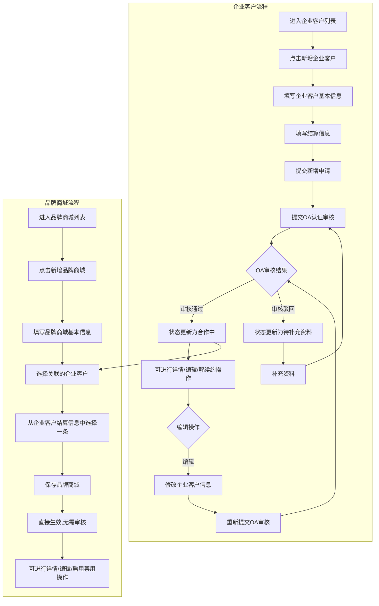
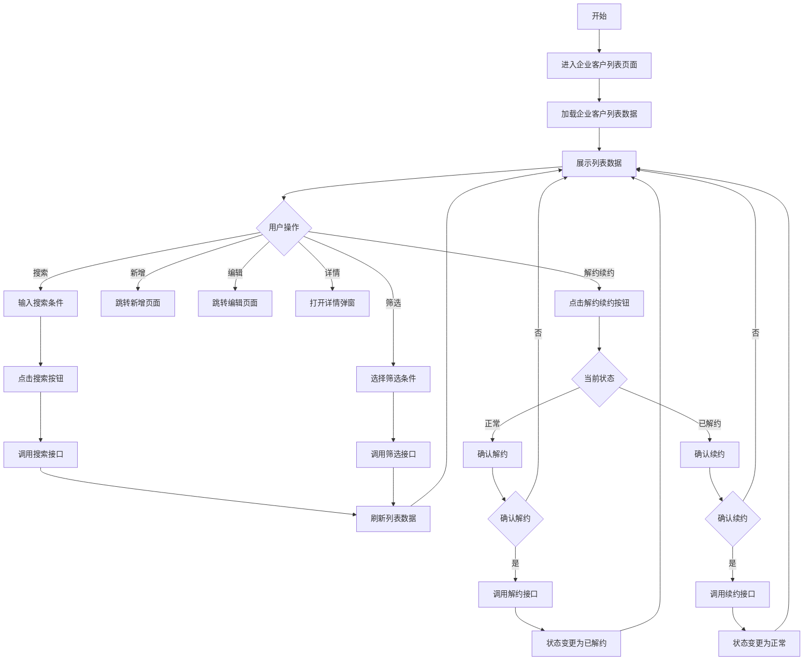
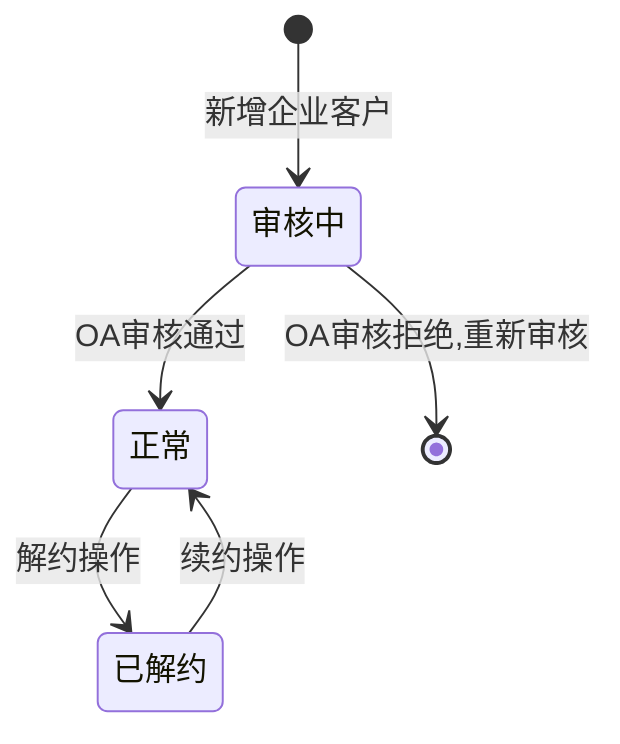
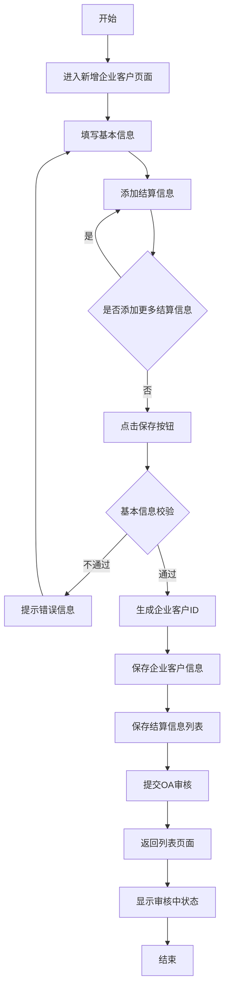
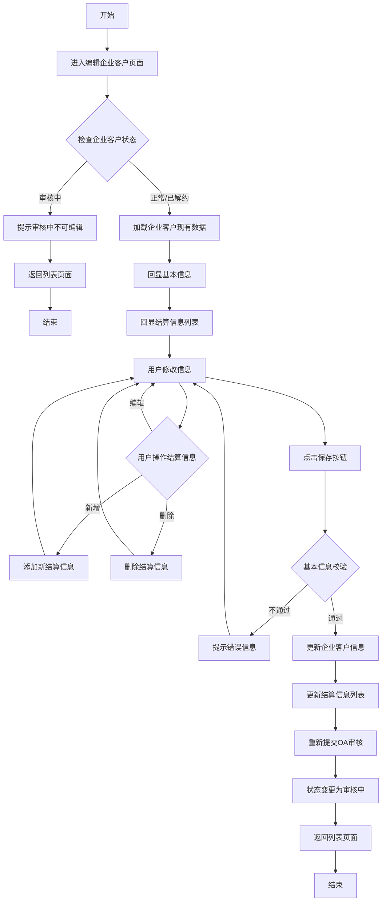
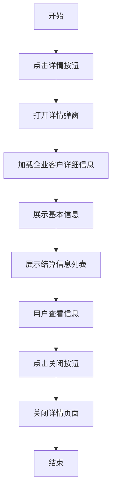
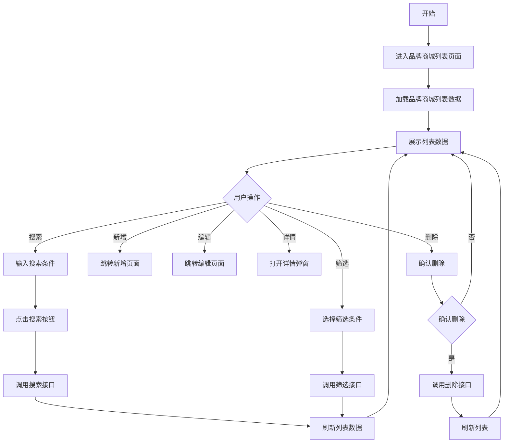
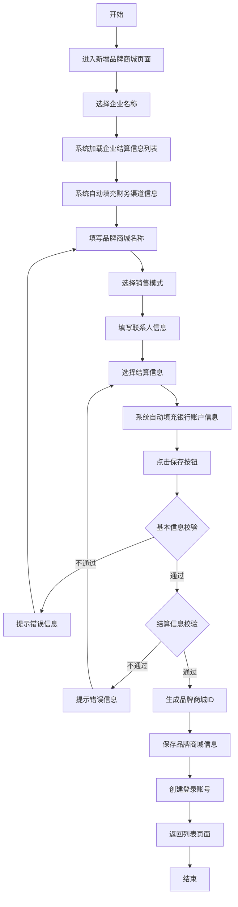
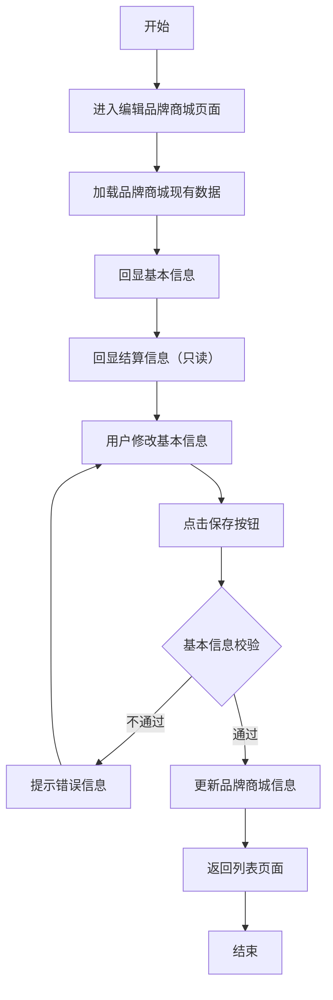
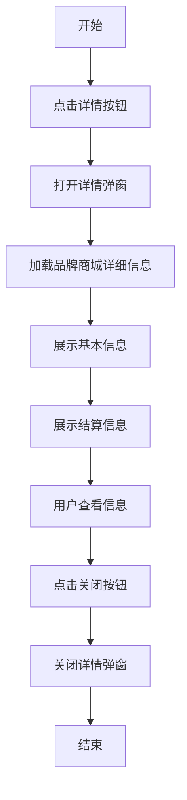

# 自研商城商城管理系统产品需求文档

# 业务流程概述

## 整体业务流程

本系统包含两个核心业务模块：企业客户管理和品牌商城管理，两者的业务流程如下：

## 业务流程说明

### 1. 企业客户业务流程

1. **新建企业客户**
   - 运营人员在企业客户列表页面点击"新增企业客户"
   - 填写企业客户基本信息（企业名称、企业简称、负责人姓名、负责人手机、对接业务员等）
   - 填写结算信息（可添加多条，财务渠道名称和财务渠道编码为非必填项）
   - 提交新增申请，系统自动提交OA认证审核

2. **OA认证审核**
   - 新增的企业客户状态为"入驻中"（橙色标签）
   - OA审核通过后，企业客户状态更新为"合作中"（绿色标签）
   - OA审核驳回后，企业客户状态更新为"待补充资料"（红色标签），需补充资料后重新提交审核
   - 企业客户状态说明：
     - **入驻中**（橙色标签）：表示企业客户正在审核中，尚未完成认证
     - **合作中**（绿色标签）：表示企业客户已完成认证，处于正常合作状态
     - **待补充资料**（红色标签）：表示OA审核驳回，需要补充相关资料后重新提交审核
     - **已解约**（灰色标签）：表示企业客户已终止合作

3. **企业客户管理**
   - 状态为"合作中"的企业客户可进行以下操作：
     - 查看详情：查看企业客户完整信息
     - 编辑：修改企业客户信息，**每次编辑都需要重新提交OA审核**
     - 解约：将企业客户状态变更为"已解约"，**同时自动禁用该企业客户关联的所有品牌商城**
     - 续约：将"已解约"状态的企业客户恢复为"合作中"，**同时自动启用该企业客户关联的所有品牌商城**
     - 开通商城数量统计：显示该企业客户关联的品牌商城数量和列表
   - 状态为"待补充资料"的企业客户可进行以下操作：
     - 查看详情：查看企业客户完整信息
     - 编辑：补充资料并重新提交OA审核
     - 开通商城数量统计：不显示商城数量统计（因为审核驳回状态下不允许创建品牌商城）
   - 状态为"入驻中"的企业客户可进行以下操作：
     - 查看详情：查看企业客户完整信息
     - 开通商城数量统计：不显示商城数量统计（因为审核中状态下不允许创建品牌商城）

### 2. 品牌商城业务流程

1. **新建品牌商城**
   - 运营人员在品牌商城列表页面点击"新增品牌商城"
   - 填写品牌商城基本信息
   - **品牌商城名称全平台唯一**，不可重复
   - 选择品牌商城关联的企业客户（下拉选择，**只能选择"合作中"状态的企业客户**）
   - 根据所选企业客户的结算信息列表，选择一条结算信息作为品牌商城的结算信息
   - 保存品牌商城，**新增的品牌商城不需要通过审核，直接生效**
   - 新增的品牌商城默认状态为"启用"

2. **品牌商城管理**
   - 品牌商城创建后可直接使用
   - 品牌商城状态说明：
     - **启用**（绿色标签）：品牌商城正常运营状态
     - **禁用**（灰色标签）：品牌商城暂停运营状态
   - 可进行查看详情、编辑、启用/禁用操作
   - 编辑时可切换关联企业客户的其他结算信息
   - 启用/禁用功能说明：
     - **启用**：将禁用状态的品牌商城恢复为启用状态，品牌商城可正常运营
     - **禁用**：将启用状态的品牌商城设置为禁用状态，品牌商城无法正常运营
     - 启用/禁用操作为人工手动执行，与企业客户解约/续约的联动禁用/启用不同

## 关联关系说明

- 品牌商城必须关联一个企业客户
- 品牌商城的结算信息来源于关联的企业客户的结算信息列表
- 企业客户解约后，不可再新增关联该企业客户的品牌商城
- 企业客户处于"待补充资料"状态时，不可被选择关联品牌商城
- **只有"合作中"状态的企业客户才能被选择关联品牌商城**

### 企业客户状态联动规则

**重要业务规则**：企业客户的解约/续约操作会联动影响关联的品牌商城状态

1. **解约联动规则**
   - 当企业客户执行"解约"操作时，系统会自动将该企业客户关联的所有品牌商城状态设置为"禁用"
   - 禁用的品牌商城无法正常运营，需等待企业客户续约后方可恢复
   - 联动禁用操作为系统自动执行，无需人工干预

2. **续约联动规则**
   - 当"已解约"状态的企业客户执行"续约"操作时，系统会自动将该企业客户关联的所有品牌商城状态恢复为"启用"
   - 恢复启用的品牌商城可正常运营
   - 联动启用操作为系统自动执行，无需人工干预

3. **联动范围**
   - 联动规则仅影响与该企业客户直接关联的品牌商城
   - 不影响其他企业客户关联的品牌商城
   - 联动操作即时生效，状态变更立即反映在品牌商城列表中

4. **解约状态下的品牌商城操作限制**
   - 当企业客户处于"已解约"状态时，在品牌商城列表中，关联该企业客户的品牌商城的"启用"按钮会被隐藏
   - 只有当企业客户续约恢复为"合作中"状态后，关联的品牌商城的"启用"按钮才会重新显示
   - 此限制是为了防止运营人员手动启用已解约企业客户关联的品牌商城，确保业务逻辑的一致性
   - **注意**：虽然"启用"按钮被隐藏，但"禁用"按钮仍然显示，运营人员仍可以手动禁用这些品牌商城

---

# 1. 详细需求

将品牌商城列表拆分为企业客户列表与品牌商城列表，所属菜单为渠道管理。

## 1.1. 自研商城商城管理系统

### 1.1.1. 企业客户管理模块

#### 1.1.1.1. 企业客户列表页面

##### 1. 功能概述

- **功能描述**：展示企业客户列表，支持搜索、筛选、查看详情、新增、编辑、解约续约等操作
- **业务描述**：运营人员可以查看和管理所有企业客户信息，包括基本信息和结算信息
- **使用角色**：运营人员、管理员
- **触发条件**：用户点击左侧菜单"企业客户管理"进入列表页面

##### 2. 界面设计

###### 2.1 输出项说明

| 字段名称  | 数据类型     |
| ----- | -------- |
| 企业名称  | String   |
| 企业简称  | String   |
| 负责人姓名 | String   |
| 负责人手机 | String   |
| 对接业务员 | String   |
| 状态    | String   |
| 创建时间  | DateTime |

##### 3. 业务逻辑

###### 3.1 流程图

**企业客户列表查询流程**

###### 3.2 业务规则

| 规则编号        | 规则名称   | 适用场景   | 规则描述                    | 错误提示              |
| ----------- | ------ | ------ | ----------------------- | ----------------- |
| RULE-EC-001 | 搜索条件限制 | 搜索企业客户 | 企业名称支持模糊搜索，负责人手机支持精确搜索  | -                 |
| RULE-EC-002 | 解约权限限制 | 解约企业客户 | 只有管理员角色可以解约企业客户         | 无权限解约企业客户         |
| RULE-EC-003 | 解约关联检查 | 解约企业客户 | 解约前检查是否关联品牌商城，有关联则不允许解约 | 该企业客户已关联品牌商城，无法解约 |
| RULE-EC-004 | 续约权限限制 | 续约企业客户 | 只有管理员角色可以续约企业客户         | 无权限续约企业客户         |
| RULE-EC-005 | 续约状态检查 | 续约企业客户 | 只有已解约状态的企业客户才能续约        | 该企业客户未解约，无法续约     |

###### 3.3 状态机设计

**企业客户状态流转**

仅企业客户需要审核，创建品牌商城不需要审核

**状态说明**：

- **审核中**：企业客户新增后等待OA审核，不可进行编辑、解约等操作
- **正常**：企业客户正常运营状态，可进行编辑、查看详情等操作
- **已解约**：企业客户已解约状态，不可新增品牌商城，可进行续约操作

##### 4. 交互设计

###### 4.1 输入项说明

| 字段名称  | 字段类型 | 必填 | 数据类型   | 取值范围          | 提示文案    | 备注     |
| ----- | ---- | -- | ------ | ------------- | ------- | ------ |
| 企业名称  | 输入框  | 否  | String | -             | 请输入企业名称 | 支持模糊搜索 |
| 负责人手机 | 输入框  | 否  | String | -             | 请输入手机号  | 精确搜索   |
| 对接业务员 | 下拉框  | 否  | String | 业务员列表         | 全部      | 筛选条件   |
| 合作状态  | 下拉框  | 否  | String | 全部、审核中、正常、已解约 | 全部      | 筛选条件   |

###### 4.2 交互说明

1. 用户进入企业客户列表页面，系统自动加载所有企业客户数据
2. 用户可在搜索栏输入企业名称或负责人手机进行搜索
3. 用户可通过筛选条件筛选对接业务员和合作状态
4. 用户点击"新增企业客户"按钮跳转新增页面
5. 用户点击列表中的"编辑"按钮跳转编辑页面（审核中状态不可编辑）
6. 用户点击列表中的"详情"按钮打开详情弹窗
7. 用户点击列表中的"解约续约"按钮：
   - 当前状态为"审核中"时，按钮不可点击
   - 当前状态为"正常"时，弹出解约确认框，确认后状态变更为"已解约"
   - 当前状态为"已解约"时，弹出续约确认框，确认后状态变更为"正常"

###### 4.3 错误提示文案

**业务异常提示**

| 错误码    | 提示文案          |
| ------ | ------------- |
| EC-001 | 无权限解约企业客户     |
| EC-002 | 无权限续约企业客户     |
| EC-003 | 该企业客户未解约，无法续约 |
| EC-004 | 该企业客户审核中，无法编辑 |

##### 5. 数据设计

###### 5.1 数据流转说明

| 字段/数据  | 获取方式 | 说明          |
| ------ | ---- | ----------- |
| 企业客户列表 | 查询接口 | 包含基本信息和统计信息 |
| 业务员列表  | 下拉接口 | 获取所有业务员姓名   |

###### 5.2 数据权限设计

- **角色数据范围**：运营人员、管理员可查看所有企业客户
- **功能权限点**：
  - 查看企业客户列表：所有角色
  - 新增企业客户：运营人员、管理员
  - 编辑企业客户：运营人员、管理员（审核中状态不可编辑）
  - 解约企业客户：运营人员、管理员（审核中状态不可解约）
  - 续约企业客户：运营人员、管理员（审核中状态不可续约）

##### 6. 扩展功能

###### 6.1 批量操作规则

无批量操作

###### 6.2 操作日志要求

| 操作类型   | 记录内容                 |
| ------ | -------------------- |
| 新增企业客户 | 企业客户ID、新增时间、操作人、基本信息 |
| 解约企业客户 | 企业客户ID、解约时间、操作人      |
| 续约企业客户 | 企业客户ID、续约时间、操作人      |

***

#### 1.1.1.2. 新增企业客户页面

##### 1. 功能概述

- **功能描述**：创建新的企业客户信息，包括基本信息和结算信息
- **业务描述**：运营人员录入企业客户的基本信息和多条结算信息，结算信息中的财务渠道名称和财务渠道编码为非必填项
- **使用角色**：运营人员、管理员
- **触发条件**：用户在企业客户列表页面点击"新增企业客户"按钮

##### 2. 界面设计

###### 2.1 输出项说明

无输出项（新增页面为表单输入）

##### 3. 业务逻辑

###### 3.1 流程图

**新增企业客户流程**

###### 3.2 业务规则

| 规则编号            | 规则名称    | 适用场景   | 规则描述                      | 错误提示        |
| --------------- | ------- | ------ | ------------------------- | ----------- |
| RULE-EC-ADD-001 | 企业名称必填  | 新增企业客户 | 企业名称为必填项                  | 请输入企业名称     |
| RULE-EC-ADD-002 | 企业简称必填  | 新增企业客户 | 企业简称为必填项                  | 请输入企业简称     |
| RULE-EC-ADD-003 | 负责人姓名必填 | 新增企业客户 | 负责人姓名为必填项                 | 请输入负责人姓名    |
| RULE-EC-ADD-004 | 负责人手机必填 | 新增企业客户 | 负责人手机为必填项                 | 请输入负责人手机    |
| RULE-EC-ADD-005 | 负责人手机格式 | 新增企业客户 | 负责人手机必须为11位数字             | 请输入正确的手机号格式 |
| RULE-EC-ADD-006 | 对接业务员必填 | 新增企业客户 | 对接业务员为必填项                 | 请选择对接业务员    |
| RULE-EC-ADD-007 | OA审核流程  | 新增企业客户 | 新增企业客户后自动提交OA审核流程         | -           |
| RULE-EC-ADD-008 | 审核状态显示  | 新增企业客户 | 在列表页面显示审核中状态，审核通过后状态变更为正常 | -           |

###### 3.3 状态机设计

无状态流转

##### 4. 交互设计

###### 4.1 输入项说明

**基本信息**

| 字段名称  | 字段类型 | 必填 | 数据类型   | 校验规则  | 取值范围  | 提示文案     | 备注        |
| ----- | ---- | -- | ------ | ----- | ----- | -------- | --------- |
| 企业名称  | 输入框  | 是  | String | 非空    | -     | 请输入企业名称  | 去重        |
| 企业简称  | 输入框  | 是  | String | 非空    | -     | 请输入企业简称  | 去重        |
| 负责人姓名 | 输入框  | 是  | String | 非空    | -     | 请输入负责人姓名 | -         |
| 负责人手机 | 输入框  | 是  | String | 手机号格式 | -     | 请输入负责人手机 | 在企业客户列表去重 |
| 对接业务员 | 下拉框  | 是  | String | 非空    | 业务员列表 | 请选择对接业务员 | -         |

**结算信息选填（可添加多条）**

| 字段名称   | 字段类型 | 必填 | 数据类型   | 校验规则 | 取值范围 | 提示文案                  | 备注          |
| ------ | ---- | -- | ------ | ---- | ---- | --------------------- | ----------- |
| 财务渠道名称 | 输入框  | 否  | String | -    | -    | 请输入财务渠道名称             | 非必填，在OA流里必填 |
| 财务渠道编码 | 输入框  | 否  | String | -    | -    | 请输入财务渠道编码             | 非必填，在OA流里必填 |
| 开户银行   | 输入框  | 是  | String | 非空   | -    | 请输入开户银行               | -           |
| 银行账号   | 输入框  | 是  | String | 非空   | -    | 请输入银行账号               | -           |
| 开户支行名称 | 输入框  | 是  | String | 非空   | -    | 请输入开户支行名称             | -           |
| 开户地址   | 输入框  | 否  | String | 非空   | -    | 请输入开户地址（省/市/区 + 详细地址） | -           |

###### 4.2 交互说明

1. 用户进入新增企业客户页面，填写基本信息
2. 用户点击"添加结算信息"按钮，系统添加一条结算信息表单
3. 用户填写结算信息，财务渠道名称和财务渠道编码为非必填项
4. 用户可添加多条结算信息，每条结算信息独立填写
5. 用户点击"提交认证"按钮，系统校验基本信息
6. 校验通过后，系统保存企业客户信息和结算信息
7. 系统自动提交OA审核流程
8. 系统返回列表页面，显示"入驻中"状态

###### 4.3 错误提示文案

**表单校验提示**

| 校验项       | 提示文案        |
| --------- | ----------- |
| 企业名称为空    | 请输入企业名称     |
| 企业简称为空    | 请输入企业简称     |
| 负责人姓名为空   | 请输入负责人姓名    |
| 负责人手机为空   | 请输入负责人手机    |
| 负责人手机格式错误 | 请输入正确的手机号格式 |
| 对接业务员为空   | 请选择对接业务员    |

**业务异常提示**

无业务异常提示

##### 5. 数据设计

###### 5.1 数据流转说明

| 字段/数据  | 获取方式 | 说明           |
| ------ | ---- | ------------ |
| 业务员列表  | 下拉接口 | 获取所有业务员姓名    |
| 企业客户ID | 自动生成 | 保存时生成唯一ID    |
| 结算信息ID | 自动生成 | 每条结算信息生成唯一ID |

###### 5.2 数据权限设计

- **角色数据范围**：运营人员和管理员可新增企业客户
- **功能权限点**：
  - 新增企业客户：运营人员、管理员

##### 6. 扩展功能

###### 6.1 批量操作规则

无批量操作

###### 6.2 操作日志要求

| 操作类型   | 记录内容                 |
| ------ | -------------------- |
| 新增企业客户 | 企业客户ID、新增时间、操作人、基本信息 |

***

#### 1.1.1.3. 编辑企业客户页面

##### 1. 功能概述

- **功能描述**：修改企业客户信息，包括基本信息和结算信息（审核中状态不可编辑）
- **业务描述**：运营人员修改企业客户的基本信息和结算信息，可新增、编辑、删除结算信息，审核中状态的企业客户不可编辑
- **使用角色**：运营人员、管理员
- **触发条件**：用户在企业客户列表页面点击"编辑"按钮

##### 2. 界面设计

###### 2.1 输出项说明

无输出项（编辑页面为表单输入）

##### 3. 业务逻辑

###### 3.1 流程图

**编辑企业客户流程**

**注意：每次编辑企业客户信息后，都需要重新提交OA审核，审核通过后才能恢复正常状态。**

###### 3.2 业务规则

| 规则编号             | 规则名称    | 适用场景   | 规则描述           | 错误提示          |
| ---------------- | ------- | ------ | -------------- | ------------- |
| RULE-EC-EDIT-001 | 企业名称必填  | 编辑企业客户 | 企业名称为必填项       | 请输入企业名称       |
| RULE-EC-EDIT-002 | 企业简称必填  | 编辑企业客户 | 企业简称为必填项       | 请输入企业简称       |
| RULE-EC-EDIT-003 | 负责人姓名必填 | 编辑企业客户 | 负责人姓名为必填项      | 请输入负责人姓名      |
| RULE-EC-EDIT-004 | 负责人手机必填 | 编辑企业客户 | 负责人手机为必填项      | 请输入负责人手机      |
| RULE-EC-EDIT-005 | 负责人手机格式 | 编辑企业客户 | 负责人手机必须为11位数字  | 请输入正确的手机号格式   |
| RULE-EC-EDIT-006 | 对接业务员必填 | 编辑企业客户 | 对接业务员为必填项      | 请选择对接业务员      |
| RULE-EC-EDIT-007 | 审核中状态限制 | 编辑企业客户 | 审核中状态的企业客户不可编辑 | 该企业客户审核中，无法编辑 |
| RULE-EC-EDIT-008 | 编辑后重新审核 | 编辑企业客户 | 每次编辑企业客户信息后，都需要重新提交OA审核，状态变更为审核中 | -             |

###### 3.3 状态机设计

无状态流转

##### 4. 交互设计

###### 4.1 输入项说明

同新增企业客户页面

###### 4.2 交互说明

1. 用户进入编辑企业客户页面，系统检查企业客户状态
2. 如果企业客户状态为"审核中"，系统提示"审核中不可编辑"，返回列表页面
3. 系统回显基本信息和结算信息列表
4. 用户修改基本信息
5. 用户可新增、编辑、删除结算信息
6. 用户点击"提交认证"按钮，系统校验基本信息
7. 校验通过后，系统更新企业客户信息和结算信息（尤其是财务结算编码和财务结算名称），返回列表页面

###### 4.3 错误提示文案

同新增企业客户页面

##### 5. 数据设计

###### 5.1 数据流转说明

| 字段/数据    | 获取方式 | 说明         |
| -------- | ---- | ---------- |
| 企业客户现有数据 | 查询接口 | 根据企业客户ID加载 |
| 业务员列表    | 下拉接口 | 获取所有业务员姓名  |

###### 5.2 数据权限设计

- **角色数据范围**：运营人员和管理员可编辑企业客户
- **功能权限点**：
  - 编辑企业客户：运营人员、管理员

##### 6. 扩展功能

###### 6.1 批量操作规则

无批量操作

###### 6.2 操作日志要求

| 操作类型   | 记录内容                 | 保留时长 |
| ------ | -------------------- | ---- |
| 编辑企业客户 | 企业客户ID、编辑时间、操作人、修改内容 | 永久   |

***

#### 1.1.1.4. 详情企业客户页面

##### 1. 功能概述

- **功能描述**：查看企业客户详细信息，包括基本信息和结算信息列表
- **业务描述**：运营人员查看企业客户的完整信息，包括所有结算信息
- **使用角色**：运营人员、管理员
- **触发条件**：用户在企业客户列表页面点击"详情"按钮

##### 2. 界面设计

###### 2.1 输出项说明

**基本信息**

| 字段名称  | 数据类型     |
| ----- | -------- |
| 企业名称  | String   |
| 企业简称  | String   |
| 负责人姓名 | String   |
| 负责人手机 | String   |
| 对接业务员 | String   |
| 备注    | String   |
| 创建时间  | DateTime |

**法人认证信息**

| 字段名称   | 数据类型   | 显示规则                   |
| ------ | ------ | ---------------------- |
| 法人证件照片 | Image  | 如果没有法人认证信息，整个法人认证板块不显示 |
| 法人姓名   | String | 如果没有法人认证信息，整个法人认证板块不显示 |
| 法人身份证号 | String | 如果没有法人认证信息，整个法人认证板块不显示 |
| 法人手机号  | String | 如果没有法人认证信息，整个法人认证板块不显示 |
| 法人任职单位 | String | 如果没有法人认证信息，整个法人认证板块不显示 |

**结算信息列表**

| 字段名称   | 数据类型   |
| ------ | ------ |
| 财务渠道名称 | String |
| 财务渠道编码 | String |
| 开户银行   | String |
| 银行账号   | String |
| 开户支行名称 | String |
| 开户地址   | String |

##### 3. 业务逻辑

###### 3.1 流程图

**查看企业客户详情流程**

###### 3.2 业务规则

1. **法人认证信息显示规则**
   - 如果企业客户没有法人认证信息（法人姓名、法人身份证号、法人手机号、法人任职单位等字段均为空），则整个法人认证板块不显示
   - 只有当企业客户存在法人认证信息时，才显示法人认证板块
   - 法人证件照片的显示规则：
     - 如果有法人认证信息，则显示证件正面和证件反面的图片预览框
     - 如果没有法人证件照片数据，则显示占位符（证件正面、证件反面）
     - 如果有法人证件照片数据，则显示实际的图片预览

2. **结算信息显示规则**
   - 结算信息列表始终显示，即使没有结算信息也显示空列表状态

###### 3.3 状态机设计

无状态流转

##### 4. 交互设计

###### 4.1 输入项说明

无输入项（详情页面为信息展示）

###### 4.2 交互说明

1. 用户在企业客户列表页面点击"详情"按钮
2. 系统打开详情弹窗，加载企业客户详细信息
3. 系统展示基本信息和结算信息列表
4. 用户查看信息，可点击"编辑"按钮跳转编辑页面
5. 用户点击"关闭"按钮关闭详情页面

###### 4.3 错误提示文案

无错误提示

##### 5. 数据设计

###### 5.1 数据流转说明

| 字段/数据    | 获取方式 | 说明               |
| -------- | ---- | ---------------- |
| 企业客户详细信息 | 查询接口 | 根据企业客户ID加载       |
| 结算信息列表   | 查询接口 | 根据企业客户ID加载所有结算信息 |

###### 5.2 数据权限设计

- **角色数据范围**：运营人员和管理员可查看所有企业客户详情
- **功能权限点**：
  - 查看企业客户详情：运营人员、管理员

##### 6. 扩展功能

###### 6.1 批量操作规则

无批量操作

###### 6.2 操作日志要求

| 操作类型 | 记录内容            |
| ---- | --------------- |
| 查看详情 | 企业客户ID、查看时间、操作人 |

***

### 1.1.2. 品牌商城管理模块

#### 1.1.2.1. 品牌商城列表页面

##### 1. 功能概述

- **功能描述**：展示品牌商城列表，支持搜索、筛选、查看详情、新增、编辑、删除等操作
- **业务描述**：运营人员可以查看和管理所有品牌商城信息，品牌商城与企业客户关联，结算信息来源于企业客户。联系人手机号为该品牌商城的登录手机号。
- **使用角色**：运营人员、管理员
- **触发条件**：用户点击左侧菜单"品牌商城管理"进入列表页面

##### 2. 界面设计

###### 2.1 输出项说明

| 字段名称   | 数据类型     |
| ------ | -------- |
| 企业名称   | String   |
| 品牌商城名称 | String   |
| 销售模式   | String   |
| 联系人姓名  | String   |
| 联系人手机号 | String   |
| 创建时间   | DateTime |

##### 3. 业务逻辑

###### 3.1 流程图

**品牌商城列表查询流程**

###### 3.2 业务规则

| 规则编号          | 规则名称   | 适用场景   | 规则描述                     | 错误提示 |
| ------------- | ------ | ------ | ------------------------ | ---- |
| RULE-MALL-001 | 搜索条件限制 | 搜索品牌商城 | 品牌商城名称支持模糊搜索，联系人手机支持精确搜索 | -    |

###### 3.3 状态机设计

无状态流转

##### 4. 交互设计

###### 4.1 输入项说明

| 字段名称   | 字段类型 | 必填 | 数据类型   | 校验规则  | 取值范围               | 提示文案      | 备注     |
| ------ | ---- | -- | ------ | ----- | ------------------ | --------- | ------ |
| 品牌商城名称 | 输入框  | 否  | String | -     | -                  | 请输入品牌商城名称 | 支持模糊搜索 |
| 联系人手机号 | 输入框  | 否  | String | 手机号格式 | -                  | 请输入联系人手机号 | 精确搜索   |
| 销售模式   | 下拉框  | 否  | String | -     | 小程序/PC商城/H5/线下/API | 全部        | 筛选条件   |

###### 4.2 交互说明

1. 用户进入品牌商城列表页面，系统自动加载所有品牌商城数据
2. 用户可在搜索栏输入品牌商城名称或联系人手机号进行搜索
3. 用户可通过筛选条件筛选销售模式
4. 用户点击"新增品牌商城"按钮跳转新增页面
5. 用户点击列表中的"编辑"按钮跳转编辑页面
6. 用户点击列表中的"详情"按钮打开详情弹窗

 

##### 5. 数据设计

###### 5.1 数据流转说明

| 字段/数据  | 获取方式 | 说明             |
| ------ | ---- | -------------- |
| 品牌商城列表 | 查询接口 | 包含基本信息和关联的企业名称 |
| 企业名称   | 关联查询 | 通过企业客户ID关联获取   |

###### 5.2 数据权限设计

- **角色数据范围**：运营人员可查看所有品牌商城，管理员可查看和删除所有品牌商城
- **功能权限点**：
  - 查看品牌商城列表：所有角色
  - 新增品牌商城：运营人员、管理员
  - 编辑品牌商城：运营人员、管理员
  - 删除品牌商城：管理员

##### 6. 扩展功能

###### 6.1 批量操作规则

无批量操作

###### 6.2 操作日志要求

| 操作类型   | 记录内容            |
| ------ | --------------- |
| 查看详情   | 品牌商城ID、查看时间     |
| 删除品牌商城 | 品牌商城ID、删除时间、操作人 |

***

#### 1.1.2.2. 新增品牌商城页面

##### 1. 功能概述

- **功能描述**：创建新的品牌商城信息，基本信息和结算信息来源于企业客户
- **业务描述**：运营人员选择企业客户后，系统自动加载该企业的结算信息，联系人手机号作为登录账号，初始密码为12345678
- **使用角色**：运营人员、管理员
- **触发条件**：用户在品牌商城列表页面点击"新增品牌商城"按钮

##### 2. 界面设计

###### 2.1 输出项说明

无输出项（新增页面为表单输入）

##### 3. 业务逻辑

###### 3.1 流程图

**新增品牌商城流程**

**企业名称选择流程**

###### 3.2 业务规则

| 规则编号              | 规则名称     | 适用场景   | 规则描述                   | 错误提示               |
| ----------------- | -------- | ------ | ---------------------- | ------------------ |
| RULE-MALL-ADD-001 | 企业名称必填   | 新增品牌商城 | 企业名称为必填项               | 请选择企业名称            |
| RULE-MALL-ADD-002 | 品牌商城名称必填 | 新增品牌商城 | 品牌商城名称为必填项             | 请输入品牌商城名称          |
| RULE-MALL-ADD-003 | 销售模式必填   | 新增品牌商城 | 销售模式为必填项               | 请选择销售模式            |
| RULE-MALL-ADD-004 | 联系人姓名必填  | 新增品牌商城 | 联系人姓名为必填项              | 请输入联系人姓名           |
| RULE-MALL-ADD-005 | 联系人手机号必填 | 新增品牌商城 | 联系人手机号为必填项             | 请输入联系人手机号          |
| RULE-MALL-ADD-006 | 联系人手机号格式 | 新增品牌商城 | 联系人手机号必须为11位数字         | 请输入正确的手机号格式        |
| RULE-MALL-ADD-007 | 结算信息必填   | 新增品牌商城 | 结算信息为必填项               | 请选择结算信息            |
| RULE-MALL-ADD-008 | 企业无结算信息  | 新增品牌商城 | 选择的企业客户必须有结算信息才能创建品牌商城 | 该企业暂无结算信息，无法创建品牌商城 |
| RULE-MALL-ADD-009 | 品牌商城名称唯一 | 新增品牌商城 | 品牌商城名称全平台唯一，不可重复       | 该品牌商城名称已存在，请重新输入   |
| RULE-MALL-ADD-010 | 无需审核     | 新增品牌商城 | 新增的品牌商城不需要通过审核，直接生效    | -                  |

###### 3.3 状态机设计

无状态流转

##### 4. 交互设计

###### 4.1 输入项说明

**基本信息**

| 字段名称   | 字段类型 | 必填 | 数据类型   | 长度限制 | 校验规则  | 取值范围               | 提示文案      | 备注                  |
| ------ | ---- | -- | ------ | ---- | ----- | ------------------ | --------- | ------------------- |
| 企业名称   | 下拉框  | 是  | String | -    | 非空    | 企业客户列表             | 请选择企业名称   | 选择后自动加载结算信息         |
| 品牌商城名称 | 输入框  | 是  | String | 100  | 非空    | -                  | 请输入品牌商城名称 | -                   |
| 销售模式   | 多选框  | 是  | String | -    | 非空    | 小程序/PC商城/H5/线下/API | 请选择销售模式   | 可多选                 |
| 联系人姓名  | 输入框  | 是  | String | 50   | 非空    | -                  | 请输入联系人姓名  | -                   |
| 联系人手机号 | 输入框  | 是  | String | 11   | 手机号格式 | -                  | 请输入联系人手机号 | 作为登录账号，初始密码12345678 |

**结算信息**

| 字段名称   | 字段类型 | 必填 | 数据类型   | 长度限制 | 校验规则 | 取值范围     | 提示文案     | 备注           |
| ------ | ---- | -- | ------ | ---- | ---- | -------- | -------- | ------------ |
| 选择结算信息 | 下拉框  | 是  | String | -    | 非空   | 企业结算信息列表 | 请先选择企业名称 | 选择企业后自动加载    |
| 财务渠道名称 | 输入框  | 否  | String | 100  | -    | -        | 自动填充     | 只读，来源于企业客户   |
| 财务渠道编码 | 输入框  | 否  | String | 50   | -    | -        | 自动填充     | 只读，来源于企业客户   |
| 开户银行   | 输入框  | 否  | String | 100  | -    | -        | 自动填充     | 只读，来源于企业结算信息 |
| 银行账号   | 输入框  | 否  | String | 19   | -    | -        | 自动填充     | 只读，来源于企业结算信息 |
| 开户支行名称 | 输入框  | 否  | String | 100  | -    | -        | 自动填充     | 只读，来源于企业结算信息 |
| 开户地址   | 输入框  | 否  | String | 200  | -    | -        | 自动填充     | 只读，来源于企业结算信息 |

###### 4.2 交互说明

1. 用户进入新增品牌商城页面
2. 用户选择企业名称，系统自动加载该企业的结算信息列表
3. 系统自动填充财务渠道名称和财务渠道编码（来源于企业客户）
4. 用户填写品牌商城名称
5. 用户选择销售模式（可多选）
6. 用户填写联系人姓名和联系人手机号
7. 用户选择结算信息，系统自动填充银行账户信息
8. 用户点击"保存"按钮，系统校验所有信息
9. 校验通过后，系统保存品牌商城信息，创建登录账号，返回列表页面

###### 4.3 错误提示文案

**表单校验提示**

| 校验项        | 提示文案        |
| ---------- | ----------- |
| 企业名称为空     | 请选择企业名称     |
| 品牌商城名称为空   | 请输入品牌商城名称   |
| 销售模式为空     | 请选择销售模式     |
| 联系人姓名为空    | 请输入联系人姓名    |
| 联系人手机号为空   | 请输入联系人手机号   |
| 联系人手机号格式错误 | 请输入正确的手机号格式 |
| 结算信息为空     | 请选择结算信息     |

**业务异常提示**

| 错误码          | 提示文案               |
| ------------ | ------------------ |
| MALL-ADD-001 | 该企业暂无结算信息，无法创建品牌商城 |

##### 5. 数据设计

###### 5.1 数据流转说明

| 字段/数据    | 获取方式 | 说明                        |
| -------- | ---- | ------------------------- |
| 企业客户列表   | 下拉接口 | 获取所有企业客户名称                |
| 企业结算信息列表 | 查询接口 | 根据企业客户ID加载结算信息            |
| 财务渠道名称   | 自动填充 | 选择企业后自动填充                 |
| 财务渠道编码   | 自动填充 | 选择企业后自动填充                 |
| 银行账户信息   | 自动填充 | 选择结算信息后自动填充               |
| 品牌商城ID   | 自动生成 | 保存时生成唯一ID                 |
| 登录账号     | 自动创建 | 使用联系人手机号创建账号，初始密码12345678 |

###### 5.2 数据权限设计

- **角色数据范围**：运营人员和管理员可新增品牌商城
- **功能权限点**：
  - 新增品牌商城：运营人员、管理员

##### 6. 扩展功能

###### 6.1 扩展功能

无批量操作

###### 6.2 操作日志要求

| 操作类型   | 记录内容                 |
| ------ | -------------------- |
| 新增品牌商城 | 品牌商城ID、新增时间、操作人、基本信息 |

***

#### 1.1.2.3. 编辑品牌商城页面

##### 1. 功能概述

- **功能描述**：修改品牌商城信息，包括基本信息，结算信息为只读展示
- **业务描述**：运营人员修改品牌商城的基本信息，结算信息来源于企业客户，不可编辑
- **使用角色**：运营人员、管理员
- **触发条件**：用户在品牌商城列表页面点击"编辑"按钮

##### 2. 界面设计

###### 2.1 输出项说明

无输出项（编辑页面为表单输入）

##### 3. 业务逻辑

###### 3.1 流程图

**编辑品牌商城流程**

###### 3.2 业务规则

| 规则编号               | 规则名称     | 适用场景   | 规则描述           | 错误提示        |
| ------------------ | -------- | ------ | -------------- | ----------- |
| RULE-MALL-EDIT-001 | 品牌商城名称必填 | 编辑品牌商城 | 品牌商城名称为必填项     | 请输入品牌商城名称   |
| RULE-MALL-EDIT-002 | 销售模式必填   | 编辑品牌商城 | 销售模式为必填项       | 请选择销售模式     |
| RULE-MALL-EDIT-003 | 联系人姓名必填  | 编辑品牌商城 | 联系人姓名为必填项      | 请输入联系人姓名    |
| RULE-MALL-EDIT-004 | 联系人手机号必填 | 编辑品牌商城 | 联系人手机号为必填项     | 请输入联系人手机号   |
| RULE-MALL-EDIT-005 | 联系人手机号格式 | 编辑品牌商城 | 联系人手机号必须为11位数字 | 请输入正确的手机号格式 |

###### 3.3 状态机设计

无状态流转

##### 4. 交互设计

###### 4.1 输入项说明

**基本信息**

| 字段名称   | 字段类型 | 必填 | 数据类型   | 校验规则  | 取值范围               | 提示文案      | 备注      |
| ------ | ---- | -- | ------ | ----- | ------------------ | --------- | ------- |
| 企业名称   | 文本展示 | -  | String | -     | -                  | -         | 只读，不可修改 |
| 品牌商城名称 | 输入框  | 是  | String | 非空    | -                  | 请输入品牌商城名称 | -       |
| 销售模式   | 多选框  | 是  | String | 非空    | 小程序/PC商城/H5/线下/API | 请选择销售模式   | 可多选     |
| 联系人姓名  | 输入框  | 是  | String | 非空    | -                  | 请输入联系人姓名  | -       |
| 联系人手机号 | 输入框  | 是  | String | 手机号格式 | -                  | 请输入联系人手机号 | 作为登录账号  |

**结算信息（只读）**

| 字段名称   | 字段类型 | 必填 | 数据类型   | 校验规则 | 取值范围 | 提示文案 | 备注 |
| ------ | ---- | -- | ------ | ---- | ---- | ---- | -- |
| 财务渠道名称 | 文本展示 | -  | String | -    | -    | -    | 只读 |
| 财务渠道编码 | 文本展示 | -  | String | -    | -    | -    | 只读 |
| 开户银行   | 文本展示 | -  | String | -    | -    | -    | 只读 |
| 银行账号   | 文本展示 | -  | String | -    | -    | -    | 只读 |
| 开户支行名称 | 文本展示 | -  | String | -    | -    | -    | 只读 |
| 开户地址   | 文本展示 | -  | String | -    | -    | -    | 只读 |

###### 4.2 交互说明

1. 用户进入编辑品牌商城页面，系统加载现有品牌商城数据
2. 系统回显基本信息和结算信息（结算信息为只读）
3. 用户修改基本信息（企业名称不可修改）
4. 用户点击"保存"按钮，系统校验所有信息
5. 校验通过后，系统更新品牌商城信息，返回列表页面

###### 4.3 错误提示文案

**表单校验提示**

| 校验项        | 提示文案        |
| ---------- | ----------- |
| 品牌商城名称为空   | 请输入品牌商城名称   |
| 销售模式为空     | 请选择销售模式     |
| 联系人姓名为空    | 请输入联系人姓名    |
| 联系人手机号为空   | 请输入联系人手机号   |
| 联系人手机号格式错误 | 请输入正确的手机号格式 |

**业务异常提示**

无业务异常提示

##### 5. 数据设计

###### 5.1 数据流转说明

| 字段/数据    | 获取方式 | 说明           |
| -------- | ---- | ------------ |
| 品牌商城现有数据 | 查询接口 | 根据品牌商城ID加载   |
| 企业名称     | 关联查询 | 通过企业客户ID关联获取 |
| 结算信息     | 关联查询 | 通过结算信息ID关联获取 |

###### 5.2 数据权限设计

- **角色数据范围**：运营人员和管理员可编辑品牌商城
- **功能权限点**：
  - 编辑品牌商城：运营人员、管理员

##### 6. 扩展功能

###### 6.1 批量操作规则

无批量操作

###### 6.2 操作日志要求

| 操作类型   | 记录内容                 |
| ------ | -------------------- |
| 编辑品牌商城 | 品牌商城ID、编辑时间、操作人、修改内容 |

***

#### 1.1.2.4. 详情品牌商城页面

##### 1. 功能概述

- **功能描述**：查看品牌商城详细信息，包括基本信息和结算信息
- **业务描述**：运营人员查看品牌商城的完整信息，包括关联的企业信息和结算信息
- **使用角色**：运营人员、管理员
- **触发条件**：用户在品牌商城列表页面点击"详情"按钮

##### 2. 界面设计

###### 2.1 输出项说明

**基本信息**

| 字段名称   | 数据类型     |
| ------ | -------- |
| 企业名称   | String   |
| 品牌商城名称 | String   |
| 销售模式   | String   |
| 联系人姓名  | String   |
| 联系人手机号 | String   |
| 创建时间   | DateTime |

**结算信息**

| 字段名称   | 数据类型   |
| ------ | ------ |
| 财务渠道名称 | String |
| 财务渠道编码 | String |
| 开户银行   | String |
| 银行账号   | String |
| 开户支行名称 | String |
| 开户地址   | String |

##### 3. 业务逻辑

###### 3.1 流程图

**查看品牌商城详情流程**

###### 3.2 业务规则

无业务规则（详情页面为展示信息）

###### 3.3 状态机设计

无状态流转

##### 4. 交互设计

###### 4.1 输入项说明

无输入项（详情页面为信息展示）

###### 4.2 交互说明

1. 用户在品牌商城列表页面点击"详情"按钮
2. 系统打开详情弹窗，加载品牌商城详细信息
3. 系统展示基本信息和结算信息
4. 用户查看信息，可点击"编辑"按钮跳转编辑页面
5. 用户点击"关闭"按钮关闭详情弹窗

###### 4.3 错误提示文案

无错误提示

##### 5. 数据设计

###### 5.1 数据流转说明

| 字段/数据    | 获取方式 | 说明           |
| -------- | ---- | ------------ |
| 品牌商城详细信息 | 查询接口 | 根据品牌商城ID加载   |
| 企业名称     | 关联查询 | 通过企业客户ID关联获取 |
| 结算信息     | 关联查询 | 通过结算信息ID关联获取 |

###### 5.2 数据权限设计

- **角色数据范围**：运营人员和管理员可查看所有品牌商城详情
- **功能权限点**：
  - 查看品牌商城详情：运营人员、管理员

##### 6. 扩展功能

###### 6.1 批量操作规则

无批量操作

###### 6.2 操作日志要求

| 操作类型 | 记录内容            |
| ---- | --------------- |
| 查看详情 | 品牌商城ID、查看时间、操作人 |

***

# 2. 附录

## 2.1. 术语表

| 术语   | 说明                               |
| ---- | -------------------------------- |
| 企业客户 | 使用商城系统的企业主体，可创建多个品牌商城            |
| 品牌商城 | 企业客户下的具体商城实例，对应一个登录账号            |
| 结算信息 | 企业客户的银行账户信息，用于财务结算               |
| 财务渠道 | 企业客户的财务核算渠道，包括名称和编码              |
| 销售模式 | 品牌商城的销售渠道类型，包括小程序、PC商城、H5、线下、API |
| 负责人  | 企业客户的负责人，负责对接业务                  |
| 联系人  | 品牌商城的联系人，手机号作为登录账号               |

## 2.2. 相关文档

| 文档名称     | 文档路径           |
| -------- | -------------- |
| 功能大纲     | 功能大纲.md        |
| 企业客户列表原型 | 企业客户列表.htm     |
| 新增企业客户原型 | 新增企业客户.htm     |
| 编辑企业客户原型 | 编辑企业客户.htm     |
| 详情企业客户原型 | 详情企业客户.htm     |
| 品牌商城列表原型 | 品牌商城列表-简化版.htm |
| 新增品牌商城原型 | 新增品牌商城.htm     |
| 编辑品牌商城原型 | 编辑品牌商城.htm     |
| 详情品牌商城原型 | 详情品牌商城.htm     |

***

# 3. 版本记录

| 版本号  | 修改日期       | 修改人  | 修改内容                            |
| ---- | ---------- | ---- | ------------------------------- |
| V1.0 | 2026-06-15 | 产品经理 | 初稿创建，包含企业客户管理模块和品牌商城管理模块的完整需求文档 |

