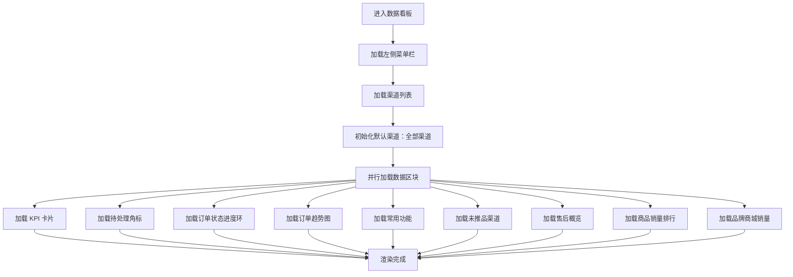
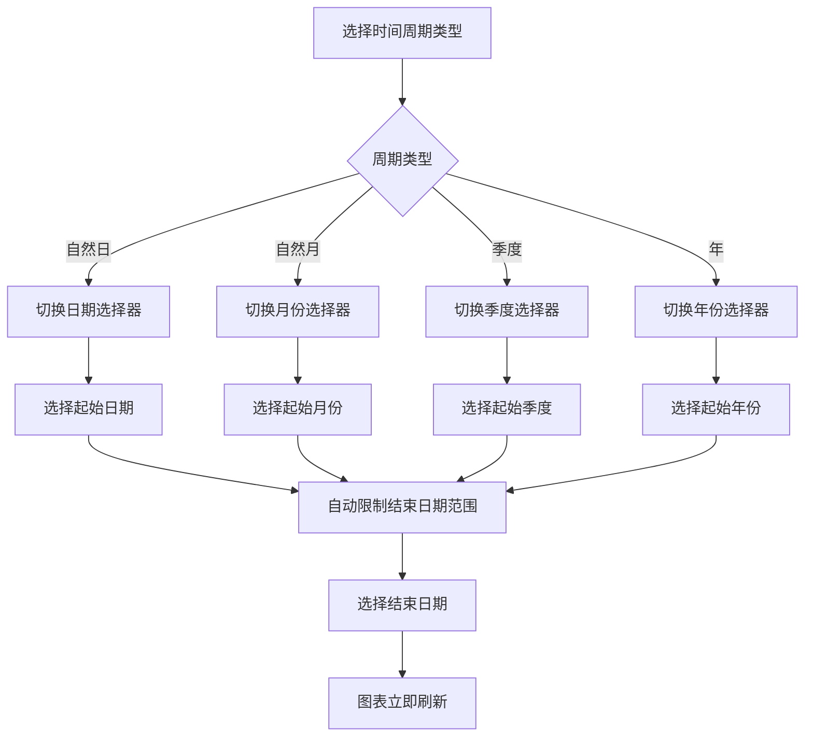
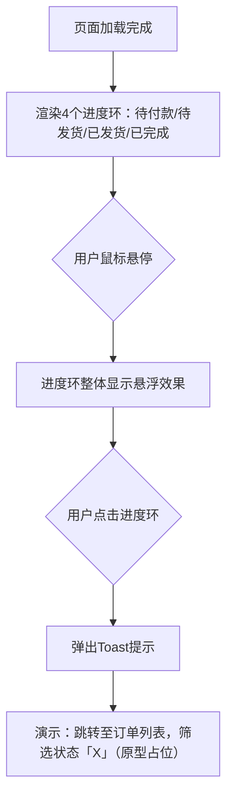

# 商城数据看板 - PRD V3.0

> 版本：V3.0 | 最后更新：2026-07-17

---

## 一、版本概述

V3.0 是商城数据看板的迭代版本，基于 V2.0 重设计方案进行细节优化。核心变更包括：KPI 卡片从"日环比"改为"昨日"口径并补充昨日数据，新上架商品数改为"7日内累计上架"；商品销量排行的模糊搜索从"搜索商品"改为"搜索渠道"以联动渠道数据视角；订单状态进度环新增点击跳转交互；常用功能配置弹窗重设计为左侧分类导航+右侧卡片网格布局；售后概览三大指标补充昨日趋势数据。所有金额单位统一为元（¥），使用千位分隔符格式化。

### 1.1 页面清单

本次PRD覆盖以下页面：

| 页面 | 文件路径 | 层级 |
|------|----------|------|
| 商城运营数据看板 | 商城运营数据看板-重设计版.html | 一级（侧边栏"数据看板"） |

共 1 个页面。

### 1.2 核心功能

V3.0 在 V2.0 基础上进行了 5 处关键变更：① KPI 卡片子文案从"日环比 +X%"改为显示昨日具体数值（支付订单数/订单金额），新上架商品数改为"7日内累计上架"且无趋势箭头；② 售后概览三个指标下方补充昨日趋势数据（昨日 XX单、昨日 X%、昨日 XX元）；③ 订单状态进度环四组环形图整体可点击，点击后弹出 Toast 提示跳转至对应状态的订单列表；④ 商品销量排行搜索从"搜索商品名称/编号"改为"搜索渠道"，选中渠道后联动刷新商品排行数据；⑤ 常用功能配置弹窗从 chip 标签式改为左侧分类导航+右侧 3 列卡片网格，卡片默认去边框，选中态仅靠图标变色和底色表达，弹窗顶部新增使用说明文案。

### 1.3 数据来源说明

| 数据类型 | 来源 | 说明 |
|----------|------|------|
| KPI 指标数据 | 看板聚合数据 | 支付订单数、订单金额、新上架商品数，按渠道筛选联动 |
| 昨日趋势数据 | 看板聚合数据 | 昨日支付订单数、昨日订单金额、昨日售后数据，用于 KPI 和售后概览对比 |
| 待处理选品数 | 选品系统 | 当前待处理的选品数量，按渠道筛选联动 |
| 待处理售后数 | 售后系统 | 当前待处理的售后订单数量，按渠道筛选联动 |
| 订单状态数据 | 订单系统 | 待付款/待发货/已发货/已完成四个状态的订单数量 |
| 订单趋势数据 | 订单聚合数据 | 按时间范围和渠道筛选的每日订单数、订单金额 |
| 售后数据 | 售后系统 | 售后总单数、售后率、售后总金额、售后原因分布 |
| 未推品渠道数据 | 渠道系统 | 各渠道最后推品时间，筛选大于14天未推品的渠道 |
| 商品销量排行 | 商品销售数据 | 按销量降序排列，支持 Top10 和类目排行两种视图，支持按渠道搜索过滤 |
| 品牌商城销量 | 订单聚合数据 | 各品牌商城按销售额降序排列，按渠道筛选联动 |
| 常用功能配置 | 页面本地存储 | 用户自定义的常用功能快捷入口，9 个候选项分 4 个分类 |

### 1.4 统计口径

| 指标 | 计算方式 | 示例 |
|------|----------|------|
| 订单统计范围 | 用户下单即计入统计，不限制订单状态（含待付款、待发货、已发货、已完成、已取消、已关闭等所有状态） | — |
| 售后统计范围 | 用户发起售后申请即计入统计，不限制售后状态（含待审核、处理中、已完成、已拒绝、已撤销等所有状态） | — |
| 支付订单数（当日） | 当日所有已支付订单总数 | 1,286 |
| 产生订单金额（当日） | 当日所有已支付订单金额合计 | ¥128,000 |
| 新上架商品数 | 7日内累计新上架的商品 SKU 总数 | 256 |
| 昨日支付订单数 | 昨日支付订单数 = 当日值 ÷ (1 + 日环比)，用于 KPI 子文案 | 1,150单 |
| 昨日订单金额 | 昨日订单金额 = 当日值 ÷ (1 + 日环比)，用于 KPI 子文案 | ¥115,000 |
| 订单状态占比 | 当前状态订单数 ÷ 全部订单总数（含已取消/已关闭等其他状态）× 100%，四舍五入取整 | 20% |
| 未推品天数 | 当前日期 - 最后推品日期 | 15天 |
| 售后率（历史累计口径） | 累计售后单数 ÷ 累计订单总数 × 100%，长期趋稳，用于质量监控 | 4.2% |
| 金额格式化 | 万元值 × 10000 后取整，使用千位分隔符 | ¥128,000 |

### 1.5 示例账号

本原型为静态演示页面，无需真实账号。所有数据均为硬编码的模拟数据，通过渠道搜索和时间周期切换可观察数据联动变化。

---

## 二、数据看板模块

数据看板模块是商城运营后台的核心入口页面，集中展示运营关键指标、订单走势、售后概览、品牌商城销量、订单状态和渠道状态，帮助运营人员快速掌握全局运营状况。

### 2.0 模块级定义

**左侧菜单栏结构：**

| 一级菜单 | 二级菜单 | 说明 |
|----------|----------|------|
| 首页 | — | 系统首页入口 |
| 数据看板 | — | 当前页面 |
| 选品管理 | 供应链商品池、选品清单、待处理选品、渠道商品管理 | 选品全流程管理 |
| 运营配置 | 前台分类管理、商品标签管理、商品品牌列表 | 运营基础配置 |
| 商城装修 | 模板管理、素材库 | 商城页面装修 |
| 活动卡卷 | 电影卡次、卡卷配置 | 营销活动与卡卷 |
| 积分管理 | 积分卡批次列表、积分卡明细列表、积分兑换比例、积分调整比例、积分调整记录、用户积分明细 | 积分体系管理 |
| 订单与售后 | 订单列表、售后监控、售后配置 | 订单与售后处理 |
| 渠道管理 | 品牌商城列表、企业客户列表、品牌商城列表-new | 渠道与客户管理 |

**全局说明：** 数据看板页面默认展示全平台汇总数据（全部渠道）。通过页面顶部的渠道模糊搜索可切换至单个渠道视角，切换后所有数据区块（KPI 卡片、订单状态进度环、订单趋势图、售后概览、品牌商城销量、近期未推品渠道、商品销量排行）联动刷新。商品销量排行模块拥有独立的渠道搜索，仅影响排行展示，不联动其他区块。

### 2.1 商城运营数据看板（商城运营数据看板-重设计版.html）

#### 2.1.1 功能概述

商城运营数据看板是运营人员登录后台后的核心工作台页面，集中展示平台运营关键指标和待处理事项。页面顶部显示个性化欢迎语及日期，右侧展示待处理选品（蓝色）和待处理售后（红色）两个角标，点击可跳转至对应处理页面。通过 3 个核心 KPI 卡片快速了解当日经营状况，其中支付订单数和订单金额显示昨日对比数据，新上架商品数显示 7 日内累计上架数量。左侧区域从上到下依次为订单趋势图、商品销量排行和售后概览，右侧区域提供常用功能快捷入口、品牌商城销量、订单状态进度环和近期未推品渠道提醒。运营人员可通过渠道模糊搜索切换数据视角，大部分数据区块联动刷新；商品销量排行拥有独立的渠道搜索，可按品牌商城筛选排行数据。

#### 2.1.2 页面结构

页面采用左侧菜单栏 + 右侧内容区的经典后台管理布局。内容区从上到下分为：顶部导航栏、欢迎语区（含待办角标）、KPI 卡片行、中部双栏布局（左侧图表区 + 右侧操作区）。

| 区域 | 位置 | 说明 |
|------|------|------|
| 顶部导航栏 | 内容区顶部 | 系统 Logo、刷新按钮、消息入口、用户头像 |
| 欢迎语区 | 顶部导航栏下方 | 显示"欢迎回来，李运营"及当前日期；右侧展示待处理选品角标（蓝色）和待处理售后角标（红色），角标显示待处理数量，可点击跳转 |
| KPI 卡片行 | 欢迎语下方 | 3 个 KPI 卡片（支付订单数、订单金额、新上架商品数），左侧圆形图标+色条装饰，含趋势箭头（前两个）和昨日对比/7日累计文字 |
| 订单趋势图 | 左侧上方 | SVG 折线图+柱状图组合，双线展示支付订单数和订单金额，顶部含渠道模糊搜索和周期切换（自然日/自然月/季度/年） |
| 商品销量排行 | 左侧中部 | 表格，支持 Top10 和类目排行两种视图切换，含独立的渠道搜索下拉框（位于视图切换按钮左侧）和下载按钮 |
| 售后概览 | 左侧下方 | 售后总单数/售后率/售后总金额三个 KPI（含昨日趋势数据）+ 售后原因分布条形图 |
| 常用功能 | 右侧上方 | 最多 6 个快捷功能入口（圆形图标+文字，3列×2行），右上角加号按钮点击打开配置弹窗 |
| 品牌商城销量 | 右侧中上部 | 表格，各品牌商城按销售额降序排列，随渠道筛选联动 |
| 订单状态进度环 | 右侧中下部 | 2×2 网格，4 个 SVG 环形进度条（待付款/待发货/已发货/已完成），整环可点击，点击弹出跳转提示 |
| 近期未推品渠道 | 右侧下方 | 表格，展示大于 14 天未推品的渠道，按未推品天数降序，最多 5 条 |

#### 2.1.3 操作流程

**页面初始化加载流程：**



**渠道模糊搜索联动流程：**

```mermaid
flowchart TD
    A[点击渠道搜索输入框] --> B[全选当前文本]
    B --> C[显示下拉面板：全部渠道列表]
    C --> D{用户操作}
    D -->|输入文字| E[模糊匹配渠道名称]
    E --> F{匹配结果}
    F -->|有匹配| G[过滤显示匹配渠道]
    F -->|无匹配| H[显示"无匹配渠道"]
    D -->|点击渠道| I[选中渠道]
    I --> J[输入框显示选中渠道名]
    J --> K[联动刷新 KPI/进度环/趋势图/售后/品牌商城/未推品]
    D -->|点击外部/失焦| L[关闭下拉面板，延迟150ms]
```

**时间周期切换流程：**



**商品销量排行视图切换与渠道搜索流程：**

```mermaid
flowchart TD
    A[默认展示 Top10 视图] --> B{用户操作}
    B -->|点击"Top10"标签| C[展示商品销量 Top10 表格]
    B -->|点击"类目排行"标签| D[展示类目销售额排行条形图]
    B -->|点击渠道搜索框| E[显示渠道下拉列表]
    C --> F[切换激活态标签样式]
    D --> F
    E --> G{输入文字/点击渠道}
    G -->|输入文字| H[模糊匹配渠道名称]
    H --> I[过滤显示匹配渠道]
    G -->|点击渠道| J[选中渠道，联动刷新排行数据]
    G -->|点击外部| K[关闭下拉面板]
    I --> J
```

**自定义常用功能配置流程（V3.0 新版）：**

```mermaid
flowchart TD
    A[点击加号按钮] --> B[打开配置弹窗]
    B --> C[弹窗顶部显示说明：最多选择6项]
    B --> D[左侧显示5个分类：全部功能/订单与售后/选品管理/渠道管理/运营配置]
    B --> E[右侧显示当前分类的功能卡片网格，3列]
    D --> F{点击左侧分类}
    F --> G[切换激活态分类]
    G --> H[右侧过滤显示对应分类的功能卡片]
    E --> I{点击功能卡片}
    I -->|已有6个选中| J[Toast提示"最多选择6个常用功能"]
    I -->|未满6个| K[切换卡片选中态：图标变实心蓝、卡片变淡蓝底、名称变蓝]
    K --> L[更新底部已选计数]
    L --> M{点击保存}
    M --> N[校验至少选择1项]
    N -->|不满足| O[Toast提示"请至少选择1个常用功能"]
    N -->|满足| P[保存配置并关闭弹窗]
    P --> Q[刷新常用功能网格]
```

**订单状态进度环点击流程：**



#### 2.1.4 字段与交互

| 字段名称 | 字段标识 | 字段类型 | 必填 | 数据类型 | 长度限制 | 默认值 | 校验规则 | 取值范围 | 来源 | 错误提示 |
|----------|----------|----------|------|----------|----------|--------|----------|----------|------|----------|
| 待处理选品角标 | greeting_pending_selection | 展示文本+点击 | — | Number | — | — | — | ≥0 | 选品系统 | — |
| 待处理售后角标 | greeting_pending_after_sale | 展示文本+点击 | — | Number | — | — | — | ≥0 | 售后系统 | — |
| 渠道搜索 | channel_search_input | 文本输入 | 否 | String | 30 | "全部渠道" | 输入文字过滤渠道列表 | 渠道名称 | 用户输入 | — |
| 渠道搜索下拉面板 | channel_search_dropdown | 下拉列表 | — | — | — | 隐藏 | 失焦 150ms 后关闭 | — | 系统生成 | — |
| 时间周期类型 | trend_period_select | 下拉选择 | 是 | String | — | "自然日" | 仅支持固定选项 | 自然日/自然月/季度/年 | 用户选择 | — |
| 起始日期 | trend_start_date | 日期选择 | 是 | Date | — | 昨日（自然日） | 受结束日期和周期类型限制 | 动态计算 | 用户选择 | — |
| 结束日期 | trend_end_date | 日期选择 | 是 | Date | — | 昨日（自然日） | 受起始日期和周期类型限制 | 动态计算 | 用户选择 | — |
| KPI 支付订单数 | kpi_order_count | 展示文本 | — | String | — | — | — | — | 看板聚合数据 | — |
| KPI 支付订单数昨日 | kpi_order_count_yesterday | 展示文本 | — | String | — | — | 昨日订单数 = 当日值 ÷ (1 + 日环比率) | — | 动态计算 | — |
| KPI 订单金额 | kpi_order_amount | 展示文本 | — | String | — | — | 格式化为 ¥X,000 | — | 看板聚合数据 | — |
| KPI 订单金额昨日 | kpi_order_amount_yesterday | 展示文本 | — | String | — | — | 昨日金额 = 当日值 ÷ (1 + 日环比率) | — | 动态计算 | — |
| KPI 新上架商品数 | kpi_new_product | 展示文本 | — | String | — | — | — | — | 看板聚合数据 | — |
| KPI 新上架商品数子文案 | kpi_new_product_sub | 展示文本 | — | String | — | — | 固定显示"7日内累计上架"，无趋势箭头 | — | 静态文案 | — |
| 日环比趋势箭头 | kpi_trend | 展示文本 | — | String | — | — | 涨/跌/持平，仅前两个KPI显示 | — | 动态计算 | — |
| 售后总单数 | return_count | 展示文本 | — | Number | — | — | 标签含"（当日）"标注，表示当日实时数据 | — | 售后系统 | — |
| 售后总单数昨日 | return_count_yesterday | 展示文本 | — | String | — | — | — | — | 售后系统 | — |
| 售后率 | return_rate | 展示文本 | — | Number | — | — | 标签含"（历史累计）"标注；公式：累计售后单数 ÷ 累计订单总数 × 100% | 0-100% | 售后系统 | — |
| 售后率昨日 | return_rate_yesterday | 展示文本 | — | String | — | — | — | — | 售后系统 | — |
| 售后总金额 | return_amount | 展示文本 | — | String | — | — | 标签含"（当日）"标注，表示当日实时数据；格式化为 ¥X,000 | — | 售后系统 | — |
| 售后总金额昨日 | return_amount_yesterday | 展示文本 | — | String | — | — | — | — | 售后系统 | — |
| 售后原因分布 | return_reason_bar | 条形图 | — | — | — | — | 6 个原因：不想要了/发错货/质量问题/少发漏件/商品破损/其他 | — | 售后系统 | — |
| 商品排行渠道搜索 | rank_search_input | 文本输入 | 否 | String | 30 | — | 模糊匹配渠道名称，包含匹配不区分大小写 | 渠道名称 | 用户输入 | — |
| 商品排行渠道搜索下拉 | rank_search_dropdown | 下拉列表 | — | — | — | 隐藏 | 失焦 150ms 后关闭 | 全部渠道+品牌商城列表 | 系统生成 | — |
| 商品排行下载 | rank_download_btn | 按钮 | — | — | — | — | — | — | — | — |
| 订单状态-待付款 | ring_pending_pay | 环形进度条+点击 | — | Number | — | — | 整环可点击，点击弹出跳转提示 | — | 订单系统 | — |
| 订单状态-待发货 | ring_pending_ship | 环形进度条+点击 | — | Number | — | — | 整环可点击，点击弹出跳转提示 | — | 订单系统 | — |
| 订单状态-已发货 | ring_shipped | 环形进度条+点击 | — | Number | — | — | 整环可点击，点击弹出跳转提示 | — | 订单系统 | — |
| 订单状态-已完成 | ring_completed | 环形进度条+点击 | — | Number | — | — | 整环可点击，点击弹出跳转提示 | — | 订单系统 | — |
| 状态占比 | ring_pct | 展示文本 | — | Number | — | — | 当前状态数 ÷ 四状态总数 × 100%，取整 | 0-100 | 动态计算 | — |
| 常用功能入口 | func_grid_item | 图标按钮 | — | — | — | — | 圆形图标+文字，3列×2行，最多6个 | — | 用户配置 | — |
| 常用功能加号 | func_add_btn | 按钮 | — | — | — | — | 点击打开配置弹窗 | — | — | — |
| 弹窗分类导航 | shortcut_sidebar | 导航列表 | — | — | — | — | 5 个分类：全部功能/订单与售后/选品管理/渠道管理/运营配置 | — | 系统生成 | — |
| 弹窗功能卡片 | shortcut_item | 卡片选择 | 否 | String | — | 未选中 | 3列网格，圆形图标+文字，选中态：图标实心蓝+卡片淡蓝底+名称变蓝 | — | 用户点击 | 超过6个："最多选择6个常用功能" |
| 弹窗已选计数 | shortcut_selected_count | 展示文本 | — | String | — | "已选 X 项（最多6项）" | 实时更新 | — | 动态计算 | — |
| 弹窗说明文字 | modal_subtitle | 展示文本 | — | String | — | "为运营角色配置常用功能，最多选择 6 项" | — | — | 静态文案 | — |
| 常用功能保存 | shortcut_save | 按钮 | — | — | — | — | 校验至少选择1项 | — | 用户点击 | 0项："请至少选择1个常用功能" |
| 未推品渠道列表 | no_product_table | 表格 | — | — | — | — | ≥14天，按未推品天数降序，最多5条 | — | 渠道系统 | — |
| 商品排行视图切换 | rank_view_tabs | 按钮组 | — | — | — | "Top10" | — | Top10/类目排行 | 用户点击 | — |
| 商品排行表格 | product_rank_table | 表格 | — | — | — | — | 按销量降序，Top10最多10条 | — | 商品销售数据 | — |
| 品牌商城销量表格 | brand_mall_rank_table | 表格 | — | — | — | — | 按销售额降序，随渠道筛选联动 | — | 订单聚合数据 | — |
| 刷新按钮 | refresh_btn | 按钮 | — | — | — | — | — | — | — | — |
| 消息入口 | message_entry | 按钮 | — | — | — | — | — | — | — | — |
| 用户头像 | user_avatar | 展示 | — | — | — | — | — | — | — | — |

#### 2.1.5 业务规则

| 规则编号 | 规则描述 |
|----------|----------|
| RULE-DASH-001 | 页面初始化默认展示全部渠道数据，渠道搜索输入框显示"全部渠道" |
| RULE-DASH-002 | 渠道模糊搜索：输入文字后实时过滤渠道列表，匹配方式为包含匹配（不区分大小写）；选中渠道后所有数据区块（KPI、进度环、趋势图、售后概览、品牌商城销量、未推品）联动刷新 |
| RULE-DASH-003 | 自然日周期：起始日期和结束日期之间最多间隔 30 天；选择起始日期后自动限制结束日期可选范围，反之亦然 |
| RULE-DASH-004 | 自然月周期：起始月份和结束月份之间最多间隔 12 个月 |
| RULE-DASH-005 | 季度周期：起始季度和结束季度之间最多间隔 4 个季度 |
| RULE-DASH-006 | 年周期：起始年份从 2023 年起，可任意选择范围 |
| RULE-DASH-007 | 默认结束时间均为昨天（不包含当天数据），跨天时 T-1 数据更新 |
| RULE-DASH-008 | 订单状态进度环统计范围：用户下单即计入，不限状态（含待付款/待发货/已发货/已完成/已取消/已关闭等所有状态）；百分比 = 当前状态订单数 ÷ 全部订单总数 × 100%，四舍五入取整；原型中四状态（待付款/待发货/已发货/已完成）合计占比约 84%，其他状态（已取消/已关闭等）约 16% |
| RULE-DASH-009 | 未推品渠道筛选条件：最后推品时间距今大于 14 天；按未推品天数降序排列，最多展示 5 条 |
| RULE-DASH-010 | 常用功能默认展示 6 个：订单列表、售后监控、渠道商品管理、供应链商品池、选品清单、品牌商城列表 |
| RULE-DASH-011 | 常用功能配置弹窗共 9 个候选项，最多选择 6 个；达到上限后点击候选项 Toast 提示"最多选择6个常用功能" |
| RULE-DASH-012 | 点击欢迎语待处理售后角标（红色）跳转至售后监控页面，并自动带入筛选条件"待平台审核" |
| RULE-DASH-013 | 商品销量排行默认展示 Top10 视图，支持切换至类目排行视图；切换仅改变视图内容，不改变全局筛选条件 |
| RULE-DASH-014 | 渠道搜索输入框获得焦点时全选当前文本，失焦 150ms 后关闭下拉面板，防止误触关闭 |
| RULE-DASH-015 | 欢迎语右侧展示两个待处理角标：待处理选品（蓝色）和待处理售后（红色），数值分别来自选品系统和售后系统的待处理数量 |
| RULE-DASH-016 | 点击待处理选品角标（蓝色）跳转至待处理选品页面；点击待处理售后角标（红色）跳转至售后监控页面（筛选条件"待平台审核"） |
| RULE-DASH-017 | 售后概览位于商品销量排行下方，展示三个 KPI 指标：售后总单数（当日，当日实时口径）、售后率（历史累计口径，标"（历史累计）"）、售后总金额（当日，当日实时口径）；三个指标采用不同口径是合理的，分别回答不同问题（当日工作量/整体质量水平/当日资金压力）；下方显示昨日趋势对比数据；以及售后原因分布条形图（不想要了/发错货/质量问题/少发漏件/商品破损/其他） |
| RULE-DASH-018 | 品牌商城销量位于常用功能下方、订单状态进度环上方，按各商城订单金额降序排列，随渠道筛选联动 |
| RULE-DASH-019 | 商品销量排行拥有独立的渠道搜索，搜索框位于 Top10/类目排行标签左侧，placeholder 为"搜索渠道"，输入渠道名称可模糊匹配渠道列表，选中渠道后联动刷新排行数据；匹配方式为包含匹配（不区分大小写） |
| RULE-DASH-020 | 所有金额单位统一为元，后台数据存储单位为万元，显示时通过 fmtYuan 函数转换（万元 × 10000 取整后使用千位分隔符格式化，如 ¥128,000）；订单趋势图 Y 轴使用 k 单位（如 ¥128k） |
| RULE-DASH-021 | 订单状态进度环（待付款/待发货/已发货/已完成）四个环整体可点击，hover 时显示悬浮效果，点击后弹出 Toast 提示"演示：跳转至订单列表，筛选状态「X」（原型占位）" |
| RULE-DASH-022 | 常用功能配置弹窗采用左侧分类导航+右侧卡片网格布局：左侧 5 个分类（全部功能/订单与售后/选品管理/渠道管理/运营配置），右侧 3 列卡片网格，卡片默认无边框（透明），hover 和选中时显示蓝色边框+淡蓝底色；选中态仅靠图标圆变实心蓝、卡片淡蓝底、名称文字变蓝来表达，无额外角标 |
| RULE-DASH-023 | 常用功能配置弹窗标题下方显示说明文字"为运营角色配置常用功能，最多选择 6 项"，底部显示已选计数"已选 X 项（最多6项）"，保存时校验至少选择 1 项，0 项时 Toast 提示"请至少选择1个常用功能" |
| RULE-DASH-024 | KPI 卡片中支付订单数和订单金额显示昨日对比数据（格式："昨日 X单" / "昨日 ¥X"），新上架商品数显示"7日内累计上架"且无趋势箭头 |
| RULE-DASH-025 | 售后概览统计范围：用户发起售后申请即计入，不限售后状态（含待审核/处理中/已完成/已拒绝/已撤销等所有状态）；三个指标采用差异化口径：① 售后总单数（当日）= 当日发起的售后单数（如 326 单），反映当日工作量；② 售后率（历史累计）= 累计售后单数 ÷ 累计订单总数 × 100%（如 4.2%），反映整体质量水平，采用历史累计口径是因为售后发生时间晚于下单时间，当日售后与当日新订单存在时间错配，按当日口径计算会失真；③ 售后总金额（当日）= 当日发起的售后总金额（如 86,000 元），反映当日资金压力；三个指标下方均显示昨日趋势对比数据（如"昨日 291单"、"昨日 3.9%"、"昨日 71,000元"） |

#### 2.1.6 页面跳转

**入口：**
- 侧边栏点击"数据看板"
- 侧边栏点击"首页"后默认展示看板内容

**出口：**
- 点击待处理选品角标（蓝色）→ 跳转至待处理选品页面
- 点击待处理售后角标（红色）→ 跳转至售后监控页面，筛选条件自动设为"待平台审核"
- 点击订单状态进度环 → 跳转至订单列表，筛选条件自动设为对应状态（原型阶段由 Toast 占位提示）
- 点击常用功能 → 跳转至对应业务模块页面（订单列表、售后监控、渠道商品管理、供应链商品池、选品清单、品牌商城列表、企业客户列表、卡卷配置、积分兑换比例）
- 点击商品销量排行下载按钮 → 下载商品销量排行 Top100 数据（原型阶段为占位按钮）
- 点击刷新按钮 → 重新加载所有数据区块
- 点击消息入口 → 进入消息中心
- 点击侧边栏菜单项 → 跳转至对应模块页面

---

## 三、数据模型

### 3.1 品牌商城数据（brandMallData）

品牌商城数据是看板的核心数据源，包含 6 个品牌商城的运营指标、待办事项、趋势数据和未推品渠道信息。

```javascript
// brandMallData 数组，每个元素结构如下：
{
  id: 'm01',              // 商城唯一标识
  name: '星悦美妆',        // 商城名称
  mode: 'direct',         // 经营模式：direct（直营）/ distributor（经销商）
  terminal: 'miniapp',    // 终端类型：miniapp / h5 / pc
  todos: {                // 待办事项统计
    orderSyncFail: 3,     // 订单同步失败数
    priceAudit: 5,        // 待价格审核数
    supplierAudit: 2,     // 待供应商审核数
    untagged: 8,          // 未打标签商品数
    afterSale: 2,         // 待处理售后数
    pendingSelection: 12, // 待处理选品数
    pendingAfterSale: 5   // 待处理售后（平台审核）数
  },
  metrics: {              // 运营指标
    orderCount: 2860,     // 支付订单数
    orderAmount: 86.5,    // 订单金额（万元）
    newProduct: 90        // 新上架商品数
  },
  trend: {                // 月度趋势数据
    volume: [240,255,...], // 12个月订单量数组
    amount: [6.8,7.2,...]  // 12个月订单金额数组（万元）
  },
  noProductChannels: [    // 未推品渠道列表
    { name: '渠道3', days: 15, last: '2026-06-24' },
    { name: '渠道7', days: 18, last: '2026-06-21' }
  ]
}
```

### 3.2 商品销量排行数据（productRankDataBase）

商品销量排行基础数据，包含 20 条商品记录，支持按商品名称/编号搜索和按渠道缩放。

```javascript
// productRankDataBase 数组，每个元素结构如下：
{
  name: '某品牌面膜套装',     // 商品名称
  code: 'BP20260400001',    // 商品编号
  category: '护肤',          // 商品类目
  sales: 2860,               // 基准销量
  amount: 458000             // 基准销售额（元）
}
```

### 3.3 订单趋势数据（orderTrendData）

订单趋势数据支持日/月/季/年四种时间周期，按渠道缩放后渲染。

```javascript
// orderTrendData 对象结构：
{
  day: {                    // 自然日数据
    labels: ['1日','2日',...],     // 30天标签
    volume: [100,120,...],          // 每日订单量
    amount: ['3.5','4.2',...]       // 每日订单金额（万元）
  },
  month: {                  // 自然月数据
    labels: ['1月','2月',...],      // 12个月标签
    volume: [8562,7895,...],        // 每月订单量
    amount: [225.6,198.5,...]       // 每月订单金额（万元）
  },
  quarter: {                // 季度数据
    labels: ['2025Q4','2025Q3',...],// 4个季度标签
    volume: [25623,24856,...],      // 每季度订单量
    amount: [685.6,658.2,...]       // 每季度订单金额（万元）
  },
  year: {                   // 年度数据
    labels: ['2022年','2023年',...], // 5年标签
    volume: [82000,95000,...],      // 每年订单量
    amount: [2100,2450,...]         // 每年订单金额（万元）
  }
}
```

### 3.4 常用功能配置（shortcutOptions）

常用功能候选项共 9 个，分为 4 个分类，每个分类包含若干功能项。

```javascript
// shortcutOptions 数组，每个元素结构如下：
{
  key: 'order_center',    // 功能唯一标识
  name: '订单列表',        // 功能显示名称
  cat: 'order_after'      // 所属分类：order_after / selection / channel / config
}

// 分类映射：
// order_after（订单与售后）：订单列表、售后监控
// selection（选品管理）：供应链商品池、选品清单
// channel（渠道管理）：渠道商品管理、品牌商城列表、企业客户列表
// config（运营配置）：卡卷配置、积分兑换比例
```

### 3.5 核心工具函数

| 函数 | 说明 |
|------|------|
| `fmtYuan(v)` | 金额格式化：万元输入值 × 10000 取整后使用千位分隔符，返回 `¥X,000` 格式字符串 |
| `aggregateMetrics(malls)` | 聚合多个商城的 KPI 指标（订单数、金额、新商品数求和） |
| `aggregateTrendMonthly(malls)` | 聚合多个商城的月度趋势数据（订单量和金额按月求和） |
| `computeTrendScale(malls)` | 计算当前筛选商城的趋势数据缩放比例 |
| `aggregateNoProduct(malls)` | 聚合未推品渠道数据，筛选 >14 天，按天数降序 |
| `aggregateCategoryRank(malls)` | 聚合类目排行数据，按销售额降序 |

---

## 四、页面导航

### 4.1 跳转关系

| 来源页面 | 触发条件 | 目标页面 |
|----------|----------|----------|
| 数据看板 | 点击待处理选品角标 | 选品管理 → 待处理选品 |
| 数据看板 | 点击待处理售后角标 | 订单与售后 → 售后监控（筛选"待平台审核"） |
| 数据看板 | 点击订单状态进度环 | 订单与售后 → 订单列表（筛选对应状态） |
| 数据看板 | 点击"订单列表" | 订单与售后 → 订单列表 |
| 数据看板 | 点击"售后监控" | 订单与售后 → 售后监控 |
| 数据看板 | 点击"渠道商品管理" | 选品管理 → 渠道商品管理 |
| 数据看板 | 点击"供应链商品池" | 选品管理 → 供应链商品池 |
| 数据看板 | 点击"选品清单" | 选品管理 → 选品清单 |
| 数据看板 | 点击"品牌商城列表" | 渠道管理 → 品牌商城列表 |
| 数据看板 | 点击"企业客户列表" | 渠道管理 → 企业客户列表 |
| 数据看板 | 点击"卡卷配置" | 活动卡卷 → 卡卷配置 |
| 数据看板 | 点击"积分兑换比例" | 积分管理 → 积分兑换比例 |
| 数据看板 | 点击侧边栏菜单项 | 对应模块页面 |

### 4.2 返回导航

所有子页面通过侧边栏菜单返回，点击"数据看板"或"首页"可回到看板页面。浏览器后退按钮使用 `history.back()` 返回来源页面。

### 4.3 登录拦截

受保护页面（含数据看板）加载时检查登录状态，未登录用户跳转至登录页。登录成功后恢复当前页面。

受保护页面列表：数据看板、选品管理、运营配置、商城装修、活动卡卷、积分管理、订单与售后、渠道管理及其所有子页面。

公开页面列表：登录页。