# 积分卡券管理系统产品需求文档

# 1. 需求背景

***

# 2. 需求分析

***

# 3. 系统流程图

***

# 4. 详细需求

## 4.1. 积分卡券管理系统

### 4.1.1. 积分卡批次管理

#### 4.1.1.1. 积分卡批次列表页面

##### 1. 功能概述

- 功能描述：管理积分卡批次的创建、查询、作废等操作，支持按多维度筛选批次信息
- 业务描述：运营人员通过批次管理功能统一管理积分卡的生成、激活、兑换等全生命周期
- 使用角色：运营管理员、渠道管理员
- 触发条件：用户在商城运营后台点击"积分卡管理 > 积分卡批次列表"菜单

##### 2. 界面设计

###### 2.1 页面原型

原型图链接：[积分卡券管理原型.html](file:///d:/Personal/Desktop/AI测试/skills%20ss/jifen/积分卡券管理原型.html)

###### 2.2 输出项说明

| 字段名称   | 字段标识               | 数据类型     | 数据来源 | 格式说明                             |
| ------ | ------------------ | -------- | ---- | -------------------------------- |
| 序号     | index              | Number   | 系统生成 | 从1开始递增                           |
| 渠道名称   | channel\_name      | String   | 批次数据 | -                                |
| 批次号    | batch\_no          | String   | 系统生成 | 格式：YYYYMMDD + 3位流水号，如20250909001 |
| 积分卡券名称 | card\_name         | String   | 批次数据 | -                                |
| 面值     | face\_value        | Number   | 批次数据 | 单位：积分，未设置显示"-"                   |
| 数量     | quantity           | Number   | 批次数据 | 单位：张                             |
| 有效期规则  | validity\_rule     | String   | 批次数据 | 格式：自卡券激活起X个月                     |
| 已激活数量  | activated\_count   | Number   | 统计计算 | -                                |
| 未激活数量  | inactive\_count    | Number   | 统计计算 | -                                |
| 已兑换数量  | redeemed\_count    | Number   | 统计计算 | -                                |
| 未兑换数量  | unredeemed\_count  | Number   | 统计计算 | -                                |
| 已消费积分  | consumed\_points   | Number   | 统计计算 | 格式：千分位分隔（暂时先不开发）                 |
| 未消费积分  | unconsumed\_points | Number   | 统计计算 | 格式：千分位分隔（暂时先不开发）                 |
| 创建人    | creator            | String   | 批次数据 | -                                |
| 创建时间   | create\_time       | DateTime | 系统生成 | 格式：YYYY-MM-DD HH:mm:ss           |
| 状态     | status             | Enum     | 批次数据 | 正常、已作废                           |

 

##### 3. 业务逻辑

###### 3.1 流程图

**新增批次流程**

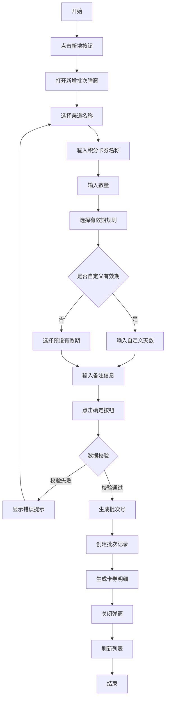

**作废批次流程**

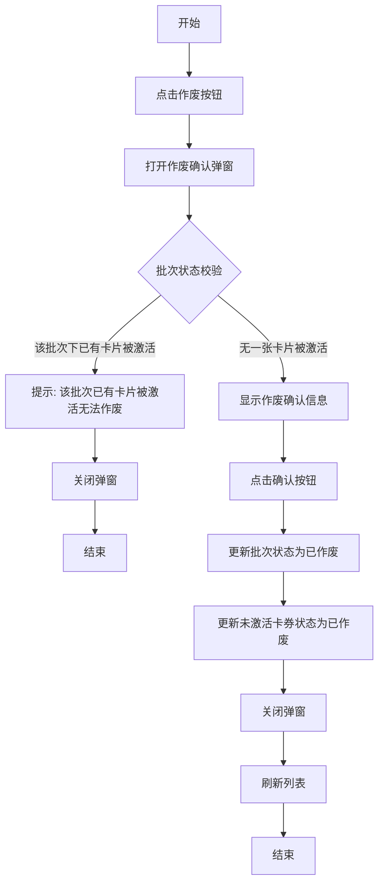

**查询批次流程**

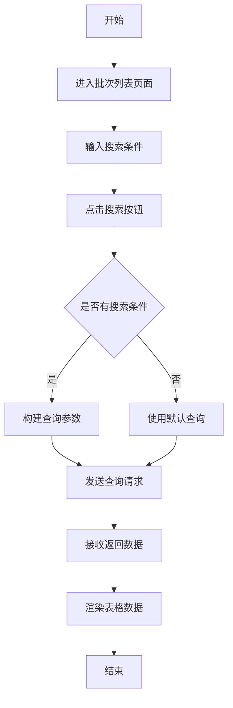

###### 3.2 业务规则

| 规则编号           | 规则名称    | 适用场景 | 规则描述                                                     | 错误提示            |
| -------------- | ------- | ---- | -------------------------------------------------------- | --------------- |
| RULE-BATCH-001 | 批次号生成规则 | 新增批次 | 批次号格式为YYYYMMDD+3位流水号，如20250909001；每天最多生成999个批次，超过则不允许再生成 | 当日批次号已达上限，请明日再试 |
| RULE-BATCH-002 | 批次作废限制  | 作废批次 | 已全部激活的批次不允许作废                                            | 该批次已全部激活，无法作废   |
| RULE-BATCH-003 | 批次状态限制  | 作废批次 | 已作废的批次不允许再次作废                                            | 该批次已作废，无需重复操作   |
| RULE-BATCH-004 | 面值显示规则  | 列表展示 | 未设置面值的批次显示"-"                                            | -               |
| RULE-BATCH-005 | 积分格式化   | 列表展示 | 积分数值使用千分位分隔显示                                            | -               |

###### 3.3 状态机设计

**批次状态定义**

| 状态值       | 状态名称 | 状态说明       |
| --------- | ---- | ---------- |
| normal    | 正常   | 批次正常可用     |
| cancelled | 已作废  | 批次已作废，不可恢复 |

**状态流转规则**

**状态对应UI差异**

| 状态  | 操作按钮          | 样式差异        |
| --- | ------------- | ----------- |
| 正常  | 面值与专区、查看详情、作废 | 绿色标签        |
| 已作废 | 面值与专区、查看详情    | 红色标签，作废按钮禁用 |

##### 4. 交互设计

###### 4.1 输入项说明

| 字段名称   | 字段标识                | 字段类型 | 必填 | 数据类型   | 长度限制 | 校验规则  | 取值范围      | 来源   | 提示文案      | 备注   |
| ------ | ------------------- | ---- | -- | ------ | ---- | ----- | --------- | ---- | --------- | ---- |
| 渠道名称   | channel\_name       | 下拉选择 | 是  | String | -    | 必须选择  | 渠道列表      | 系统配置 | 请选择渠道     | -    |
| 批次号    | batch\_no           | 文本输入 | 否  | String | 20   | -     | -         | 用户输入 | 请输入批次号    | 模糊搜索 |
| 积分卡券名称 | card\_name          | 文本输入 | 否  | String | 50   | -     | -         | 用户输入 | 请输入积分卡券名称 | 模糊搜索 |
| 面值最小值  | face\_value\_min    | 数字输入 | 否  | Number | -    | 非负整数  | ≥1        | 用户输入 | 最小值       | -    |
| 面值最大值  | face\_value\_max    | 数字输入 | 否  | Number | -    | 非负整数  | ≥面值最小值    | 用户输入 | 最大值       | -    |
| 创建人    | creator             | 文本输入 | 否  | String | 20   | -     | -         | 用户输入 | 请输入创建人    | 模糊搜索 |
| 创建开始时间 | create\_time\_start | 日期选择 | 否  | Date   | -    | -     | -         | 用户选择 | -         | -    |
| 创建结束时间 | create\_time\_end   | 日期选择 | 否  | Date   | -    | ≥开始时间 | -         | 用户选择 | -         | -    |
| 状态     | status              | 下拉选择 | 否  | Enum   | -    | -     | 全部/正常/已作废 | 系统配置 | -         | -    |

###### 4.2 交互说明

**搜索操作**

1. 用户在搜索区域输入或选择搜索条件
2. 点击"搜索"按钮，系统根据条件查询数据
3. 查询结果展示在表格中，分页重置为第一页
4. 点击"重置"按钮，清空所有搜索条件，恢复默认查询

**新增操作**

1. 点击"新增"按钮，打开新增批次弹窗
2. 填写表单信息后点击"确定"
3. 校验通过后创建批次并生成卡券明细
4. 关闭弹窗并刷新列表

**导出操作**

1. 点击"导出"按钮
2. 系统根据当前搜索条件导出数据
3. 生成Excel文件并下载

###### 4.3 错误提示文案

**表单校验提示**

| 字段   | 校验规则       | 提示文案           |
| ---- | ---------- | -------------- |
| 面值范围 | 最大值小于最小值   | 面值最大值不能小于最小值   |
| 创建时间 | 结束时间早于开始时间 | 创建结束时间不能早于开始时间 |

**业务异常提示**

| 错误码       | 错误场景  | 提示文案         |
| --------- | ----- | ------------ |
| BATCH-001 | 批次不存在 | 批次信息不存在或已被删除 |
| BATCH-002 | 作废失败  | 批次作废失败，请稍后重试 |
| BATCH-003 | 导出失败  | 数据导出失败，请稍后重试 |

##### 5. 数据设计

###### 5.1 数据流转说明

| 字段/数据  | 来源     | 获取方式  | 说明         |
| ------ | ------ | ----- | ---------- |
| 渠道列表   | 渠道管理模块 | API查询 | 获取所有可用渠道   |
| 批次统计数据 | 卡券明细表  | 实时统计  | 激活、兑换、消费统计 |
| 创建人信息  | 用户管理模块 | API查询 | 获取用户基本信息   |

###### 5.2 数据权限设计

去角色权限管理里自定义配置，列表的所有操作都要支持配置权限

 

##### 6. 扩展功能

###### 6.1 批量操作规则

| 操作名称 | 单次上限   | 前置条件 | 成功提示 |
| ---- | ------ | ---- | ---- |
| 批量导出 | 10000条 | 无    | 导出成功 |

###### 6.2 操作日志要求

| 操作类型 | 记录内容             | 保留时长 |
| ---- | ---------------- | ---- |
| 新增批次 | 批次号、渠道、名称、数量、有效期 | 永久   |
| 作废批次 | 批次号、操作人、操作时间     | 永久   |
| 导出数据 | 导出条件、导出数量、操作人    | 1年   |

***

#### 4.1.1.2. 新增批次弹窗

##### 1. 功能概述

- 功能描述：创建新的积分卡批次，设置批次基本信息和有效期规则
- 业务描述：运营人员通过填写表单创建积分卡批次，系统自动生成批次号和卡券明细
- 使用角色：运营管理员、渠道管理员
- 触发条件：在批次列表页面点击"新增"按钮

##### 2. 界面设计

###### 2.1 页面原型

原型图链接：[积分卡券管理原型.html](file:///d:/Personal/Desktop/AI测试/skills%20ss/jifen/积分卡券管理原型.html)

###### 2.2 输出项说明

| 字段名称   | 字段标识           | 数据类型   | 数据来源        |      数据限制     | 格式说明    |
| ------ | -------------- | ------ | ----------- | :-----------: | ------- |
| 渠道名称   | channel\_name  | String | 基础模块的品牌商城列表 |          | -       |
| 积分卡券名称 | card\_name     | String | 用户输入        |    字符长度≤30    | -       |
| 数量     | quantity       | Number | 用户输入        | 数值范围1-10万，正整数 | 单位：张    |
| 有效期规则  | validity\_rule | String | 用户选择        |          | 预设或自定义  |
| 自定义天数  | custom\_days   | Number | 用户输入        |     ≤1095天    | 仅自定义时显示 |
| 备注     | remark         | String | 用户输入        |    字符长度≤500   | -       |

##### 3. 业务逻辑

###### 3.1 流程图

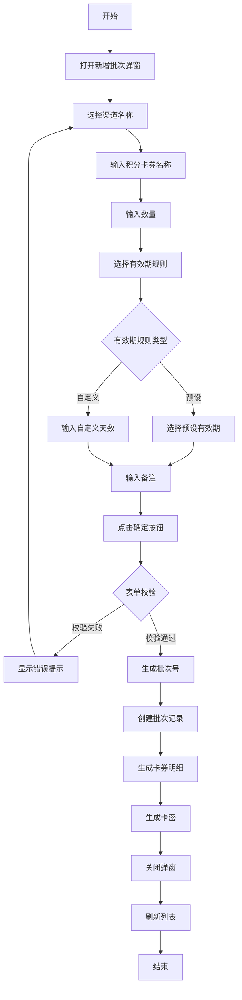

###### 3.2 业务规则

| 规则编号         | 规则名称   | 适用场景 | 规则描述                                                   | 错误提示          |
| ------------ | ------ | ---- | ------------------------------------------------------ | ------------- |
| RULE-ADD-001 | 渠道必选   | 新增批次 | 必须选择渠道名称                                               | 请选择渠道名称       |
| RULE-ADD-002 | 名称必填   | 新增批次 | 积分卡券名称必填                                               | 请输入积分卡券名称     |
| RULE-ADD-003 | 数量必填   | 新增批次 | 数量必填且为正整数                                              | 请输入有效的数量      |
| RULE-ADD-004 | 数量范围   | 新增批次 | 数量范围1-100000                                           | 数量范围为1-100000 |
| RULE-ADD-005 | 有效期必选  | 新增批次 | 必须选择有效期规则                                              | 请选择有效期规则      |
| RULE-ADD-006 | 自定义天数  | 新增批次 | 选择自定义时必须输入天数                                           | 请输入自定义天数      |
| RULE-ADD-007 | 天数范围   | 新增批次 | 自定义天数范围1-1095                                          | 天数范围为1-1095   |
| RULE-ADD-008 | 卡密生成   | 新增批次 | 卡密共8位，由数字2-9（排除0和1）和大写字母A-Z（排除I和O）组成，如ZFYX9988         | -             |
| RULE-ADD-009 | 卡券编码生成 | 新增批次 | 卡券编码为批次号+动态位数序号，如20251225003125；百张补3位、千张补4位、万张补5位，依次类推 | -             |

###### 3.3 状态机设计

不适用，此功能无状态流转。

##### 4. 交互设计

###### 4.1 输入项说明

| 字段名称   | 字段标识           | 字段类型 | 必填   | 数据类型   | 长度限制 | 校验规则      | 取值范围     | 来源   | 提示文案      | 备注      |
| ------ | -------------- | ---- | ---- | ------ | ---- | --------- | -------- | ---- | --------- | ------- |
| 渠道名称   | channel\_name  | 下拉选择 | 是    | String | -    | 必选        | 渠道列表     | 系统配置 | 请选择渠道     | -       |
| 积分卡券名称 | card\_name     | 文本输入 | 是    | String | 50   | 必填、长度限制   | -        | 用户输入 | 请输入积分卡券名称 | -       |
| 数量     | quantity       | 数字输入 | 是    | Number | -    | 必填、正整数、范围 | 1-100000 | 用户输入 | 请输入卡券数量   | -       |
| 有效期规则  | validity\_rule | 下拉选择 | 是    | Enum   | -    | 必选        | 预设选项     | 系统配置 | 请选择有效期规则  | -       |
| 自定义天数  | custom\_days   | 数字输入 | 条件必填 | Number | -    | 正整数、范围    | 1-3650   | 用户输入 | 请输入天数     | 仅自定义时显示 |
| 备注     | remark         | 多行文本 | 否    | String | 500  | 长度限制      | -        | 用户输入 | 请输入备注信息   | -       |

###### 4.2 交互说明

1. 点击"新增"按钮，打开弹窗
2. 选择渠道名称，下拉列表展示所有可用渠道
3. 输入积分卡券名称，最多50个字符
4. 输入数量，支持正整数，范围1-100000
5. 选择有效期规则：
   - 预设选项：12个月、24个月、36个月
   - 自定义：选择后显示天数输入框
6. 可选填写备注信息
7. 点击"确定"按钮提交表单
8. 点击"取消"或关闭按钮关闭弹窗

###### 4.3 错误提示文案

**表单校验提示**

| 字段     | 校验规则    | 提示文案            |
| ------ | ------- | --------------- |
| 渠道名称   | 未选择     | 请选择渠道名称         |
| 积分卡券名称 | 未填写     | 请输入积分卡券名称       |
| 积分卡券名称 | 超过50字符  | 积分卡券名称不能超过50个字符 |
| 数量     | 未填写     | 请输入卡券数量         |
| 数量     | 非正整数    | 请输入有效的数量        |
| 数量     | 超出范围    | 数量范围为1-100000   |
| 有效期规则  | 未选择     | 请选择有效期规则        |
| 自定义天数  | 未填写     | 请输入自定义天数        |
| 自定义天数  | 超出范围    | 天数范围为1-3650     |
| 备注     | 超过500字符 | 备注不能超过500个字符    |

**业务异常提示**

| 错误码     | 错误场景  | 提示文案         |
| ------- | ----- | ------------ |
| ADD-001 | 渠道不存在 | 所选渠道不存在或已禁用  |
| ADD-002 | 创建失败  | 批次创建失败，请稍后重试 |

##### 5. 数据设计

###### 5.1 数据流转说明

| 字段/数据 | 来源     | 获取方式  | 说明                                  |
| ----- | ------ | ----- | ----------------------------------- |
| 渠道列表  | 渠道管理模块 | API查询 | 获取所有启用状态的渠道                         |
| 批次号   | 系统生成   | 自动生成  | 格式：YYYYMMDD+3位流水号，如20250909001      |
| 卡密    | 系统生成   | 随机生成  | 8位字符，数字2-9和大写字母A-Z（排除I和O），如ZFYX9988 |

###### 5.2 数据权限设计

去角色权限管理里自定义配置，列表的所有操作都要支持配置权限

##### 6. 扩展功能

不适用。

***

#### 4.1.1.3. 批次详情弹窗

##### 1. 功能概述

- 功能描述：查看积分卡批次的详细信息，包括基本信息和统计数据
- 业务描述：运营人员通过详情弹窗查看批次的完整信息
- 使用角色：运营管理员、渠道管理员
- 触发条件：在批次列表页面点击"查看详情"按钮

##### 2. 界面设计

###### 2.1 页面原型

原型图链接：[积分卡券管理原型.html](file:///d:/Personal/Desktop/AI测试/skills%20ss/jifen/积分卡券管理原型.html)

###### 2.2 输出项说明

| 字段名称   | 字段标识               | 数据类型     | 数据来源 | 格式说明                |
| ------ | ------------------ | -------- | ---- | ------------------- |
| 渠道名称   | channel\_name      | String   | 批次数据 | -                   |
| 批次号    | batch\_no          | String   | 批次数据 | -                   |
| 积分卡券名称 | card\_name         | String   | 批次数据 | -                   |
| 面值     | face\_value        | Number   | 批次数据 | 未设置显示"-"            |
| 数量     | quantity           | Number   | 批次数据 | -                   |
| 有效期规则  | validity\_rule     | String   | 批次数据 | -                   |
| 已激活数量  | activated\_count   | Number   | 统计计算 | -                   |
| 未激活数量  | inactive\_count    | Number   | 统计计算 | -                   |
| 已兑换数量  | redeemed\_count    | Number   | 统计计算 | -                   |
| 未兑换数量  | unredeemed\_count  | Number   | 统计计算 | -                   |
| 已消费积分  | consumed\_points   | Number   | 统计计算 | 千分位格式               |
| 未消费积分  | unconsumed\_points | Number   | 统计计算 | 千分位格式               |
| 创建人    | creator            | String   | 批次数据 | -                   |
| 创建时间   | create\_time       | DateTime | 批次数据 | YYYY-MM-DD HH:mm:ss |
| 状态     | status             | Enum     | 批次数据 | -                   |
| 备注     | remark             | String   | 批次数据 | -                   |

##### 3. 业务逻辑

###### 3.1 流程图

不适用，此功能为纯展示功能，无业务流程。

###### 3.2 业务规则

| 规则编号            | 规则名称 | 适用场景 | 规则描述           | 错误提示 |
| --------------- | ---- | ---- | -------------- | ---- |
| RULE-DETAIL-001 | 数据获取 | 查看详情 | 根据批次号查询批次完整信息  | -    |
| RULE-DETAIL-002 | 统计计算 | 查看详情 | 实时统计激活、兑换、消费数据 | -    |

###### 3.3 状态机设计

不适用，此功能无状态流转。

##### 4. 交互设计

###### 4.1 输入项说明

不适用，此功能无输入项。

###### 4.2 交互说明

1. 点击"查看详情"按钮，打开详情弹窗
2. 系统自动加载批次详细信息
3. 展示基本信息和统计数据
4. 点击"关闭"按钮关闭弹窗

###### 4.3 错误提示文案

**业务异常提示**

| 错误码        | 错误场景  | 提示文案         |
| ---------- | ----- | ------------ |
| DETAIL-001 | 批次不存在 | 批次信息不存在或已被删除 |
| DETAIL-002 | 加载失败  | 详情加载失败，请稍后重试 |

##### 5. 数据设计

###### 5.1 数据流转说明

| 字段/数据  | 来源    | 获取方式  | 说明         |
| ------ | ----- | ----- | ---------- |
| 批次基本信息 | 批次表   | API查询 | 根据批次号查询    |
| 统计数据   | 卡券明细表 | 实时统计  | 激活、兑换、消费统计 |

###### 5.2 数据权限设计

去角色权限管理里自定义配置，列表的所有操作都要支持配置权限

##### 6. 扩展功能

不适用。

***

#### 4.1.1.4. 作废批次弹窗

##### 1. 功能概述

- 功能描述：作废指定的积分卡批次，同时作废该批次下未激活的卡券
- 业务描述：运营人员通过作废功能取消批次的使用，已激活的卡券不受影响
- 使用角色：运营管理员
- 触发条件：在批次列表页面点击"作废"按钮

##### 2. 界面设计

###### 2.1 页面原型

原型图链接：[积分卡券管理原型.html](file:///d:/Personal/Desktop/AI测试/skills%20ss/jifen/积分卡券管理原型.html)

###### 2.2 输出项说明

| 字段名称   | 字段标识            | 数据类型   | 数据来源 | 格式说明 |
| ------ | --------------- | ------ | ---- | ---- |
| 批次号    | batch\_no       | String | 批次数据 | -    |
| 积分卡券名称 | card\_name      | String | 批次数据 | -    |
| 未激活数量  | inactive\_count | Number | 统计计算 | -    |

##### 3. 业务逻辑

###### 3.1 流程图

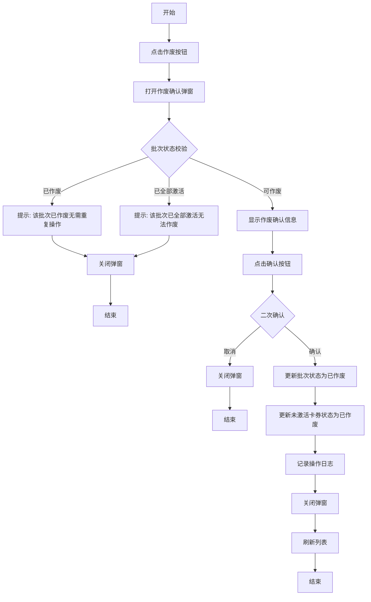

###### 3.2 业务规则

| 规则编号            | 规则名称 | 适用场景 | 规则描述                | 错误提示          |
| --------------- | ---- | ---- | ------------------- | ------------- |
| RULE-CANCEL-001 | 状态校验 | 作废批次 | 已作废的批次不允许再次作废       | 该批次已作废，无需重复操作 |
| RULE-CANCEL-002 | 激活校验 | 作废批次 | 已全部激活的批次不允许作废       | 该批次已全部激活，无法作废 |
| RULE-CANCEL-003 | 卡券处理 | 作废批次 | 仅作废未激活的卡券，已激活卡券不受影响 | -             |
| RULE-CANCEL-004 | 权限校验 | 作废批次 | 仅运营管理员可作废批次         | 无权限执行此操作      |

###### 3.3 状态机设计

不适用，此功能触发批次状态变更，状态机设计见批次列表页面。

##### 4. 交互设计

###### 4.1 输入项说明

不适用，此功能无输入项。

###### 4.2 交互说明

1. 点击"作废"按钮，打开作废确认弹窗
2. 系统校验批次状态
3. 校验不通过时显示相应提示并关闭弹窗
4. 校验通过时显示作废确认信息
5. 点击"确认"按钮执行作废操作
6. 点击"取消"按钮关闭弹窗

###### 4.3 错误提示文案

**业务异常提示**

| 错误码        | 错误场景    | 提示文案          |
| ---------- | ------- | ------------- |
| CANCEL-001 | 批次已作废   | 该批次已作废，无需重复操作 |
| CANCEL-002 | 批次已全部激活 | 该批次已全部激活，无法作废 |
| CANCEL-003 | 作废失败    | 批次作废失败，请稍后重试  |
| CANCEL-004 | 无权限     | 无权限执行此操作      |

##### 5. 数据设计

###### 5.1 数据流转说明

| 字段/数据 | 来源    | 获取方式 | 说明          |
| ----- | ----- | ---- | ----------- |
| 批次状态  | 批次表   | 更新操作 | 更新为已作废      |
| 卡券状态  | 卡券明细表 | 批量更新 | 未激活卡券更新为已作废 |

###### 5.2 数据权限设计

去角色权限管理里自定义配置，列表的所有操作都要支持配置权限

##### 6. 扩展功能

不适用。

***

### 4.1.2. 积分卡明细管理

#### 4.1.2.1. 积分卡明细列表页面

##### 1. 功能概述

- 功能描述：管理积分卡明细的查询、激活、作废等操作，支持批量激活和导入激活
- 业务描述：运营人员通过明细管理功能管理每张积分卡的状态和使用情况
- 使用角色：运营管理员、渠道管理员
- 触发条件：用户在商城运营后台点击"积分卡管理 > 积分卡明细列表"菜单

##### 2. 界面设计

###### 2.1 页面原型

原型图链接：[积分卡券管理原型.html](file:///d:/Personal/Desktop/AI测试/skills%20ss/jifen/积分卡券管理原型.html)

###### 2.2 输出项说明

| 字段名称   | 字段标识            | 数据类型     | 数据来源 | 格式说明                |
| ------ | --------------- | -------- | ---- | ------------------- |
| 序号     | index           | Number   | 系统生成 | 从1开始递增              |
| 渠道名称   | channel\_name   | String   | 卡券数据 | -                   |
| 批次号    | batch\_no       | String   | 卡券数据 | -                   |
| 积分卡券编号 | card\_no        | String   | 系统生成 | 批次号+3位序号            |
| 积分卡券名称 | card\_name      | String   | 卡券数据 | -                   |
| 面值     | face\_value     | Number   | 卡券数据 | -                   |
| 剩余有效天数 | remaining\_days | Number   | 计算得出 | -                   |
| 生效日期   | effective\_date | Date     | 卡券数据 | YYYY-MM-DD          |
| 失效日期   | expiry\_date    | Date     | 卡券数据 | YYYY-MM-DD          |
| 卡券状态   | card\_status    | Enum     | 卡券数据 | 未激活、已激活、已作废         |
| 激活时间   | activate\_time  | DateTime | 卡券数据 | YYYY-MM-DD HH:mm:ss |
| 兑换状态   | redeem\_status  | Enum     | 卡券数据 | 未兑换、已兑换             |
| 兑换时间   | redeem\_time    | DateTime | 卡券数据 | YYYY-MM-DD HH:mm:ss |
| 兑换人账号  | redeem\_account | String   | 卡券数据 | -                   |
| 兑换人手机  | redeem\_phone   | String   | 卡券数据 | 脱敏显示                |

##### 3. 业务逻辑

###### 3.1 流程图

**单卡激活流程**

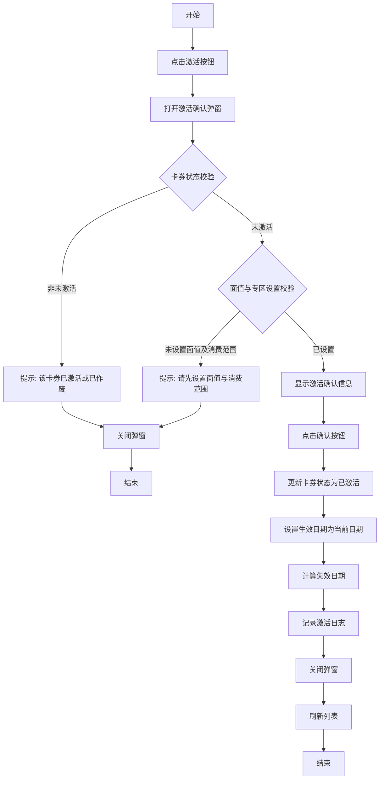

**批量激活流程**

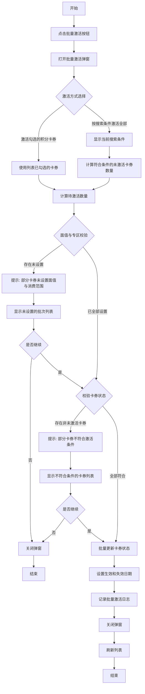

**卡券作废流程**

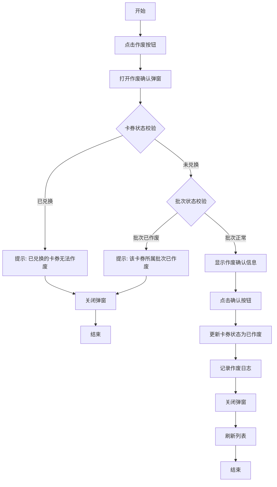

###### 3.2 业务规则

| 规则编号          | 规则名称   | 适用场景 | 规则描述                                              | 错误提示          |
| ------------- | ------ | ---- | ------------------------------------------------- | ------------- |
| RULE-CARD-001 | 卡券编号规则 | 生成卡券 | 编号格式为批次号+动态位数序号，如20251225003125；百张补3位、千张补4位、万张补5位 | -             |
| RULE-CARD-002 | 激活前置条件 | 激活卡券 | 必须先设置面值与消费范围才能激活，需同时满足两个条件                        | 请先设置面值与消费范围   |
| RULE-CARD-003 | 激活状态限制 | 激活卡券 | 仅未激活状态的卡券可激活                                      | 该卡券已激活或已作废    |
| RULE-CARD-004 | 作废状态限制 | 作废卡券 | 已兑换的卡券无法作废                                        | 已兑换的卡券无法作废    |
| RULE-CARD-005 | 批量激活上限 | 批量激活 | 单次批量激活不超过1000张                                    | 单次最多激活1000张卡券 |
| RULE-CARD-006 | 有效期计算  | 激活卡券 | 生效日期为激活当日，失效日期根据有效期规则计算                           | -             |
| RULE-CARD-007 | 手机号脱敏  | 列表展示 | 兑换人手机号中间4位用\*替代                                   | -             |

###### 3.3 状态机设计

**卡券状态定义**

| 状态值      | 状态名称 | 状态说明        |
| -------- | ---- | ----------- |
| inactive | 未激活  | 卡券已生成，尚未激活  |
| active   | 已激活  | 卡券已激活，可正常使用 |
| voided   | 已作废  | 卡券已作废，不可使用  |

**状态流转规则**

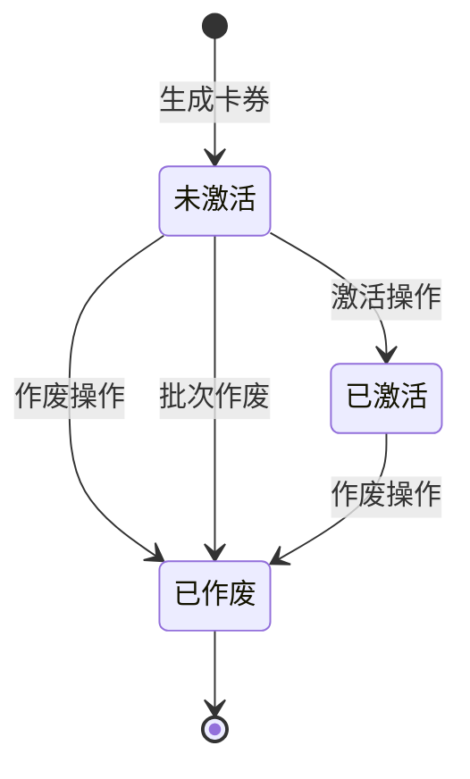

**兑换状态定义**

| 状态值        | 状态名称 | 状态说明        |
| ---------- | ---- | ----------- |
| unredeemed | 未兑换  | 卡券尚未被用户兑换   |
| redeemed   | 已兑换  | 卡券已被用户兑换到账户 |

**兑换状态流转规则**

**状态对应UI差异**

| 卡券状态 | 兑换状态 | 操作按钮          | 样式差异 |
| ---- | ---- | ------------- | ---- |
| 未激活  | 未兑换  | 查看卡密、激活、作废、详情 | 橙色标签 |
| 已激活  | 未兑换  | 查看卡密、激活、作废、详情 | 绿色标签 |
| 已激活  | 已兑换  | 查看卡密、激活、作废、详情 | 蓝色标签 |
| 已作废  | -    | 查看卡密、详情       | 红色标签 |

##### 4. 交互设计

###### 4.1 输入项说明

| 字段名称   | 字段标识                  | 字段类型 | 必填 | 数据类型   | 长度限制 | 校验规则  | 取值范围       | 来源   | 提示文案     | 备注   |
| ------ | --------------------- | ---- | -- | ------ | ---- | ----- | ---------- | ---- | -------- | ---- |
| 渠道名称   | channel\_name         | 文本输入 | 否  | String | -    | -     | -          | 用户输入 | 请输入渠道名称  | 模糊搜索 |
| 批次号    | batch\_no             | 文本输入 | 否  | String | 20   | -     | -          | 用户输入 | 请输入批次号   | 精确搜索 |
| 卡券状态   | card\_status          | 下拉选择 | 否  | Enum   | -    | -     | 全部/未激活/已激活 | 系统配置 | -        | -    |
| 激活开始时间 | activate\_time\_start | 日期选择 | 否  | Date   | -    | -     | -          | 用户选择 | -        | -    |
| 激活结束时间 | activate\_time\_end   | 日期选择 | 否  | Date   | -    | ≥开始时间 | -          | 用户选择 | -        | -    |
| 兑换状态   | redeem\_status        | 下拉选择 | 否  | Enum   | -    | -     | 全部/未兑换/已兑换 | 系统配置 | -        | -    |
| 兑换开始时间 | redeem\_time\_start   | 日期选择 | 否  | Date   | -    | -     | -          | 用户选择 | -        | -    |
| 兑换结束时间 | redeem\_time\_end     | 日期选择 | 否  | Date   | -    | ≥开始时间 | -          | 用户选择 | -        | -    |
| 兑换人账号  | redeem\_account       | 文本输入 | 否  | String | 50   | -     | -          | 用户输入 | 请输入兑换人账号 | 精确搜索 |
| 兑换人手机  | redeem\_phone         | 文本输入 | 否  | String | 11   | 手机号格式 | -          | 用户输入 | 请输入兑换人手机 | 精确搜索 |

###### 4.2 交互说明

**搜索操作**

1. 用户在搜索区域输入或选择搜索条件
2. 点击"搜索"按钮，系统根据条件查询数据
3. 查询结果展示在表格中，分页重置为第一页
4. 点击"重置"按钮，清空所有搜索条件，恢复默认查询

**批量激活操作**

1. 点击"批量激活"按钮，打开批量激活弹窗
2. 选择激活方式：激活勾选的积分卡券或按搜索条件激活全部
3. 确认激活信息后点击"确认激活"
4. 系统批量更新卡券状态并刷新列表

**批量导入激活操作**

1. 点击"批量导入激活"按钮，打开导入弹窗
2. 下载导入模板
3. 按模板格式填写卡券编号
4. 上传文件并确认激活
5. 系统批量更新卡券状态并刷新列表

**单卡操作**

1. 查看卡密：点击"查看卡密"按钮，弹窗显示8位卡密
2. 激活：点击"激活"按钮，确认后激活卡券
3. 作废：点击"作废"按钮，确认后作废卡券
4. 详情：点击"详情"按钮，查看卡券完整信息

###### 4.3 错误提示文案

**表单校验提示**

| 字段     | 校验规则       | 提示文案           |
| ------ | ---------- | -------------- |
| 激活时间范围 | 结束时间早于开始时间 | 激活结束时间不能早于开始时间 |
| 兑换时间范围 | 结束时间早于开始时间 | 兑换结束时间不能早于开始时间 |
| 兑换人手机  | 格式不正确      | 请输入正确的手机号码     |

**业务异常提示**

| 错误码      | 错误场景   | 提示文案                |
| -------- | ------ | ------------------- |
| CARD-001 | 卡券不存在  | 卡券信息不存在或已被删除        |
| CARD-002 | 激活失败   | 卡券激活失败，请稍后重试        |
| CARD-003 | 作废失败   | 卡券作废失败，请稍后重试        |
| CARD-004 | 批量激活超限 | 单次最多激活1000张卡券       |
| CARD-005 | 导入格式错误 | 导入文件格式不正确，请下载模板重新填写 |

##### 5. 数据设计

###### 5.1 数据流转说明

| 字段/数据  | 来源    | 获取方式  | 说明            |
| ------ | ----- | ----- | ------------- |
| 卡券基本信息 | 卡券明细表 | API查询 | 根据搜索条件查询      |
| 批次信息   | 批次表   | 关联查询  | 获取批次名称、有效期规则等 |
| 渠道信息   | 渠道表   | 关联查询  | 获取渠道名称        |

###### 5.2 数据权限设计

去角色权限管理里自定义配置，列表的所有操作都要支持配置权限

##### 6. 扩展功能

###### 6.1 批量操作规则

| 操作名称   | 单次上限   | 前置条件     | 成功提示   |
| ------ | ------ | -------- | ------ |
| 批量激活   | 1000张  | 卡券状态为未激活 | 批量激活成功 |
| 批量导入激活 | 1000张  | 文件格式正确   | 导入激活成功 |
| 批量导出   | 10000条 | 无        | 导出成功   |

###### 6.2 操作日志要求

| 操作类型 | 记录内容               | 保留时长 |
| ---- | ------------------ | ---- |
| 单卡激活 | 卡券编号、操作人、操作时间      | 永久   |
| 批量激活 | 批次号、激活数量、操作人、操作时间  | 永久   |
| 导入激活 | 文件名、导入数量、成功数量、失败数量 | 永久   |
| 卡券作废 | 卡券编号、作废原因、操作人、操作时间 | 永久   |
| 导出数据 | 导出条件、导出数量、操作人      | 1年   |

***

#### 4.1.2.2. 批量激活弹窗

##### 1. 功能概述

- 功能描述：批量激活多张积分卡券，支持激活勾选的积分卡券或按搜索条件激活全部
- 业务描述：运营人员通过批量激活功能提高激活效率
- 使用角色：运营管理员、渠道管理员
- 触发条件：在明细列表页面点击"批量激活"按钮

##### 2. 界面设计

###### 2.1 页面原型

原型图链接：[积分卡券管理原型.html](file:///d:/Personal/Desktop/AI测试/skills%20ss/jifen/积分卡券管理原型.html)

###### 2.2 输出项说明

| 字段名称   | 字段标识            | 数据类型   | 数据来源 | 格式说明                |
| ------ | --------------- | ------ | ---- | ------------------- |
| 激活方式   | activate\_mode  | Enum   | 用户选择 | 激活勾选的积分卡券/按搜索条件激活全部 |
| 已勾选数量  | selected\_count | Number | 系统计算 | 激活勾选方式时显示           |
| 搜索条件摘要 | search\_summary | String | 系统生成 | 按搜索条件方式时显示当前搜索条件描述  |
| 待激活数量  | pending\_count  | Number | 系统计算 | -                   |

##### 3. 业务逻辑

###### 3.1 流程图

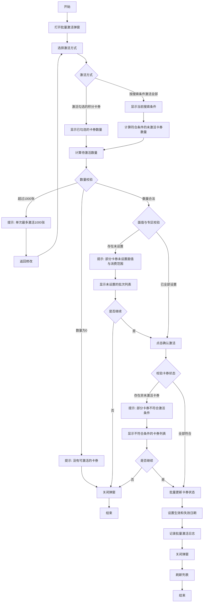

###### 3.2 业务规则

| 规则编号               | 规则名称 | 适用场景 | 规则描述         | 错误提示              |
| ------------------ | ---- | ---- | ------------ | ----------------- |
| RULE-BATCH-ACT-001 | 数量上限 | 批量激活 | 单次最多激活1000张  | 单次最多激活1000张卡券     |
| RULE-BATCH-ACT-002 | 状态限制 | 批量激活 | 仅激活未激活状态的卡券  | 只能激活卡券状态为【未激活】的卡券 |
| RULE-BATCH-ACT-003 | 面值校验 | 批量激活 | 必须先设置面值与消费范围 | 部分卡券未设置面值与消费范围    |
| RULE-BATCH-ACT-004 | 勾选校验 | 批量激活 | 激活勾选方式需先勾选卡券 | 请先勾选需要激活的卡券       |

###### 3.3 状态机设计

不适用，此功能触发卡券状态变更，状态机设计见明细列表页面。

##### 4. 交互设计

###### 4.1 输入项说明

| 字段名称 | 字段标识           | 字段类型 | 必填 | 数据类型 | 长度限制 | 校验规则 | 取值范围                | 来源   | 提示文案 | 备注          |
| ---- | -------------- | ---- | -- | ---- | ---- | ---- | ------------------- | ---- | ---- | ----------- |
| 激活方式 | activate\_mode | 单选按钮 | 是  | Enum | -    | 必选   | 激活勾选的积分卡券/按搜索条件激活全部 | 用户选择 | -    | 默认激活勾选的积分卡券 |

###### 4.2 交互说明

1. 点击"批量激活"按钮，打开批量激活弹窗
2. 选择激活方式：
   - 激活勾选的积分卡券：使用列表中已勾选的卡券
   - 按搜索条件激活全部：显示当前搜索条件下的未激活卡券数量
3. 系统自动计算待激活数量
4. 点击"确认激活"按钮执行批量激活
5. 点击"取消"按钮关闭弹窗

###### 4.3 错误提示文案

**表单校验提示**

| 字段   | 校验规则           | 提示文案        |
| ---- | -------------- | ----------- |
| 激活方式 | 未勾选卡券时选择激活勾选方式 | 请先勾选需要激活的卡券 |

**业务异常提示**

| 错误码           | 错误场景    | 提示文案                         |
| ------------- | ------- | ---------------------------- |
| BATCH-ACT-001 | 数量超限    | 单次最多激活1000张卡券                |
| BATCH-ACT-002 | 无可激活卡券  | 没有可激活的卡券                     |
| BATCH-ACT-003 | 部分未设置面值 | 部分卡券未设置面值与消费范围，是否继续激活已设置的卡券？ |
| BATCH-ACT-004 | 激活失败    | 批量激活失败，请稍后重试                 |

##### 5. 数据设计

###### 5.1 数据流转说明

| 字段/数据 | 来源    | 获取方式 | 说明            |
| ----- | ----- | ---- | ------------- |
| 卡券列表  | 卡券明细表 | 条件查询 | 根据编号范围或搜索条件查询 |
| 批次信息  | 批次表   | 关联查询 | 校验面值是否设置      |

###### 5.2 数据权限设计

去角色权限管理里自定义配置，列表的所有操作都要支持配置权限

##### 6. 扩展功能

不适用。

***

#### 4.1.2.3. 批量导入激活弹窗（这次先不开发，等下次评审）

##### 1. 功能概述

- 功能描述：通过上传Excel文件批量激活积分卡券
- 业务描述：运营人员通过导入功能实现大批量卡券激活
- 使用角色：运营管理员、渠道管理员
- 触发条件：在明细列表页面点击"批量导入激活"按钮

##### 2. 界面设计

###### 2.1 页面原型

原型图链接：[积分卡券管理原型.html](file:///d:/Personal/Desktop/AI测试/skills%20ss/jifen/积分卡券管理原型.html)

###### 2.2 输出项说明

| 字段名称 | 字段标识           | 数据类型   | 数据来源 | 格式说明            |
| ---- | -------------- | ------ | ---- | --------------- |
| 上传文件 | upload\_file   | File   | 用户上传 | .xlsx/.xls/.csv |
| 导入结果 | import\_result | Object | 系统生成 | 成功/失败数量         |

##### 3. 业务逻辑

###### 3.1 流程图

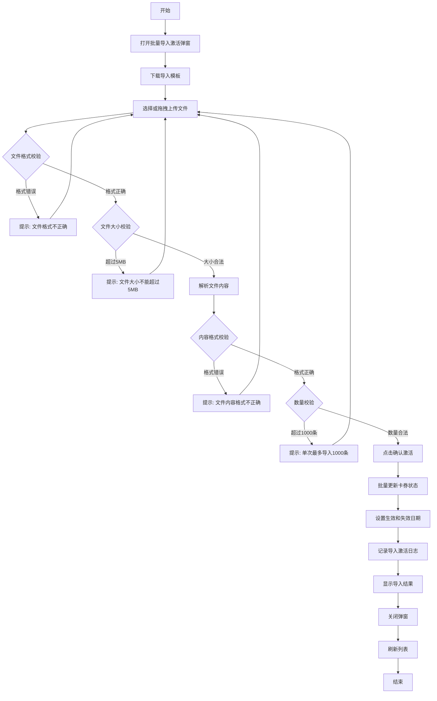

###### 3.2 业务规则

| 规则编号            | 规则名称 | 适用场景 | 规则描述                 | 错误提示                |
| --------------- | ---- | ---- | -------------------- | ------------------- |
| RULE-IMPORT-001 | 文件格式 | 导入激活 | 仅支持.xlsx、.xls、.csv格式 | 文件格式不正确，请上传Excel文件  |
| RULE-IMPORT-002 | 文件大小 | 导入激活 | 文件大小不超过5MB           | 文件大小不能超过5MB         |
| RULE-IMPORT-003 | 导入数量 | 导入激活 | 单次最多导入1000条          | 单次最多导入1000条记录       |
| RULE-IMPORT-004 | 模板格式 | 导入激活 | 必须使用系统提供的模板格式        | 文件内容格式不正确，请下载模板重新填写 |
| RULE-IMPORT-005 | 卡券编号 | 导入激活 | 卡券编号必须存在且为未激活状态      | 卡券编号不存在或状态不符合       |

###### 3.3 状态机设计

不适用，此功能触发卡券状态变更，状态机设计见明细列表页面。

##### 4. 交互设计

###### 4.1 输入项说明

| 字段名称 | 字段标识         | 字段类型 | 必填 | 数据类型 | 长度限制 | 校验规则    | 取值范围            | 来源   | 提示文案          | 备注 |
| ---- | ------------ | ---- | -- | ---- | ---- | ------- | --------------- | ---- | ------------- | -- |
| 上传文件 | upload\_file | 文件上传 | 是  | File | 5MB  | 文件格式、大小 | .xlsx/.xls/.csv | 用户上传 | 点击或拖拽文件到此区域上传 | -  |

###### 4.2 交互说明

1. 点击"批量导入激活"按钮，打开导入弹窗
2. 点击"下载导入模板"链接下载模板
3. 按模板格式填写卡券编号
4. 点击或拖拽上传文件
5. 系统自动校验文件格式和内容
6. 点击"确认激活"按钮执行导入激活
7. 显示导入结果（成功/失败数量）
8. 点击"取消"按钮关闭弹窗

###### 4.3 错误提示文案

**表单校验提示**

| 字段   | 校验规则  | 提示文案               |
| ---- | ----- | ------------------ |
| 上传文件 | 未上传   | 请上传文件              |
| 文件格式 | 格式不正确 | 文件格式不正确，请上传Excel文件 |
| 文件大小 | 超过5MB | 文件大小不能超过5MB        |

**业务异常提示**

| 错误码        | 错误场景   | 提示文案                |
| ---------- | ------ | ------------------- |
| IMPORT-001 | 模板格式错误 | 文件内容格式不正确，请下载模板重新填写 |
| IMPORT-002 | 数量超限   | 单次最多导入1000条记录       |
| IMPORT-003 | 编号不存在  | 第X行：卡券编号不存在         |
| IMPORT-004 | 状态不符合  | 第X行：卡券状态不符合激活条件     |
| IMPORT-005 | 导入失败   | 导入激活失败，请稍后重试        |

##### 5. 数据设计

###### 5.1 数据流转说明

| 字段/数据 | 来源    | 获取方式 | 说明              |
| ----- | ----- | ---- | --------------- |
| 导入模板  | 系统生成  | 文件下载 | 包含卡券编号列的Excel模板 |
| 卡券信息  | 卡券明细表 | 编号查询 | 根据导入的编号查询卡券     |

###### 5.2 数据权限设计

去角色权限管理里自定义配置，列表的所有操作都要支持配置权限

##### 6. 扩展功能

不适用。

***

#### 4.1.2.4. 查看卡密弹窗

##### 1. 功能概述

- 功能描述：查看积分卡券的卡密信息
- 业务描述：运营人员通过此功能查看卡券的8位卡密，用于线下发放
- 使用角色：运营管理员、渠道管理员
- 触发条件：在明细列表页面点击"查看卡密"按钮

##### 2. 界面设计

###### 2.1 页面原型

原型图链接：[积分卡券管理原型.html](file:///d:/Personal/Desktop/AI测试/skills%20ss/jifen/积分卡券管理原型.html)

###### 2.2 输出项说明

| 字段名称 | 字段标识      | 数据类型   | 数据来源 | 格式说明                                |
| ---- | --------- | ------ | ---- | ----------------------------------- |
| 卡券编号 | card\_no  | String | 卡券数据 | 格式：批次号+动态位数序号，如20251225003125       |
| 卡密   | card\_key | String | 卡券数据 | 8位字符，数字2-9和大写字母A-Z（排除I和O），如ZFYX9988 |

##### 3. 业务逻辑

###### 3.1 流程图

不适用，此功能为纯展示功能，无业务流程。

###### 3.2 业务规则

| 规则编号         | 规则名称 | 适用场景 | 规则描述                            | 错误提示 |
| ------------ | ---- | ---- | ------------------------------- | ---- |
| RULE-KEY-001 | 卡密显示 | 查看卡密 | 卡密为8位字符，由数字2-9和大写字母A-Z（排除I和O）组成 | -    |
| RULE-KEY-002 | 安全提示 | 查看卡密 | 显示安全提示文案                        | -    |

###### 3.3 状态机设计

不适用，此功能无状态流转。

##### 4. 交互设计

###### 4.1 输入项说明

不适用，此功能无输入项。

###### 4.2 交互说明

1. 点击"查看卡密"按钮，打开卡密弹窗
2. 显示卡券编号和8位卡密
3. 显示安全提示文案
4. 点击"确定"按钮关闭弹窗

###### 4.3 错误提示文案

**业务异常提示**

| 错误码     | 错误场景  | 提示文案         |
| ------- | ----- | ------------ |
| KEY-001 | 卡券不存在 | 卡券信息不存在或已被删除 |

##### 5. 数据设计

###### 5.1 数据流转说明

| 字段/数据 | 来源    | 获取方式  | 说明       |
| ----- | ----- | ----- | -------- |
| 卡密信息  | 卡券明细表 | API查询 | 根据卡券编号查询 |

###### 5.2 数据权限设计

去角色权限管理里自定义配置，列表的所有操作都要支持配置权限

##### 6. 扩展功能

不适用。

***

#### 4.1.2.5. 激活卡券弹窗

##### 1. 功能概述

- 功能描述：激活单张积分卡券
- 业务描述：运营人员通过此功能激活单张卡券
- 使用角色：运营管理员、渠道管理员
- 触发条件：在明细列表页面点击"激活"按钮

##### 2. 界面设计

###### 2.1 页面原型

原型图链接：[积分卡券管理原型.html](file:///d:/Personal/Desktop/AI测试/skills%20ss/jifen/积分卡券管理原型.html)

###### 2.2 输出项说明

| 字段名称 | 字段标识     | 数据类型   | 数据来源 | 格式说明 |
| ---- | -------- | ------ | ---- | ---- |
| 卡券编号 | card\_no | String | 卡券数据 | -    |

##### 3. 业务逻辑

###### 3.1 流程图

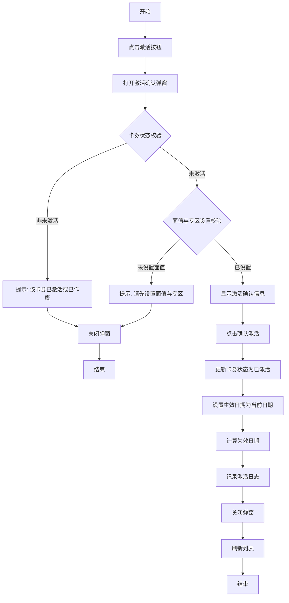

###### 3.2 业务规则

| 规则编号         | 规则名称  | 适用场景 | 规则描述                      | 错误提示        |
| ------------ | ----- | ---- | ------------------------- | ----------- |
| RULE-ACT-001 | 状态限制  | 激活卡券 | 仅未激活状态的卡券可激活              | 该卡券已激活或已作废  |
| RULE-ACT-002 | 面值校验  | 激活卡券 | 必须先设置面值与消费范围              | 请先设置面值与消费范围 |
| RULE-ACT-003 | 有效期计算 | 激活卡券 | 生效日期为激活当日，失效日期根据批次有效期规则计算 | -           |

###### 3.3 状态机设计

不适用，此功能触发卡券状态变更，状态机设计见明细列表页面。

##### 4. 交互设计

###### 4.1 输入项说明

不适用，此功能无输入项。

###### 4.2 交互说明

1. 点击"激活"按钮，打开激活确认弹窗
2. 显示卡券编号和确认提示
3. 点击"确认激活"按钮执行激活
4. 点击"取消"按钮关闭弹窗

###### 4.3 错误提示文案

**业务异常提示**

| 错误码     | 错误场景   | 提示文案         |
| ------- | ------ | ------------ |
| ACT-001 | 卡券状态不符 | 该卡券已激活或已作废   |
| ACT-002 | 未设置面值  | 请先设置面值与消费范围  |
| ACT-003 | 激活失败   | 卡券激活失败，请稍后重试 |

##### 5. 数据设计

###### 5.1 数据流转说明

| 字段/数据 | 来源    | 获取方式  | 说明       |
| ----- | ----- | ----- | -------- |
| 卡券信息  | 卡券明细表 | API查询 | 根据卡券编号查询 |
| 批次信息  | 批次表   | 关联查询  | 获取有效期规则  |

###### 5.2 数据权限设计

去角色权限管理里自定义配置，列表的所有操作都要支持配置权限

##### 6. 扩展功能

不适用。

***

#### 4.1.2.6. 卡券详情弹窗

##### 1. 功能概述

- 功能描述：查看积分卡券的详细信息，包括基本信息、状态、消费信息等
- 业务描述：运营人员通过详情弹窗查看卡券的完整信息
- 使用角色：运营管理员、渠道管理员
- 触发条件：在明细列表页面点击"详情"按钮

##### 2. 界面设计

###### 2.1 页面原型

原型图链接：[积分卡券管理原型.html](file:///d:/Personal/Desktop/AI测试/skills%20ss/jifen/积分卡券管理原型.html)

###### 2.2 输出项说明

| 字段名称  | 字段标识              | 数据类型     | 数据来源 | 格式说明                |
| ----- | ----------------- | -------- | ---- | ------------------- |
| 渠道名称  | channel\_name     | String   | 卡券数据 | -                   |
| 批次号   | batch\_no         | String   | 卡券数据 | -                   |
| 卡券编号  | card\_no          | String   | 卡券数据 | -                   |
| 卡券名称  | card\_name        | String   | 卡券数据 | -                   |
| 面值    | face\_value       | Number   | 卡券数据 | -                   |
| 卡密    | card\_key         | String   | 卡券数据 | 8位卡密                |
| 生效日期  | effective\_date   | Date     | 卡券数据 | YYYY-MM-DD          |
| 失效日期  | expiry\_date      | Date     | 卡券数据 | YYYY-MM-DD          |
| 剩余天数  | remaining\_days   | Number   | 计算得出 | -                   |
| 卡券状态  | card\_status      | Enum     | 卡券数据 | -                   |
| 激活时间  | activate\_time    | DateTime | 卡券数据 | YYYY-MM-DD HH:mm:ss |
| 兑换状态  | redeem\_status    | Enum     | 卡券数据 | -                   |
| 兑换时间  | redeem\_time      | DateTime | 卡券数据 | YYYY-MM-DD HH:mm:ss |
| 兑换人账号 | redeem\_account   | String   | 卡券数据 | -                   |
| 兑换人手机 | redeem\_phone     | String   | 卡券数据 | 脱敏显示                |
| 已消费积分 | consumed\_points  | Number   | 卡券数据 | -                   |
| 剩余积分  | remaining\_points | Number   | 卡券数据 | -                   |
| 消费范围  | consume\_scope    | String   | 卡券数据 | -                   |

##### 3. 业务逻辑

###### 3.1 流程图

不适用，此功能为纯展示功能，无业务流程。

###### 3.2 业务规则

| 规则编号                 | 规则名称   | 适用场景 | 规则描述           | 错误提示 |
| -------------------- | ------ | ---- | -------------- | ---- |
| RULE-CARD-DETAIL-001 | 数据获取   | 查看详情 | 根据卡券编号查询卡券完整信息 | -    |
| RULE-CARD-DETAIL-002 | 剩余天数计算 | 查看详情 | 失效日期-当前日期      | -    |
| RULE-CARD-DETAIL-003 | 消费范围显示 | 查看详情 | 根据消费范围类型显示对应描述 | -    |

###### 3.3 状态机设计

不适用，此功能无状态流转。

##### 4. 交互设计

###### 4.1 输入项说明

不适用，此功能无输入项。

###### 4.2 交互说明

1. 点击"详情"按钮，打开卡券详情弹窗
2. 系统自动加载卡券详细信息
3. 展示基本信息、状态信息、消费信息
4. 点击"关闭"按钮关闭弹窗

###### 4.3 错误提示文案

**业务异常提示**

| 错误码             | 错误场景  | 提示文案         |
| --------------- | ----- | ------------ |
| CARD-DETAIL-001 | 卡券不存在 | 卡券信息不存在或已被删除 |
| CARD-DETAIL-002 | 加载失败  | 详情加载失败，请稍后重试 |

##### 5. 数据设计

###### 5.1 数据流转说明

| 字段/数据  | 来源    | 获取方式  | 说明            |
| ------ | ----- | ----- | ------------- |
| 卡券基本信息 | 卡券明细表 | API查询 | 根据卡券编号查询      |
| 批次信息   | 批次表   | 关联查询  | 获取批次名称、有效期规则等 |
| 渠道信息   | 渠道表   | 关联查询  | 获取渠道名称        |
| 消费范围信息 | 消费范围表 | 关联查询  | 获取消费范围详情      |

###### 5.2 数据权限设计

去角色权限管理里自定义配置，列表的所有操作都要支持配置权限

##### 6. 扩展功能

不适用。

***

### 4.1.3. 面值与专区设置

#### 4.1.3.1. 面值与专区设置页面

##### 1. 功能概述

- 功能描述：设置积分卡批次的面值和消费范围，支持通兑、指定分类、标签、单品、品牌
- 业务描述：运营人员通过此功能设置批次下所有卡券的面值和可用消费范围
- 使用角色：运营管理员、渠道管理员
- 触发条件：在批次列表页面点击"面值与专区"按钮

##### 2. 界面设计

###### 2.1 页面原型

原型图链接：[积分卡券管理原型.html](file:///d:/Personal/Desktop/AI测试/skills%20ss/jifen/积分卡券管理原型.html)

###### 2.2 输出项说明

| 字段名称   | 字段标识                   | 数据类型   | 数据来源 | 格式说明             |
| ------ | ---------------------- | ------ | ---- | ---------------- |
| 批次号    | batch\_no              | String | 批次数据 | -                |
| 积分卡券名称 | card\_name             | String | 批次数据 | -                |
| 总数量    | quantity               | Number | 批次数据 | -                |
| 当前状态   | status                 | String | 批次数据 | -                |
| 面值     | face\_value            | Number | 用户输入 | 单位：积分            |
| 消费范围类型 | consume\_scope\_type   | Enum   | 用户选择 | 通兑/指定分类/标签/单品/品牌 |
| 消费范围详情 | consume\_scope\_detail | Object | 用户选择 | 根据类型不同而不同        |

##### 3. 业务逻辑

###### 3.1 流程图

**面值与专区设置流程**

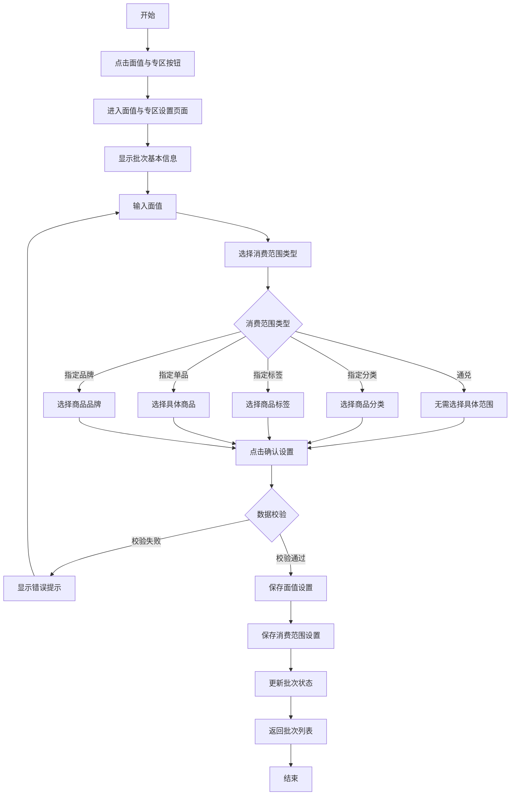

###### 3.2 业务规则

| 规则编号           | 规则名称     | 适用场景 | 规则描述                            | 错误提示          |
| -------------- | -------- | ---- | ------------------------------- | ------------- |
| RULE-SCOPE-001 | 面值必填     | 设置面值 | 面值必须填写                          | 请输入面值         |
| RULE-SCOPE-002 | 面值范围     | 设置面值 | 面值范围为1-100万积分                   | 面值范围为1-100万 |
| RULE-SCOPE-003 | 消费范围必选   | 设置专区 | 必须选择消费范围类型                      | 请选择消费范围类型     |
| RULE-SCOPE-004 | 分类选择     | 指定分类 | 至少选择一个商品分类                      | 请至少选择一个商品分类   |
| RULE-SCOPE-005 | 标签选择     | 指定标签 | 至少选择一个商品标签                      | 请至少选择一个商品标签   |
| RULE-SCOPE-006 | 单品选择     | 指定单品 | 至少选择一个商品                        | 请至少选择一个商品     |
| RULE-SCOPE-007 | 品牌选择     | 指定品牌 | 至少选择一个品牌                        | 请至少选择一个品牌     |
| RULE-SCOPE-008 | 面值编辑限制   | 设置面值 | 面值第一次设置保存后不可再编辑                 | -             |
| RULE-SCOPE-009 | 消费范围编辑限制 | 设置专区 | 消费范围始终可编辑，直至该批次下全部卡片有效期都失效后不可编辑 | -             |

###### 3.3 状态机设计

不适用，此功能无状态流转。

##### 4. 交互设计

###### 4.1 输入项说明

| 字段名称   | 字段标识                 | 字段类型  | 必填   | 数据类型   | 长度限制 | 校验规则      | 取值范围             | 来源   | 提示文案      | 备注      |
| ------ | -------------------- | ----- | ---- | ------ | ---- | --------- | ---------------- | ---- | --------- | ------- |
| 面值     | face\_value          | 数字输入  | 是    | Number | -    | 必填、正整数、范围 | 1-1000000        | 用户输入 | 请输入单张卡的面值 | -       |
| 消费范围类型 | consume\_scope\_type | 单选按钮  | 是    | Enum   | -    | 必选        | 通兑/指定分类/标签/单品/品牌 | 用户选择 | -         | 默认通兑    |
| 商品分类   | category\_ids        | 多选复选框 | 条件必填 | Array  | -    | 至少选一个     | 分类树              | 用户选择 | -         | 指定分类时必填 |
| 商品标签   | tag\_ids             | 多选复选框 | 条件必填 | Array  | -    | 至少选一个     | 标签列表             | 用户选择 | -         | 指定标签时必填 |
| 商品单品   | product\_ids         | 多选复选框 | 条件必填 | Array  | -    | 至少选一个     | 商品列表             | 用户选择 | -         | 指定单品时必填 |
| 商品品牌   | brand\_ids           | 多选复选框 | 条件必填 | Array  | -    | 至少选一个     | 品牌列表             | 用户选择 | -         | 指定品牌时必填 |

###### 4.2 交互说明

1. 点击"面值与专区"按钮，进入设置页面
2. 显示批次基本信息（批次号、名称、数量、状态）
3. 输入面值（积分）
   - 面值第一次设置保存后不可再编辑，输入框变为只读状态
4. 选择消费范围类型：
   - 通兑：全平台可用，无需选择具体范围
   - 指定分类：展开分类树，勾选商品分类
   - 指定标签：展开标签列表，勾选商品标签
   - 指定单品：搜索并勾选具体商品
   - 指定品牌：搜索并勾选商品品牌
   - 消费范围始终可编辑，直至该批次下全部卡片有效期都失效后不可编辑
5. 点击"确认设置"按钮保存
6. 点击"取消"按钮返回批次列表

###### 4.3 错误提示文案

**表单校验提示**

| 字段     | 校验规则 | 提示文案          |
| ------ | ---- | ------------- |
| 面值     | 未填写  | 请输入面值         |
| 面值     | 非正整数 | 请输入有效的面值      |
| 面值     | 超出范围 | 面值范围为1-100万 |
| 消费范围类型 | 未选择  | 请选择消费范围类型     |
| 商品分类   | 未选择  | 请至少选择一个商品分类   |
| 商品标签   | 未选择  | 请至少选择一个商品标签   |
| 商品单品   | 未选择  | 请至少选择一个商品     |
| 商品品牌   | 未选择  | 请至少选择一个品牌     |

**业务异常提示**

| 错误码       | 错误场景  | 提示文案            |
| --------- | ----- | --------------- |
| SCOPE-001 | 批次不存在 | 批次信息不存在或已被删除    |
| SCOPE-002 | 设置失败  | 面值与专区设置失败，请稍后重试 |

##### 5. 数据设计

###### 5.1 数据流转说明

| 字段/数据 | 来源     | 获取方式  | 说明       |
| ----- | ------ | ----- | -------- |
| 批次信息  | 批次表    | API查询 | 获取批次基本信息 |
| 商品分类  | 商品管理模块 | API查询 | 获取分类树结构  |
| 商品标签  | 商品管理模块 | API查询 | 获取标签列表   |
| 商品列表  | 商品管理模块 | API查询 | 搜索获取商品列表 |
| 品牌列表  | 商品管理模块 | API查询 | 获取品牌列表   |

###### 5.2 数据权限设计

去角色权限管理里自定义配置，列表的所有操作都要支持配置权限

##### 6. 扩展功能

不适用。

***

# 5. 非功能需求

## 5.1. 性能需求

| 指标名称   | 指标要求             |
| ------ | ---------------- |
| 页面加载时间 | 首屏加载 ≤ 3秒        |
| 操作响应时间 | 普通操作 ≤ 500ms     |
| 批量激活响应 | 1000张卡券激活 ≤ 10秒  |
| 导出响应时间 | 10000条数据导出 ≤ 30秒 |
| 并发用户数  | 支持100个用户同时操作     |

## 5.2. 兼容性需求

| 类型  | 要求                                         |
| --- | ------------------------------------------ |
| 浏览器 | Chrome 80+、Firefox 75+、Safari 13+、Edge 80+ |
| 分辨率 | 最低支持1366×768，推荐1920×1080                   |

## 5.3. 安全需求

| 安全项  | 要求                    |
| ---- | --------------------- |
| 卡密安全 | 卡密传输使用HTTPS加密，数据库加密存储 |
| 权限控制 | 基于角色的访问控制（RBAC）       |
| 数据隔离 | 渠道间数据相互隔离             |
| 操作审计 | 记录所有关键操作日志            |
| 文件上传 | 校验文件类型和大小，防止恶意文件上传    |

## 5.4. 可用性需求

| 指标     | 要求         |
| ------ | ---------- |
| 系统可用性  | 99.9%      |
| 故障恢复时间 | ≤ 1小时      |
| 数据备份   | 每日备份，保留30天 |

***

# 6. 附录

## 6.1. 术语表

| 术语   | 说明                                               |
| ---- | ------------------------------------------------ |
| 积分卡  | 一种预付性质的电子卡券，用户可通过兑换获得积分                          |
| 批次   | 同一批生成的积分卡券集合，具有相同的渠道、名称和有效期规则                    |
| 批次号  | 格式为YYYYMMDD+3位流水号，如20250909001，每天最多生成999个        |
| 卡密   | 8位字符，由数字2-9和大写字母A-Z（排除I和O）组成，如ZFYX9988，用于用户兑换积分卡 |
| 卡券编号 | 格式为批次号+动态位数序号，如20251225003125，根据批次总数量自动适配位数      |
| 激活   | 将积分卡从未激活状态变为已激活状态，激活后开始计算有效期                     |
| 兑换   | 用户使用卡密将积分卡中的积分充值到个人账户                            |
| 通兑   | 积分卡可在全平台所有商品中使用                                  |
| 消费范围 | 积分卡可使用的商品范围限制                                    |

## 6.2. 相关文档

| 文档名称    | 文档路径                          |
| ------- | ----------------------------- |
| 原型文件    | 积分卡券管理原型.html                 |
| PRD规范文档 | prd-template-specification.md |

***

# 7. 版本记录

| 版本号  | 修改日期       | 修改人  | 修改内容 |
| ---- | ---------- | ---- | ---- |
| V1.0 | 2024-04-01 | 产品经理 | 初稿创建 |

