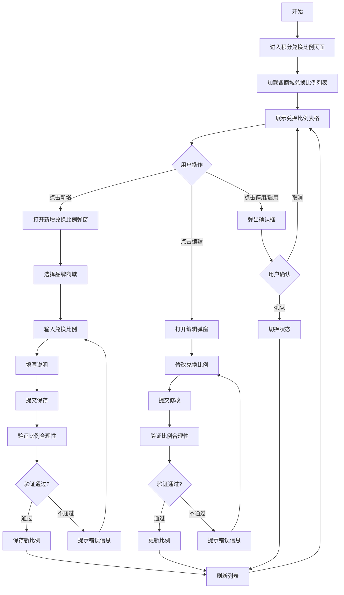
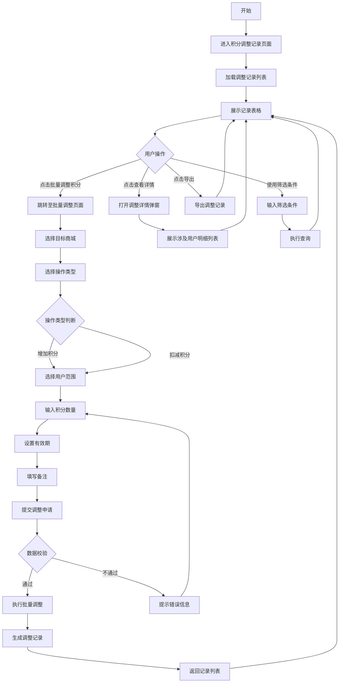
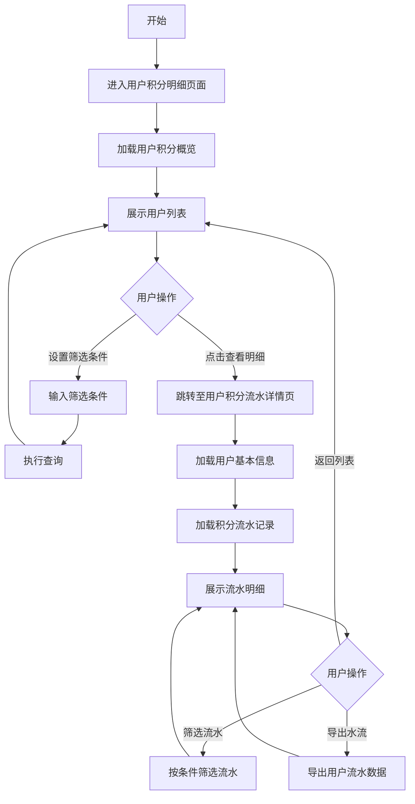
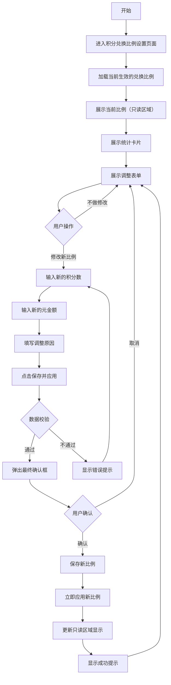
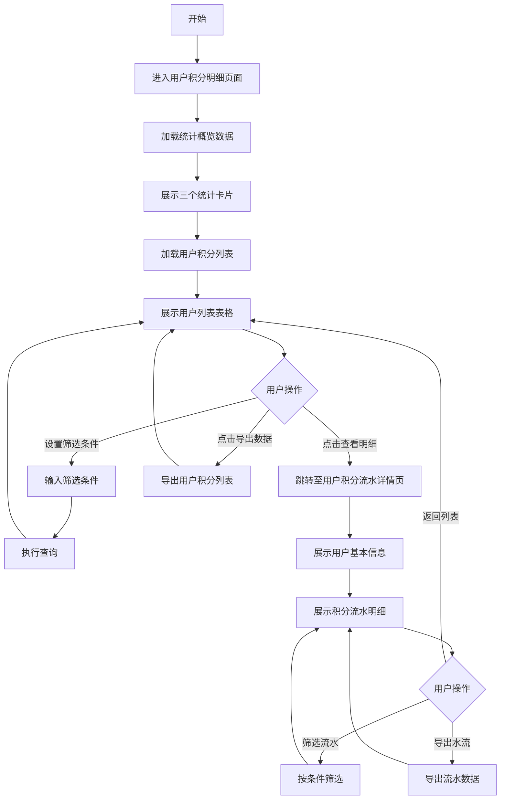

# 积分管理系统产品需求文档

# 1. 需求背景

---

# 2. 需求分析

---

# 3. 竞品分析

## 3.1. 主要竞品概览

根据本产品核心功能（积分兑换比例管理、批量积分调整、用户积分明细、多品牌商城后台），以下是市场主要竞品：

| 竞品 | 类型 | 核心定位 |与本产品相似度 |
|------|------|----------|-------------|
| **有赞积分系统** | SaaS电商 | 社交电商积分运营 | ⭐⭐⭐⭐ |
| **微盟积分商城** | SaaS零售 | 全渠道积分打通 | ⭐⭐⭐⭐⭐ |
| **兑吧** | 积分运营SaaS | 企业积分运营平台 | ⭐⭐⭐⭐ |
| **通卡积分系统** | 多商户联盟 | 超市/多商户积分通兑 | ⭐⭐⭐⭐⭐ |
| **思迅/二维火** | 行业解决方案 | 超市/餐饮收银+积分 | ⭐⭐⭐ |

## 3.2. 详细竞品分析

### 3.2.1. 有赞积分系统

**产品定位**：社交电商场景下的会员积分运营解决方案

**核心功能**：
- **积分获取**：签到送积分、购买送积分、评价送积分、分享互动送积分
- **积分使用**：积分抵现、兑换商品、参与活动、会员升级
- **后台管理**：积分规则自定义配置、积分商城独立运营、积分+现金混合支付、积分过期管理与提醒

**与本产品相似点**：
| 功能点 | 相似程度 | 说明 |
|--------|----------|------|
| 积分兑换比例配置 | ✅ 高 | 支持商家自定义积分抵扣比例 |
| 积分过期管理 | ✅ 高 | 提供积分有效期设置和过期提醒 |
| 用户积分明细查看 | ✅ 高 | 用户可查看积分余额和变动记录 |
| 多商户/多品牌支持 | ⚠️ 中 | 支持多店铺，但非核心定位 |

**差异化分析**：
- 有赞更侧重社交电商场景（社交裂变积分玩法）
- 本产品更强调多品牌商城独立后台管理
- 有赞积分与会员等级体系深度绑定，本产品积分相对独立

### 3.2.2. 微盟积分商城

**产品定位**：面向零售连锁、多渠道商家的全渠道积分管理解决方案

**核心功能**：
- **积分获取**：购物得积分、签到得积分、分享得积分
- **积分使用**：积分抵扣、积分兑换、积分抽奖
- **全渠道积分打通**：线上线下积分互通，统一管理
- **后台管理**：积分过期管理、积分活动策划工具、数据分析

**与本产品相似点**：
| 功能点 | 相似程度 | 说明 |
|--------|----------|------|
| 全渠道/多平台积分管理 | ✅✅ 极高 | 与本产品多品牌商城理念一致 |
| 积分兑换比例配置 | ✅ 高 | 支持商家自定义配置 |
| 积分过期提醒机制 | ✅ 高 | 完善的过期管理功能 |
| 用户积分流水明细 | ✅ 高 | 详细的变动记录查看 |
| 品牌独立后台 | ✅ 高 | 支持各品牌独立管理 |

**差异化分析**：
- 微盟专门针对零售连锁、多渠道商家设计
- 线上线下积分一体化管理能力更强
- 本产品可参考其多品牌商城架构设计

### 3.2.3. 兑吧积分运营平台

**产品定位**：企业积分运营服务平台，帮助企业搭建用户积分体系

**核心功能**：
- **积分商城搭建**：提供丰富的积分兑换商品库
- **积分活动运营**：积分抽奖、积分游戏、互动活动工具
- **积分消耗场景**：兑换、抽奖、游戏等多种消耗方式
- **数据分析**：用户画像、积分运营效果分析

**与本产品相似点**：
| 功能点 | 相似程度 | 说明 |
|--------|----------|------|
| 积分余额与变动明细管理 | ✅ 中 | 有用户积分管理功能 |
| 积分过期管理 | ✅ 中 | 支持积分有效期设置 |

**差异化分析**：
- 兑吧更偏重积分运营活动和消耗场景，而非基础积分管理后台
- 兑吧不侧重多品牌商城场景
- 兑吧提供丰富的积分活动工具（抽奖、游戏等），本产品暂未涉及

### 3.2.4. 通卡积分系统

**产品定位**：多商户联盟积分平台，超市零售行业积分解决方案

**核心功能**：
- **多商户联盟积分通兑**：不同商户间积分可互通使用
- **会员卡管理系统**：统一会员管理、跨商户识别
- **统一结算平台**：平台统一管理资金结算和积分清算
- **积分兑换与营销**：积分兑换商品、积分促销活动

**与本产品相似点**：
| 功能点 | 相似程度 | 说明 |
|--------|----------|------|
| 多商户/多品牌架构 | ✅✅ 极高 | 与本产品多品牌商城概念高度一致 |
| 积分通兑机制 | ✅ 高 | 支持跨商户积分使用 |
| 统一后台管理各商户积分 | ✅✅ 极高 | 运营后台统一管理 |
| 商户独立管理 | ✅ 高 | 各商户有独立后台 |

**差异化分析**：
- 通卡专门解决多商户积分互通问题，适合超市、联盟商户场景
- 通卡强调积分跨商户通兑，本产品积分按品牌商城隔离
- 本产品可参考其多品牌积分统一管理的设计思路

## 3.3. 竞品功能对比矩阵

| 功能维度 | 有赞 | 微盟 | 兑吧 | 通卡 | 本产品 |
|----------|------|------|------|------|---------|
| 积分兑换比例配置 | ✅ | ✅ | ❌ | ✅ | ✅ |
| 多品牌/多商户管理 | ✅ | ✅ | ❌ | ✅✅ | ✅✅ |
| 批量积分调整 | ✅ | ✅ | ❌ | ✅ | ✅ |
| 用户积分明细流水 | ✅ | ✅ | ✅ | ✅ | ✅ |
| 积分过期提醒 | ✅ | ✅ | ✅ | ✅ | ✅ |
| 品牌独立后台 | ❌ | ✅ | ❌ | ✅ | ✅✅ |
| 积分活动运营工具 | ✅✅ | ✅ | ✅✅ | ✅ | ❌ |
| 线上线下互通 | ❌ | ✅ | ❌ | ✅ | 待定 |
| 积分跨商户通兑 | ❌ | ❌ | ❌ | ✅✅ | ❌ |

## 3.4. 竞品调研建议

根据本产品特点，建议重点调研以下竞品：

### 3.4.1. 微盟积分商城（优先级：高）
- **调研重点**：全渠道积分管理架构、品牌独立后台设计
- **参考价值**：多品牌商城架构设计最佳参考
- **调研方式**：官网 https://www.weimob.com，申请演示账号

### 3.4.2. 通卡积分系统（优先级：高）
- **调研重点**：多商户积分互通机制、统一结算流程
- **参考价值**：多商户联盟积分管理最佳参考
- **调研方式**：联系商务获取产品手册和演示

### 3.4.3. 有赞积分系统（优先级：中）
- **调研重点**：积分规则配置界面设计、积分明细流水页面交互
- **参考价值**：成熟的积分后台UI/UX设计参考
- **调研方式**：官网 https://www.youzan.com，开通试用店铺

## 3.5. 本产品差异化优势

基于竞品分析，本产品应重点打造以下差异化能力：

| 差异化方向 | 竞品现状 | 本产品策略 |
|------------|----------|------------|
| 多品牌商城架构 | 微盟、通卡有类似功能 | 更清晰的权限隔离和数据隔离设计 |
| 积分兑换比例管理 | 各竞品功能相似 | 支持更灵活的比例调整和历史记录 |
| 批量积分调整 | 功能较为基础 | 提供更丰富的筛选条件和批量操作 |
| 用户积分明细 | 功能相似 | 更直观的即将过期提醒和数据可视化 |
| 积分过期管理 | 各竞品功能相似 | 提前30天预警，支持多维度提醒 |

---

# 4. 系统流程图

---

# 5. 详细需求

## 5.1. 商城运营后台系统

### 5.1.1. 积分卡券管理模块

#### 5.1.1.1. 积分兑换比例页面

##### 1. 功能概述
- **功能描述**：管理和配置各品牌商城的积分兑换比例，控制积分与人民币的换算关系
- **业务描述**：运营人员可为不同的品牌商城设置专属的积分兑换比例，用户在该商城消费时按照此比例进行积分抵扣。默认比例为固定1元（不可编辑）
- **使用角色**：商城运营人员、管理员
- **触发条件**：在左侧菜单选择"积分卡券管理"→"积分兑换比例"

##### 2. 界面设计
###### 2.1 页面原型
- 原型图链接：待补充

###### 2.2 输出项说明
| 字段名称 | 字段标识 | 数据类型 | 数据来源 | 格式说明 |
|----------|----------|----------|----------|----------|
| 序号 | sequence_number | integer | 系统自动生成 | 自增序号 |
| 品牌商城 | mall_name | string | 商城基础数据 | 商城名称 |
| 兑换比例 | exchange_ratio | string | 配置数据 | 格式："X : Y"，表示X积分=Y元 |
| 元金额 | money_amount | decimal | 固定值 | 固定为1元，不可编辑 |
| 说明 | description | string | 配置时录入 | 文本说明 |
| 状态 | status | string | 配置数据 | 枚举：启用（绿色）、停用（橙色） |
| 更新人 | updater | string | 系统记录 | 最后修改人 |
| 更新时间 | update_time | datetime | 系统自动记录 | 格式：YYYY-MM-DD HH:mm:ss |
| 操作 | operation | string | - | 编辑、停用/启用 |

##### 3. 业务逻辑
###### 3.1 流程图

###### 3.2 业务规则
| 规则编号 | 规则名称 | 适用场景 | 规则描述 | 错误提示 |
|----------|----------|----------|----------|----------|
| RULE-RATE-001 | 元金额固定 | 编辑比例 | 元金额字段固定为1，不允许修改 | 元金额固定为1元，不可修改 |
| RULE-RATIO-002 | 积分数值要求 | 设置比例 | 积分数必须为正整数，最小值为1 | 积分数必须为大于0的正整数 |
| RULE-RATIO-003 | 唯一性约束 | 新增比例 | 每个品牌商城只能有一个启用的兑换比例 | 该商城已有启用的兑换比例 |
| RULE-RATIO-004 | 比例合理性 | 设置比例 | 推荐积分:元比例在1:1至100:1之间 | 建议兑换比例在合理范围内 |

##### 4. 交互设计
###### 4.1 输入项说明
| 字段名称 | 字段标识 | 字段类型 | 必填 | 数据类型 | 长度限制 | 校验规则 | 取值范围 | 来源 | 提示文案 | 备注 |
|----------|----------|----------|------|----------|----------|----------|----------|------|----------|------|
| 品牌商城 | mall_name | 下拉选择 | 是 | string | 50 | 非空校验 | 商城列表 | 用户选择 | 请选择品牌商城 | - |
| 兑换比例（积分数） | points_ratio | 数字框 | 是 | integer | - | 正整数校验 | ≥1 | 用户输入 | 请输入积分数 | - |
| 兑换比例（元金额） | money_ratio | 数字框 | 是 | decimal | - | 固定值 | 固定为1 | 系统设定 | 固定为1元 | 不可编辑 |
| 说明 | description | 文本域 | 否 | string | 500 | - | - | 用户输入 | 请输入说明 | 选填 |
| 状态 | status | 下拉选择 | 是 | enum | - | - | 启用/停用 | 用户选择 | 请选择状态 | 默认"启用" |

###### 4.2 交互说明
1. **页面加载**：展示所有品牌商城的积分兑换比例配置列表
2. **新增比例**：点击"新增"按钮，弹出新增弹窗，选择商城并设置比例
3. **编辑比例**：点击"编辑"按钮，在弹窗中修改比例参数
4. **元金额字段**：始终显示为1，置灰不可编辑
5. **状态切换**：点击"停用"或"启用"按钮，经确认后切换状态
6. **即时生效**：保存后的兑换比例立即生效，影响后续消费结算

###### 4.3 错误提示文案
**表单校验提示**：
| 场景 | 提示文案 |
|------|----------|
| 品牌商城未选择 | 请选择品牌商城 |
| 积分数为空 | 请输入积分数 |
| 积分数非法 | 积分数必须为正整数 |

**业务异常提示**：
| 错误码 | 异常场景 | 提示文案 |
|--------|----------|----------|
| RATE-001 | 商城已有启用比例 | 该商城已有启用的兑换比例，请先停用原比例 |
| RATE-002 | 参数错误 | 兑换比例参数不合法 |

##### 5. 数据设计
###### 5.1 数据流转说明
| 字段/数据 | 来源 | 获取方式 | 说明 |
|----------|------|----------|------|
| 品牌商城列表 | 基础数据服务 | 接口获取 | 可用的品牌商城列表 |
| 元金额 | 系统 | 固定值 | 始终为1，不可修改 |
| 更新人 | 系统 | 当前登录用户 | 记录最后修改人 |
| 更新时间 | 系统 | 自动记录 | 最后修改的时间戳 |

###### 5.2 数据权限设计
- **角色数据范围**：
  - 超级管理员：可管理所有商城的兑换比例
  - 商城管理员：仅可管理本商城的兑换比例
- **功能权限点**：
  - rate_view：查看兑换比例
  - rate_add：新增兑换比例
  - rate_edit：编辑兑换比例
  - rate_enable_disable：启用/停用兑换比例

#### 5.1.1.2. 积分调整记录页面

##### 1. 功能概述
- **功能描述**：记录和管理批量积分调整操作，包括增加积分和扣减积分两种类型，支持查看调整详情和导出记录
- **业务描述**：运营人员可在此页面查看所有的批量积分调整历史记录，了解每次调整涉及的商城、用户数、积分数等信息，并可发起新的批量调整操作
- **使用角色**：商城运营人员、管理员
- **触发条件**：在左侧菜单选择"积分卡券管理"→"积分调整记录"

##### 2. 界面设计
###### 2.1 页面原型
- 原型图链接：待补充

###### 2.2 输出项说明
| 字段名称 | 字段标识 | 数据类型 | 数据来源 | 格式说明 |
|----------|----------|----------|----------|----------|
| 序号 | sequence_number | integer | 系统自动生成 | 自增序号 |
| 品牌商城 | mall_name | string | 调整时选择 | 商城名称 |
| 操作类型 | operation_type | string | 调整时选择 | 枚举：增加积分（绿色标签）、扣减积分（红色文本） |
| 涉及用户数 | user_count | integer | 系统统计 | 人数，如"150 人" |
| 总积分数量 | total_points | string | 系统计算 | 格式："+X,XXX 积分"或"-X,XXX 积分"，带颜色标识 |
| 有效期至 | validity_date | date | 调整时设置 | 格式：YYYY-MM-DD，扣减时显示为"-" |
| 操作人 | operator | string | 系统记录 | 操作人姓名/账号 |
| 操作时间 | operate_time | datetime | 系统自动记录 | 格式：YYYY-MM-DD HH:mm:ss |
| 操作 | operation | string | - | 查看详情 |

##### 3. 业务逻辑
###### 3.1 流程图

###### 3.2 业务规则
| 规则编号 | 规则名称 | 适用场景 | 规则描述 | 错误提示 |
|----------|----------|----------|----------|----------|
| RULE-ADJUST-001 | 用户范围选择 | 批量调整 | 支持按全平台用户、指定商品标签、指定品牌、指定商品四种方式选择目标用户 | 请选择用户范围 |
| RULE-ADJUST-002 | 积分数量限制 | 批量调整 | 单次调整每人积分数量范围为0.01-999999.99，保留两位小数 | 单人积分数量需在0.01-999999.99之间 |
| RULE-ADJUST-003 | 有效期设置 | 增加积分 | 增加积分时必须设置有效期，扣减积分无需设置 | 请设置积分有效期 |
| RULE-ADJUST-004 | 余额校验 | 扣减积分 | 扣减积分时需校验用户余额是否充足 | 部分用户余额不足，无法完成扣减 |
| RULE-ADJUST-005 | 操作频率限制 | 批量调整 | 同一商城每日最多进行10次批量调整操作 | 今日操作次数已达上限 |

##### 4. 交互设计
###### 4.1 输入项说明
| 字段名称 | 字段标识 | 字段类型 | 必填 | 数据类型 | 长度限制 | 校验规则 | 取值范围 | 来源 | 提示文案 | 备注 |
|----------|----------|----------|------|----------|----------|----------|----------|------|----------|------|
| 品牌商城 | mall_name | 下拉选择 | 否 | string | 50 | - | 全部商城列表 | 用户选择 | 请选择商城 | 用于筛选 |
| 操作类型 | operation_type | 下拉选择 | 否 | enum | - | - | 全部/增加积分/扣减积分 | 用户选择 | 请选择类型 | 用于筛选 |
| 操作时间（开始） | operate_time_start | 日期选择器 | 否 | date | - | - | - | 用户选择 | 开始日期 | - |
| 操作时间（结束） | operate_time_end | 日期选择器 | 否 | date | - | - | - | 用户选择 | 结束日期 | - |

**批量调整表单字段**：
| 字段名称 | 字段标识 | 字段类型 | 必填 | 数据类型 | 长度限制 | 校验规则 | 取值范围 | 来源 | 提示文案 | 备注 |
|----------|----------|----------|------|----------|----------|----------|----------|------|----------|------|
| 目标商城 | target_mall | 下拉选择 | 是 | string | 50 | 非空校验 | 商城列表 | 用户选择 | 请选择目标商城 | - |
| 操作类型 | adjust_type | 单选按钮 | 是 | enum | - | - | 增加积分/扣减积分 | 用户选择 | 请选择操作类型 | - |
| 选择方式 | select_method | 单选按钮 | 是 | enum | - | - | 全平台用户/指定商品标签/指定品牌/指定商品 | 用户选择 | 请选择用户范围 | 不含条件筛选选项 |
| 商品标签 | product_tags | 多选框 | 条件必选 | array | - | - | 标签列表 | 用户选择 | 请选择标签 | 选择方式为"指定商品标签"时必填 |
| 品牌 | brands | 多选框 | 条件必选 | array | - | - | 品牌列表 | 用户选择 | 请选择品牌 | 选择方式为"指定品牌"时必填 |
| 商品 | products | 表格多选 | 条件必选 | array | - | - | 商品列表 | 用户选择 | 请选择商品 | 选择方式为"指定商品"时必填 |
| 每人积分数量 | per_user_points | 数字框 | 是 | decimal(10,2) | - | 范围校验，保留两位小数 | 0.01-999999.99 | 用户输入 | 请输入每人积分数量 | - |
| 有效期至 | validity_date | 日期选择器 | 条件必选 | date | - | - | - | 用户选择 | 请选择有效期 | 增加积分时必填 |
| 备注 | remark | 文本域 | 否 | string | 500 | - | - | 用户输入 | 请输入备注说明 | 选填 |

###### 4.2 交互说明
1. **页面加载**：默认展示全部调整记录，按操作时间倒序排列
2. **筛选查询**：支持按商城、操作类型、时间范围筛选
3. **发起批量调整**：点击"➕ 批量调整积分"按钮，跳转至独立的批量调整页面
4. **批量调整流程**：
   - 第一步：选择目标品牌商城
   - 第二步：选择操作类型（增加/扣减）
   - 第三步：选择用户范围方式（全平台/商品标签/品牌/商品）
   - 第四步：根据选择方式显示对应的选项（标签列表/品牌列表/商品表格）
   - 第五步：输入每人积分数量
   - 第六步：如为增加积分，需设置有效期
   - 第七步：填写备注说明
   - 第八步：确认提交
5. **查看详情**：点击"查看详情"按钮，弹窗展示该次调整涉及的用户明细列表
6. **导出功能**：点击"📥 导出记录"按钮，导出当前查询结果

###### 4.3 错误提示文案
**表单校验提示**：
| 场景 | 提示文案 |
|------|----------|
| 目标商城未选择 | 请选择目标品牌商城 |
| 操作类型未选择 | 请选择操作类型 |
| 用户范围未选择 | 请选择用户范围 |
| 积分数量为空 | 请输入每人积分数量 |
| 积分数量超范围 | 单人积分数量需在1-100000之间 |
| 有效期未设置 | 请设置积分有效期 |
| 商品标签未选择 | 请至少选择一个商品标签 |
| 品牌未选择 | 请至少选择一个品牌 |
| 商品未选择 | 请至少选择一个商品 |

**业务异常提示**：
| 错误码 | 异常场景 | 提示文案 |
|--------|----------|----------|
| ADJUST-001 | 用户余额不足 | 部分用户积分余额不足，无法完成扣减操作 |
| ADJUST-002 | 操作频率超限 | 今日该商城批量调整次数已达上限（10次） |
| ADJUST-003 | 无符合条件的用户 | 未找到符合所选条件的用户 |

##### 5. 数据设计
###### 5.1 数据流转说明
| 字段/数据 | 来源 | 获取方式 | 说明 |
|----------|------|----------|------|
| 涉及用户数 | 系统 | 根据选择条件统计 | 实时计算符合条件的用户数量 |
| 总积分数量 | 系统 | 用户数×每人积分 | 自动计算总调整积分数 |
| 调整记录ID | 系统 | 自动生成 | 唯一标识每次调整操作 |
| 操作人 | 系统 | 当前登录用户 | 记录操作责任人 |

###### 5.2 数据权限设计
- **角色数据范围**：
  - 超级管理员：可查看和操作全部商城的调整记录
  - 商城管理员：仅可查看和操作本商城的调整记录
- **功能权限点**：
  - adjust_record_view：查看调整记录
  - adjust_batch_execute：执行批量调整
  - adjust_record_detail：查看调整详情
  - adjust_record_export：导出调整记录

##### 6. 扩展功能
###### 6.1 批量操作规则
| 操作名称 | 单次上限 | 前置条件 | 成功提示 |
|----------|----------|----------|----------|
| 批量调整积分 | 100000用户 | 选择目标用户范围 | 成功为X个用户调整积分 |
| 导出记录 | 10000条 | 无 | 导出成功，共X条记录 |

###### 6.2 操作日志要求
| 操作类型 | 记录内容 | 保留时长 |
|----------|----------|----------|
| 批量增加积分 | 操作人、商城、用户数、总积分、有效期、操作时间 | 永久保留 |
| 批量扣减积分 | 操作人、商城、用户数、总积分、操作时间 | 永久保留 |
| 查看调整详情 | 操作人、记录ID、查看时间 | 保留180天 |

#### 5.1.1.3. 用户积分明细页面

##### 1. 功能概述
- **功能描述**：查看各品牌商城用户的积分余额及变动明细，支持按多种条件筛选，可查看每个用户的积分流水记录
- **业务描述**：运营人员可在此页面监控用户的积分状态，包括当前余额、累计获得、已消费、即将过期等指标，并可追溯每笔积分变动的详细来源
- **使用角色**：商城运营人员、管理员
- **触发条件**：在左侧菜单选择"积分卡券管理"→"用户积分明细"

##### 2. 界面设计
###### 2.1 页面原型
- 原型图链接：待补充

###### 2.2 输出项说明
| 字段名称 | 字段标识 | 数据类型 | 数据来源 | 格式说明 |
|----------|----------|----------|----------|----------|
| 序号 | sequence_number | integer | 系统自动生成 | 自增序号 |
| 手机号 | phone | string | 用户注册信息 | 脱敏显示，如138****8888 |
| 当前积分余额 | current_balance | decimal(10,2) | 系统实时计算 | 带颜色和加粗显示，保留两位小数，如蓝色12,580.50 |
| 累计获得 | total_earned | decimal(10,2) | 系统统计 | 绿色显示，保留两位小数 |
| 已消费 | total_consumed | decimal(10,2) | 系统统计 | 红色显示，保留两位小数 |
| 即将过期 | expiring_soon | decimal(10,2) | 系统计算 | 30天内即将过期的积分，橙色加粗显示，保留两位小数 |
| 操作 | operation | string | - | 查看明细 |

##### 3. 业务逻辑
###### 3.1 流程图

###### 3.2 业务规则
| 规则编号 | 规则名称 | 适用场景 | 规则描述 | 错误提示 |
|----------|----------|----------|----------|----------|
| RULE-USER-001 | 手机号脱敏 | 列表展示 | 手机号中间4位以*号替代 | - |
| RULE-USER-002 | 即将过期定义 | 过期提醒 | 距离失效日期30天内的积分标记为即将过期 | - |
| RULE-USER-003 | 变动类型枚举 | 流水筛选 | 积分变动类型分为三类：卡券变动、消费变动、手动修改 | - |
| RULE-USER-004 | 来源说明格式 | 流水展示 | 不同类型的变动有不同的来源/用途说明格式 | - |

**来源/用途说明格式规范**：

| 变动类型 | 说明格式 | 示例 |
|----------|----------|------|
| 消费变动 | 订单号：xx，消费积分xx / 订单号：xx，退回积分xx | 订单号：ORD240201001，消费积分500 |
| 手工变动 | 新增积分xx（备注说明）/扣减积分xx（备注说明） | 新增积分1000（五一活动奖励） |
| 卡券变动 | 新增积分xx，批次号xx | 新增积分100，批次号20250909001 |

##### 4. 交互设计
###### 4.1 输入项说明
| 字段名称 | 字段标识 | 字段类型 | 必填 | 数据类型 | 长度限制 | 校验规则 | 取值范围 | 来源 | 提示文案 | 备注 |
|----------|----------|----------|------|----------|----------|----------|----------|------|----------|------|
| 品牌商城 | mall_name | 下拉选择 | 否 | string | 50 | - | 全部商城列表 | 用户选择 | 请选择商城 | - |
| 用户账号/手机号 | user_identifier | 文本框 | 否 | string | 50 | - | - | 用户输入 | 请输入用户账号或手机号 | 支持模糊匹配 |
| 积分变动类型 | change_type | 下拉选择 | 否 | enum | - | - | 全部/卡券变动/消费变动/手动修改 | 用户选择 | 请选择变动类型 | - |
| 查询时间（开始） | query_time_start | 日期选择器 | 否 | date | - | - | - | 用户选择 | 开始日期 | - |
| 查询时间（结束） | query_time_end | 日期选择器 | 否 | date | - | - | - | 用户选择 | 结束日期 | - |

**积分流水详情页筛选字段**：
| 字段名称 | 字段标识 | 字段类型 | 必填 | 数据类型 | 长度限制 | 校验规则 | 取值范围 | 来源 | 提示文案 | 备注 |
|----------|----------|----------|------|----------|----------|----------|----------|------|----------|------|
| 变动类型 | flow_change_type | 下拉选择 | 否 | enum | - | - | 全部类型/卡券变动/手动修改/消费变动 | 用户选择 | 请选择变动类型 | - |
| 时间范围（开始） | flow_time_start | 日期选择器 | 否 | date | - | - | - | 用户选择 | 开始日期 | - |
| 时间范围（结束） | flow_time_end | 日期选择器 | 否 | date | - | - | - | 用户选择 | 结束日期 | - |

###### 4.2 交互说明
1. **页面加载**：默认展示全部用户的积分概览列表
2. **多维度筛选**：支持按商城、用户标识、变动类型、时间范围组合筛选
3. **查看明细**：点击"查看明细"按钮，跳转至该用户的积分流水详情页
4. **积分流水详情页**：
   - 展示用户基本信息（手机号）
   - 展示积分流水明细表格，包含：流水号、变动时间、变动类型、变动积分（带颜色）、变动后余额、来源/用途说明、过期时间、来源
   - **过期积分特殊标记**：即将过期的积分（30天内）在变动积分列显示圆形感叹号图标（⚠️），鼠标悬停显示tooltip提示"该积分30天内即将过期"
   - 支持按变动类型和时间范围筛选流水记录
   - 提供"返回用户列表"和"导出水流数据"操作
5. **即将过期标识**：用户列表中的"即将过期"列以橙色加粗显示，引起运营人员注意

###### 4.3 错误提示文案
**表单校验提示**：
| 场景 | 提示文案 |
|------|----------|
| 日期范围错误 | 结束日期不能早于开始日期 |

**业务异常提示**：
| 错误码 | 异常场景 | 提示文案 |
|--------|----------|----------|
| USER-001 | 用户不存在 | 该用户不存在或已被注销 |

##### 5. 数据设计
###### 5.1 数据流转说明
| 字段/数据 | 来源 | 获取方式 | 说明 |
|----------|------|----------|------|
| 当前积分余额 | 系统 | 实时计算 | 根据用户所有积分变动汇总 |
| 累计获得 | 系统 | 统计计算 | 所有正向变动的总和 |
| 已消费 | 系统 | 统计计算 | 所有消费类负向变动总和 |
| 即将过期 | 系统 | 计算 | 统计30天内即将失效的积分 |
| 积分流水 | 系统 | 流水表查询 | 按时间倒序排列 |

###### 5.2 数据权限设计
- **角色数据范围**：
  - 超级管理员：可查看所有商城的用户积分数据
  - 商城管理员：仅可查看本商城的用户积分数据
- **功能权限点**：
  - user_points_view：查看用户积分列表
  - user_points_detail：查看用户积分流水详情
  - user_points_export：导出用户积分数据

---

## 5.2. 品牌商城管理后台系统

### 5.2.1. 积分卡券管理模块

#### 5.2.1.1. 积分兑换比例设置页面

##### 1. 功能概述
- **功能描述**：为品牌商城设置专属的积分兑换比例，覆盖系统全局默认值，控制用户在本商城消费时的积分抵扣规则
- **业务描述**：品牌商城管理员可根据运营策略灵活调整本商城的积分兑换比例。设置后，用户在该商城消费时将按照此比例进行积分抵扣。页面展示当前生效的比例、统计数据，并提供调整入口
- **使用角色**：品牌商城管理员
- **触发条件**：登录品牌商城管理后台，在左侧菜单选择"积分卡券管理"→"积分兑换比例"

##### 2. 界面设计
###### 2.1 页面原型
- 原型图链接：待补充

###### 2.2 输出项说明
| 字段名称 | 字段标识 | 数据类型 | 数据来源 | 格式说明 |
|----------|----------|----------|----------|----------|
| 当前生效的兑换比例 | current_ratio | string | 系统配置 | 格式："X : Y"，大字号展示，如"10 : 1" |
| 比例说明 | ratio_description | string | 系统计算 | 文本说明，如"即 10 积分 = 1 元人民币" |
| 新兑换比例（积分数） | new_points_ratio | number | 用户输入 | 正整数 |
| 新兑换比例（元金额） | new_money_ratio | number | 用户输入 | 正数，支持小数 |
| 调整原因/备注 | adjust_reason | text | 用户输入 | 文本说明，必填 |

**统计卡片输出项**：
| 字段名称 | 字段标识 | 数据类型 | 数据来源 | 格式说明 |
|----------|----------|----------|----------|----------|
| 当前生效的兑换比例 | current_ratio_display | string | 系统配置 | 大字号展示，如"10 : 1" |

##### 3. 业务逻辑
###### 3.1 流程图

###### 3.2 业务规则
| 规则编号 | 规则名称 | 适用场景 | 规则描述 | 错误提示 |
|----------|----------|----------|----------|----------|
| RULE-BRAND-RATE-001 | 积分数值要求 | 设置比例 | 积分数必须为≥1的正整数 | 请输入有效的积分数值 |
| RULE-BRAND-RATE-002 | 元金额要求 | 设置比例 | 元金额必须>0的正数 | 请输入有效的金额数值 |
| RULE-BRAND-RATE-003 | 调整原因必填 | 保存比例 | 调整原因/备注为必填项 | 请输入调整原因或备注信息 |
| RULE-BRAND-RATE-004 | 即时生效 | 保存比例 | 保存后新比例立即生效，影响后续消费 | - |
| RULE-BRAND-RATE-005 | 历史记录 | 调整操作 | 每次调整都会记录历史，但本页面不展示历史记录（已在需求中删除） | - |

##### 4. 交互设计
###### 4.1 输入项说明
| 字段名称 | 字段标识 | 字段类型 | 必填 | 数据类型 | 长度限制 | 校验规则 | 取值范围 | 来源 | 提示文案 | 备注 |
|----------|----------|----------|------|----------|----------|----------|----------|------|----------|------|
| 新兑换比例（积分数） | new_points_ratio | 数字框 | 是 | integer | - | 正整数校验，min=1 | ≥1 | 用户输入 | 积分数 | 支持键盘输入 |
| 新兑换比例（元金额） | new_money_ratio | 数字框 | 是 | decimal | - | 正数校验，min=0.1，step=0.1 | >0 | 用户输入 | 金额数 | 支持小数，如0.5、1等 |
| 调整原因/备注 | adjust_reason | 文本域 | 是 | string | 500 | 非空校验 | - | 用户输入 | 请输入调整原因或备注信息 | 必填 |

###### 4.2 交互说明
1. **页面加载**：
   - 顶部显示功能说明文字，介绍本页面的作用
   - 展示统计卡片，显示当前生效的兑换比例（如"10 : 1"），附带说明文字
   - 显示调整表单区域，分为两部分：
     - 上方：当前兑换比例（只读），灰色背景展示，不可编辑
     - 下方：新兑换比例（可编辑），两个数字输入框分别对应积分数和元金额
2. **调整流程**：
   - 在"新兑换比例"区域输入新的积分数和元金额
   - 在"调整原因/备注"文本域填写调整原因（必填）
   - 点击"✅ 保存并应用新比例"按钮（大按钮，居中显示）
   - 系统校验输入值的合法性
   - 弹出确认对话框，让用户最终确认是否应用新比例
   - 确认后保存并立即生效
   - 顶部的"当前兑换比例"只读区域更新为新值
   - 显示成功Toast提示
3. **UI特点**：
   - 当前比例区域使用灰色背景，明确标识为只读
   - 新比例输入框并排显示，中间用"积分 ="和"元"连接
   - 保存按钮样式突出，位于表单底部居中位置
   - 整体采用卡片式布局，视觉清晰

###### 4.3 错误提示文案
**表单校验提示**：
| 场景 | 提示文案 |
|------|----------|
| 积分数为空 | 请输入积分数 |
| 积分数非法 | 请输入有效的积分数值（正整数） |
| 元金额为空 | 请输入金额数 |
| 元金额非法 | 请输入有效的金额数值 |
| 调整原因为空 | 请输入调整原因或备注信息 |

**业务异常提示**：
| 错误码 | 异常场景 | 提示文案 |
|--------|----------|----------|
| BRAND-RATE-001 | 保存失败 | 兑换比例保存失败，请重试 |
| BRAND-RATE-002 | 无权限 | 您没有权限修改兑换比例 |

##### 5. 数据设计
###### 5.1 数据流转说明
| 字段/数据 | 来源 | 获取方式 | 说明 |
|----------|------|----------|------|
| 当前兑换比例 | 配置中心 | API获取 | 本商城当前生效的比例配置 |
| 新兑换比例 | 用户输入 | 表单提交 | 用户在界面输入的新值 |
| 调整原因 | 用户输入 | 表单提交 | 用户填写的调整说明 |
| 操作人 | 系统 | 当前登录用户 | 自动记录当前操作的管理员 |
| 操作时间 | 系统 | 自动记录 | 保存操作的时间戳 |

###### 5.2 数据权限设计
- **角色数据范围**：
  - 品牌商城管理员：仅可管理本商城的兑换比例
  - 超级管理员：可管理任意商城的兑换比例
- **功能权限点**：
  - brand_rate_view：查看当前兑换比例
  - brand_rate_edit：修改兑换比例

#### 5.2.1.2. 用户积分明细页面

##### 1. 功能概述
- **功能描述**：展示本品牌商城所有用户的积分概况，包括总用户数、总积分余额、零积分用户数等统计指标，以及每个用户的积分余额、累计获得、已消费、即将过期等详细信息
- **业务描述**：品牌商城管理员可在此页面监控本商城用户的整体积分状况和个体积分情况，快速识别高价值用户和即将流失用户（积分即将过期），支持按条件筛选和导出数据
- **使用角色**：品牌商城管理员
- **触发条件**：在左侧菜单选择"积分卡券管理"→"用户积分明细"

##### 2. 界面设计
###### 2.1 页面原型
- 原型图链接：待补充

###### 2.2 输出项说明
**统计卡片**：
| 字段名称 | 字段标识 | 数据类型 | 数据来源 | 格式说明 |
|----------|----------|----------|----------|----------|
| 总用户数 | total_users | integer | 系统统计 | 大字号显示，如"12,456 人" |
| 总积分余额 | total_balance | decimal(12,2) | 系统统计 | 绿色大字号显示，保留两位小数，如"8,562,340.50 积分" |
| 零积分用户数 | zero_balance_users | integer | 系统统计 | 红色大字号显示，如"1,234 人" |

**用户列表**：
| 字段名称 | 字段标识 | 数据类型 | 数据来源 | 格式说明 |
|----------|----------|----------|----------|----------|
| 复选框 | checkbox | boolean | - | 用于批量选择 |
| 序号 | sequence_number | integer | 系统自动生成 | 自增序号 |
| 手机号 | phone | string | 用户注册信息 | 脱敏显示，如138****8888 |
| 当前积分余额 | current_balance | decimal(10,2) | 系统实时计算 | 蓝色加粗大字号显示，保留两位小数，如12,580.50 |
| 累计获得 | total_earned | decimal(10,2) | 系统统计 | 绿色显示，保留两位小数 |
| 已消费 | total_consumed | decimal(10,2) | 系统统计 | 红色显示，保留两位小数 |
| 即将过期 | expiring_soon | decimal(10,2) | 系统计算 | 橙色加粗显示，保留两位小数，如2,000.50 |
| 操作 | operation | string | - | 查看明细 |

##### 3. 业务逻辑
###### 3.1 流程图

###### 3.2 业务规则
| 规则编号 | 规则名称 | 适用场景 | 规则描述 | 错误提示 |
|----------|----------|----------|----------|----------|
| RULE-BRAND-USER-001 | 数据隔离 | 数据展示 | 仅展示本品牌商城的用户积分数据 | - |
| RULE-BRAND-USER-002 | 手机号脱敏 | 信息保护 | 手机号中间4位以*号替代显示 | - |
| RULE-BRAND-USER-003 | 即将过期定义 | 过期提醒 | 距离失效日期30天内的积分标记为即将过期 | - |
| RULE-BRAND-USER-004 | 零积分用户识别 | 用户分类 | 当前积分余额为0的用户计入零积分用户数 | - |

##### 4. 交互设计
###### 4.1 输入项说明
| 字段名称 | 字段标识 | 字段类型 | 必填 | 数据类型 | 长度限制 | 校验规则 | 取值范围 | 来源 | 提示文案 | 备注 |
|----------|----------|----------|------|----------|----------|----------|----------|------|----------|------|
| 用户账号/手机号 | user_identifier | 文本框 | 否 | string | 50 | - | - | 用户输入 | 请输入用户账号或手机号 | 支持模糊匹配 |
| 积分余额（最小值） | balance_min | 数字框 | 否 | decimal(10,2) | - | 数值校验，保留两位小数 | ≥0.00 | 用户输入 | 最小值 | - |
| 积分余额（最大值） | balance_max | 数字框 | 否 | decimal(10,2) | - | 数值校验，保留两位小数 | ≥0.00 | 用户输入 | 最大值 | - |
| 最后活跃时间（开始） | last_active_start | 日期选择器 | 否 | date | - | - | - | 用户选择 | 开始日期 | - |
| 最后活跃时间（结束） | last_active_end | 日期选择器 | 否 | date | - | - | - | 用户选择 | 结束日期 | - |

**积分流水详情页筛选字段**：
| 字段名称 | 字段标识 | 字段类型 | 必填 | 数据类型 | 长度限制 | 校验规则 | 取值范围 | 来源 | 提示文案 | 备注 |
|----------|----------|----------|------|----------|----------|----------|----------|------|----------|------|
| 变动类型 | change_type | 下拉选择 | 否 | enum | - | - | 全部类型/卡券变动/手动修改/消费变动 | 用户选择 | 请选择变动类型 | - |
| 时间范围（开始） | time_start | 日期选择器 | 否 | date | - | - | - | 用户选择 | 开始日期 | - |
| 时间范围（结束） | time_end | 日期选择器 | 否 | date | - | - | - | 用户选择 | 结束日期 | - |

###### 4.2 交互说明
1. **页面加载**：
   - 顶部显示功能说明文字
   - 展示三个统计卡片（总用户数、总积分余额、零积分用户数），使用不同颜色的左边框区分
   - 显示搜索栏和用户列表表格
2. **统计卡片**：
   - 总用户数：蓝色左边框
   - 总积分余额：绿色左边框
   - 零积分用户数：红色左边框（用于识别潜在流失用户）
3. **用户列表**：
   - 支持复选框批量选择
   - 手机号脱敏显示
   - 当前积分余额使用蓝色加粗大字号突出显示
   - 即将过期积分使用橙色加粗显示，引起注意
4. **查看明细**：点击"查看明细"按钮，跳转至用户积分流水详情页
5. **导出功能**：点击"📥 导出数据"按钮，导出当前查询结果
6. **积分流水详情页**：
   - 顶部显示"← 返回用户列表"按钮
   - 展示用户基本信息卡片（仅显示手机号）
   - 展示积分流水明细表格，包含：序号、流水号、变动时间、变动类型、变动积分（带颜色）、变动后余额、来源/用途说明、过期时间、来源
   - 支持按变动类型和时间范围筛选
   - 提供"导出水流数据"功能

###### 4.3 错误提示文案
**表单校验提示**：
| 场景 | 提示文案 |
|------|----------|
| 余额范围错误 | 最大值不能小于最小值 |
| 日期范围错误 | 结束日期不能早于开始日期 |

**业务异常提示**：
| 错误码 | 异常场景 | 提示文案 |
|--------|----------|----------|
| BRAND-USER-001 | 用户不存在 | 该用户不存在或已注销 |

##### 5. 数据设计
###### 5.1 数据流转说明
| 字段/数据 | 来源 | 获取方式 | 说明 |
|----------|------|----------|------|
| 统计卡片数据 | 系统 | 聚合查询 | 实时统计本商城用户积分数据 |
| 用户列表 | 系统 | 分页查询 | 按条件筛选后分页返回 |
| 积分流水 | 系统 | 流水表查询 | 按用户ID查询所有变动记录 |

###### 5.2 数据权限设计
- **角色数据范围**：
  - 品牌商城管理员：仅可查看本商城的数据
  - 数据严格隔离，跨商城数据不可见
- **功能权限点**：
  - brand_user_list：查看用户积分列表
  - brand_user_detail：查看用户积分流水详情
  - brand_user_export：导出用户积分数据

##### 6. 扩展功能
###### 6.1 批量操作规则
| 操作名称 | 单次上限 | 前置条件 | 成功提示 |
|----------|----------|----------|----------|
| 导出用户数据 | 10000条 | 无 | 导出成功，共X条数据 |
| 导出流水数据 | 50000条 | 无 | 导出成功，共X条记录 |

###### 6.2 操作日志要求
| 操作类型 | 记录内容 | 保留时长 |
|----------|----------|----------|
| 查询用户列表 | 操作人、筛选条件、查询时间 | 保留90天 |
| 查看用户流水详情 | 操作人、用户标识、查看时间 | 保留90天 |
| 导出用户数据 | 操作人、导出条件、导出数量、导出时间 | 永久保留 |
| 导出流水数据 | 操作人、用户标识、导出时间 | 永久保留 |

---

# 6. 非功能需求

## 6.1. 性能需求
| 指标名称 | 指标要求 |
|----------|----------|
| 页面加载时间 | 首屏加载 ≤ 3秒 |
| 列表查询响应时间 | 普通查询 ≤ 500ms，复杂查询 ≤ 2秒 |
| 批量操作响应时间 | 批量激活/调整 ≤ 5秒（1000条以内） |
| 并发用户数 | 支持100个用户同时在线操作 |

## 6.2. 兼容性需求
| 类型 | 要求 |
|------|------|
| 浏览器 | Chrome 80+、Firefox 75+、Safari 13+、Edge 80+ |
| 分辨率 | 最低支持1366×768，推荐1920×1080 |
| 设备类型 | 主要支持PC端浏览器访问 |

## 6.3. 安全需求
| 安全项 | 要求 |
|--------|--------|
| 身份认证 | 基于角色的登录认证，Session超时时间为30分钟 |
| 权限控制 | 基于角色的访问控制（RBAC），数据按商城隔离 |
| 数据传输 | 使用HTTPS加密传输敏感数据 |
| 敏感信息 | 手机号脱敏