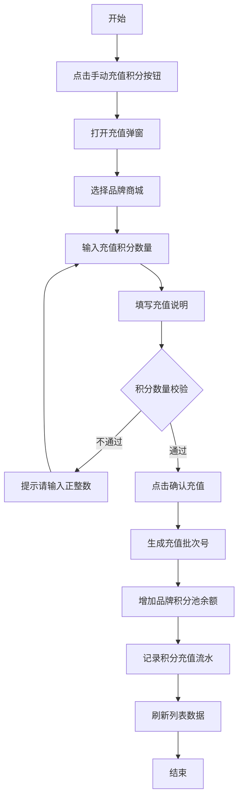
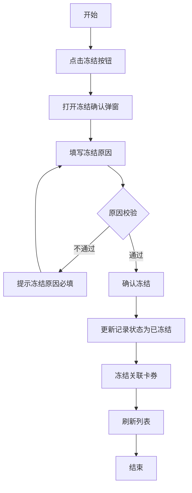
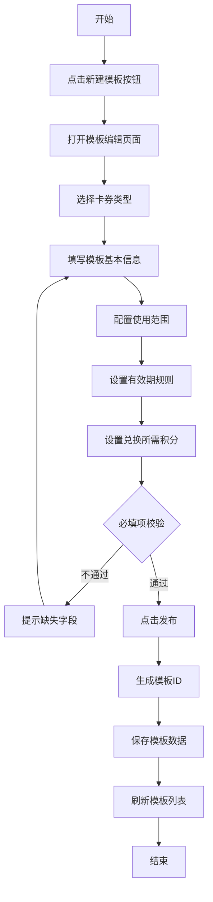
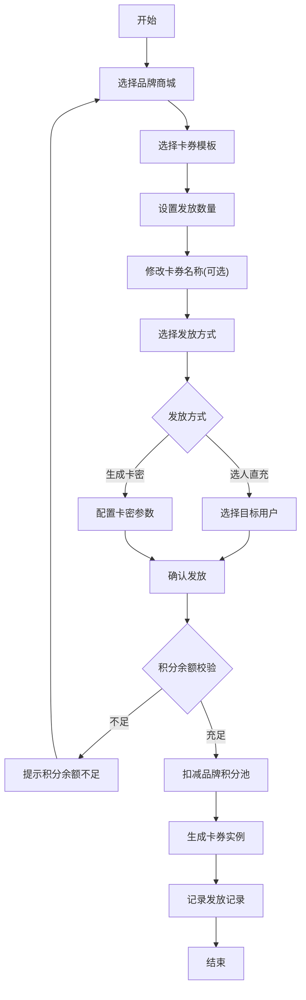
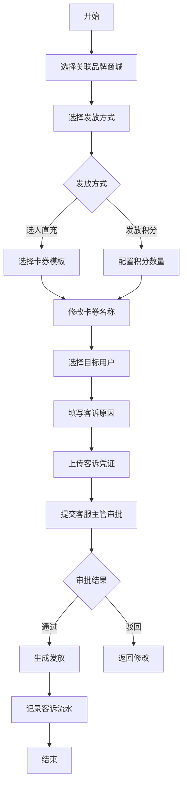
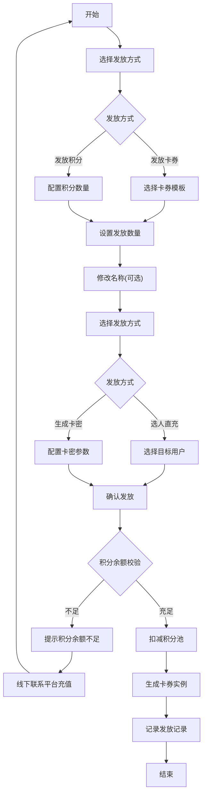

# 积分管理与营销卡券系统产品需求文档

| 字段   | 内容                              |
| ---- | ------------------------------- |
| 文档名称 | 积分管理与营销卡券系统产品需求文档               |
| 当前版本 | V1.0                            |
| 文档日期 | 2026-07-07                      |
| 文档性质 | 积分底座重构方案 - 以积分作为数据底座，卡券作为营销发放模式 |

***

# 1. 详细需求

## 1.1. 商城运营平台系统

### 1.1.1. 积分管理模块

#### 1.1.1.1. 商城积分列表页面

##### 1. 功能概述

- **功能描述**：管理各品牌商城的积分池，支持手动充值、查看发放记录与代发操作。
- **业务描述**：平台运营人员可查看所有品牌商城的积分余额、已消耗积分、累计充值等数据，并支持手动增加积分池余额。
- **使用角色**：平台运营专员（道馨）
- **触发条件**：运营人员登录平台端，进入"营销管理 > 商城积分列表"菜单。

##### 2. 界面设计

###### 2.1 页面原型

[商城积分列表原型页面](file:///c:/Users/power/Documents/trae_projects/积分原型/21.商城积分列表-原型页面.html)

###### 2.2 输出项说明

| 字段名称   | 数据类型   | 数据来源      | 格式说明                |
| ------ | ------ | --------- | ------------------- |
| 品牌商城名称 | String | 品牌商城基础信息表 | 文本展示                |
| 品牌商城ID | String | 品牌商城基础信息表 | 如 P202607001        |
| 当前积分余额 | Number | 积分池表      | 支持两位小数，如 150,000.50 |
| 已消耗积分  | Number | 积分流水表     | 支持两位小数，如 85,500.25  |
| 累计充值   | Number | 积分流水表     | 支持两位小数，如 235,500.75 |
| 品牌积分名称 | String | 品牌商城配置表   | 如"苏银豆"、"红到点"        |
| 兑换比例   | String | 品牌商城配置表   | 如"100分=1豆"          |
| 状态     | Enum   | 品牌商城状态表   | 启用/停用               |

##### 3. 业务逻辑

###### 3.1 流程图

**手动充值积分流程**

###### 3.2 业务规则

| 规则编号            | 规则名称   | 适用场景 | 规则描述         | 错误提示    |
| --------------- | ------ | ---- | ------------ | ------- |
| RULE-POINTS-001 | 积分数量校验 | 手动充值 | 充值积分数量必须为正整数 | 请输入正整数  |
| RULE-POINTS-002 | 充值说明必填 | 手动充值 | 充值说明不能为空     | 请填写充值说明 |
| RULE-POINTS-003 | 品牌商城必选 | 手动充值 | 必须选择品牌商城     | 请选择品牌商城 |

##### 4. 交互设计

###### 4.1 输入项说明

| 字段名称     | 字段类型 | 必填 | 数据类型   | 长度限制       | 校验规则 | 取值范围        | 来源   | 提示文案        | 备注             |
| -------- | ---- | -- | ------ | ---------- | ---- | ----------- | ---- | ----------- | -------------- |
| 手动充值积分按钮 | 按钮   | -  | -      | -          | -    | -           | 系统固定 | 手动充值积分      | 点击打开充值弹窗       |
| 品牌商城     | 下拉选择 | 是  | String | -          | 必选   | 启用状态的品牌商城   | 系统数据 | 请选择品牌商城     | -              |
| 充值积分数量   | 数字输入 | 是  | Number | 1-10000000 | 正整数  | >0          | 用户输入 | 请输入充值积分数量   | -              |
| 充值说明     | 文本输入 | 是  | String | 1-200      | 非空   | -           | 用户输入 | 如：三季度营销预算充值 | -              |
| 充值凭证     | 文件上传 | 否  | File   | -          | 图片格式 | jpg/png/pdf | 用户上传 | 请上传充值凭证（选填） | 支持上传转账凭证、审批凭证等 |
| 确认充值按钮   | 按钮   | -  | -      | -          | -    | -           | 系统固定 | 确认充值        | 点击提交充值信息       |

###### 4.2 交互说明

1. 用户在筛选区域输入品牌商城名称或ID进行搜索
2. 点击"手动充值积分"按钮打开充值弹窗
3. 在弹窗中选择品牌商城、输入充值积分数量和说明
4. 点击"确认充值"完成充值操作
5. 系统提示"充值成功"并刷新列表

###### 4.3 错误提示文案

**表单校验提示**

| 校验项      | 提示文案      |
| -------- | --------- |
| 品牌商城未选   | 请选择品牌商城   |
| 积分数量为空   | 请输入充值积分数量 |
| 积分数量格式错误 | 请输入正整数    |
| 充值说明为空   | 请填写充值说明   |

**业务异常提示**

| 错误码        | 提示文案          |
| ---------- | ------------- |
| POINTS-001 | 该品牌商城已停用，无法充值 |
| POINTS-002 | 充值积分数量超出单次上限  |

##### 5. 扩展功能

###### 5.1 操作日志要求

| 操作类型 | 记录内容                      |
| ---- | ------------------------- |
| 手动充值 | 操作人、时间、品牌商城、充值数量、充值说明、批次号 |

***

#### 1.1.1.2. 积分发放记录页面

##### 1. 功能概述

- **功能描述**：查看品牌商城的积分发放与消耗记录，包括平台手动充值、自主发放卡券、平台代发等所有操作。
- **业务描述**：支持对已发放记录发起冻结/作废，作废后未使用部分返还品牌商城积分池。
- **使用角色**：平台运营专员（道馨）、品牌商城运营（王五）
- **触发条件**：从商城积分列表点击"发放记录"进入，或通过菜单访问。

##### 2. 界面设计

###### 2.1 页面原型

[积分发放记录原型页面](file:///c:/Users/power/Documents/trae_projects/积分原型/25.积分发放记录-原型页面.html)

###### 2.2 输出项说明

| 字段名称  | 数据类型     | 数据来源  | 格式说明                           |
| ----- | -------- | ----- | ------------------------------ |
| 发放时间  | DateTime | 发放记录表 | YYYY-MM-DD HH:mm:ss            |
| 发放批次号 | String   | 发放记录表 | 如 J20260701001                 |
| 类型    | Enum     | 发放记录表 | 积分充值/品牌自主发放/平台代发/客诉补偿发放          |
| 卡券信息  | String   | 发放记录表 | 卡券名称、规格说明                      |
| 发放数量  | Number   | 发放记录表 | 整数                             |
| 消耗积分  | Number   | 发放记录表 | 支持两位小数，如 +100,000.50 或 -500.25 |
| 剩余积分  | Number   | 发放记录表 | 支持两位小数                         |
| 发放用户  | String   | 用户表   | 用户名称                           |
| 状态    | Enum     | 发放记录表 | 成功/待审批/发放失败/已冻结/已作废            |
| 操作人   | String   | 操作日志表 | 如"平台-道馨"                       |

##### 3. 业务逻辑

###### 3.1 流程图

**冻结发放记录流程**

###### 3.2 业务规则

| 规则编号            | 规则名称   | 适用场景 | 规则描述             | 错误提示        |
| --------------- | ------ | ---- | ---------------- | ----------- |
| RULE-RECORD-001 | 冻结原因必填 | 冻结操作 | 冻结原因不能为空         | 请填写冻结原因     |
| RULE-RECORD-002 | 作废前提条件 | 作废操作 | 作废前需先冻结该批次       | 请先冻结该批次后再作废 |
| RULE-RECORD-003 | 作废积分返还 | 作废操作 | 作废后未使用积分返还至品牌积分池 | -           |

###### 3.3 状态机设计

**状态定义**

| 状态值     | 状态名称 | 状态说明         | 可见角色      |
| ------- | ---- | ------------ | --------- |
| success | 成功   | 发放成功         | 平台运营、品牌商城 |
| pending | 待审批  | 等待审批通过       | 平台运营、审批员  |
| failed  | 发放失败 | 发放失败         | 平台运营      |
| frozen  | 已冻结  | 已冻结，不可继续使用   | 平台运营、品牌商城 |
| revoked | 已作废  | 已作废，未使用积分已返还 | 平台运营、品牌商城 |

**状态流转规则**

| 当前状态 | 触发操作 | 目标状态 | 操作角色 | 前置条件 |
| ---- | ---- | ---- | ---- | ---- |
| 成功   | 冻结   | 已冻结  | 平台运营 | -    |
| 已冻结  | 解冻   | 成功   | 平台运营 | -    |
| 已冻结  | 作废   | 已作废  | 平台运营 | -    |

***

#### 1.1.1.3. 用户积分卡券流水页面

##### 1. 功能概述

- **功能描述**：查看C端用户的积分和卡券流水记录，包括积分获取、消耗、卡券领取、核销等。
- **业务描述**：用于客服和运营查询用户账户变动情况，支持按用户ID、流水类型、时间范围筛选。
- **使用角色**：平台运营专员（道馨）、客服专员（刘艳）
- **触发条件**：运营人员登录平台端，进入"营销管理 > 用户积分卡券流水"菜单。

##### 2. 界面设计

###### 2.1 页面原型

[用户积分卡券流水原型页面](file:///c:/Users/power/Documents/trae_projects/积分原型/33.用户积分卡券流水-原型页面.html)

###### 2.2 输出项说明

| 字段名称  | 数据类型     | 数据来源 | 格式说明                                         |
| ----- | -------- | ---- | -------------------------------------------- |
| 流水时间  | DateTime | 流水表  | YYYY-MM-DD HH:mm:ss                          |
| 业务    | Enum     | 流水表  | 积分/卡券                                        |
| 流水类型  | Enum     | 流水表  | 积分获取/积分消耗/积分返还/积分过期/卡券领取/卡券核销/卡券兑换/卡券作废/卡券过期 |
| 对象    | String   | 流水表  | 积分期限批次（如1年期、2年期、不限）或卡券名称                     |
| 变动数量  | Number   | 流水表  | 正数为获取，负数为消耗，支持两位小数                           |
| 变动后余额 | Number   | 流水表  | 支持两位小数                                       |
| 关联单号  | String   | 流水表  | 订单编号、发放批次号、卡密编号等                             |
| 流水状态  | Enum     | 流水表  | 已核销/未使用/已过期/已作废/已返还等                         |
| 备注    | String   | 流水表  | 流水说明                                         |

***

### 1.1.2. 卡券管理模块

#### 1.1.2.1. 卡券模板列表页面

##### 1. 功能概述

- **功能描述**：平台预置的卡券模板管理，品牌商城和平台发放时选择模板、改名、发放即可。
- **业务描述**：平台运营人员创建和发布卡券模板，模板包含面值、有效期、使用范围、兑换所需积分等参数。
- **使用角色**：平台运营专员（道馨）
- **触发条件**：运营人员登录平台端，进入"营销管理 > 卡券模板列表"菜单。

##### 2. 界面设计

###### 2.1 页面原型

[卡券模板列表原型页面](file:///c:/Users/power/Documents/trae_projects/积分原型/22.卡券模板列表-原型页面.html)

###### 2.2 输出项说明

| 字段名称   | 数据类型   | 数据来源 | 格式说明                 |
| ------ | ------ | ---- | -------------------- |
| 模板名称   | String | 模板表  | 文本展示                 |
| 模板ID   | String | 模板表  | 如 M00001             |
| 卡券类型   | Enum   | 模板表  | 优惠券/满减券/折扣券/商品次卡/积分卡 |
| 面值/内容  | String | 模板表  | 如"满200减50"、"8折"      |
| 兑换所需积分 | Number | 模板表  | 整数                   |
| 使用范围   | String | 模板表  | 全场/指定品类/指定商品         |
| 有效期    | String | 模板表  | 如"自领取起30天有效"         |
| 状态     | Enum   | 模板表  | 已发布/待审核/草稿           |

##### 3. 业务逻辑

###### 3.1 流程图

**创建卡券模板流程**

###### 3.2 业务规则

| 规则编号              | 规则名称   | 适用场景 | 规则描述         | 错误提示     |
| ----------------- | ------ | ---- | ------------ | -------- |
| RULE-TEMPLATE-001 | 模板名称唯一 | 创建模板 | 模板名称不能重复     | 该模板名称已存在 |
| RULE-TEMPLATE-002 | 兑换积分为正 | 创建模板 | 兑换所需积分必须为正整数 | 请输入正整数   |
| RULE-TEMPLATE-003 | 有效期必填  | 创建模板 | 有效期规则必须配置    | 请配置有效期   |

***

#### 1.1.2.2. 平台代发卡券页面

##### 1. 功能概述

- **功能描述**：平台代替品牌商城发放卡券，消耗该品牌商城的积分池。
- **业务描述**：平台运营人员选择品牌商城、选择卡券模板、设置数量，消耗品牌积分发放卡券给指定用户。
- **使用角色**：平台运营专员（道馨）
- **触发条件**：从商城积分列表点击"平台代发"进入，或通过菜单访问。

##### 2. 界面设计

###### 2.1 页面原型

[平台代发卡券原型页面](file:///c:/Users/power/Documents/trae_projects/积分原型/23.平台代发卡券-原型页面.html)

###### 2.2 输出项说明

| 字段名称   | 数据类型   | 数据来源  | 格式说明                |
| ------ | ------ | ----- | ------------------- |
| 品牌商城信息 | Object | 品牌商城表 | 商城名称、ID、当前积分余额      |
| 卡券模板信息 | Object | 模板表   | 模板名称、类型、面值、使用范围、有效期 |
| 发放数量   | Number | 用户输入  | 整数                  |
| 消耗积分   | Number | 系统计算  | 支持两位小数，兑换积分 × 数量    |
| 剩余积分   | Number | 系统计算  | 支持两位小数，当前余额 - 消耗积分  |
| 发放方式   | Enum   | 用户选择  | 选人直充/生成卡密           |

##### 3. 业务逻辑

###### 3.1 流程图

**平台代发卡券流程**

###### 3.2 业务规则

| 规则编号          | 规则名称   | 适用场景 | 规则描述            | 错误提示                   |
| ------------- | ------ | ---- | --------------- | ---------------------- |
| RULE-SEND-001 | 积分余额校验 | 发放卡券 | 消耗积分不能超过品牌积分池余额 | 积分余额不足，当前可用{balance}积分 |
| RULE-SEND-002 | 发放数量限制 | 发放卡券 | 单次发放数量不能超过1000张 | 单次最多发放1000张            |
| RULE-SEND-003 | 折扣审批   | 折扣发放 | 发放折扣需运营主管审批     | -                      |

***

#### 1.1.2.3. 客诉补偿发放卡券/积分页面

##### 1. 功能概述

- **功能描述**：平台专属客诉补偿通道，平台直接向品牌商城的客户发放补偿卡券或积分，不消耗品牌商城积分池。
- **业务描述**：客服专员选择品牌商城和卡券模板、填写客诉原因和凭证，向该品牌商城的对应客户发放补偿卡券。所有发放均需客服主管审批。
- **使用角色**：客服专员（刘艳）、客服主管（路宁）
- **触发条件**：客服人员登录平台端，进入"客服管理 > 客诉补偿发放卡券/积分"菜单。

##### 2. 界面设计

###### 2.1 页面原型

[客诉补偿发放卡券/积分原型页面](file:///c:/Users/power/Documents/trae_projects/积分原型/24.客诉补偿发放卡券-原型页面.html)

###### 2.2 输出项说明

| 字段名称   | 数据类型   | 数据来源 | 格式说明      |
| ------ | ------ | ---- | --------- |
| 关联品牌商城 | String | 用户选择 | 品牌商城名称    |
| 卡券模板   | Object | 用户选择 | 模板信息      |
| 卡券名称   | String | 用户输入 | 自定义名称     |
| 客诉原因   | String | 用户输入 | 文本描述      |
| 客诉凭证   | File   | 用户上传 | 图片文件      |
| 发放方式   | Enum   | 用户选择 | 选人直充/发放积分 |
| 发放用户   | Array  | 用户选择 | 目标用户列表    |

##### 3. 业务逻辑

###### 3.1 流程图

**客诉补偿发放卡券/积分流程**

###### 3.2 业务规则

| 规则编号          | 规则名称   | 适用场景 | 规则描述         | 错误提示         |
| ------------- | ------ | ---- | ------------ | ------------ |
| RULE-COMP-001 | 禁发积分卡  | 客诉补偿发放 | 客诉通道不可发放积分卡  | 客诉通道不支持发放积分卡 |
| RULE-COMP-002 | 全量人工审批 | 客诉补偿发放 | 所有客诉补偿发放需人工审批  | -            |
| RULE-COMP-003 | 凭证必填   | 客诉补偿发放 | 客诉凭证必须上传     | 请上传客诉凭证      |
| RULE-COMP-004 | 原因必填   | 客诉补偿发放 | 客诉原因必须填写     | 请填写客诉原因      |

***

#### 1.1.2.4. 卡密池管理页面

##### 1. 功能概述

- **功能描述**：管理所有卡密的全生命周期，包括系统生成卡密和导入已有卡密。
- **业务描述**：支持空白卡密的生成、激活，以及已激活卡密的兑换追踪、冻结、作废等操作。
- **使用角色**：平台运营专员（道馨）
- **触发条件**：运营人员登录平台端，进入"营销管理 > 卡密池管理"菜单。

##### 2. 界面设计

###### 2.1 页面原型

[卡密池管理原型页面](file:///c:/Users/power/Documents/trae_projects/积分原型/28.卡密池管理-原型页面.html)

###### 2.2 输出项说明

| 字段名称  | 数据类型     | 数据来源    | 格式说明                        |
| ----- | -------- | ------- | --------------------------- |
| 卡号    | String   | 系统生成/导入 | 如 BC20260700001             |
| 密码    | String   | 系统生成/导入 | 掩码展示如 \*\*\*\*1234          |
| 状态    | Enum     | 卡密表     | 未激活/未兑换/已兑换/已核销/已过期/已冻结/已作废 |
| 关联模板  | String   | 模板表     | 模板名称                        |
| 来源    | Enum     | 卡密表     | 品牌自发放/平台代发                  |
| 品牌商城  | String   | 品牌商城表   | 商城名称                        |
| 发放批次号 | String   | 发放记录表   | 如 J20260701001              |
| 兑换用户  | String   | 用户表     | 用户昵称                        |
| 兑换时间  | DateTime | 卡密表     | YYYY-MM-DD HH:mm:ss         |
| 核销时间  | DateTime | 卡密表     | YYYY-MM-DD HH:mm:ss         |

##### 3. 业务逻辑

###### 3.3 状态机设计

**状态定义**

| 状态值        | 状态名称 | 状态说明       | 可见角色      |
| ---------- | ---- | ---------- | --------- |
| inactive   | 未激活  | 空白卡密，未关联模板 | 平台运营      |
| unredeemed | 未兑换  | 已激活，未兑换    | 平台运营、品牌商城 |
| redeemed   | 已兑换  | 用户已兑换到账户   | 平台运营、品牌商城 |
| used       | 已核销  | 卡券已使用      | 平台运营、品牌商城 |
| expired    | 已过期  | 超过有效期      | 平台运营、品牌商城 |
| frozen     | 已冻结  | 已冻结，不可使用   | 平台运营      |
| revoked    | 已作废  | 已作废        | 平台运营      |

**状态流转规则**

| 当前状态    | 触发操作 | 目标状态    | 操作角色 | 前置条件 |
| ------- | ---- | ------- | ---- | ---- |
| 未激活     | 激活   | 未兑换     | 平台运营 | -    |
| 未兑换     | 用户兑换 | 已兑换     | C端用户 | -    |
| 已兑换     | 核销   | 已核销     | C端用户 | -    |
| 未兑换/已兑换 | 冻结   | 已冻结     | 平台运营 | -    |
| 已冻结     | 解冻   | 未兑换/已兑换 | 平台运营 | -    |
| 已冻结     | 作废   | 已作废     | 平台运营 | -    |

***

#### 1.1.2.5. 卡券管理页面

##### 1. 功能概述

- **功能描述**：卡券实例级管理，按发放批次查看所有卡券的来源、发放方式、核销进度与状态。
- **业务描述**：支持详情追溯与冻结/作废操作，查看每个批次的核销率、剩余可用数量等。
- **使用角色**：平台运营专员（道馨）
- **触发条件**：运营人员登录平台端，进入"营销管理 > 卡券管理"菜单。

##### 2. 界面设计

###### 2.1 页面原型

[卡券管理原型页面](file:///c:/Users/power/Documents/trae_projects/积分原型/29.卡券管理-原型页面.html)

###### 2.2 输出项说明

| 字段名称    | 数据类型     | 数据来源  | 格式说明                     |
| ------- | -------- | ----- | ------------------------ |
| 发放批次号   | String   | 发放记录表 | 如 J20260701001           |
| 卡券编号    | String   | 卡券表   | 如 C20260701001           |
| 卡券类型    | Enum     | 模板表   | 优惠券/满减券/折扣券/商品次卡/积分卡     |
| 面值/内容   | String   | 模板表   | 如"满200减50"               |
| 来源      | Enum     | 发放记录表 | 品牌发放/平台代发                |
| 关联品牌商城  | String   | 品牌商城表 | 商城名称                     |
| 生成时间    | DateTime | 发放记录表 | YYYY-MM-DD HH:mm:ss      |
| 有效期     | String   | 卡券表   | 如"2026-08-01至2026-10-31" |
| 发放方式    | Enum     | 发放记录表 | 选人直充/生成卡密                |
| 核销量/发放量 | String   | 卡券表   | 如"23/100"                |
| 状态      | Enum     | 卡券表   | 发放中/已冻结/已发完/已作废          |

***

### 1.1.3. 审批管理模块

#### 1.1.3.1. 审批管理页面

##### 1. 功能概述

- **功能描述**：管理平台端的审批流程，包括客诉补偿发放审批和折扣审批。
- **业务描述**：审批员可查看待审批的客诉补偿发放申请和折扣申请，进行通过或驳回操作。
- **使用角色**：运营主管（泽梅）、客服主管（路宁）
- **触发条件**：审批员登录平台端，进入"审批管理"菜单。

##### 2. 界面设计

###### 2.1 页面原型

[审批管理原型页面](file:///c:/Users/power/Documents/trae_projects/积分原型/26.审批管理-原型页面.html)

###### 2.2 输出项说明

| 字段名称   | 数据类型     | 数据来源  | 格式说明                |
| ------ | -------- | ----- | ------------------- |
| 申请时间   | DateTime | 审批表   | YYYY-MM-DD HH:mm:ss |
| 申请类型   | Enum     | 审批表   | 客诉补偿发放审批/折扣审批           |
| 申请人    | String   | 用户表   | 申请人姓名               |
| 关联品牌商城 | String   | 品牌商城表 | 商城名称                |
| 卡券信息   | Object   | 卡券表   | 卡券名称、面值、数量          |
| 申请原因   | String   | 审批表   | 文本描述                |
| 凭证     | File     | 审批表   | 图片链接                |
| 状态     | Enum     | 审批表   | 待审批/已通过/已驳回         |

***

### 1.1.4. 统计模块

#### 1.1.4.1. 客诉补偿发放统计页面

##### 1. 功能概述

- **功能描述**：统计客诉补偿发放数据，包括发放次数、发放金额、客诉原因分布等。
- **业务描述**：客服主管和运营主管可查看客诉补偿发放统计报表，用于成本控制和异常监控。
- **使用角色**：客服主管（路宁）、运营主管（泽梅）
- **触发条件**：管理人员登录平台端，进入"客服管理 > 客诉补偿发放统计"菜单。

##### 2. 界面设计

###### 2.1 页面原型

[客诉补偿发放统计原型页面](file:///c:/Users/power/Documents/trae_projects/积分原型/30.补偿统计-原型页面.html)

***

## 1.2. 品牌商城端系统

### 1.2.1. 积分管理模块

#### 1.2.1.1. 商城积分列表页面

##### 1. 功能概述

- **功能描述**：品牌商城查看自身积分池余额、发放记录，以及进行自主发放卡券操作。
- **业务描述**：品牌商城运营人员可查看积分余额、已消耗积分、累计充值等数据，支持消耗积分发放卡券。
- **使用角色**：品牌商城运营（王五）
- **触发条件**：运营人员登录品牌端，进入"营销管理 > 商城积分列表"菜单。

##### 2. 界面设计

###### 2.1 页面原型

[品牌商城积分列表原型页面](file:///c:/Users/power/Documents/trae_projects/积分原型/品牌商城端/1.商城积分列表.html)

##### 3. 业务逻辑

###### 3.2 业务规则

| 规则编号           | 规则名称   | 适用场景 | 规则描述          | 错误提示                   |
| -------------- | ------ | ---- | ------------- | ---------------------- |
| RULE-BRAND-001 | 余额不足阻止 | 发放卡券 | 积分余额不足时阻止发放   | 积分余额不足，当前可用{balance}积分 |
| RULE-BRAND-002 | 授权范围限制 | 选择模板 | 只能使用平台授权的卡券类型 | 该卡券类型未授权               |

***

### 1.2.2. 卡券管理模块

#### 1.2.2.1. 卡券模板列表页面

##### 1. 功能概述

- **功能描述**：品牌商城查看平台预置的卡券模板，选择模板进行发放。
- **业务描述**：品牌商城运营人员可浏览已发布的卡券模板，查看模板详情，选择模板发放卡券。
- **使用角色**：品牌商城运营（王五）
- **触发条件**：运营人员登录品牌端，进入"营销管理 > 卡券列表"菜单。

##### 2. 界面设计

###### 2.1 页面原型

[品牌商城卡券模板列表原型页面](file:///c:/Users/power/Documents/trae_projects/积分原型/品牌商城端/2.卡券模板列表.html)

##### 3. 业务逻辑

###### 3.2 业务规则

| 规则编号                | 规则名称  | 适用场景 | 规则描述            | 错误提示 |
| ------------------- | ----- | ---- | --------------- | ---- |
| RULE-BRAND-VIEW-001 | 仅查看权限 | 模板管理 | 品牌商城只能查看模板，不能编辑 | -    |
| RULE-BRAND-VIEW-002 | 使用发放  | 模板操作 | 点击"使用发放"跳转到发放页面 | -    |

***

#### 1.2.2.2. 发放卡券/积分页面

##### 1. 功能概述

- **功能描述**：品牌商城消耗自身积分池发放卡券或积分给用户。
- **业务描述**：品牌商城运营人员选择卡券模板、设置数量、选择发放方式，消耗积分发放卡券。
- **使用角色**：品牌商城运营（王五）
- **触发条件**：运营人员登录品牌端，进入"营销管理 > 发放卡券/积分"菜单。

##### 2. 界面设计

###### 2.1 页面原型

[品牌商城发放卡券/积分原型页面](file:///c:/Users/power/Documents/trae_projects/积分原型/品牌商城端/3.直接生成卡券.html)

##### 3. 业务逻辑

###### 3.1 流程图

**品牌商城发放卡券流程**

***

# 2. 非功能需求

## 2.1. 性能需求

| 指标名称   | 指标要求           |
| ------ | -------------- |
| 页面加载时间 | 首屏加载 ≤ 3秒      |
| 操作响应时间 | 普通操作 ≤ 500ms   |
| 列表查询时间 | 1000条以内 ≤ 1秒   |
| 批量导出时间 | 10000条以内 ≤ 30秒 |

## 2.2. 兼容性需求

| 类型  | 要求                                         |
| --- | ------------------------------------------ |
| 浏览器 | Chrome 80+、Firefox 75+、Safari 13+、Edge 80+ |
| 分辨率 | 最低支持1366×768，推荐1920×1080                   |

## 2.3. 安全需求

| 安全项  | 要求              |
| ---- | --------------- |
| 权限控制 | 基于角色的访问控制（RBAC） |
| 数据隔离 | 品牌商城数据相互隔离      |
| 操作审计 | 所有敏感操作记录日志      |
| 积分安全 | 积分变动需有流水记录，支持追溯 |

***

# 3. 附录

## 3.1. 术语表

| 术语     | 说明                                                |
| ------ | ------------------------------------------------- |
| 积分     | 平台统一数据底座，1积分=1元。品牌商城消耗积分生成卡券，C端用户持有积分可在购物结算时抵扣现金。 |
| 品牌积分   | 仅小程序前台展示层概念。品牌商城可自定义积分名称与展示比例。底层所有计算统一使用平台积分。     |
| 卡券模板   | 平台预先创建并发布的卡券配置蓝图，预置好面值/有效期/使用范围等全部参数。             |
| 卡券     | 从模板生成的实例，包含面值、数量、有效期、使用范围。                        |
| 选人直充   | 选择用户，卡券直接充入其账户。                                   |
| 生成卡密   | 系统生成卡号+密码，线下传递给用户，用户在小程序输入卡密兑换。                   |
| 卡密池    | 管理所有卡密的统一容器。包含系统生成卡密和导入已有卡密。                      |
| 平台代发卡券 | 平台代替品牌商城发放卡券，消耗该品牌商城的积分池。                         |
| 客诉补偿发放卡券 | 平台专属。平台直接向品牌商城的客户发放补偿卡券，不消耗品牌商城积分池。所有发放均需审批。                      |

## 3.2. 相关文档

| 文档名称     | 文档路径                 |
| -------- | -------------------- |
| 积分商城设计方案 | 积分商城设计方案.md          |
| 积分管理优化方案 | 202.B端积分管理全链路优化方案.MD |

***

## 3.3. 编号规则

| 编号类型     | 编号格式            | 示例            | 说明                                          |
| -------- | --------------- | ------------- | ------------------------------------------- |
| 积分批次流水号  | JYYYYMMDD001    | J20260701001  | 用于积分充值、发放、返还等积分相关操作的批次标识，J代表积分批次，后接日期和三位流水号 |
| 卡密批次流水号  | KYYYYMMDD001    | K20260701001  | 用于卡券发放批次的标识，K代表卡密批次，后接日期和三位流水号              |
| 空白卡卡号    | BCYYYYMMDD00001 | BC20260700001 | 未激活的空白卡密编号，BC代表空白卡，后接日期和五位流水号               |
| 直接生成卡密卡号 | CYYYYMMDD00001  | C20260700001  | 直接生成的卡密编号，C代表卡密，后接日期和五位流水号                  |

***

# 4. 版本记录

| 版本号  | 修改日期       | 修改人  | 修改内容                 |
| ---- | ---------- | ---- | -------------------- |
| V1.0 | 2026-07-07 | 产品经理 | 初稿创建，包含平台端和品牌商城端核心功能 |

