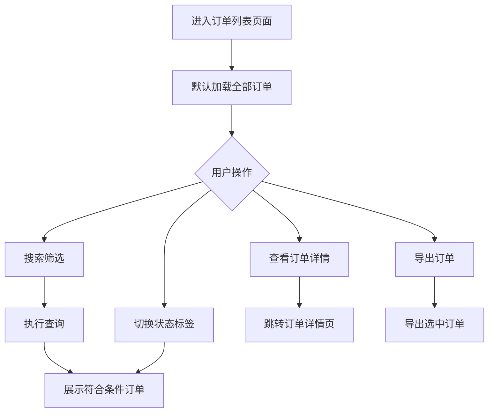
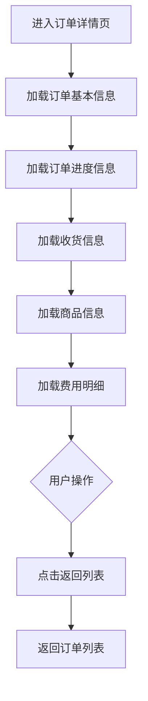
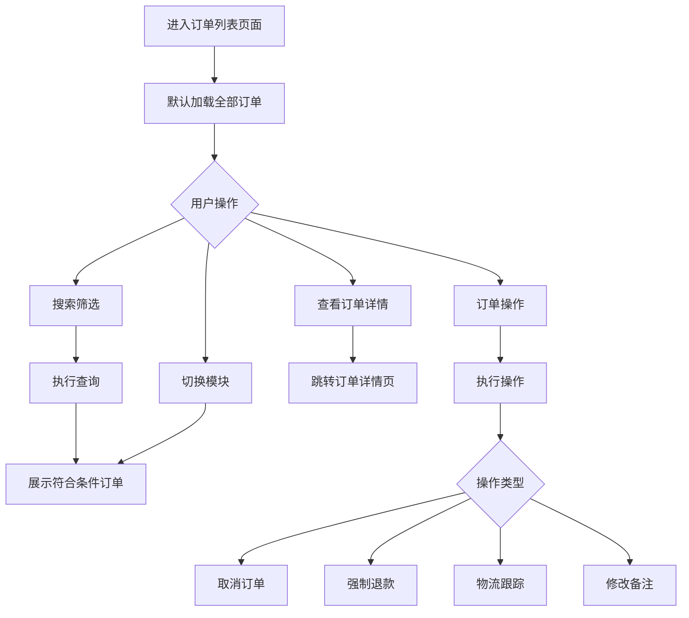
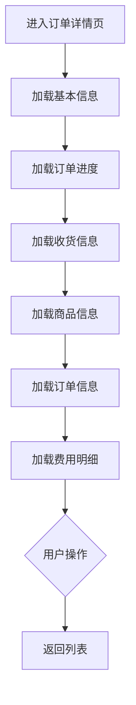
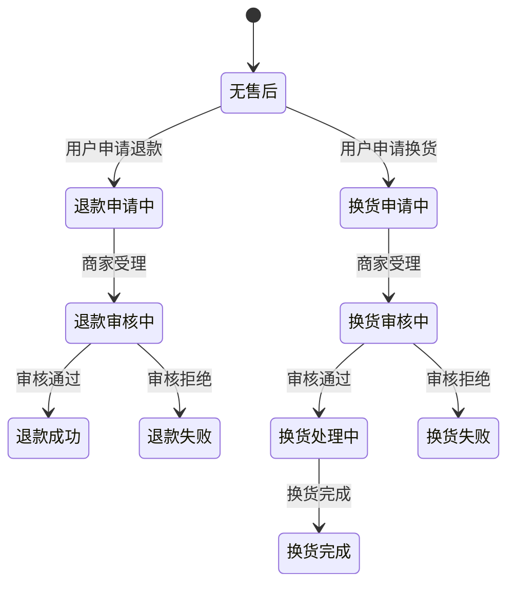

# 商城订单管理系统产品需求文档

***

# 1. 需求背景

***

# 2. 需求分析

## 2.1. 竞品订单模块功能对比

基于对京东企业购、苏宁企业购、史泰博、齐心集团等竞品的商城后台分析，提取订单管理相关功能对比如下：

| 功能项        | 京东企业购 | 苏宁企业购 | 史泰博  | 齐心集团   | 我方现状 |
| ---------- | ----- | ----- | ---- | ------ | ---- |
| 订单列表       | 完整    | 完整    | 完整   | 完整     | 已实现  |
| 订单拆单/合单    | 支持    | 部分支持  | 部分支持 | 部分支持   | 已实现  |
| 订单路由（一品多商） | 智能路由  | 手动路由  | 待验证  | 手动路由   | 已实现  |
| 积分+现金混合支付  | 支持    | 支持    | 待验证  | 待验证    | 支持   |
| 积分退回机制     | 支持    | 支持    | 不支持  | 不支持    | 支持   |
| 延迟发货报备     | 支持    | 待验证   | 待验证  | 超时发货标记 | 未实现  |
| 承诺时效设置     | 支持    | 待验证   | 待验证  | 待验证    | 未实现  |

## 2.2. 竞品订单模块功能详情

### 2.2.1. 京东企业购

京东企业购订单管理功能最为完善，其供应商后台导航菜单包含以下订单相关入口：

- **订单列表**：完整的订单查询与管理页面，支持多维度筛选
- **延迟发货报备**：供应商针对无法按时发货的订单进行报备，规避平台处罚
- **承诺时效设置**：设置不同商品/区域的发货承诺时效，影响订单优先级与搜索权重
- **待回告订单**：需供应商确认接单的订单队列，支持快速回告
- **待送货订单**：已确认待发货的订单队列，跟踪发货进度
- **待取货订单**：等待物流取件的订单，跟踪取件状态
- **待采购单加急送货**：标记为加急的采购订单，优先处理


**京东一品多商订单路由流程**（P0优先级）：

```
用户下单 → 系统识别商品SKU → 查询关联供应商列表 → 比价计算（价格+评估分）→ 选择最优供应商 → 锁定库存 → 供应商确认 → 发货履约

比价维度：
- 价格权重（可配置）
- 交货时间权重（可配置）
- 质量评分权重（可配置）
- 履约率权重（可配置）

Fallback策略：
- 最优供应商缺货 → 自动切换第二最优供应商
- 所有供应商缺货 → 订单挂起等待补货
- 超时未确认 → 自动取消重新路由
```

### 2.2.2. 苏宁企业购


苏宁供应商后台（商家工作台）订单管理模块包含以下功能点：

- **订单接收确认**：供应商接收并确认订单
- **订单发货处理**：处理发货流程
- **物流信息录入**：录入物流单号与物流信息
- **订单异常申报**：对异常订单进行申报处理
- **批量发货**：支持批量操作发货
- **订单状态查看**：查看订单当前状态及流转记录

### 2.2.3. 史泰博


史泰博SRM供应商管理平台导航中包含独立的"订单"模块，供应商后台工作台提供订单管理、商品管理、结算管理等核心功能。

### 2.2.4. 齐心集团


齐心供应商后台首页展示以下订单相关待办入口：

- **订单-待发货**：待发货订单快速入口，显示待处理数量
- **订单-超时发货**：超时未发货订单预警入口，显示超时数量
- **运单-物流问题件**：物流异常件处理入口
- **运单-异常运单号**：异常运单号管理入口
- **售后-待供应商处理**：待供应商处理的售后订单入口
- **售后-回寄中**：退货回寄中的售后订单入口

## 2.3. 竞品订单模块差异分析

### 2.3.1. 竞品有——我方缺失的关键功能

| 序号 | 缺失功能   | 优先级    | 竞品代表     | 业务逻辑               | 对我方影响        |
| -- | ------ | ------ | -------- | ------------------ | ------------ |
| 1  | 多级审批流程 | **P1** | 京东/苏宁/齐心 | 企业采购合规要求、预算控制、权限管控 | 无法满足央企国企合规需求 |
| 2  | 延迟发货报备 | **P2** | 京东       | 供应商针对无法按时发货的订单进行报备 | 缺乏供应商履约管理手段  |

### 2.3.2. 竞品订单模块共性特征

通过竞品分析，归纳订单模块的共性特征如下：

1. **订单状态体系**：所有竞品均支持完整的订单状态流转（待付款→待发货→已发货→已完成/已关闭），我方PRD已覆盖
2. **订单与售后状态分离**：售后状态独立于订单状态按商品维度管理，我方PRD已设计（见第5章售后状态体系）
3. **待办任务驱动**：京东、齐心均在首页展示订单待办数量（待发货、超时发货、异常订单等），驱动供应商及时处理
4. **供应商确认机制**：京东（待回告订单）、苏宁（订单接收确认）均要求供应商确认接单，形成订单处理闭环
5. **物流全程跟踪**：竞品普遍支持物流信息录入与查询，部分支持物流问题件标记

***

# 3. 系统流程图

***

# 4. 详细需求

## 4.1. 品牌商城后台系统

### 4.1.1. 订单管理模块

#### 4.1.1.1. 订单列表页面

##### 1. 功能概述

品牌商城后台订单列表页面用于品牌商查看和管理其订单数据，支持多维度搜索筛选、订单状态快速切换、订单导出等功能。

**使用角色**：品牌商城管理员

**触发条件**：管理员点击侧边栏「订单管理」→「订单列表」进入页面

##### 2. 流程图



##### 3. 页面原型

原型图路径：`品牌商城后台订单模块.html`

##### 4. 输入项说明

| 字段名称    | 字段类型 | 必填 | 数据类型 | 长度限制 | 校验规则 | 取值范围                                                     | 来源   | 提示文案        | 备注           |
| ------- | ---- | -- | ---- | ---- | ---- | -------------------------------------------------------- | ---- | ----------- | ------------ |
| 主订单号    | 输入框  | 否  | 字符串  | 50   | 精确匹配 | -                                                        | 用户输入 | 请输入主订单号     | 支持模糊搜索       |
| 子订单号    | 输入框  | 否  | 字符串  | 50   | 精确匹配 | -                                                        | 用户输入 | 请输入子订单号     | 支持模糊搜索       |
| 商品名称    | 输入框  | 否  | 字符串  | 100  | 模糊匹配 | -                                                        | 用户输入 | 请输入商品名称     | -            |
| SKU物流编码 | 输入框  | 否  | 字符串  | 50   | 精确匹配 | -                                                        | 用户输入 | 请输入SKU物流编码  | -            |
| 客户信息    | 输入框  | 否  | 字符串  | 20   | 模糊匹配 | -                                                        | 用户输入 | 请输入客户姓名/手机号 | 支持姓名或手机号搜索   |
| 订单状态    | 下拉复选 | 否  | 多选枚举 | -    | -    | 全部/待付款/待发货/部分发货/已发货/已完成/已关闭                              | 系统预设 | 请选择订单状态     | 支持多选         |
| 售后状态    | 下拉复选 | 否  | 多选枚举 | -    | -    | 全部/无售后/退款申请中/退款审核中/退款成功/退款失败/换货申请中/换货审核中/换货处理中/换货完成/换货失败 | 系统预设 | 请选择售后状态     | 支持多选，与订单状态独立 |
| 下单时间-开始 | 日期选择 | 否  | 日期   | -    | -    | -                                                        | 用户选择 | 请选择开始日期     | -            |
| 下单时间-结束 | 日期选择 | 否  | 日期   | -    | -    | -                                                        | 用户选择 | 请选择结束日期     | -            |

##### 5. 输出项说明

| 字段名称    | 数据类型 | 数据来源 | 格式说明                                                  |
| ------- | ---- | ---- | ----------------------------------------------------- |
| 主订单号    | 字符串  | 后端返回 | 格式：ORD+年月日+序号                                         |
| 子订单号    | 字符串  | 后端返回 | 格式：ORD+年月日+序号+序号                                      |
| 商品信息    | 对象   | 后端返回 | 包含商品图片、商品名称、商品数量                                      |
| SKU物流编码 | 字符串  | 后端返回 | 格式：SKU-品牌缩写-产品缩写-序号                                   |
| 客户信息    | 对象   | 后端返回 | 包含客户姓名、手机号（脱敏）                                        |
| 订单金额    | 数值   | 后端返回 | 单位：元，保留两位小数                                           |
| 订单总金额   | 数值   | 后端返回 | 订单金额+运费-优惠                                            |
| 运费      | 数值   | 后端返回 | 单位：元                                                  |
| 支付积分    | 整数   | 后端返回 | 单位：积分                                                 |
| 订单状态    | 枚举   | 后端返回 | 待付款/待发货/部分发货/已发货/已完成/已关闭                              |
| 售后状态    | 枚举   | 后端返回 | 无售后/退款申请中/退款审核中/退款成功/退款失败/换货申请中/换货审核中/换货处理中/换货完成/换货失败 |
| 下单时间    | 日期时间 | 后端返回 | 格式：YYYY-MM-DD HH:mm:ss                                |
| 订单备注    | 字符串  | 后端返回 | 用户下单时填写                                               |

##### 6. 业务规则

| 规则编号  | 规则名称        | 适用场景   | 规则描述                                                             | 错误提示         |
| ----- | ----------- | ------ | ---------------------------------------------------------------- | ------------ |
| BR001 | 订单金额计算      | 订单展示   | 订单总金额 = 商品金额 + 运费 - 积分抵扣                                         | -            |
| BR002 | 订单状态筛选      | 状态标签切换 | 点击状态标签时，仅展示对应状态的订单                                               | -            |
| BR003 | 多商品订单展示     | 订单列表   | 多商品订单占用多行展示，每个商品一行                                               | -            |
| BR004 | 订单备注展示      | 列表展示   | 订单备注以截断形式展示，鼠标悬浮显示完整内容                                           | -            |
| BR005 | SKU物流编码     | 订单查询   | 支持按SKU物流编码精确查询订单                                                 | -            |
| BR006 | 时间范围筛选      | 下单时间筛选 | 开始时间不能大于结束时间                                                     | 开始时间不能大于结束时间 |
| BR007 | 订单状态与售后状态独立 | 状态管理   | 订单状态与售后状态为并行关系，互不影响。订单状态仅包含订单流转状态，售后状态独立管理退款/换货流程                | -            |
| BR008 | 售后状态视觉标识    | 列表展示   | 不同售后状态使用不同颜色和图标区分：无售后（灰色）、退款相关（橙色/蓝色/绿色/红色）、换货相关（紫色/青色/橙色/绿色/红色） | -            |
| BR009 | 勾选框列冻结      | 列表展示   | 勾选框列在横向滚动时固定在视图左侧，不随滚动条移动                                        | -            |

##### 7. 交互说明

1. **搜索筛选流程**
   - 用户填写任意筛选条件
   - 点击「查询」按钮执行搜索
   - 点击「重置」按钮清空所有筛选条件
   - 支持订单状态与售后状态组合筛选
2. **状态标签切换流程**
   - 用户点击状态标签（如「待付款」「待发货」）
   - 页面刷新并展示对应状态的订单
   - 选中标签高亮显示
3. **查看订单详情流程**
   - 用户点击主订单号或「详情」链接
   - 跳转到订单详情页面
4. **导出订单流程**
   - 用户勾选需要导出的订单（或全选）
   - 点击「导出订单」按钮
   - 系统生成并下载订单Excel文件
5. **勾选框冻结交互**
   - 横向滚动表格时，勾选框列始终固定在左侧
   - 冻结列右侧显示阴影分隔效果
   - 勾选功能（单选、多选、全选）不受冻结影响

##### 8. 数据流转说明

###### 数据来源

| 字段/数据  | 来源    | 获取方式 | 说明             |
| ------ | ----- | ---- | -------------- |
| 订单列表数据 | 后端API | 分页查询 | 默认展示第1页，每页20条  |
| 订单状态选项 | 系统预设  | 静态配置 | 前端下拉选项         |
| 订单统计数  | 后端API | 实时查询 | 展示当前筛选条件下的订单总数 |

###### 数据去向

| 数据   | 目标系统/模块 | 同步时机    | 说明             |
| ---- | ------- | ------- | -------------- |
| 筛选参数 | 后端API   | 用户点击查询时 | 传递筛选条件到后端      |
| 导出请求 | 后端API   | 用户点击导出时 | 生成Excel文件并下载   |
| 订单ID | 订单详情页   | 用户点击详情时 | 跳转到详情页面并传递订单ID |

##### 9. 错误提示文案

###### 表单校验提示

| 校验字段    | 校验场景   | 提示文案         |
| ------- | ------ | ------------ |
| 主订单号    | 格式错误   | 订单号格式不正确     |
| 下单时间-开始 | 大于结束时间 | 开始时间不能大于结束时间 |
| SKU物流编码 | 格式错误   | SKU编码格式不正确   |

###### 业务异常提示

| 异常场景  | 错误码        | 提示文案         |
| ----- | ---------- | ------------ |
| 查询失败  | ORDER\_001 | 订单查询失败，请稍后重试 |
| 导出失败  | ORDER\_002 | 订单导出失败，请稍后重试 |
| 无查询结果 | ORDER\_003 | 暂无符合条件的订单    |

##### 10. 数据权限设计

###### 角色数据范围

| 角色    | 数据范围   | 说明          |
| ----- | ------ | ----------- |
| 品牌管理员 | 当前品牌订单 | 只能查看所属品牌的订单 |
| 店铺管理员 | 当前店铺订单 | 只能查看所属店铺的订单 |

###### 功能权限点

| 权限标识          | 权限名称   |
| ------------- | ------ |
| ORDER\_VIEW   | 查看订单   |
| ORDER\_EXPORT | 导出订单   |
| ORDER\_DETAIL | 查看订单详情 |

##### 11. 模块依赖关系

###### 依赖的其他模块

| 模块名称 | 依赖场景   | 依赖数据      | 是否强依赖 |
| ---- | ------ | --------- | ----- |
| 用户模块 | 登录验证   | 用户ID、角色   | 是     |
| 商品模块 | 商品信息展示 | 商品ID、商品名称 | 是     |

###### 被依赖场景

| 调用模块 | 调用场景 | 提供数据 |
| ---- | ---- | ---- |
| 订单详情 | 查看详情 | 订单ID |

#### 4.1.1.2. 订单详情页面

##### 1. 功能概述

品牌商城后台订单详情页面用于查看订单的完整信息，包括订单进度、收货信息、商品信息、费用明细等。

**使用角色**：品牌商城管理员

**触发条件**：在订单列表点击主订单号或「详情」链接

##### 2. 流程图



##### 3. 页面原型

原型图路径：`品牌商城后台订单详情.html`

##### 4. 输入项说明

| 字段名称 | 字段类型  | 必填 | 数据类型 | 长度限制 | 校验规则 | 取值范围 | 来源   | 提示文案 | 备注     |
| ---- | ----- | -- | ---- | ---- | ---- | ---- | ---- | ---- | ------ |
| 主订单号 | URL参数 | 是  | 字符串  | 50   | 非空   | -    | 路由参数 | -    | 从列表页传递 |

##### 5. 输出项说明

| 字段名称    | 数据类型 | 数据来源 | 格式说明                                                          |
| ------- | ---- | ---- | ------------------------------------------------------------- |
| 主订单号    | 字符串  | 后端返回 | -                                                             |
| 订单状态    | 枚举   | 后端返回 | 待付款/待发货/已发货/已完成/已关闭等                                          |
| 订单进度    | 对象数组 | 后端返回 | 包含状态、时间、描述                                                    |
| 收货人     | 字符串  | 后端返回 | -                                                             |
| 收货电话    | 字符串  | 后端返回 | 脱敏显示                                                          |
| 收货地址    | 字符串  | 后端返回 | 详细地址                                                          |
| 子订单号    | 字符串  | 后端返回 | -                                                             |
| 商品信息    | 对象   | 后端返回 | 包含商品名称、规格、图片                                                  |
| SKU物流编码 | 字符串  | 后端返回 | -                                                             |
| 单价      | 数值   | 后端返回 | -                                                             |
| 数量      | 整数   | 后端返回 | -                                                             |
| 小计      | 数值   | 后端返回 | -                                                             |
| 售后状态    | 枚举   | 后端返回 | 商品级售后状态：无售后/退款申请中/退款审核中/退款成功/退款失败/换货申请中/换货审核中/换货处理中/换货完成/换货失败 |
| 商品金额    | 数值   | 后端返回 | -                                                             |
| 运费      | 数值   | 后端返回 | -                                                             |
| 积分抵扣    | 数值   | 后端返回 | -                                                             |
| 订单总额    | 数值   | 后端返回 | -                                                             |
| 支付方式    | 枚举   | 后端返回 | 微信支付/支付宝等                                                     |
| 支付时间    | 日期时间 | 后端返回 | -                                                             |
| 订单备注    | 字符串  | 后端返回 | 用户填写                                                          |

##### 6. 业务规则

| 规则编号  | 规则名称      | 适用场景 | 规则描述                                       | 错误提示 |
| ----- | --------- | ---- | ------------------------------------------ | ---- |
| BR007 | 订单进度展示    | 详情页  | 按时间倒序列展示订单状态变更记录                           | -    |
| BR008 | 手机号脱敏     | 信息展示 | 手机号显示格式：138\*\*\*\*8888                    | -    |
| BR009 | 费用计算      | 费用明细 | 订单总额 = 商品金额 + 运费 - 积分抵扣                    | -    |
| BR010 | SKU物流编码展示 | 商品信息 | 每个商品对应唯一的SKU物流编码                           | -    |
| BR011 | 售后状态商品级展示 | 商品信息 | 售后状态按商品维度展示，位于每个商品行的"小计"字段之后，不同商品可显示不同售后状态 | -    |
| BR012 | 售后状态视觉标识  | 商品信息 | 不同售后状态使用不同颜色和图标区分，便于快速识别                   | -    |

##### 7. 交互说明

1. **返回列表**
   - 用户点击「返回列表」按钮
   - 页面返回到订单列表页面

##### 8. 数据流转说明

###### 数据来源

| 字段/数据  | 来源    | 获取方式     | 说明           |
| ------ | ----- | -------- | ------------ |
| 订单详情数据 | 后端API | 根据订单ID查询 | 单次请求获取完整订单信息 |

###### 数据去向

| 数据   | 目标系统/模块 | 同步时机  | 说明       |
| ---- | ------- | ----- | -------- |
| 订单ID | 后端API   | 页面加载时 | 用于查询订单详情 |

##### 9. 错误提示文案

###### 业务异常提示

| 异常场景   | 错误码        | 提示文案           |
| ------ | ---------- | -------------- |
| 订单不存在  | ORDER\_004 | 订单不存在          |
| 查询详情失败 | ORDER\_005 | 加载订单详情失败，请稍后重试 |

##### 10. 数据权限设计

同订单列表页面

##### 11. 模块依赖关系

| 模块名称 | 依赖场景 | 依赖数据 | 是否强依赖 |
| ---- | ---- | ---- | ----- |
| 订单列表 | 进入详情 | 订单ID | 是     |
| 商品模块 | 商品信息 | 商品ID | 是     |

## 4.2. 商城运营后台系统

### 4.2.1. 订单管理模块

#### 4.2.1.1. 全商城订单列表页面

##### 1. 功能概述

商城运营后台订单列表页面用于运营人员管理全商城所有订单，支持多商城、多供应商订单管理，具备订单操作功能。

**使用角色**：商城运营管理员

**触发条件**：管理员点击侧边栏「订单管理」→「全商城订单」进入页面

##### 2. 流程图



##### 3. 页面原型

原型图路径：`商城运营后台订单模块.html`

##### 4. 输入项说明

| 字段名称    | 字段类型 | 必填 | 数据类型 | 长度限制 | 校验规则 | 取值范围                                                     | 来源   | 提示文案       | 备注           |
| ------- | ---- | -- | ---- | ---- | ---- | -------------------------------------------------------- | ---- | ---------- | ------------ |
| 主订单号    | 输入框  | 否  | 字符串  | 50   | 精确匹配 | -                                                        | 用户输入 | 请输入主订单号    | 支持模糊搜索       |
| 子订单号    | 输入框  | 否  | 字符串  | 50   | 精确匹配 | -                                                        | 用户输入 | 请输入子订单号    | -            |
| 供应商名称   | 输入框  | 否  | 字符串  | 50   | 模糊匹配 | -                                                        | 用户输入 | 请输入供应商名称   | -            |
| 商品名称    | 输入框  | 否  | 字符串  | 100  | 模糊匹配 | -                                                        | 用户输入 | 请输入商品名称    | -            |
| SKU物流编码 | 输入框  | 否  | 字符串  | 30   | 精确匹配 | -                                                        | 用户输入 | 请输入SKU物流编码 | -            |
| 收货人手机号  | 输入框  | 否  | 字符串  | 11   | 精确匹配 | -                                                        | 用户输入 | 请输入手机号     | -            |
| 所属商城    | 输入框  | 否  | 字符串  | 50   | 模糊匹配 | -                                                        | 用户输入 | 请输入商城名称    | -            |
| 供应商     | 输入框  | 否  | 字符串  | 50   | 模糊匹配 | -                                                        | 用户输入 | 请输入供应商名称   | -            |
| 订单状态    | 下拉复选 | 否  | 多选枚举 | -    | -    | 全部/待付款/待发货/部分发货/已发货/已完成/已关闭                              | 系统预设 | 请选择订单状态    | 支持多选         |
| 售后状态    | 下拉复选 | 否  | 多选枚举 | -    | -    | 全部/无售后/退款申请中/退款审核中/退款成功/退款失败/换货申请中/换货审核中/换货处理中/换货完成/换货失败 | 系统预设 | 请选择售后状态    | 支持多选，与订单状态独立 |

##### 5. 输出项说明

| 字段名称    | 数据类型 | 数据来源 | 格式说明                                                  |
| ------- | ---- | ---- | ----------------------------------------------------- |
| 主订单号    | 字符串  | 后端返回 | -                                                     |
| 子订单号    | 字符串  | 后端返回 | -                                                     |
| 所属商城    | 字符串  | 后端返回 | 订单所属商城，独立列展示                                          |
| 供应商     | 字符串  | 后端返回 | 订单供应商，独立列展示                                           |
| SKU物流编码 | 字符串  | 后端返回 | 独立列展示                                                 |
| 下单时间    | 日期时间 | 后端返回 | 独立列展示，格式：YYYY-MM-DD HH:mm:ss                          |
| 客户信息    | 对象   | 后端返回 | 姓名、手机号                                                |
| 商品信息    | 对象   | 后端返回 | 商品名称、数量                                               |
| 订单金额    | 数值   | 后端返回 | 单个商品金额                                                |
| 订单总金额   | 数值   | 后端返回 | 订单总金额                                                 |
| 运费      | 数值   | 后端返回 | 预留隐藏字段                                                |
| 支付积分    | 整数   | 后端返回 | -                                                     |
| 订单状态    | 枚举   | 后端返回 | 待付款/待发货/部分发货/已发货/已完成/已关闭                              |
| 售后状态    | 枚举   | 后端返回 | 无售后/退款申请中/退款审核中/退款成功/退款失败/换货申请中/换货审核中/换货处理中/换货完成/换货失败 |
| 订单备注    | 字符串  | 后端返回 | 可显示完整内容                                               |

##### 6. 业务规则

| 规则编号  | 规则名称        | 适用场景  | 规则描述                                                             | 错误提示 |
| ----- | ----------- | ----- | ---------------------------------------------------------------- | ---- |
| BR011 | 订单金额计算      | 订单展示  | 订单总金额 = 商品金额 + 运费                                                | -    |
| BR012 | 供应商展示       | 订单列表  | 展示订单对应的供应商信息                                                     | -    |
| BR013 | 运费隐藏标记      | 运费展示  | 运费字段显示"（预留隐藏）"标记                                                 | -    |
| BR014 | 备注展示方式      | 列表展示  | 备注支持截断展示，悬浮显示完整内容                                                | -    |
| BR015 | 多行订单展示      | 订单列表  | 多商品订单每个商品占用一行                                                    | -    |
| BR016 | 订单模块切换      | 侧边栏切换 | 支持在全商城订单/异常订单/售后订单间切换                                            | -    |
| BR017 | 字段独立展示      | 列表布局  | 所属商城、供应商、SKU物流编码、下单时间分为4个独立列展示，便于排序和筛选                           | -    |
| BR018 | 订单状态与售后状态独立 | 状态管理  | 订单状态与售后状态为并行关系，互不影响。订单状态仅包含订单流转状态，售后状态独立管理退款/换货流程                | -    |
| BR019 | 售后状态视觉标识    | 列表展示  | 不同售后状态使用不同颜色和图标区分：无售后（灰色）、退款相关（橙色/蓝色/绿色/红色）、换货相关（紫色/青色/橙色/绿色/红色） | -    |
| BR020 | 勾选框列冻结      | 列表展示  | 勾选框列在横向滚动时固定在视图左侧，不随滚动条移动                                        | -    |

##### 7. 交互说明

1. **搜索筛选**：同品牌商城后台，支持更多筛选条件（所属商城、供应商），支持订单状态与售后状态组合筛选
2. **订单操作**
   - 取消订单：弹出确认框，确认后执行取消
   - 强制退款：弹出退款金额输入框，确认后执行退款
   - 物流跟踪：弹出物流信息弹窗
   - 修改备注：弹出备注编辑弹窗
3. **模块切换**：通过侧边栏切换到异常订单、售后订单模块
4. **勾选框冻结交互**
   - 横向滚动表格时，勾选框列始终固定在左侧
   - 冻结列右侧显示阴影分隔效果
   - 勾选功能（单选、多选、全选）不受冻结影响

##### 8. 数据流转说明

###### 数据来源

| 字段/数据 | 来源    | 获取方式 | 说明            |
| ----- | ----- | ---- | ------------- |
| 订单列表  | 后端API | 分页查询 | 支持全商城、异常、售后订单 |
| 供应商列表 | 后端API | 下拉选择 | 用于供应商搜索       |

###### 数据去向

| 数据   | 目标系统/模块 | 同步时机   | 说明     |
| ---- | ------- | ------ | ------ |
| 取消订单 | 后端API   | 点击取消订单 | 更新订单状态 |
| 强制退款 | 后端API   | 点击强制退款 | 触发退款流程 |
| 修改备注 | 后端API   | 点击修改备注 | 更新订单备注 |

##### 9. 错误提示文案

###### 表单校验提示

| 校验字段 | 校验场景     | 提示文案         |
| ---- | -------- | ------------ |
| 强制退款 | 退款金额大于实付 | 退款金额不能大于实付金额 |
| 强制退款 | 退款金额为负   | 退款金额必须大于0    |

###### 业务异常提示

| 异常场景   | 错误码        | 提示文案            |
| ------ | ---------- | --------------- |
| 取消订单失败 | ORDER\_006 | 取消订单失败，订单状态不可取消 |
| 退款失败   | ORDER\_007 | 退款失败，请稍后重试      |
| 修改备注失败 | ORDER\_008 | 修改备注失败，请稍后重试    |

##### 10. 数据权限设计

###### 角色数据范围

| 角色    | 数据范围  | 说明          |
| ----- | ----- | ----------- |
| 超级管理员 | 全商城数据 | 可管理所有商城订单   |
| 运营管理员 | 授权范围  | 可管理授权范围内的订单 |

###### 功能权限点

| 权限标识             | 权限名称    |
| ---------------- | ------- |
| ORDER\_VIEW\_ALL | 查看全商城订单 |
| ORDER\_CANCEL    | 取消订单    |
| ORDER\_REFUND    | 强制退款    |
| ORDER\_REMARK    | 修改备注    |
| ORDER\_LOGISTICS | 物流跟踪    |

##### 11. 模块依赖关系

| 模块名称  | 依赖场景  | 依赖数据     | 是否强依赖 |
| ----- | ----- | -------- | ----- |
| 商城管理  | 商城筛选  | 商城ID、名称  | 是     |
| 供应商管理 | 供应商筛选 | 供应商ID、名称 | 是     |
| 订单详情  | 查看详情  | 订单ID     | 是     |

#### 4.2.1.2. 订单详情页面

##### 1. 功能概述

商城运营后台订单详情页面用于运营人员查看订单完整信息，包含订单进度、收货信息、商品信息、费用明细、订单信息等。

**使用角色**：商城运营管理员

**触发条件**：在订单列表点击主订单号或「详情」链接

##### 2. 流程图



##### 3. 页面原型

原型图路径：`商城运营后台订单详情.html`

##### 4. 输入项说明

| 字段名称 | 字段类型  | 必填 | 数据类型 | 长度限制 | 校验规则 | 取值范围 | 来源   | 提示文案 | 备注 |
| ---- | ----- | -- | ---- | ---- | ---- | ---- | ---- | ---- | -- |
| 主订单号 | URL参数 | 是  | 字符串  | 50   | 非空   | -    | 路由参数 | -    | -  |

##### 5. 输出项说明

| 字段名称     | 数据类型 | 数据来源 | 格式说明                                                          |
| -------- | ---- | ---- | ------------------------------------------------------------- |
| 主订单号     | 字符串  | 后端返回 | -                                                             |
| 所属商城     | 字符串  | 后端返回 | -                                                             |
| 供应商      | 字符串  | 后端返回 | -                                                             |
| 订单状态     | 枚举   | 后端返回 | 待付款/待发货/已发货/已完成/已关闭                                           |
| 订单进度     | 对象数组 | 后端返回 | -                                                             |
| 收货人      | 字符串  | 后端返回 | -                                                             |
| 收货电话     | 字符串  | 后端返回 | 脱敏显示                                                          |
| 收货地址     | 字符串  | 后端返回 | -                                                             |
| 子订单号     | 字符串  | 后端返回 | -                                                             |
| 商品信息     | 对象   | 后端返回 | -                                                             |
| SKU物流编码  | 字符串  | 后端返回 | -                                                             |
| 单价/数量/小计 | 数值   | 后端返回 | -                                                             |
| 售后状态     | 枚举   | 后端返回 | 商品级售后状态：无售后/退款申请中/退款审核中/退款成功/退款失败/换货申请中/换货审核中/换货处理中/换货完成/换货失败 |
| 商品金额     | 数值   | 后端返回 | -                                                             |
| 运费       | 数值   | 后端返回 | -                                                             |
| 积分抵扣     | 数值   | 后端返回 | -                                                             |
| 订单总额     | 数值   | 后端返回 | -                                                             |
| 支付方式/时间  | -    | 后端返回 | -                                                             |
| 订单备注     | 字符串  | 后端返回 | -                                                             |

##### 6. 业务规则

| 规则编号  | 规则名称      | 适用场景 | 规则描述                                       | 错误提示 |
| ----- | --------- | ---- | ------------------------------------------ | ---- |
| BR017 | 供应商展示     | 详情页  | 展示订单对应的供应商信息                               | -    |
| BR018 | 商城展示      | 详情页  | 展示订单所属商城信息                                 | -    |
| BR019 | 售后状态商品级展示 | 商品信息 | 售后状态按商品维度展示，位于每个商品行的"小计"字段之后，不同商品可显示不同售后状态 | -    |
| BR020 | 售后状态视觉标识  | 商品信息 | 不同售后状态使用不同颜色和图标区分，便于快速识别                   | -    |

##### 7. 交互说明

1. **返回列表**：点击「返回列表」按钮返回订单列表页

##### 8. 数据流转说明

同品牌商城后台订单详情

##### 9. 错误提示文案

| 异常场景   | 错误码        | 提示文案           |
| ------ | ---------- | -------------- |
| 订单不存在  | ORDER\_004 | 订单不存在          |
| 查询详情失败 | ORDER\_005 | 加载订单详情失败，请稍后重试 |

##### 10. 数据权限设计

同全商城订单列表页面

##### 11. 模块依赖关系

| 模块名称  | 依赖场景  | 依赖数据     | 是否强依赖 |
| ----- | ----- | -------- | ----- |
| 订单列表  | 进入详情  | 订单ID     | 是     |
| 商城管理  | 商城信息  | 商城ID、名称  | 是     |
| 供应商管理 | 供应商信息 | 供应商ID、名称 | 是     |

***

# 5. 售后状态体系设计

## 5.1. 状态分离原则

订单状态与售后状态为并行关系，互不影响：

- **订单状态**：仅包含订单流转状态（待付款、待发货、部分发货、已发货、已完成、已关闭）
- **售后状态**：独立管理退款/换货流程，按商品维度展示

## 5.2. 售后状态定义

### 5.2.1. 退款相关状态

| 状态值              | 状态名称  | 状态说明           | 视觉标识        |
| ---------------- | ----- | -------------- | ----------- |
| none             | 无售后   | 商品未发起售后申请      | 灰色背景 + 减号图标 |
| refund\_applying | 退款申请中 | 用户已提交退款申请，等待审核 | 橙色背景 + 时钟图标 |
| refund\_auditing | 退款审核中 | 商家正在审核退款申请     | 蓝色背景 + 审核图标 |
| refund\_success  | 退款成功  | 退款流程已完成        | 绿色背景 + 勾选图标 |
| refund\_failed   | 退款失败  | 退款申请被拒绝或流程失败   | 红色背景 + 叉号图标 |

### 5.2.2. 换货相关状态

| 状态值                  | 状态名称  | 状态说明           | 视觉标识        |
| -------------------- | ----- | -------------- | ----------- |
| exchange\_applying   | 换货申请中 | 用户已提交换货申请，等待审核 | 紫色背景 + 时钟图标 |
| exchange\_auditing   | 换货审核中 | 商家正在审核换货申请     | 青色背景 + 审核图标 |
| exchange\_processing | 换货处理中 | 换货申请已通过，正在处理中  | 橙色背景 + 同步图标 |
| exchange\_completed  | 换货完成  | 换货流程已完成        | 绿色背景 + 勾选图标 |
| exchange\_failed     | 换货失败  | 换货申请被拒绝或流程失败   | 红色背景 + 叉号图标 |

## 5.3. 售后状态展示位置

### 5.3.1. 订单列表页面

- 售后状态作为独立列展示
- 支持按售后状态筛选和搜索
- 不同状态使用不同颜色和图标区分

### 5.3.2. 订单详情页面

- 售后状态按商品维度展示
- 位于每个商品行的"小计"字段之后
- 同一订单的不同商品可显示不同售后状态

## 5.4. 售后状态流转规则



***

# 6. 非功能需求

## 6.1. 性能需求

| 指标名称   | 指标要求         |
| ------ | ------------ |
| 页面加载时间 | 首屏加载 ≤ 3秒    |
| 订单列表查询 | ≤ 1秒         |
| 订单详情加载 | ≤ 500ms      |
| 操作响应时间 | 普通操作 ≤ 500ms |

## 6.2. 兼容性需求

| 类型  | 要求                                         |
| --- | ------------------------------------------ |
| 浏览器 | Chrome 80+、Firefox 75+、Safari 13+、Edge 80+ |
| 分辨率 | 最低支持1366×768，推荐1920×1080                   |

## 5.3. 安全需求

| 安全项   | 要求          |
| ----- | ----------- |
| 权限控制  | 基于角色的访问控制   |
| 数据隔离  | 品牌/商城数据相互隔离 |
| 手机号脱敏 | 前端展示时进行脱敏处理 |

***

# 6. 附录

## 6.1. 术语表

| 术语      | 说明                    |
| ------- | --------------------- |
| 主订单号    | 订单的顶级编号，一个主订单可包含多个子订单 |
| 子订单号    | 订单的商品级编号，每个商品对应一个子订单  |
| SKU物流编码 | 商品的物流编码，用于物流追踪        |
| 订单金额    | 单个商品的购买金额             |
| 订单总金额   | 订单的整体金额（含运费、优惠等）      |
| 支付积分    | 订单支付的积分数量             |

## 6.2. 相关文档

| 文档名称         | 文档路径            |
| ------------ | --------------- |
| 品牌商城后台订单模块原型 | 品牌商城后台订单模块.html |
| 品牌商城后台订单详情原型 | 品牌商城后台订单详情.html |
| 商城运营后台订单模块原型 | 商城运营后台订单模块.html |
| 商城运营后台订单详情原型 | 商城运营后台订单详情.html |

***

# 7. 版本记录

| 版本号  | 修改日期       | 修改人 | 修改内容 |
| ---- | ---------- | --- | ---- |
| V1.0 | 2026-04-02 | 蔡雨桐 | 初稿创建 |

