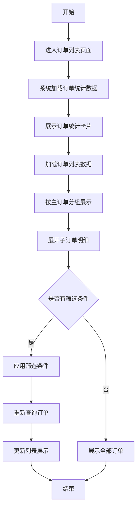
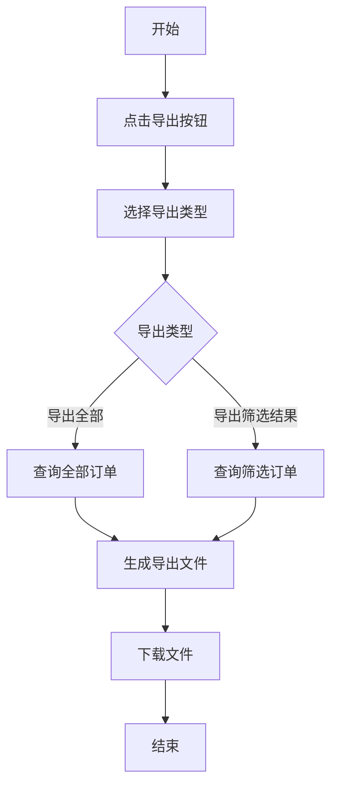
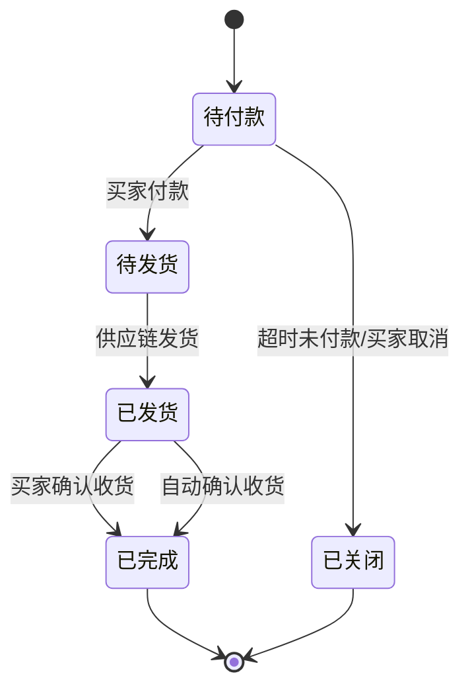
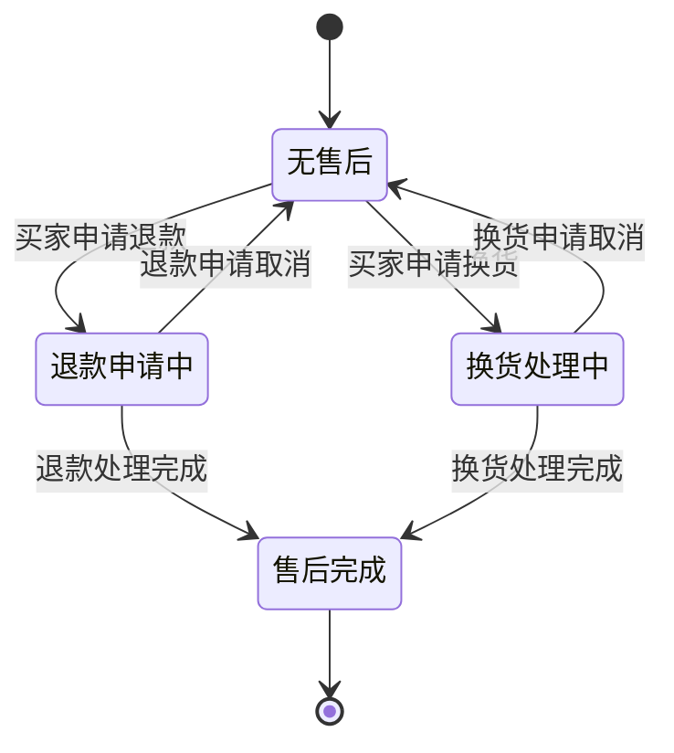
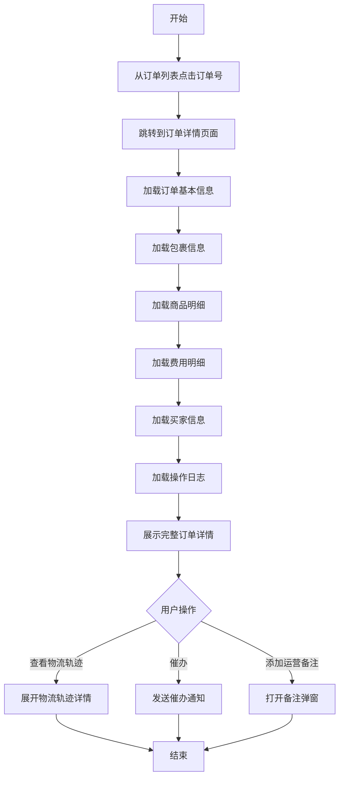
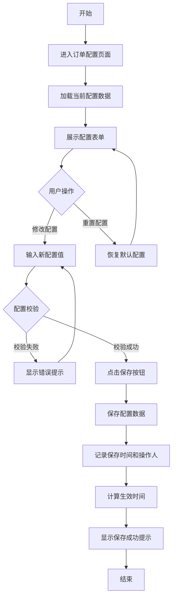
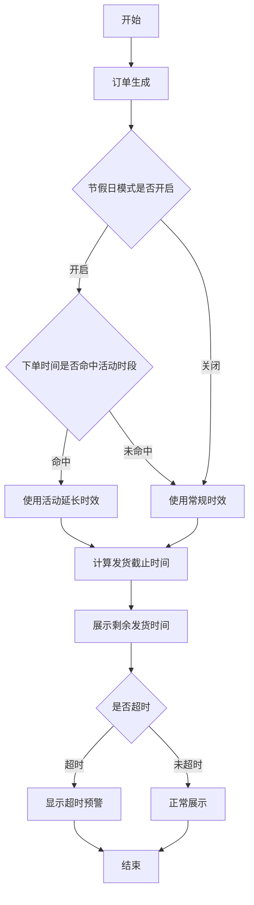
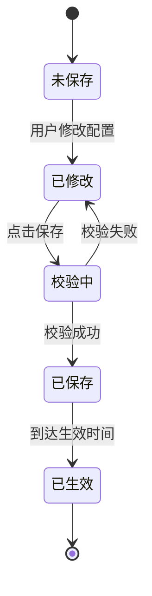

# 商城平台订单管理产品需求文档

# 1. 详细需求

## 1.1. 商城运营后台系统

### 1.1.1. 订单监控模块

#### 1.1.1.1. 商城订单列表页面

##### 1. 功能概述

- **功能描述**:集中管理各品牌商城交易订单,提供订单查询、筛选、导出和批量操作功能
- **业务描述**:运营人员通过订单列表页面监控和管理各品牌商城的交易订单,支持主订单和子订单的层级展示,便于快速定位和处理订单问题
- **使用角色**:运营专员、运营经理
- **触发条件**:运营人员需要查看、筛选或管理商城订单时访问该页面

##### 2. 界面设计

###### 2.1 页面原型

- 原型图链接:[商城订单列表原型页面](file:///c:/Users/power/Documents/trae_projects/shangchengyuanxing/16.商城订单列表-原型页面.html)

###### 2.2 输出项说明

| 字段名称   | 数据类型     | 数据来源     | 格式说明                 |
| ------ | -------- | -------- | -------------------- |
| 订单总金额  | Decimal  | 订单统计汇总   | ¥XX,XXX.XX           |
| 7天订单数  | Integer  | 订单统计汇总   | XXX笔                 |
| 主订单号   | String   | 订单主表     | MO-YYYYMMDD-XXXXX    |
| 子订单号   | String   | 订单子表     | SO-YYYYMMDD-XXXXX    |
| 客户商城   | String   | 订单主表     | 商城名称                 |
| 下单时间   | DateTime | 订单主表     | YYYY-MM-DD HH:mm:ss  |
| 订单金额   | Decimal  | 订单主表     | ¥XX,XXX.XX           |
| 优惠信息   | String   | 订单主表     | 优惠券+积分明细             |
| 运费     | Decimal  | 订单主表     | ¥XX.XX               |
| 客户备注   | String   | 订单主表     | 文本内容                 |
| 运营备注   | String   | 订单主表(新增) | 文本内容                 |
| 商品名称   | String   | 商品表      | 商品标题                 |
| 商品规格   | String   | 商品表      | 规格描述                 |
| 商品数量   | Integer  | 订单子表     | X件                   |
| 商品价格   | Decimal  | 订单子表     | ¥XX.XX               |
| 供应链名称  | String   | 供应链表     | 供应商名称                |
| 供应链SKU | String   | 供应链表     | SKU编码                |
| 客户商品编码 | String   | 客户商品表    | 客户自定义商品编码，可为空显示"—"   |
| 物流公司   | String   | 物流表      | 快递公司名称               |
| 运单号    | String   | 物流表      | 运单编号                 |
| 订单状态   | Enum     | 订单主表     | 待付款/待发货/已发货/已完成/已关闭  |
| 售后状态   | Enum     | 订单子表     | 无售后/退款申请中/换货处理中/售后完成 |
| 剩余发货时间 | String   | 系统计算     | X小时X分钟               |

##### 3. 业务逻辑

###### 3.1 流程图

**订单列表查询流程**

**订单导出流程**

###### 3.2 业务规则

| 规则编号           | 规则名称       | 适用场景     | 规则描述                                            | 错误提示 |
| -------------- | ---------- | -------- | ----------------------------------------------- | ---- |
| RULE-ORDER-001 | 主订单展示规则    | 订单列表展示   | 主订单信息包含:订单号、客户商城、下单时间、金额、优惠、运费、备注               | 无    |
| RULE-ORDER-002 | 子订单展示规则  | 订单列表展示   | 子订单按商品拆分展示,同商品多件合并为一行             | 无    |
| RULE-ORDER-003 | 客户商品编码展示规则 | 商品编码展示   | 客户商品编码为客户自定义的商品编码，若不存在则显示"—"      | 无    |
| RULE-ORDER-004 | 发货时效计算规则 | 剩余发货时间展示 | 根据订单配置的承诺发货时效计算剩余时间,超时显示红色预警      | 无    |
| RULE-ORDER-005 | 搜索筛选规则     | 订单搜索     | 支持按订单号、客户商城、下单时间、订单状态、售后状态等多维度筛选                | 无    |
| RULE-ORDER-006 | 批量操作规则     | 批量处理订单   | 支持批量催办、批量导出、批量添加运营备注等操作                         | 无    |
| RULE-ORDER-007 | 汇总数据规则     | 数据汇总展示   | 上方的汇总数据固定不变,不会根据筛选条件改动;下方的数据汇总根据选中的子订单数量动态改变    | 无    |
| RULE-ORDER-008 | 复制按钮显示规则   | 字段复制操作   | 复制按钮仅在鼠标悬浮在对应字段上时显示,其他时候隐藏                      | 无    |
| RULE-ORDER-009 | 跨页选中规则     | 复选框操作    | 左侧复选框支持跨页选中,支持跨页操作和跨页统计                         | 无    |
| RULE-ORDER-010 | 订单列表展开规则   | 列表初始展示   | 订单列表进入时默认为全部展开状态                                | 无    |
| RULE-ORDER-011 | 剩余发货时间提示规则 | 时间信息展示   | 鼠标悬浮在子订单的剩余发货时间上,展示下单时间、承诺时效以及该子订单距离承诺发货时间的剩余时间 | 无    |
| RULE-ORDER-012 | 备注操作规则     | 备注修改操作   | 备注操作为修改运营备注                                     | 无    |
| RULE-ORDER-013 | 物流进展弹窗规则   | 物流信息展示   | 物流进展内的弹窗参照原版本内容,但需要将相同物流信息的整合为一个包裹              | 无    |

###### 3.3 状态机设计

**订单状态流转**

**订单售后状态流转**

##### 4. 交互设计

###### 4.1 输入项说明

| 字段名称   | 字段类型 | 必填 | 数据类型     | 长度限制  | 校验规则      | 取值范围                 | 来源   | 提示文案                                   | 备注      |
| ------ | ---- | -- | -------- | ----- | --------- | -------------------- | ---- | -------------------------------------- | ------- |
| 搜索关键词  | 文本输入 | 否  | String   | 100字符 | 无特殊字符限制   | -                    | 用户输入 | 请输入主/子订单号 / 商品名称 / 商城SKU / 收货人手机号 / 姓名 | 支持模糊搜索  |
| 客户商城   | 下拉选择 | 否  | String   | -     | 必须为有效商城   | 商城列表                 | 系统配置 | 请选择客户商城                                | -       |
| 下单开始时间 | 日期选择 | 否  | DateTime | -     | 开始时间≤结束时间 | -                    | 用户选择 | 请选择下单开始时间                              | -       |
| 下单结束时间 | 日期选择 | 否  | DateTime | -     | 开始时间≤结束时间 | -                    | 用户选择 | 请选择下单结束时间                              | -       |
| 订单状态   | 下拉选择 | 否  | Enum     | -     | 必须为有效状态   | 待付款/待发货/已发货/已完成/已关闭  | 系统配置 | 请选择订单状态                                | -       |
| 售后状态   | 下拉选择 | 否  | Enum     | -     | 必须为有效状态   | 无售后/退款申请中/换货处理中/售后完成 | 系统配置 | 请选择售后状态                                | -       |
| 运营备注   | 文本输入 | 否  | String   | 500字符 | 无特殊字符限制   | -                    | 用户输入 | 请输入运营备注                                | 批量添加时可选 |

###### 4.2 交互说明

1. **订单列表查看**:用户进入页面后,系统自动加载订单统计卡片和订单列表
2. **订单筛选**:用户可通过搜索栏输入关键词或选择筛选条件,点击"筛选"按钮后重新查询订单列表
3. **订单导出**:用户点击"全量订单导出"按钮,选择导出类型(全部订单或筛选结果),系统生成导出文件并下载
4. **批量操作**:用户勾选多个订单后,可进行批量催办、批量导出操作
5. **订单详情查看**:用户点击订单号或"查看详情"链接,跳转到订单详情页面
6. **催办操作**:用户点击"催办"按钮,系统向供应链发送站内信通知相关人员

###### 4.3 错误提示文案

**表单校验提示**

| 校验项     | 提示文案         |
| ------- | ------------ |
| 搜索关键词为空 | 请输入搜索关键词     |
| 时间范围无效  | 开始时间不能大于结束时间 |
| 商城选择无效  | 请选择有效的客户商城   |

**业务异常提示**

| 错误码           | 提示文案             |
| ------------- | ---------------- |
| ERR-ORDER-001 | 订单数据加载失败,请刷新页面重试 |
| ERR-ORDER-002 | 导出文件生成失败,请稍后重试   |
| ERR-ORDER-003 | 批量操作失败,请检查订单状态   |

 

##### 5. 扩展功能

###### 5.1 批量操作规则

| 操作名称 | 单次上限    | 前置条件         | 成功提示      |
| ---- | ------- | ------------ | --------- |
| 批量催办 | 50个订单   | 订单状态为待发货或已发货 | 已成功催办X个订单 |
| 批量导出 | 1000个订单 | 无特殊条件        | 导出文件已生成   |

###### 5.2 操作日志要求

| 操作类型 | 记录内容               |
| ---- | ------------------ |
| 订单查看 | 订单号、查看时间、操作人       |
| 订单导出 | 导出条件、导出时间、操作人      |
| 批量操作 | 操作类型、订单数量、操作时间、操作人 |

***

#### 1.1.1.2. 商城订单详情页面

##### 1. 功能概述

- **功能描述**:查看单个订单的完整信息,包括订单状态、包裹信息、物流轨迹、商品明细、费用明细等
- **业务描述**:运营人员通过订单详情页面深入了解订单的完整信息,便于处理订单问题和跟进物流状态
- **使用角色**:运营专员、运营经理
- **触发条件**:从订单列表页面点击订单号或"查看详情"链接进入

##### 2. 界面设计

###### 2.1 页面原型

- 原型图链接:[商城订单详情原型页面](file:///c:/Users/power/Documents/trae_projects/shangchengyuanxing/17.商城订单详情页-原型页面.html)

###### 2.2 输出项说明

| 字段名称  | 数据类型    | 数据来源  | 格式说明                |
| ----- | ------- | ----- | ------------------- |
| 订单状态  | Enum    | 订单主表  | 待付款/待发货/已发货/已完成/已关闭 |
| 包裹数量  | Integer | 包裹表   | X个包裹                |
| 包裹状态  | Enum    | 包裹表   | 待发货/已发货/已签收         |
| 物流公司  | String  | 物流表   | 快递公司名称              |
| 运单号   | String  | 物流表   | 运单编号                |
| 物流轨迹  | String  | 物流轨迹表 | 时间+状态+地点            |
| 商品名称  | String  | 商品表   | 商品标题                |
| 商品规格  | String  | 商品表   | 规格描述                |
| 客户商品编码 | String  | 客户商品表 | 客户自定义商品编码，可为空显示"—" |
| 商品数量  | Integer | 订单子表  | X件                  |
| 商品价格  | Decimal | 订单子表  | ¥XX.XX              |
| 小计金额  | Decimal | 订单子表  | ¥XX.XX              |
| 收货人姓名 | String  | 订单主表  | 姓名                  |
| 收货人电话 | String  | 订单主表  | 手机号                 |
| 收货地址  | String  | 订单主表  | 省市区+详细地址            |
| 订单总额  | Decimal | 订单主表  | ¥XX,XXX.XX          |
| 优惠金额  | Decimal | 订单主表  | ¥XX.XX              |
| 运费金额  | Decimal | 订单主表  | ¥XX.XX              |
| 实付金额  | Decimal | 订单主表  | ¥XX,XXX.XX          |
| 买家姓名  | String  | 买家表   | 姓名                  |
| 买家手机号 | String  | 买家表   | 手机号                 |
| 买家积分  | Integer | 买家表   | X积分                 |
| 买家优惠券 | Integer | 买家表   | X张                  |
| 操作日志  | String  | 操作日志表 | 时间+操作+操作人           |

##### 3. 业务逻辑

###### 3.1 流程图

**订单详情查看流程**

###### 3.2 业务规则

| 规则编号            | 规则名称     | 适用场景   | 规则描述                                           | 错误提示 |
| --------------- | -------- | ------ | ---------------------------------------------- | ---- |
| RULE-DETAIL-001 | 包裹信息展示规则 | 包裹信息展示 | 每个包裹包含物流公司、运单号、包裹状态、预计到达时间                     | 无    |
| RULE-DETAIL-002 | 物流轨迹展示规则 | 物流轨迹查看 | 物流轨迹按时间倒序展示,包含时间、状态、地点信息                       | 无    |
| RULE-DETAIL-003 | 商品明细展示规则 | 商品明细展示 | 商品明细包含商品名称、规格、客户商品编码、数量、价格、小计金额 | 无    |
| RULE-DETAIL-004 | 客户商品编码展示规则 | 商品编码展示 | 客户商品编码为客户自定义的商品编码，若不存在则显示"—"   | 无    |
| RULE-DETAIL-005 | 费用明细展示规则 | 费用明细展示 | 费用明细包含订单总额、优惠金额、运费金额、实付金额  | 无    |
| RULE-DETAIL-006 | 催办规则     | 催办操作   | 催办操作向供应链发送站内信通知相关人员        | 无    |
| RULE-DETAIL-007 | 发货状态提示规则 | 发货状态展示 | 根据子订单的每个发货状态显示不同颜色的发货提示;已发货的子订单按照相同的物流单号区分包裹组合 | 无    |
| RULE-DETAIL-008 | 复制按钮显示规则 | 字段复制操作 | 复制按钮仅在鼠标悬浮在对应字段上时显示,其他时候隐藏 | 无    |
| RULE-DETAIL-009 | 地址修改规则   | 地址修改操作 | 仅当所有子订单均为待发货状态时,才允许修改收货地址   | 无    |

###### 3.3 状态机设计

**订单状态流转**

##### 4. 交互设计

###### 4.1 输入项说明

| 字段名称 | 字段类型 | 必填 | 数据类型   | 校验规则    | 取值范围 | 来源   | 提示文案    | 备注      |
| ---- | ---- | -- | ------ | ------- | ---- | ---- | ------- | ------- |
| 运营备注 | 文本输入 | 否  | String | 无特殊字符限制 | -    | 用户输入 | 请输入运营备注 | 添加备注时必填 |

###### 4.2 交互说明

1. **订单详情查看**:用户从订单列表点击订单号进入详情页面,系统自动加载订单完整信息
2. **物流轨迹查看**:用户点击"查看物流轨迹"按钮,展开物流轨迹详情
3. **催办操作**:用户点击"催办"按钮,系统向供应链发送站内信通知相关人员
4. **添加运营备注**:用户点击"添加运营备注"按钮,打开备注弹窗,输入备注内容后保存

###### 4.3 错误提示文案

**表单校验提示**

| 校验项    | 提示文案      |
| ------ | --------- |
| 运营备注为空 | 请输入运营备注内容 |

**业务异常提示**

| 错误码            | 提示文案             |
| -------------- | ---------------- |
| ERR-DETAIL-001 | 订单详情加载失败,请刷新页面重试 |
| ERR-DETAIL-002 | 物流轨迹查询失败,请稍后重试   |
| ERR-DETAIL-003 | 催办通知发送失败,请稍后重试   |

#####

***

#### 1.1.1.3. 订单配置页面

##### 1. 功能概述

- **功能描述**:配置平台级订单履约、支付超时与售后申请规则
- **业务描述**:运营经理通过订单配置页面设置订单相关的业务规则,包括发货时效、自动确认收货、未支付订单自动取消、售后申请规则等
- **使用角色**:运营经理
- **触发条件**:运营经理需要调整订单相关业务规则时访问该页面

##### 2. 界面设计

###### 2.1 页面原型

- 原型图链接:[订单配置原型页面](file:///c:/Users/power/Documents/trae_projects/shangchengyuanxing/20.订单配置-原型页面.html)

###### 2.2 输出项说明

| 字段名称      | 数据类型     | 数据来源 | 格式说明                |
| --------- | -------- | ---- | ------------------- |
| 承诺发货时效    | Integer  | 配置表  | X小时                 |
| 节假日模式开关   | Boolean  | 配置表  | 开启/关闭               |
| 活动时段列表    | Array    | 配置表  | 时段列表                |
| 签收后自动确认天数 | Integer  | 配置表  | X天                  |
| 发货后自动确认天数 | Integer  | 配置表  | X天                  |
| 未支付取消分钟数  | Integer  | 配置表  | X分钟                 |
| 退货退款时效    | Integer  | 配置表  | X天                  |
| 换货时效      | Integer  | 配置表  | X天                  |
| 保存时间      | DateTime | 配置表  | YYYY-MM-DD HH:mm:ss |
| 生效时间      | DateTime | 配置表  | YYYY-MM-DD HH:mm:ss |
| 操作人       | String   | 配置表  | 姓名                  |

##### 3. 业务逻辑

###### 3.1 流程图

**订单配置保存流程**

**发货时效计算流程**

###### 3.2 业务规则

| 规则编号            | 规则名称      | 适用场景      | 规则描述                              | 错误提示           |
| --------------- | --------- | --------- | --------------------------------- | -------------- |
| RULE-CONFIG-001 | 发货时效配置规则  | 发货时效设置    | 承诺发货时效范围1-168小时,默认24小时            | 时效必须在1-168小时之间 |
| RULE-CONFIG-002 | 节假日模式配置规则 | 节假日模式设置   | 可配置多个活动时段,时段不可重叠                  | 活动时段不可重叠       |
| RULE-CONFIG-003 | 自动确认收货规则  | 自动确认收货设置  | 签收后自动确认天数范围0-30天,发货后自动确认天数范围1-30天 | 天数必须在有效范围内     |
| RULE-CONFIG-004 | 未支付取消规则   | 未支付订单取消设置 | 未支付取消分钟数范围1-4320分钟,默认15分钟         | 分钟数必须在1-4320之间 |
| RULE-CONFIG-005 | 售后时效配置规则  | 售后时效设置    | 退货退款时效和换货时效范围1-365天,默认15天         | 天数必须在1-365之间   |
| RULE-CONFIG-006 | 配置生效规则    | 配置保存后生效   | 保存后于下一个小时整点对新订单生效,已有订单按快照值执行      | 无              |

###### 3.3 状态机设计

**配置保存状态流转**

##### 4. 交互设计

###### 4.1 输入项说明

| 字段名称      | 字段类型 | 必填 | 数据类型    | 长度限制 | 校验规则   | 取值范围   | 来源   | 提示文案                  | 备注         |
| --------- | ---- | -- | ------- | ---- | ------ | ------ | ---- | --------------------- | ---------- |
| 承诺发货时效    | 数字输入 | 是  | Integer | -    | 1-168  | 1-168  | 用户输入 | 请输入承诺发货时效(1-168小时)    | 默认24小时     |
| 节假日模式开关   | 开关选择 | 否  | Boolean | -    | 无      | 开启/关闭  | 用户选择 | 开启节假日/活动模式            | 默认关闭       |
| 活动时段      | 时段配置 | 否  | Array   | -    | 时段不可重叠 | -      | 用户配置 | 配置活动时段                | 开启节假日模式时显示 |
| 签收后自动确认天数 | 数字输入 | 是  | Integer | -    | 0-30   | 0-30   | 用户输入 | 请输入签收后自动确认天数(0-30天)   | 默认3天       |
| 发货后自动确认天数 | 数字输入 | 是  | Integer | -    | 1-30   | 1-30   | 用户输入 | 请输入发货后自动确认天数(1-30天)   | 默认7天       |
| 未支付取消分钟数  | 数字输入 | 是  | Integer | -    | 1-4320 | 1-4320 | 用户输入 | 请输入未支付取消分钟数(1-4320分钟) | 默认15分钟     |
| 退货退款时效    | 数字输入 | 是  | Integer | -    | 1-365  | 1-365  | 用户输入 | 请输入退货退款时效(1-365天)     | 默认15天      |
| 换货时效      | 数字输入 | 是  | Integer | -    | 1-365  | 1-365  | 用户输入 | 请输入换货时效(1-365天)       | 默认15天      |

###### 4.2 交互说明

1. **配置查看**:用户进入页面后,系统自动加载当前配置数据并展示
2. **配置修改**:用户修改配置项的值,系统实时校验输入值的有效性
3. **配置保存**:用户点击"保存"按钮,系统保存配置数据并记录保存时间和操作人
4. **配置重置**:用户点击"重置"按钮,系统恢复默认配置值
5. **节假日模式配置**:用户开启节假日模式后,可配置多个活动时段和对应的延长时效

###### 4.3 错误提示文案

**表单校验提示**

| 校验项           | 提示文案           |
| ------------- | -------------- |
| 发货时效超出范围      | 时效必须在1-168小时之间 |
| 签收后自动确认天数超出范围 | 天数必须在0-30之间    |
| 发货后自动确认天数超出范围 | 天数必须在1-30之间    |
| 未支付取消分钟数超出范围  | 分钟数必须在1-4320之间 |
| 退货退款时效超出范围    | 天数必须在1-365之间   |
| 换货时效超出范围      | 天数必须在1-365之间   |
| 活动时段重叠        | 活动时段不可重叠       |

**业务异常提示**

| 错误码            | 提示文案           |
| -------------- | -------------- |
| ERR-CONFIG-001 | 配置保存失败,请稍后重试   |
| ERR-CONFIG-002 | 配置加载失败,请刷新页面重试 |

#####

***

 

***

 

# 3. 相关文档

| 文档名称 | 文档路径                                                       |
| ---- | ---------------------------------------------------------- |
| 功能大纲 | 功能大纲.md                                                    |
| 原型页面 | 16.商城订单列表-原型页面.html、17.商城订单详情页-原型页面.html、20.订单配置-原型页面.html |

***

# 4. 版本记录

| 版本号  | 修改日期       | 修改人  | 修改内容                         |
| ---- | ---------- | ---- | ---------------------------- |
| V1.0 | 2026-06-24 | 产品经理 | 初稿创建,基于V1.3订单开发评审会议记录和原型页面生成 |

